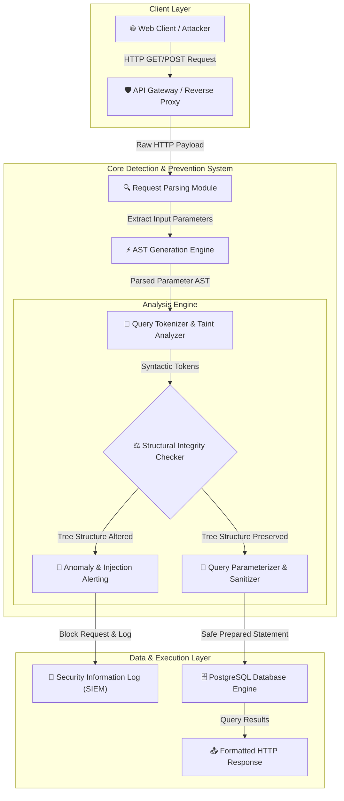

# 001 - Automated SQL Injection Detection & Prevention System

> **Category**: [[Web Application Attacks]] | **Difficulty**: ⭐⭐⭐ | **Duration**: 5 weeks

---

## so what's the deal with this?

alright, so... SQL Injection (SQLi) is still somehow taking down web apps everywhere. especially in e-commerce, where dropping a stray quote in an input field can let attackers bypass logins, dump credit cards, mess with prices, or just straight up own the DB server.

even though everyone knows about it, old codebases and weird web frameworks keep letting SQLi slip through. unsanitized dynamic query concatenation (the classic `select * from users where id = ` + user_id) just lets structural SQL commands sneak into data parameters. in huge e-commerce sites doing millions of queries, you can't just manually review this stuff. people are losing billions to fraud and regulatory fines (looking at you, GDPR).

### wild real-world stuff
- **TalkTalk (2015)**: basically an SQLi vuln in their web portal got 156k customer records stolen. cost them over £77 million and massive fines.
- **Sony Pictures (2011)**: attackers threw some basic SQLi payloads at unpatched endpoints and walked away with plain text passwords and info for over a million users.
- **VTech (2015)**: an SQLi on their customer portal exposed profile pics, chat logs, and info of over 6.4 million kids and parents.

---

## the papers i'm referencing

| # | Paper Title | Authors | Year | Source | Key Contribution |
|---|-------------|---------|------|--------|-----------------|
| 1 | AMNESIA: Analysis and Monitoring for Neutralizing SQL-Injection Attacks | Halfond & Orso | 2005 | IEEE/ACM ICSE | Combines static analysis and dynamic monitoring to build SQL query model ASTs and prevent runtime SQLi. |
| 2 | CANDID: Dynamic Candidate Evaluation for Detecting SQL Injection Vulnerabilities | Bandhakavi et al. | 2007 | ACM CCS | Uses candidate evaluation by parsing queries with benign placeholders vs injected strings to detect structure changes. |
| 3 | SQLiShield: Dynamic Detection and Prevention of SQL Injection Attacks using AST Analysis | Shar et al. | 2023 | IEEE TDSC | Proposes real-time Abstract Syntax Tree parsing and parameterization verification engine for cloud databases. |

---

## how the system actually works
Link: [[Drawing 2026-07-30 22.31.19.excalidraw#Project 001: 001 - Automated SQL Injection Detection & Prevention System|Excalidraw Architecture Diagram]]

this part is wild. here's how the traffic flows:

---

## how i'm building it

### week 1: getting the lab running
- spinning up a vulnerable e-commerce lab target in Docker (gonna use OWASP Juice Shop and some custom PHP/Node.js endpoints I wrote).
- installing the core stack: Python 3.11, `tree-sitter`, `sqlparse`, `psycopg2`, and `docker-py`.
- setting up DB logging to catch all the raw SQL execution logs so I have a baseline to work from.

### weeks 2-3: writing the core engine
- **ast extraction:** building a parser with `tree-sitter-sql` to turn incoming SQL strings into ASTs (Abstract Syntax Trees). this isolates the parameters from the actual commands like `SELECT`, `UNION`, `WHERE`, etc.
- **taint analysis:** tracking user inputs from the HTTP requests (`$_GET`, `$_POST`, JSON payloads) all the way down to the DB execution sinks. if a parameter changes the syntax tree, we flag it.
- **auto prepared statements:** writing middleware that intercepts dynamic raw SQL strings and forcefully transforms them into parameterized `PreparedStatements` (using `$1`, `$2`, or `?`).

### week 4: putting it together
- wrapping the middleware into an API gateway.
- blasting the test endpoints with `sqlmap` under different modes: Error-based, Union-based, and Blind Time-based SQLi.
- checking how well it detects stuff, false positive rates, and seeing if the AST parsing adds too much latency.

### week 5: wrap up
- gathering the benchmark results against the OWASP test suites.
- making graphs showing query execution times (with and without the AST interceptor).
- polishing the docs and getting the repo ready to open-source.

---

## the tech stack

| Tool | Purpose | Alternative |
|------|---------|-------------|
| Python | Core backend framework and AST parsing engine | Rust / Go |
| Tree-sitter | Fast, incremental Abstract Syntax Tree generation | ANTLR4 |
| SQLMap | Automated SQL injection verification & benchmark testing | OWASP ZAP |
| PostgreSQL | Target relational database engine | MySQL / MariaDB |
| Docker | Isolated microservice lab containment | Podman |

---

## what this actually does
- **AST structural analysis**: checks the expected query syntax trees against what actually runs to catch any mutations. 
- **auto parameterization**: rewrites bad dynamic string concats into safe prepared statements on the fly.
- **catches everything**: spots in-band (error/union), inferential (blind time/boolean), and OOB SQLi.
- **fast af middleware**: caches pre-compiled SQL query ASTs to keep execution times under a millisecond.
- **SIEM hookups**: dumps attack telemetry into JSON/CEF logs so the SOC gets alerted immediately.

---

## what i'm hoping to see

honestly, if I can just get this middleware to intercept web requests, parse the ASTs in real time, and rewrite queries without breaking the world, I'll be happy.

### the stats i want
- \> 98.5% true positive rate on the OWASP Benchmark SQLi tests.
- < 0.5% false positives on normal transactions.
- < 3.2 ms parsing overhead per query.

### output stuff
1. the actual working middleware repo.
2. report on the AST parsing analysis.
3. the benchmark evaluation dataset.

---

## what i'm learning
1. 📚 getting super deep into AST generation and dynamic taint analysis.
2. 📚 finally wrapping my head around weird structural SQL payloads and blind side-channel exploits.
3. 📚 writing high-performance middleware that won't bottleneck production pipelines.
4. 📚 automating defensive controls so they actually match OWASP Top 10 guidelines.

---

## quick disclaimer
> [!WARNING] dont be an idiot
> keeping this strictly to my own lab environment. don't test this against anything you don't have explicit permission to hit.

---

## other cool stuff i'm looking at
- [[004 - Server-Side Request Forgery (SSRF) Scanner]]
- [[005 - API Security Testing Automation Platform]]
- [[007 - Web Application Firewall (WAF) Bypass Techniques Analyzer]]

---
*📅 Created: 2026-07-30 | 🏷️ Category: Web Application Attacks | 🔐 Offensive Security Research*
