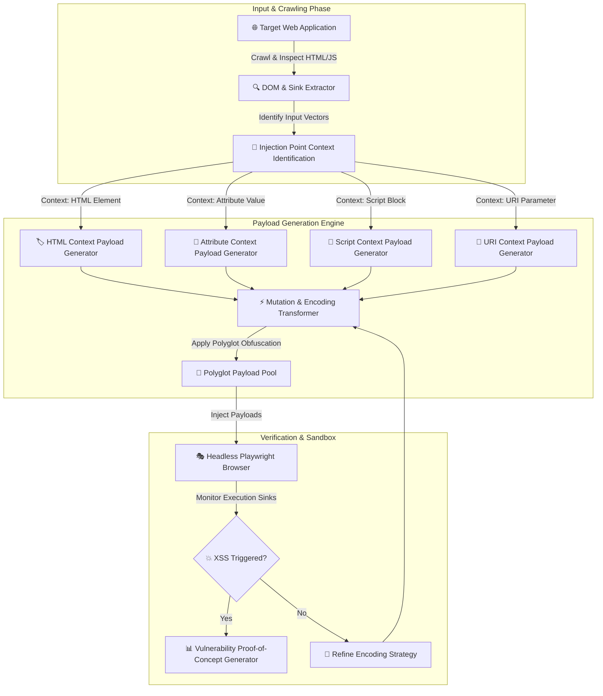

# 002 - XSS Payload Generator with Context-Aware Encoding

> **Category**: [[Web Application Attacks]] | **Difficulty**: ⭐⭐ | **Duration**: 4 weeks

---

## alright, so what's the deal with this?

> [!CAUTION] it gets wild out there
> XSS is basically just injecting scripts into trusted web apps. but in finance or online banking portals, this means stealing session tokens, messing with the DOM to fake transaction confirmations, or pulling off silent wire transfers. yikes.

honestly, standard sanitization usually completely fails when devs just slap some generic HTML entity encoding onto stuff that ends up inside specialized JS blocks, inline event handlers, dynamic URLs, or CSS attributes. context-aware payload generation is all about proving how context mismatch vulns can be systematically tracked down and smashed by hitting the browser with insane polyglot encodings. 

### real-world stuff that broke
- **Yahoo Mail XSS (2015)**: a stored XSS flaw let attackers run scripts just by having someone open a crafted email. ripped session cookies for like 300 million users.
- **Samy Worm on MySpace (2005)**: this one's legendary. polyglot XSS payload in user profiles forced 1M+ users to friend Samy in under 24 hours. fastest spreading web worm ever.
- **British Airways Magecart (2018)**: malicious JS got injected via third-party web dependencies. skimmed credit cards from 380k customers over two weeks.

---

## papers I actually read for this

because just guessing wasn't going to cut it:

| # | Paper Title | Authors | Year | Source | Key Contribution |
|---|-------------|---------|------|--------|-----------------|
| 1 | ScriptGard: Automatic Context-Sensitive Sanitization for Large Scale Web Applications | Saxena et al. | 2011 | ACM CCS | dynamic context analysis to automatically fix broken sanitization functions in web apps. |
| 2 | DOMXSS Step-by-step: Precise and Automated Detection of DOM-based XSS | Lekies et al. | 2013 | USENIX Security | taint tracking in browser engines to trace data flows from HTML sinks to executable JS sinks. |
| 3 | Context-Aware Automated XSS Payload Generation and Sanitization Validation | Melicher et al. | 2021 | IEEE S&P | analyzes context boundaries in modern web frameworks and presents automated polyglot test gen algorithms. |

---

## how i'm building it
Link: [[Drawing 2026-07-30 22.31.19.excalidraw#Project 002: 002 - XSS Payload Generator with Context-Aware Encoding|Excalidraw Architecture Diagram]]

---

## how it actually works

### week 1: getting the sandbox ready
- spinning up a testbed (Node.js/Express app) that renders inputs in 6 distinct XSS contexts.
- installing the essentials: Python 3.11, Node.js, `playwright`, `jsbeautifier`, and `DOMPurify`.
- figuring out how browsers parse things across HTML tokenizers, CSS parsers, and JS engine boundaries. (browser internals are messy lol).

### weeks 2-3: writing the actual code
- **context detection engine**: building a parser to figure out exactly where the input lands inside the target DOM template. is it in the HTML body? double-quoted attribute? inline JS var? URL scheme?
- **context-aware payload mutator**: crafting payloads explicitly designed to break out of specific boundaries (like `</script><script>...`, `" autofocus onfocus=...`, `javascript:...`).
- **polyglot payload generator**: generating frankenstein strings that can execute across multiple parser states simultaneously.
- **headless execution validator**: automating sandbox tests with Playwright to see if `alert()`, `console.log()`, or `fetch()` actually fire.

### week 4: integration & blowing stuff up
- running the payload generator against standard sanitization libraries like OWASP Java Encoder and DOMPurify. also testing custom regex replacements because people always write bad regex.
- seeing how well we can bypass incomplete regex filters and mismatched entity encoders.

### week 5: writing it all down
- documenting the escape techniques and making an encoding matrix for devs.
- throwing together some guidelines for context-aware output encoding in modern templating engines (React JSX, Angular templates).

---

## the tech stack

| Tool | Purpose | Alternative |
|------|---------|-------------|
| Python | Payload generation & mutation logic | TypeScript |
| Playwright | Headless browser execution verification | Selenium / Puppeteer |
| DOMPurify | Benchmark client-side sanitization evaluation | Sanitizer API |
| CyberChef | Payload encoding and obfuscation analysis | Burp Suite Encoder |

---

## what i'm trying to pull off here

> [!NOTE] the end goal
> i'm building a tool that scans target parameters, figures out the DOM injection context on its own, spits out custom context-escaped polyglots, and then safely verifies execution in a headless browser.

the plan is to get this thing classifying contexts with >99% accuracy across standard HTML5/JS templates, checking payloads in under 1.5 seconds each, and catching >90% of mismatched sanitization implementations. 

by the time this is done, i'll have an executable Python/Playwright test engine, a matrix of XSS contexts + sanitization rules, and a detailed experimental benchmark report. gonna learn a ton about browser parser state transitions, context-aware output encoding, automated headless validation, and the differences between Reflected, Stored, and DOM-based XSS. 

---

## wait, don't go to jail
> [!WARNING] Legal & Ethical Notice
> test this in a controlled lab environment ONLY. do not go firing this off at random production systems without explicit written permission.

---

## other cool stuff
- [[003 - CSRF Token Analyzer & Bypass Framework]]
- [[011 - Browser Extension Security Analyzer]]
- [[012 - Content Security Policy (CSP) Bypass Research Tool]]

---
*📅 Created: 2026-07-30 | 🏷️ Category: Web Application Attacks | 🔐 Offensive Security Research*
