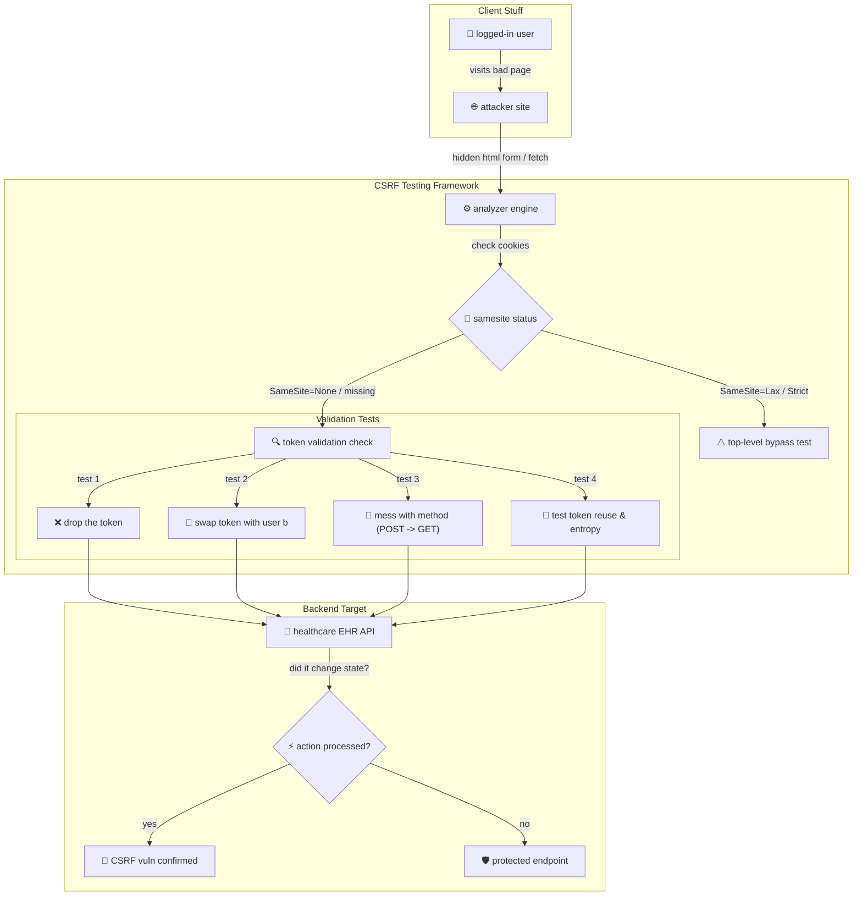

# 003 - CSRF Token Analyzer & Bypass Framework

> **Category**: [[Web Application Attacks]] | **Difficulty**: ⭐ | **Duration**: 3 weeks

---

## so what's the deal with this?

> [!CAUTION] real-world impact
> basically, CSRF forces a logged-in user to do stuff they didn't ask for on a site they trust. imagine a healthcare portal getting hit—attackers could silently mess with patient records (EHR), change prescriptions, or move sensitive medical profiles without the user ever knowing. honestly, it's wild that this still happens.

we usually just slap on CSRF tokens and `SameSite` cookies, but bad setups—like static tokens, ignoring specific HTTP methods, reusing tokens, or messed up CORS headers—leave apps super vulnerable.

### the real-world stuff
- **netflix (2006)**: attackers could add DVDs to your queue, change shipping addresses, and even wreck account creds just by forcing a request.
- **ING direct (2008)**: flawed workflows let attackers force POST requests and move funds between accounts. big yikes.
- **youtube (2008)**: attackers exploited CSRF to make logged-in users favorite videos, subscribe to channels, and send messages without them clicking a thing.

---

## papers i'm reading

| # | paper | authors | year | source | what's the point |
|---|-------|---------|------|--------|------------------|
| 1 | Defenses for Cross-Site Request Forgery | Barth et al. | 2008 | ACM CCS | looks at origin header validation and secret token patterns. |
| 2 | De-anonymizing Web Users Through CSRF Attacks | De Ryck et al. | 2012 | IEEE S&P | cross-site timing and state-changing request tricks for user tracking. |
| 3 | Evaluating SameSite Cookie Attribute Effectiveness Against CSRF | Calzavara et al. | 2022 | NDSS | digs into real-world challenges and bypass vectors of samesite policies. |

---

## how it all fits together
Link: [[Drawing 2026-07-30 22.31.19.excalidraw#Project 003: 003 - CSRF Token Analyzer & Bypass Framework|Excalidraw Architecture Diagram]]

---

## how i'm building it

alright, so here is the game plan.

### week 1: prep work
- throwing together a python flask lab target simulating healthcare EHR ops (like `POST /patient/update-prescription`).
- setting up burp suite / owasp zap to intercept all the traffic.
- digging into `SameSite` cookie rules (`Strict`, `Lax`, `None`), chrome's top-level GET exceptions, and CORS preflight rules.

### weeks 2-3: coding the core
- **cookie & header checker**: pull session cookies and check `SameSite`, `HttpOnly`, and `Secure` flags, plus CORS `Access-Control-Allow-Origin` values.
- **token entropy analyzer**: figure out if the tokens are actually random using shannon entropy metrics. checking if tokens change across sessions.
- **method & payload fuzzer**: this part is wild. automate structural tweaks: drop tokens, swap `POST` for `GET`, inject tokens from another user session, and strip custom headers like `X-Requested-With`.
- **auto-PoC generator**: scripts to spit out ready-to-run HTML auto-submitting forms and JS `fetch()` payloads. 

### week 4: break things
- point the framework at the vulnerable healthcare docker containers.
- test out double-submit cookie patterns vs synchronizer token patterns and see what holds up.

### week 5: docs
- write down anti-CSRF guidelines for modern SPAs.
- sketch out architecture recommendations for mixing `SameSite=Lax` with custom headers (`X-CSRF-Token`).

---

## the stack

| tool | what it's for | backup plan |
|------|---------------|-------------|
| python | building the interceptor and analyzer | node.js |
| flask | hacking together the vulnerable api target | django / express |
| burp suite | manual proxying and checking stuff | owasp zap |
| samesite inspector | figuring out wtf cookies are doing | chrome devtools |

---

## cool stuff it actually does
- ✅ **spots token flaws**: checks if you can drop the token, tamper with it, or swap it with another user's.
- ✅ **samesite inspector**: reads cookie flags and catches edge-case bypasses.
- ✅ **token entropy checks**: makes sure the tokens aren't super predictable.
- ✅ **method switching**: catches apis that check tokens on `POST` but totally forget to on `GET` or `PUT`.
- ✅ **PoC generator**: literally just spits out html files to prove the vuln exists. 

---

## what am i getting out of this?

> [!NOTE] deliverables
> a python framework that checks session flows, tests anti-CSRF protections, tries to bypass them, and spits out a report.

### goals
- **speed**: gotta scan an auth flow in under 3 seconds.
- **accuracy**: catch 100% of standard CSRF misconfigs.
- **proof**: generate working HTML exploits for the vulnerable endpoints.

### output
1. the python CSRF assessment tool itself.
2. auto-generated html PoC templates.
3. a guide on how to actually secure this stuff right using double-submit cookies and samesite.

### personal goals
1. 📚 actually understand how CSRF and browser cookies work under the hood.
2. 📚 figure out CORS, samesite policies, and browser security.
3. 📚 build solid anti-CSRF protections (sync tokens, custom headers).
4. 📚 run state-change assessments on REST APIs and old-school web apps.

---

## don't go to jail
> [!WARNING] legal notice
> keep this strictly in the local lab. testing this on random sites without permission is a great way to catch a charge.

---

## other cool projects
- [[002 - XSS Payload Generator with Context-Aware Encoding]]
- [[006 - JWT Token Vulnerability Assessment Tool]]
- [[008 - Broken Access Control Detection Engine]]

---
*📅 Created: 2026-07-30 | 🏷️ Category: Web Application Attacks | 🔐 Offensive Security Research*
