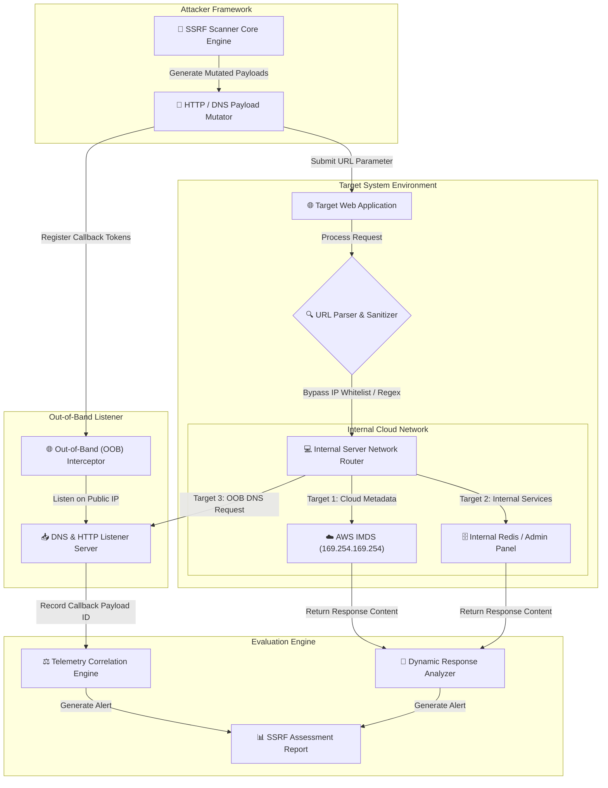

# 004 - building an ssrf scanner

> **category**: [[Web Application Attacks]] | **difficulty**: ⭐⭐⭐ | **timeline**: roughly 5 weeks if i don't sleep

---

## so what's the deal with this?

> [!CAUTION] real-world impact
> alright, so here's the wild thing about ssrf (server-side request forgery). you essentially trick a web server into making http or dns requests for you. it's basically using the server as a puppet. in cloud environments (aws, gcp, azure), this gets super dangerous. if you pull off a blind or unblind ssrf, you can hit the internal cloud instance metadata services (like IMDSv1 at `169.254.169.254`). from there, you just yoink IAM role credentials and basically own the whole infra.

honestly, modern apps are basically begging for this. they rely heavily on webhooks, pdf generators, image parsers, all sorts of microservice integrations that fetch urls you give them. if they don't validate properly, you just pivot right past the firewall into internal networks (`10.0.0.0/8`, `172.16.0.0/12`, `192.168.0.0/16`) and start messing with internal admin panels, databases, etc.

### 🌍 real-world screw-ups
- **capital one cloud data breach (2019)**: someone found an ssrf in a misconfigured WAF. they hit the aws IMDS, grabbed temp IAM credentials, and walked away with over 100 mil customer credit card apps sitting in s3 buckets. crazy.
- **microsoft exchange proxylogon (2021)**: cve-2021-26855 let unauthenticated folks send arbitrary http requests through the exchange server. instant bypass to mailboxes and RCE.
- **shopify bug bounty (2020)**: their screenshot rendering service had an ssrf flaw. researchers used it to hit internal google cloud metadata servers and pull cluster secrets.

---

## what i'm reading right now

been digging through these papers to wrap my head around it:

| # | Paper Title | Authors | Year | Source | Key Contribution |
|---|-------------|---------|------|--------|-----------------|
| 1 | A Systematic Study of Server-Side Request Forgery Vulnerabilities in Cloud Applications | Khattak et al. | 2021 | IEEE Access | categorizes ssrf attack vectors across cloud providers and looks into dns rebinding fixes. |
| 2 | Anatomy of Cloud Infrastructure Compromise via SSRF Vectors | Zhang & Wang | 2022 | ACM CCS | looks at what happens after you exfiltrate metadata credentials in aws and kubernetes. |
| 3 | Blind SSRF Detection via Out-of-Band Telemetry and DNS Rebinding Analysis | Alenazi et al. | 2024 | USENIX Security | automated way to spot blind ssrf using out-of-band callbacks and TOCTOU dns analysis. |

---

## architecture brain-dump
Link: [[Drawing 2026-07-30 22.31.19.excalidraw#Project 004: 004 - Server-Side Request Forgery (SSRF) Scanner|Excalidraw Architecture Diagram]]

here's how i'm putting the pieces together:

---

## how i'm building it (the technical stuff)

### week 1: setting up the lab
- spinning up a fake cloud lab with `AWS LocalStack` and some docker containers that run intentionally vulnerable webhook services.
- installing the stack: python 3.11, projectdiscovery `interactsh-client`, `dnspython`, `aiohttp`, and `scapy`.
- tweaking custom dns nameservers to test dns rebinding scenarios (`A` record TTL = 0). this part is wild.

### weeks 2-3: coding the core engine
- **payload mutator**: building a generator to craft advanced bypasses. stuff like alternative IP formats (hex `0x7f000001`, octal `0177.0.0.1`, dword `2130706433`), ipv6 transitions (`[::ffff:169.254.169.254]`), and messing with URL schemes (`gopher://`, `dict://`, `file://`).
- **dns rebinding trickery**: putting together a dynamic dns responder. the idea is it resolves a safe external IP on the first lookup, but flips to an internal IP (`169.254.169.254`) on the subsequent fetch. classic TOCTOU (Time-of-Check to Time-of-Use) bypass.
- **out-of-band telemetry**: hooking up an interaction listener server (probably an api bridge to `interactsh`) to verify blind ssrfs when the target doesn't directly reflect the http response back to me.

### week 4: putting it together
- firing automated scans at local microservices and API gateways.
- benchmarking how well it detects in-band ssrf (direct reflection), blind ssrf (OOB confirmation), and protocol smuggling (like hitting redis/memcached over gopher).

### week 5: wrapping it up
- documenting how to actually stop this: strict url parsing with solid libraries, doing IP blacklists *after* dns resolution, and just forcing IMDSv2 (which uses session token-based metadata access).
- dumping the automated scan logs into standard SARIF/JSON formats.

---

## tools i'm using

| Tool | Why i'm using it | Alternative |
|------|---------|-------------|
| Python | scanner automation & async http engine | Go |
| LocalStack | faking aws IMDS and service lab | Real AWS Sandbox |
| Interactsh | testing out-of-band callbacks | Burp Collaborator |
| Docker | containing the vulnerable service targets | Podman |

---

## what this thing actually does
- ✅ **ip obfuscation**: spits out internal IPs in like 12+ different formats to sneak past naive string filters.
- ✅ **dns rebinding**: messes with TTLs to exploit TOCTOU validation flaws in the URL fetching logic.
- ✅ **weird protocols**: tests alternative handlers you shouldn't be using like `file://`, `gopher://`, `dict://`, `sftp://`.
- ✅ **metadata hunting**: specific payloads aimed at aws IMDSv1/v2, gcp metadata, azure wireserver, and k8s secrets.
- ✅ **blind ssrf catcher**: correlates dns and http callbacks in real-time to confirm blind vulns via out-of-band telemetry.

---

## where this is going

so if everything works out, i'll have a python-based ssrf assessment tool that handles oob interaction correlation, dns rebinding modules, and cloud IMDS detection.

some stats i'm aiming for:
- **speed**: > 50 payloads/sec with async I/O.
- **bypass rate**: hoping to beat > 95% of basic regex and ip-blacklist filters.
- **accuracy**: zero false positives on blind ssrf (thanks to OOB checks).

eventually i'll push the code to a repo, write up a cloud metadata security benchmark guide, and maybe a pdf report template for the output.

---

## stuff i'm learning along the way
1. getting way too familiar with the mechanics of ssrf in microservices and cloud architectures.
2. wrapping my head around dns rebinding techniques and why TOCTOU is a security nightmare.
3. evaluating how cloud providers secure metadata (aws IMDSv1 vs IMDSv2, gcp headers).
4. figuring out how to build out-of-band network interaction tracking tools to actually detect this stuff.

---

## ⚠️ quick disclaimer
> [!WARNING] Legal & Ethical Notice
> obviously just doing this in my local lab environment. don't point this at random servers without explicit written authorization unless you want a visit from three-letter agencies.

---

## related brain-dumps
- [[001 - Automated SQL Injection Detection & Prevention System]]
- [[005 - API Security Testing Automation Platform]]
- [[007 - Web Application Firewall (WAF) Bypass Techniques Analyzer]]

---
*📅 drafted: 2026-07-30 | 🏷️ tags: web app attacks, ssrf | 🔐 doing some offensive research*
