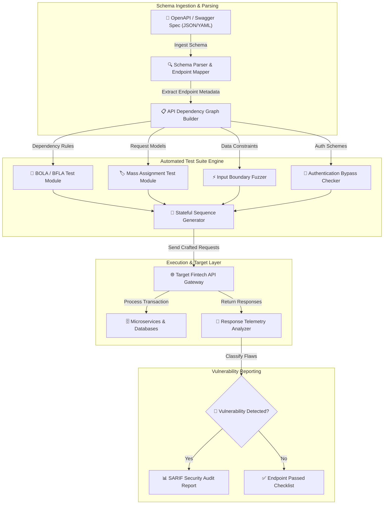

# 005 - API Security Testing Automation Platform

> category: [[Web Application Attacks]] | difficulty: ⭐⭐⭐ | time to build: 5 weeks

---

## so what's the deal with this?

> [!CAUTION] real-world impact
> alright, so... modern fintech apps are just a massive pile of REST APIs and microservices. back in the day, a web app was a monolithic frontend, but now APIs just yeet raw app logic and data structures straight to the client. this part is wild because bugs like BOLA (broken object level authorization), mass assignment, or missing rate limits can completely expose a database to automated attacks.

honestly, doing API pen testing manually sucks. you can't realistically test complex, stateful workflows across hundreds of endpoints by hand. that's where automated testing comes in—it parses the OpenAPI/Swagger docs dynamically and just hammers the endpoints with structured fuzzing.

### why this actually matters (real breaches)
- **optus (2022)**: someone literally just left an unauthenticated API endpoint exposed. attackers iterated through customer IDs and grabbed data on 9.8 million people. oops.
- **coinbase (2022)**: a researcher found a vuln in their advanced trading API. missing validation let you trade between random account pairs, basically letting you mess with assets that weren't yours.
- **t-mobile (2021)**: unprotected APIs got scraped to hell and back. attackers walked away with names, numbers, and SSNs for 54 million customers.

---

## papers i skimmed

| # | paper | authors | year | source | what it actually does |
|---|-------------|---------|------|--------|-----------------|
| 1 | Automated API Security Testing via OpenAPI Specification Parsing and Stateful Fuzzing | Viglianisi et al. | 2020 | ACM ISSTA | generates executable security tests straight from OpenAPI schemas. |
| 2 | Empirical Study of API Security Flaws in Modern Financial Infrastructure | Shah et al. | 2022 | IEEE S&P | deep dives into OWASP API top 10 vulns across 150 commercial fintech APIs. |
| 3 | RESTler: Stateful REST API Fuzzing Engine | Atlidakis et al. | 2019 | IEEE/ACM ICSE | grammar-based stateful fuzzing to find bugs across requests that depend on each other. |

---

## how i'm building it
Link: [[Drawing 2026-07-30 22.31.19.excalidraw#Project 005: 005 - API Security Testing Automation Platform|Excalidraw Architecture Diagram]]

---

## the game plan

### week 1: setting up the lab
- gotta build a fake fintech API lab. probably using node.js/express, docker, and postgres. need endpoints for account balances, transferring funds, all that good stuff.
- grabbing my tools: python 3.11, `schemathesis`, `openapi-spec-validator`, `requests`, and `pytest`.
- gonna write some OpenAPI 3.0 specs that cover auth and transactions so i have something to actually test against.

### weeks 2-3: the heavy lifting (core modules)
- **module 1: the parser.** taking the JSON/YAML specs and dynamically mapping out paths, methods, and auth requirements. the tricky part is maintaining state (like `POST /auth/login` -> `POST /accounts` -> `GET /accounts/{id}`).
- **module 2: BOLA fuzzer.** basically dual-token testing. swap user A and user B's tokens and see if user A can hit `GET /accounts/{userB_ID}`.
- **module 3: mass assignment.** sneaking extra admin properties (like `"is_admin": true`, `"role": "superuser"`) into POST/PUT payloads to see if the backend actually sanitizes inputs or just blindly binds them.
- **module 4: rate limiting.** blasting sensitive endpoints with async requests to check if they even have rate limiting headers (`X-RateLimit-Remaining`, HTTP 429 status codes).

### week 4: putting it together
- hooking all these modules up into a single CLI automation framework.
- running automated sweeps against my fake fintech lab to see what breaks.

### week 5: wrapping it up
- benchmarking it. need to see my schema coverage, how many vulns it catches, and how fast it runs.
- writing up some docs on how to actually fix the OWASP API top 10 (like custom DTO binding, strict RBAC, API gateway rate-limiting).

---

## what i'm using

| tool | what it's for | alternative |
|------|---------|-------------|
| python | building the main engine & async testing | typescript |
| schemathesis | schema validation and property-based testing | restler |
| openAPI spec | standard format for API docs | postman collections |
| docker | keeping my local lab contained so i don't break my machine | podman |

---

## what this thing actually does
- ✅ **parses specs:** just feed it an OpenAPI v2/v3 file and it builds test cases automatically.
- ✅ **BOLA testing:** swaps tokens between accounts to check if auth is actually enforced.
- ✅ **mass assignment checks:** injects hidden admin parameters into request bodies to see if the backend is sloppy.
- ✅ **stateful testing:** it remembers stuff. keeps track of token IDs and UUIDs across multiple API calls so it can test realistic workflows.
- ✅ **SARIF reporting:** spits out a standard security audit report you could plug straight into CI/CD.

---

## what i want at the end

> [!NOTE] end goal
> basically a fully working python tool that parses schemas, builds stateful tests, checks for OWASP top 10 vulns, and spits out a SARIF report.

### performance goals
- > 95% path/parameter coverage on v3 specs.
- firing off 100+ stateful endpoint tests a minute.
- 100% accuracy catching those insecure direct object references (IDOR/BOLA).

### what i'm actually shipping
1. the python repo for the platform.
2. a sample OpenAPI spec and some dummy data to test it with.
3. a quick guide on how to not write terrible APIs.

---

## why i'm even doing this
1. 📚 getting my head around the OWASP API top 10 and why this stuff keeps happening.
2. 📚 figuring out how to parse swagger/openapi schemas with code instead of just reading them.
3. 📚 writing an HTTP engine that can actually hold state and session context.
4. 📚 learning how to block BOLA attacks properly.

---

## obligatory warning
> [!WARNING] legal & ethical notice
> keep this in a local docker lab. don't point this at random apis on the internet unless you have explicit written permission, or you'll probably go to jail.

---

## other stuff
- [[001 - Automated SQL Injection Detection & Prevention System]]
- [[006 - JWT Token Vulnerability Assessment Tool]]
- [[008 - Broken Access Control Detection Engine]]

---
*📅 created: 2026-07-30 | 🏷️ category: web app attacks | 🔐 offensive security notes*
