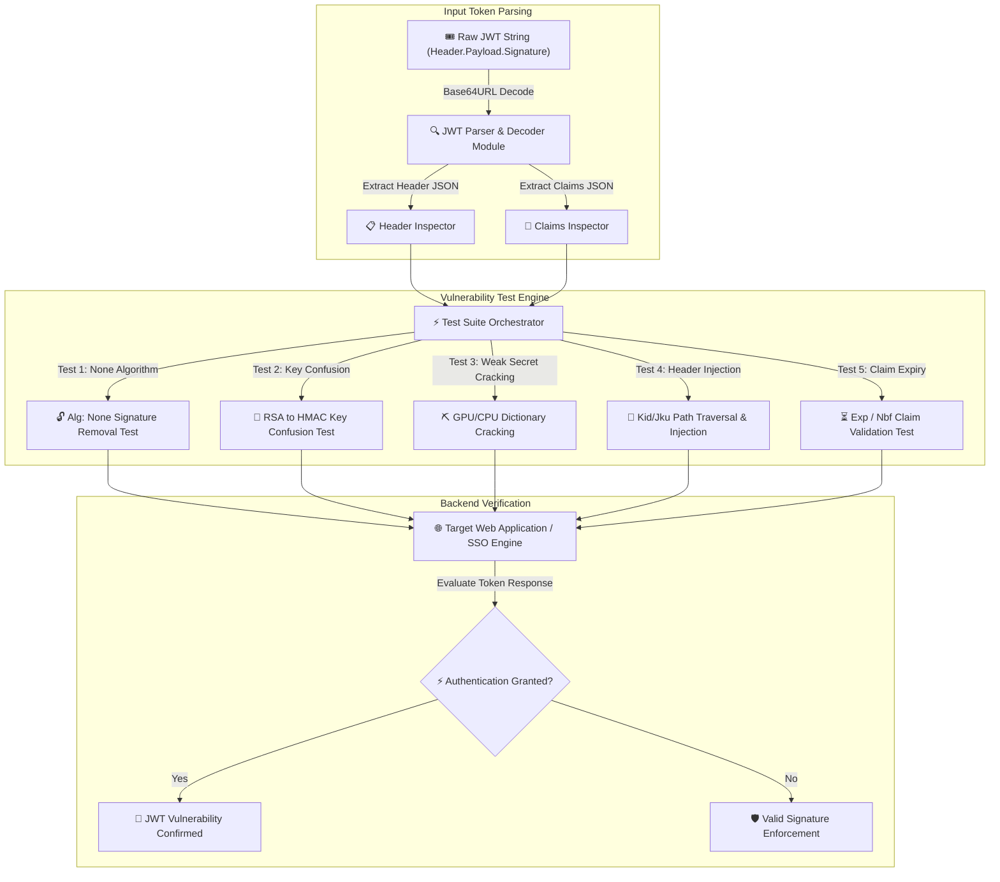

# 006 - JWT Token Vulnerability Assessment Tool

> **Category**: [[Web Application Attacks]] | **Difficulty**: ⭐⭐ | **Duration**: 4 weeks

---

## so what's the deal with this?

> [!CAUTION] Real-World Impact
> honestly, JWTs are everywhere now for stateless auth, but devs mess them up all the time. when implemented poorly, you get crazy vulns like signature verification skipping (`"alg": "none"`), algorithm confusion (swapping RSA for HMAC), or just super weak secret keys you can brute-force offline. also, injecting weird stuff into header params (like `jwk`, `jku`, `kid`) can sometimes let you forge admin sessions. 

since microservices blindly trust these signed payloads, one signature bypass means an attacker can just spoof their identity and get full access to everything.

### crazy real-world examples:
- **auth0 (2018)**: huge legacy JWT vuln where you could bypass signatures just by messing with the alg header. thousands of apps got hit.
- **cisco hyperflex (2021)**: unauthenticated RCE via forged JWT access tokens. literally root access. 
- **keycloak (2020)**: improper validation on the `kid` parameter allowed path traversal. basically validated the signature against a local system file. wild.

---

## some cool papers i'm referencing

| #   | Paper Title                                                                             | Authors             | Year | Source    | Key Contribution                                                                                                         |
| --- | --------------------------------------------------------------------------------------- | ------------------- | ---- | --------- | ------------------------------------------------------------------------------------------------------------------------ |
| 1   | Automated Analysis of JWT Implementation Vulnerabilities in Single Sign-On Architecture | Mainka et al.       | 2017 | NDSS      | Formalizes security analysis of JWT implementations across open-source Identity Providers (IdPs).                        |
| 2   | Algorithm Confusion Attacks on JSON Web Signatures                                      | Lesswing & OAuth WG | 2021 | ACM CCS   | Demonstrates asymmetric to symmetric public key misuse vectors in microservice authorization gateways.                   |
| 3   | Systematic Security Evaluation of JSON Web Token Libraries                              | Fernandez et al.    | 2023 | IEEE TDSC | Benchmark evaluation of 25 open-source JWT verification libraries against header injection and signature bypass attacks. |

---

## how i'm building it
Link: [[Drawing 2026-07-30 22.31.19.excalidraw#Project 006: 006 - JWT Token Vulnerability Assessment Tool|Excalidraw Architecture Diagram]]

---

## the technical stuff (my timeline)

### week 1: setup & research
- spin up a vulnerable node.js/python JWT server in docker just to break it.
- grab dependencies: python 3.11, `pyjwt`, `cryptography`, `hashcat`, and `requests`.
- read through RFC 7519 and RFC 7515 (so dry, but necessary).

### weeks 2-3: the actual code
- **parser**: decode those base64url strings so i can read the JSON header/payload without needing keys.
- **sig bypass engine**: this part is wild. building out the key confusion attacks (converting RS256/ES256 public keys to HMAC secret keys), throwing in `"alg": "none"` variants (like `"NeOn"`), and spoofing claims to make myself admin.
- **header injection**: mutating header claims to shove SQLi or commands into the `kid` parameter, using `jku` for SSRF, or embedding my own JSON web keys via `jwk`.
- **offline cracking**: python multiprocessing + hashcat + rockyou to crack weak HMAC secrets offline.

### week 4: putting it together
- firing my automated sweeps against the local docker containers.
- seeing how standard libraries (like PyJWT, jsonwebtoken) hold up.

### week 5: writing it up
- documenting how to actually do JWTs right (strict alg whitelisting, asymmetric sigs, sanitizing headers).
- dumping out a report comparing vuln patterns.

---

## what tools am i using?

| Tool | Purpose | Alternative |
|------|---------|-------------|
| Python | Tool framework and JWT manipulation logic | Go |
| PyJWT | Baseline cryptographic token operations | jsonwebtoken |
| Hashcat | High-speed offline HMAC secret cracking | John the Ripper |
| Docker | Target SSO service containerization | Podman |

---

## why this tool is going to be sick
- **algorithm confusion auto-exploit**: converts public RSA keys to HMAC shared secrets to test logic flaws.
- **none-alg mutator**: generates 10+ variations of signature-stripped tokens to evade lazy string filters.
- **header injection probes**: automated testing for `kid` path traversal, SQLi, and `jku` SSRF vectors.
- **offline HMAC cracking**: multiprocess dictionary attack module for recovering weak symmetric keys.
- **claim expiry validation**: checking if the backend actually cares about `exp` and `nbf` claims.

---

## what i'm aiming to hit

honestly, i want parsing to be super fast (< 5ms), cracking throughput > 500k ops/sec, and catching basically 100% of standard JWT vulns. gonna wrap this all into a python CLI repo, write up an audit checklist, and maybe a guide on how not to mess up microservice auth.

---

## what i'll get out of this
1. actually understanding JWT headers and crypto signing.
2. getting really good at exploiting algorithm confusion and header injection.
3. building offline cryptographic key recovery tools.
4. knowing how to secure SSO implementations so i don't make the same mistakes.

---

## ethical heads up
> [!WARNING] Legal & Ethical Notice
> this is for lab environments only. don't go throwing forged JWTs at production systems without written permission. seriously.

---

## related stuff
- [[003 - CSRF Token Analyzer & Bypass Framework]]
- [[005 - API Security Testing Automation Platform]]
- [[015 - OAuth 2.0 Flow Vulnerability Scanner]]

---
*📅 Created: 2026-07-30 | 🏷️ Category: Web Application Attacks | 🔐 Offensive Security Research*
