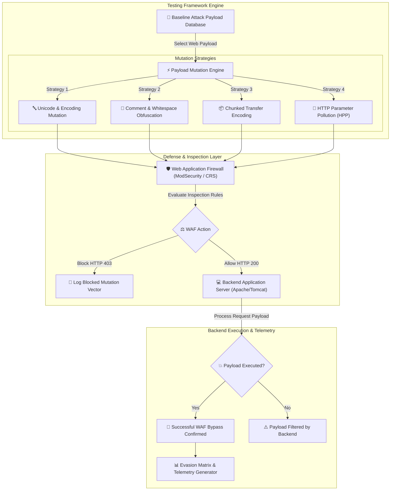

# 007 - waf bypass techniques analyzer

> **Category**: [[Web Application Attacks]] | **Difficulty**: ⭐⭐⭐ | **Duration**: 5 weeks

---

## so what's the deal with this?

> [!CAUTION] why this matters
> WAFs are supposed to be our frontline defense, but APTs just breeze past them. they basically evade signature rules by exploiting protocol parsing, weird character encodings, HTTP smuggling, chunked transfers... all the good stuff. 

the craziest part is the "impedance mismatch". if a WAF (say NGINX + ModSecurity) parses an HTTP payload differently than the backend server (like Tomcat), you can craft payloads that look completely harmless to the WAF, but the backend processes them as straight-up attacks. 

### real-world chaos
- **equifax (2017)**: attackers just bypassed the perimeter to hit an apache struts vuln (CVE-2017-5638). exfiltrated data of 147 million people. wild.
- **log4shell (2021)**: right after CVE-2021-44228 dropped, people were coming up with crazy string obfuscations (like `${jndi:${lower:m}ldap://...}`) that completely bypassed early vendor WAF rules.
- **capital one (2019)**: misconfigured WAF rules let SSRF requests go straight to the internal AWS instance metadata service. 

---

## stuff i've been reading

| # | paper | who wrote it | year | where | why i care |
|---|-------------|---------|------|--------|-----------------|
| 1 | WAF-A-MoLE: Evading Web Application Firewalls using Adversarial Mutation | Demetrio et al. | 2020 | IEEE Transactions on Information Forensics and Security | uses reinforcement learning to mutate payloads to trick ML-based WAFs. |
| 2 | Impedance Mismatch in HTTP Request Processing: A Study of WAF Evasion | Anley & Stuttard | 2019 | ACM CCS | super deep dive into parsing differences between WAF proxies and backend containers. |
| 3 | Systematic Payload Mutation and Syntax Obfuscation for WAF Evasion | Chen et al. | 2023 | USENIX Security | looks at comment insertion, weird character sets, and chunked transfer encoding. |

---

## how the architecture looks
Link: [[Drawing 2026-07-30 22.31.19.excalidraw#Project 007: 007 - Web Application Firewall (WAF) Bypass Techniques Analyzer|Excalidraw Architecture Diagram]]

---

## how i'm building it

### week 1: lab setup
- spinning up a docker lab with NGINX + ModSecurity v3 and OWASP CRS v3.3.
- deploying vulnerable targets (PHP SQLi/XSS endpoints, Node.js command injection).
- grabbing python 3.11, `scapy`, `requests`, `mitmproxy`, and `sqlmap`.

### weeks 2-3: writing the code
- **mutator 1 (encoding & strings)**: writing a script for double URL encoding, mixed-case, UTF-8 overlong, null bytes, and inline SQL/HTML comments (e.g., `UN/**/ION SELECT`).
- **mutator 2 (HPP)**: shooting duplicate query keys (like `?id=1&id=UNION SELECT`) to see how the WAF concatenates parameters vs the backend app.
- **mutator 3 (chunked transfer)**: building custom HTTP socket handlers to split payloads across fragmented `Transfer-Encoding: chunked` frames. gotta find those parsing mismatches.
- **mutator 4 (test runner)**: automating everything to fire mutated payloads, log the WAF response (403 vs 200), and check if the backend actually got owned.

### week 4: testing time
- running automated mutation sweeps against standard WAF installs.
- tracking bypass success rates for SQLi, XSS, RCE, LFI, etc.

### week 5: wrapping up
- writing down how to tune WAF rules to fix impedance mismatches.
- making a guide on strict HTTP validation for proxies.

---

## the stack

| tool | what it's for | alternative |
|------|---------|-------------|
| Python | payload mutation & raw sockets | Go |
| ModSecurity | the WAF i'm testing against | AWS WAF / Cloudflare |
| OWASP CRS | baseline threat detection | Custom WAF Rules |
| Mitmproxy | messing with headers mid-flight | Burp Suite |

---

## cool things it does
- ✅ **auto-mutator**: applies 15+ encoding/obfuscation tricks on the fly.
- ✅ **HPP testing**: tests how the backend handles multi-valued parameters.
- ✅ **chunked transfer probes**: fragments HTTP requests to test WAF inspection bounds.
- ✅ **mismatch detector**: finds discrepancies between proxy engines and backend parsers.
- ✅ **evasion matrix**: generates a visual matrix showing exactly which mutations bypassed active rules.

---

## what i want out of this

> [!NOTE] the goal
> basically a python framework that throws mutated payloads at a WAF, finds parsing gaps, and spits out recommendations on how to patch them.

### performance goals
- hitting > 200 payload permutations per minute.
- 100% verification based on backend telemetry.
- generating specific regex tuning suggestions for ModSecurity rules.

### deliverables
1. the actual github repo.
2. OWASP CRS hardening guide.
3. a benchmark report on WAF evasion.

---

## stuff to learn
1. 📚 figuring out exactly how WAFs evaluate rules and where they fall short.
2. 📚 getting really good at encodings, HTTP smuggling, and parameter pollution.
3. 📚 exploiting those proxy vs backend parsing mismatches.
4. 📚 learning how to configure WAF normalizers properly so this stuff doesn't happen.

---

## heads up
> [!WARNING] ethical check
> keep this in a local lab environment. do not point this at production systems without written permission. seriously.

---

## related notes
- [[001 - Automated SQL Injection Detection & Prevention System]]
- [[002 - XSS Payload Generator with Context-Aware Encoding]]
- [[004 - Server-Side Request Forgery (SSRF) Scanner]]

---
*📅 Created: 2026-07-30 | 🏷️ Category: Web Application Attacks | 🔐 Offensive Security Research*
