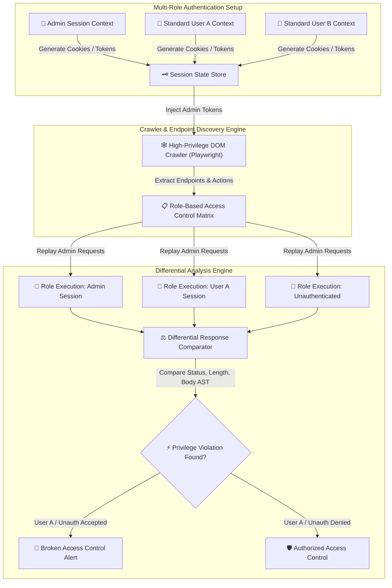

# 008 - Broken Access Control Detection Engine

> **Category**: [[Web Application Attacks]] | **Difficulty**: ⭐⭐⭐ | **Duration**: 5 weeks

---

## so what's the deal with this?

> [!CAUTION] Real-World Impact
> broken access control is literally the #1 vulnerability on the OWASP top 10 right now. access control policies exist to make sure users can't just do whatever they want outside their permissions. in the real world, if server-side checks fail, you get nasty stuff like IDORs, horizontal privilege escalation (seeing other people's stuff), and vertical privesc (normal users running admin functions). 

honestly, regular automated scanners suck at finding authorization flaws because access control logic is super app-specific. we really need automated engines that can crawl endpoints using multiple role-based session states to actually find these hidden bypass vulns.

### real-world stuff that blew up
- **USPS API IDOR (2018)**: huge IDOR vuln in an authenticated API endpoint let anyone who registered view account details, emails, and phone numbers for like 60 million accounts. wild.
- **Facebook Access Token Flaw (2018)**: three different bugs in the "View As" feature let attackers harvest access tokens, ruining 29 million user accounts.
- **Instagram Direct Messages IDOR (2020)**: researchers found an IDOR that let attackers read private instagram DMs and media just by messing with endpoint resource IDs.

---

## some research papers i looked at

| # | Paper Title | Authors | Year | Source | Key Contribution |
|---|-------------|---------|------|--------|-----------------|
| 1 | Automated Discovery of Access Control Vulnerabilities in Web Applications | Dynamic & Static Auth Group | 2021 | USENIX Security | Presents role-based state graph crawling to detect broken access control logic across enterprise apps. |
| 2 | Analyzing Access Control Vulnerabilities in Web Applications via Dual-Role Differential Testing | Sun et al. | 2022 | ACM CCS | Proposes differential response analysis between high-privileged and low-privileged user session execution. |
| 3 | Detecting Broken Object-Level Authorization in REST APIs | Meng et al. | 2024 | IEEE S&P | Develops automated schema inference and IDOR detection techniques for modern single-page applications. |

---

## how i'm building it

Link: [[Drawing 2026-07-30 22.31.19.excalidraw#Project 008: 008 - Broken Access Control Detection Engine|Excalidraw Architecture Diagram]]

---

## the game plan (technical execution)

### week 1: getting the environment ready
- deploying a multi-role web app target (Node.js/Express, PostgreSQL) with Admin, Manager, and Standard User roles.
- installing the stuff i need: Python 3.11, `playwright`, `requests`, `beautifulsoup4`, and `jsondiff`.
- setting up the environment to pull session cookies and JWT bearer tokens easily.

### weeks 2-3: building the core modules
- **module 1: multi-role crawler & endpoint mapper**
  writing a headless crawler with Playwright that logs in as an admin, maps out all the paths, dynamic API routes (`/api/v1/users/{id}`), and actions that change state (`POST`, `PUT`, `DELETE`).
- **module 2: differential HTTP test relayer**
  this part is fun. taking those extracted requests and replaying them under different identities: User A (horizontal test against User B's stuff), Standard User (vertical test against Admin endpoints), and unauthenticated guest.
- **module 3: response comparative analyzer**
  comparing HTTP status codes, response length differences, JSON key structure, and DOM trees. this is needed so we can tell the difference between actual data exposure and just a generic HTTP 200 with an "Access Denied" error message.
- **module 4: IDOR parameter mutator**
  looking for sequential IDs (`/user/1001`), UUIDs, and encoded parameters. then we mutate them across different session contexts to hunt for IDORs.

### week 4: integration & testing
- running automated scans against vulnerable benchmark environments like OWASP Juice Shop and a custom multi-role target.
- checking the accuracy for horizontal IDOR, vertical privesc, and unauth endpoint exposure.

### week 5: wrapping it up
- documenting the auth design patterns i find: centralized RBAC, ABAC, and indirect object references.
- writing up a security report with the flaws i detected and how the code should be fixed (diffs).

---

## tools i'm using

| Tool | Purpose | Alternative |
|------|---------|-------------|
| Python | Core detection engine & differential logic | Node.js / Go |
| Playwright | Multi-role headless web crawling & state extraction | Selenium |
| Burp Suite | Manual verification & session interception | OWASP ZAP |
| PostgreSQL | Target relational database engine | MySQL |

---

## what this thing actually does

so the final engine will basically:
- run a multi-role session matrix to fire off test sequences across different user identities at the same time.
- automate IDOR detection by messing with resource identifiers to catch cross-account data leaks.
- use a differential response engine to check JSON structures and content differences to avoid annoying false positives.
- crawl the DOM headless to find dynamic SPA endpoints that are rendered purely in client-side JS.
- spit out detailed matrix reports showing what endpoints are permitted vs denied per role.

i'm aiming for it to find over 90% of dynamic endpoints automatically, keep false positives under 2% (thanks to AST matching), and process like 50+ auth routes a minute. 

by the end of this, i should have a solid python scanner repo, a clean RBAC audit report, and a guide on how to actually fix these auth patterns. 

---

## what i'm learning here
- getting a really deep understanding of RBAC and ABAC authorization models.
- wrapping my head around how horizontal/vertical privesc and IDORs actually work under the hood.
- building differential response analysis engines from scratch.
- figuring out how to implement solid server-side auth checks in modern web frameworks.

---

## ethical heads-up
> [!WARNING] Legal & Ethical Notice
> obviously keeping this to my own controlled lab environment. do not point this at systems you don't own or have explicit written permission to test.

---

## related notes
- [[003 - CSRF Token Analyzer & Bypass Framework]]
- [[005 - API Security Testing Automation Platform]]
- [[006 - JWT Token Vulnerability Assessment Tool]]

---
*📅 Created: 2026-07-30 | 🏷️ Category: Web Application Attacks | 🔐 Offensive Security Research*
