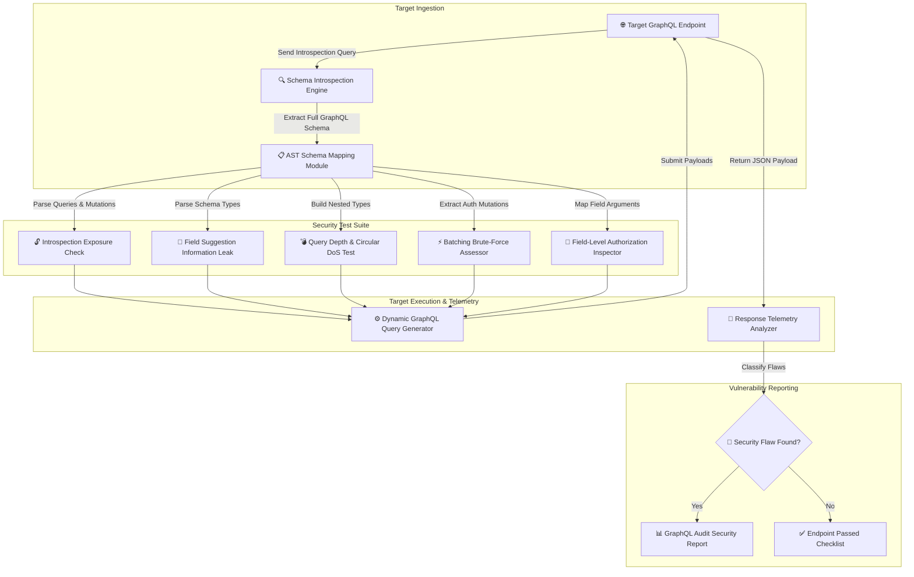

# 009 - GraphQL API Security Audit Framework

> **Category**: [[Web Application Attacks]] | **Difficulty**: ⭐⭐ | **Duration**: 4 weeks

---

## so what's the deal with this?

> [!CAUTION] Real-World Impact
> alright, so graphql is everywhere right now because it's super flexible (you basically ask for exactly the data you want and get it back in one request). but honestly, that same flexibility makes it a massive target. 
>
> if a dev forgets to turn off introspection, you can literally just ask the api for its entire database schema and it just hands it over. then you've got query batching letting attackers spam brute-force attempts, nested queries causing easy DoS, and even field suggestion features leaking private variable names. 

unhardened enterprise endpoints are basically just leaving admin mutations out in the open without proper field-level auth checks. getting into database records or doing wild admin operations is way too easy if they don't lock it down.

### real-world stuff that actually happened
- **gitlab graphql DoS (2021)**: someone figured out you could send unrestricted nested queries and just nuke their server cpu and memory. total service denial.
- **shopify privilege escalation (2020)**: researchers found missing auth checks on some mutation fields and just walked right into private store analytics and billing settings.
- **clara healthcare introspection leak (2022)**: they left introspection on and exposed patient PII schema models and hidden dev endpoints to the public internet. wild.

---

## what i'm reading / research

| # | Paper Title | Authors | Year | Source | Key Contribution |
|---|-------------|---------|------|--------|-----------------|
| 1 | GraphQL Security: Vulnerabilities, Attacks, and Defensive Strategies | Vulnerability Research Team | 2021 | ACM Computing Surveys | really good survey of attack vectors that only apply to graphql. |
| 2 | Automated Vulnerability Detection in GraphQL Schemas via Fuzzing | Dynamic API Security Lab | 2022 | IEEE Access | shows off a dynamic query generator for finding DoS flaws and auth bypasses. |
| 3 | Empirical Evaluation of GraphQL Adoption and Security Misconfigurations | Software Security Group | 2023 | USENIX Security | they looked at 500 production endpoints and documented how often introspection and batching abuse are actually possible in the wild. |

---

## architecture & how it works
Link: [[Drawing 2026-07-30 22.31.19.excalidraw#Project 009: 009 - GraphQL API Security Audit Framework|Excalidraw Architecture Diagram]]

---

## how i'm building it (the plan)

### week 1: setting up the lab
- spinning up a super vulnerable graphql server using apollo server, node.js, and postgres. gonna give it some endpoints for users, products, and admin settings.
- installing the toolkit: python 3.11, `graphql-core`, `requests`, `InQL`, and `graphql-cop`.
- basically just reading up on schema introspection, directives, mutations, subscriptions, and how query complexity is calculated under the hood.

### weeks 2-3: writing the core modules
- **module 1: the introspection dumper**
  sending full introspection queries (like `__schema { types { name fields { name type { name } } } }`) to scrape every single Query, Mutation, and Subscription object available.
- **module 2: circular dependency & depth DoS fuzzer**
  building deeply nested queries (think `user { friends { friends { friends { ... } } } }`) to see if the server chokes and check if they forgot to implement depth limiting.
- **module 3: query batching abuse checker**
  firing off http POST requests with arrays of 100+ duplicate queries just to see if the backend stupidly processes them sequentially without any rate limiting.
- **module 4: field-level auth tester**
  automating some token-swapping on sensitive fields (like `user { ssn creditCard }`) to see if the resolvers actually check role-based access control or just hand over the data.

### week 4: putting it all together
- running the whole automated suite against my apollo server, plus hasura and graphql yoga instances.
- tracking how well it detects the introspection leaks, DoS vectors, and batching vulns.

### week 5: docs and wrap-up
- writing up guidelines on how to actually secure this stuff (turn off introspection in prod, set max depth limits, use query cost analysis, lock down resolvers).
- pushing the whole audit framework code and guide to the repo.

---

## tech stack

| Tool | Purpose | Alternative |
|------|---------|-------------|
| Python | writing the audit framework & query gen logic | Node.js |
| Apollo Server | the target backend for testing | Hasura / GraphQL Yoga |
| InQL | burp extension for ripping schemas | Clairvoyance |
| GraphQL-Cop | quick security auditor | Custom Scripts |

---

## what the tool actually does
- ✅ **auto-dumps introspection**: rips and visualizes the whole schema structure if it's left open.
- ✅ **DoS testing**: spams nested circular queries to see if it can exhaust server resources.
- ✅ **batching abuse**: checks if the backend can be hammered with multi-query arrays.
- ✅ **field suggestion harvesting**: even if introspection is off, it abuses error messages to brute-force hidden schema field names.
- ✅ **auth checking**: makes sure resolver-level RBAC is actually working on sensitive fields.

---

## what i want to get out of this

> [!NOTE] the final product
> planning to output a python CLI tool that takes a graphql endpoint, rips the schema, runs all the depth/batching/auth tests, and spits out a report.

### performance goals:
- dump full schemas in under 2 seconds.
- accurately find the query depth limits.
- hit 100% test coverage on all the discovered query and mutation resolvers.

### what i'm dropping in the repo:
1. the actual python framework repo.
2. a hardening guide for apollo and hasura.
3. a sample audit report.

---

## stuff i'm learning
1. 📚 getting really good at graphql architecture, SDL, and how resolvers work.
2. 📚 mastering the weird attack vectors like introspection leaks and query depth DoS.
3. 📚 coding tools that can parse ASTs and build dynamic payloads on the fly.
4. 📚 figuring out how to actually defend against this (query cost, depth validation, etc).

---

## heads up
> [!WARNING] stay out of jail
> testing this stuff outside a lab without permission is a terrible idea. don't do it.

---

## related notes
- [[005 - API Security Testing Automation Platform]]
- [[006 - JWT Token Vulnerability Assessment Tool]]
- [[008 - Broken Access Control Detection Engine]]

---
*📅 Created: 2026-07-30 | 🏷️ Category: Web Application Attacks | 🔐 Offensive Security Research*
