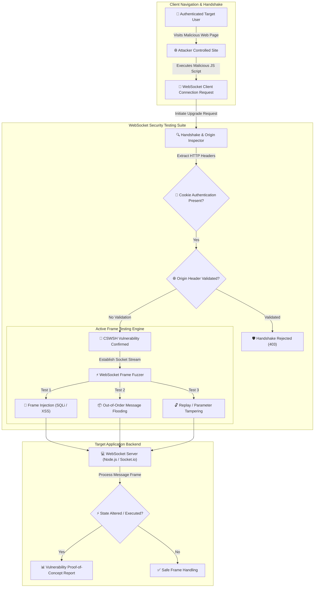

# 010 - WebSocket Security Testing Suite

> category: [[Web Application Attacks]] | difficulty: ⭐⭐ | duration: 4 weeks

---

## so what's the deal with this?

> [!CAUTION] why this actually matters
> websockets (`ws://` and `wss://`) are awesome for real-time stuff like live chat, trading apps, or anything where you need two-way comms without constant polling. but here's the catch: a lot of apps just rely on ambient cookies to authenticate the initial HTTP handshake and totally forget to check the `Origin` header.

this oversight leads straight to Cross-Site WebSocket Hijacking (CSWSH). basically, if an authenticated user visits my attacker site, my javascript can silently open a websocket connection back to the target server. since the browser auto-attaches their session cookies, the server thinks it's a legit request. boom—now i can read their private data streams, inject frames, and puppet their session.

### wild stuff that actually happened:
- **slack (2017)**: a CSWSH vuln let attacker sites open sockets to slack using victim cookies, stealing chat messages and API tokens.
- **trello (2018)**: missing origin checks let anyone monitor board updates live and manipulate user cards cross-origin.
- **tradingview (2020)**: researchers injected unauthenticated frames to spoof live financial market indicators right on client dashboards.

---

## some late-night reading material

| # | Paper Title | Authors | Year | Source | Key Contribution |
|---|-------------|---------|------|--------|-----------------|
| 1 | Cross-Site WebSocket Hijacking: Vulnerabilities, Attacks, and Mitigations | Structural Web Security Group | 2018 | ACM CCS | Formalizes CSWSH attack mechanics and Origin validation enforcement across browser engines. |
| 2 | Security Analysis of Real-Time Web Protocols: WebSockets vs WebRTC | Network Protocol Lab | 2021 | IEEE TDSC | Evaluates frame-level encryption, authorization persistence, and input sanitization across real-time web protocols. |
| 3 | Automated Fuzzing and Message Injection Analysis for WebSocket Gateways | Binary & Web Security Team | 2023 | USENIX Security | Presents a frame-level fuzzing framework for detecting injection vulnerabilities in WebSocket message handlers. |

---

## how this thing works under the hood
Link: [[Drawing 2026-07-30 22.31.19.excalidraw#Project 010: 010 - WebSocket Security Testing Suite|Excalidraw Architecture Diagram]]

---

## how i'm building it

### week 1: setting up the lab
- spinning up a basic real-time chat target using Node.js, `ws`, and `Socket.io` (with cookie auth enabled).
- grabbing the tools: Python 3.11, `websockets`, `aiohttp`, `autobahn`, and `Burp Suite`.
- re-reading RFC 6455 so i don't mess up the handshake logic, frame masking, or control frames (`Ping`/`Pong`/`Close`).

### weeks 2-3: writing the actual code
- **handshake analyzer**: crafting custom HTTP Upgrade requests. gonna spoof the `Origin` header (like `Origin: https://evil.com`) but attach valid victim cookies to see if the server blindly trusts it.
- **frame fuzzer**: building a script to blast mutated JSON, SQLi payloads, and XSS strings directly into active text and binary frames.
- **auth inspector**: a quick check to see if the server validates auth on every single frame, or if it just checks once during the handshake and then trusts the socket forever.
- **poc generator**: script that spits out ready-to-run HTML/JS payloads so i don't have to handwrite the CSWSH exploits every time.

### week 4: testing it out
- pointing the scanner at my local chat lab and a dummy trading dashboard.
- benchmarking how well it catches CSWSH, missing sanitization, and connection flooding (DoS).

### week 5: wrapping it up
- documenting how to actually fix this stuff (strict `Origin` validation, short-lived per-connection tokens, sanitizing inputs).
- pushing the whole suite to the repo.

---

## the toolkit

| Tool | Purpose | Alternative |
|------|---------|-------------|
| Python | async websocket testing engine | Node.js |
| Socket.io | target server framework | ws / Autobahn |
| Burp Suite | intercepting & messing with frames | OWASP ZAP |
| Docker | local lab containerization | Podman |

---

## what this thing actually does
- scans for missing `Origin` headers on handshakes
- async frame fuzzer for blasting payload frames over active sockets
- per-frame auth checker
- auto-generates html exploit proofs for CSWSH
- floods connections to test server stability

---

## what i'm aiming for

> [!NOTE] deliverables
> a python suite that intercepts handshakes, checks for CSWSH, fuzzes payloads, and spits out reports.

### stats i want to hit
- **handshake speed**: checking connections in < 500 ms.
- **fuzzing throughput**: pushing > 1,000 mutated frames per second.
- **accuracy**: 100% detection rate on bad cross-origin configs.

### what i'll have at the end
1. the actual tool repo.
2. a guide on mitigating CSWSH.
3. a sample vulnerability report to show it works.

---

## what i'm actually learning here
1. wrapping my head around RFC 6455, HTTP Upgrades, and masking rules.
2. mastering CSWSH and how browser origin policies apply to sockets.
3. writing async python tools for binary/text streams.
4. figuring out how to actually secure these things (Origin checks, CSRF tokens, proper sanitization).

---

## quick disclaimer
> [!WARNING] heads up
> keeping this strictly to my local lab. never running this on targets without explicit written permission.

---

## other stuff i've worked on
- [[002 - XSS Payload Generator with Context-Aware Encoding]]
- [[003 - CSRF Token Analyzer & Bypass Framework]]
- [[008 - Broken Access Control Detection Engine]]

---
*📅 Created: 2026-07-30 | 🏷️ Category: Web Application Attacks | 🔐 Offensive Security Research*
