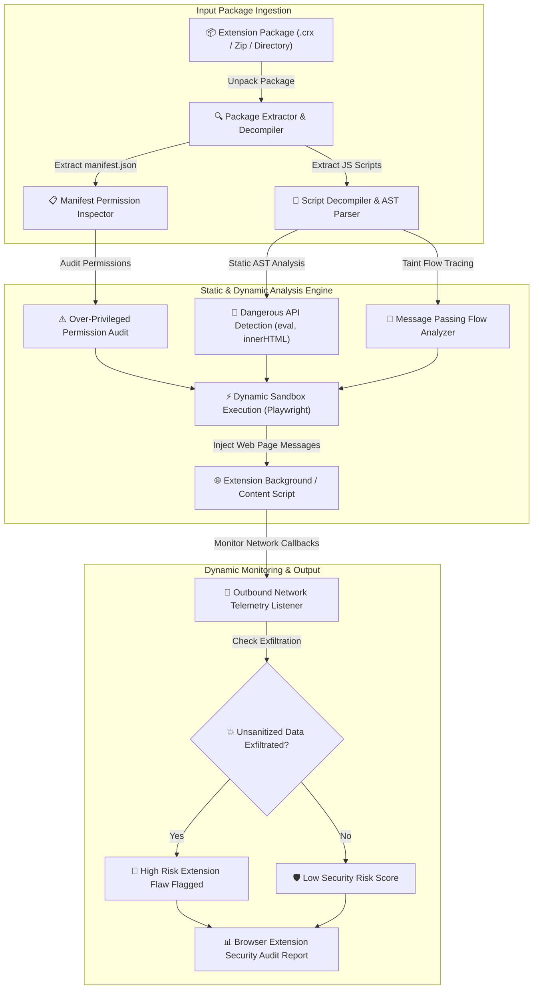

# 011 - Browser Extension Security Analyzer

> **Category**: [[Web Application Attacks]] | **Difficulty**: ⭐⭐⭐ | **Duration**: 5 weeks

---

## so what's the deal with this?

> [!CAUTION] Real-World Impact
> alright, so browser extensions (whether Manifest v2 or v3) have crazy broad permissions. they can inspect, modify, and exfiltrate user web traffic, DOM trees, auth cookies, and even keystrokes across literally all visited websites (`<all_urls>`). when malicious devs get hold of popular extensions or when legit ones have dumb security flaws (like insecure message passing or raw `eval()` execution), attackers can just silently steal session tokens and bank creds. it's bad.

honestly, we need static code analysis combined with dynamic permission auditing. the goal is to automatically inspect extension packages (`.crx` / `.xpi`), analyze whatever wild manifest permissions they're asking for, and trace data flow vulns between background scripts, content scripts, and web pages.

### real-world stuff that actually happened
- **Great Suspender Extension Hijack (2021)**: huge Chrome extension (2M+ users) got sold to some shady unknown entity and updated with malicious background scripts to run remote code execution. wild.
- **DataViper Extension Exfiltration (2020)**: a bunch of malicious extensions disguised as ad blockers were just skimming creds and session tokens from over 4 million users before getting nuked from the Chrome Web Store.
- **Cache-Control Extension Attack (2019)**: vulns allowed malicious web pages to talk to background scripts via `chrome.runtime.sendMessage`, abusing extension privileges to read cross-origin data.

---

## papers i'm referencing

| # | Paper Title | Authors | Year | Source | what it's actually about |
|---|-------------|---------|------|--------|-----------------|
| 1 | Security Analysis of Chrome Browser Extensions: Permission Abuse and Data Exfiltration | Kapravelos et al. | 2014 | USENIX Security | seminal study on permission over-privileging and static flow analysis for Chrome extensions. |
| 2 | Manifest V3: Security Gains and Extension Ecosystem Implications | Web Security Research Group | 2022 | IEEE S&P | breaks down security improvements of Manifest v3 (declarativeNetRequest, CSP restrictions) vs the legacy v2 stuff. |
| 3 | Detecting Insecure Cross-Boundary Message Passing in Web Extensions | System Security Lab | 2024 | ACM CCS | they built a taint analysis engine to track untrusted web page messages flowing into extension background scripts. |

---

## how the whole thing fits together (architecture)
Link: [[Drawing 2026-07-30 22.31.19.excalidraw#Project 011: 011 - Browser Extension Security Analyzer|Excalidraw Architecture Diagram]]

---

## how i'm building it

### week 1: getting the lab ready
- setting up a testing lab with Chromium/Firefox extension debuggers and some Docker containers.
- installing the stack: Python 3.11, Node.js, `esprima`, `eslint`, `playwright`, and `crx3`.
- checking out Chrome Manifest v2 vs Manifest v3 specs and permission models (`cookies`, `webRequest`, `declarativeNetRequest`, `storage`, `<all_urls>`).

### weeks 2-3: coding the core modules
this part is wild. gonna be heavy.
- **module 1: package unpacker & manifest permission auditor**
  decompressing `.crx` files and parsing `manifest.json`. flagging risky permissions like `cookies`, `debugger`, `webRequestBlocking`, broad host permissions (`<all_urls>`), and weak CSPs.
- **module 2: static abstract syntax tree (AST) scanner**
  parsing JS content/background scripts using `esprima` to find dangerous function calls (`eval()`, `new Function()`, dynamic `script` tag injection, `document.write`).
- **module 3: cross-boundary message passing inspector**
  tracing calls to `chrome.runtime.onMessageExternal` and `window.addEventListener("message")` to see if the extension actually checks `sender.origin` before doing privileged stuff.
- **module 4: dynamic network telemetry monitor**
  running extensions inside a Playwright-controlled Chromium instance and watching outbound HTTP requests for data exfil.

### week 4: putting it together & testing
- running this beast against a dataset of 50 open-source Chrome/Firefox extensions.
- seeing how well it detects over-privileged manifests, bad message handlers, and token stealing scripts.

### week 5: docs and wrap-up
- writing up security best practices for dev folks (least privilege, strict CSP, origin validation).
- publishing the repo and the audit guide.

---

## tools i'm using

| Tool | Purpose | Alternative |
|------|---------|-------------|
| Python | tool automation & static analysis coordinator | TypeScript |
| Esprima | JS AST parsing & static token inspection | Babel Parser |
| Playwright | dynamic extension sandbox execution engine | Puppeteer |
| Chrome DevTools | extension debugging and network monitoring | Firefox Developer Tools |

---

## what this thing actually does
- ✅ **manifest permission auditor**: flags over-privileging and high-risk API requests.
- ✅ **AST-based code scanner**: spots dangerous execution sinks (`eval`, dynamic script injection) in the source.
- ✅ **message passing validator**: yells at you if you're missing origin checks in `chrome.runtime.onMessageExternal` listeners.
- ✅ **dynamic exfiltration monitor**: watches network requests at runtime in a headless browser sandbox.
- ✅ **risk scoring engine**: spits out a composite security risk score based on all the findings.

---

## what i'm hoping to get out of this

> [!NOTE] the end goal
> literally just a solid tool that unpacks extensions, audits manifests, runs static AST taint analysis, watches runtime network telemetry, and spits out a risk report.

### performance targets
- **analysis speed**: trying to parse and analyze a package in < 3 seconds.
- **audit accuracy**: 100% identification of broad host permissions and high-risk APIs.
- **vuln detection**: hoping to catch > 92% of insecure message handling and execution sinks.

### what i'll actually release
1. the Browser Extension Security Analyzer repo.
2. an extension developer security hardening guide.
3. a vulnerability dataset & audit findings report.

---

## what i'm learning here
1. 📚 mastering Chrome Extension Manifest v2/v3 architecture, background processes, and content script boundaries.
2. 📚 getting deep into the security implications of extension permissions (`webRequest`, `cookies`, `<all_urls>`).
3. 📚 building JavaScript Abstract Syntax Tree (AST) parsers to find vulns statically.
4. 📚 setting up dynamic browser sandboxes to monitor network interactions.

---

## a quick disclaimer
> [!WARNING] Legal & Ethical Notice
> obviously, keep this in a controlled lab environment. never test this on systems or extensions without explicit written authorization. don't be stupid.

---

## related stuff
- [[002 - XSS Payload Generator with Context-Aware Encoding]]
- [[006 - JWT Token Vulnerability Assessment Tool]]
- [[012 - Content Security Policy (CSP) Bypass Research Tool]]

---
*📅 Created: 2026-07-30 | 🏷️ Category: Web Application Attacks | 🔐 Offensive Security Research*
