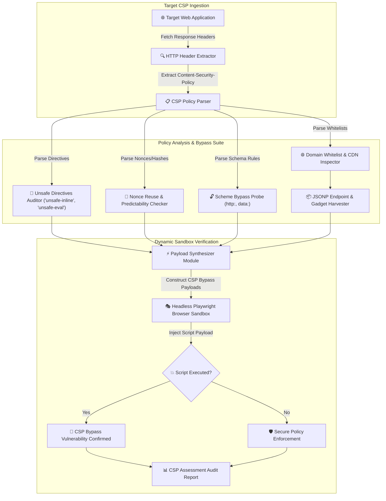

# 012 - Content Security Policy (CSP) Bypass Research Tool

> **category**: [[Web Application Attacks]] | **difficulty**: ⭐⭐⭐ | **duration**: 4 weeks

---

## so what's the deal with this?

alright, so Content Security Policy (CSP) is supposed to be this ultimate HTTP header that stops cross-site scripting (XSS) dead in its tracks. the idea is simple: tell the browser exactly which origins are allowed to load scripts, images, etc. 

but honestly... people mess it up constantly. i've been looking at real-world CSP setups and they are riddled with wild flaws. devs get lazy and throw in `'unsafe-inline'` or `'unsafe-eval'`, or they whitelist entire massive CDNs like `*.googleapis.com` or `cdn.jsdelivr.net`. plus, they forget to define fallback directives or leave JSONP endpoints wide open.

this basically means if an attacker finds a basic XSS vector, they can just sidestep the CSP completely, pull in an external script payload, and steal whatever data they want.

**some wild real-world fails:**
- **Google Services (2017)**: researchers found out that standard whitelists including Google's own JSONP endpoints (like `www.google.com/complete/search?client=chrome&jsonp=...`) let attackers execute arbitrary XSS. literally bypassing google's own protection.
- **Twitter CDN Flaw (2018)**: messed up fallback directives let attackers load malicious scripts straight from legacy whitelisted CDNs. 
- **US Bank (2020)**: they just slapped `'unsafe-inline'` in their `script-src`. like... why even have a CSP at that point? any injected `<script>` tag would just run.

---

## some heavy reading (papers)

i dug into some research to figure out how broken this really is. 

| # | Paper Title | Authors | Year | Source | Key Contribution |
|---|-------------|---------|------|--------|-----------------|
| 1 | CSP Is Dead, Long Live CSP: On the Insecurity of Whitelist-Based CSP in the Wild | Weichselbaum et al. | 2016 | ACM CCS | Benchmark study evaluating 1 million domains, proving 95%+ of domain whitelist CSPs are trivially bypassable. |
| 2 | Strict CSP: A Deployable Defense Against Cross-Site Scripting | Google Security Team | 2019 | IEEE Security & Privacy | Introduces Nonce-based and Hash-based CSP architectures as superior alternatives to domain whitelists. |
| 3 | Automated Discovery of JSONP and Gadget Bypass Vectors in CSP Whitelists | System Security Research | 2022 | USENIX Security | Presents automated crawler for identifying script gadget endpoints within whitelisted CDN domains. |

---

## how i'm building the tool (architecture)

Link: [[Drawing 2026-07-30 22.31.19.excalidraw#Project 012: 012 - Content Security Policy (CSP) Bypass Research Tool|Excalidraw Architecture Diagram]]

here's the brain-dump of how the flow is going to work. 

---

## the plan

i'm splitting this into a few phases over the next month.

### phase 1: getting the lab ready
- gonna spin up an intentionally vulnerable Express.js web app. i want to inject at least 8 different botched CSP header configs to test against.
- grabbing all the libs i need: Python 3.11, `playwright`, `beautifulsoup4`, `tldextract`, and `requests`.
- spending some time actually reading the W3C CSP Level 3 specs (stuff like `script-src`, `object-src`, `base-uri`, `'strict-dynamic'`).

### phase 2: writing the actual code
- **parser module**: taking the raw `Content-Security-Policy` header strings and ripping them into a JSON object so i can actually map the directives and fallbacks (like `default-src`).
- **static auditor**: this will just check for the obvious dumb stuff. `'unsafe-inline'`, `'unsafe-eval'`, wildcards (`*`), missing `object-src`, or HTTP fallbacks.
- **gadget finder**: taking whitelisted domains (like `cdnjs.cloudflare.com`) and throwing them against a database of known JSONP endpoints and Angular/React gadgets to see if we can force arbitrary code execution.
- **headless validator**: this part is wild. i'm going to use Playwright to dynamically inject bypass payloads into a sandboxed browser that is actively enforcing the target CSP. if the payload pops, we know it's a confirmed bypass.

### phase 3: testing it all
- running automated sweeps against some local containers and maybe parsing top domains just to see what their headers look like.
- checking the accuracy to make sure my nonce reuse checks and domain-whitelist bypasses actually work without throwing false positives.

### phase 4: docs & wrap up
- writing down some guidelines on how to actually do Strict CSP right (using random nonces like `'nonce-rAnd0m'` and `'strict-dynamic'`).
- pushing the whole repo and docs to my github.

---

## my tech stack

just keeping it simple for this one.

| Tool | Purpose | Alternative |
|------|---------|-------------|
| Python | parsing the headers and running the bypass engine | TypeScript |
| Playwright | headless browser verification | Selenium |
| Google CSP Evaluator | referencing how the big guys analyze policies | manual lab analysis |
| CyberChef | cooking up weird payloads and polyglots | Burp Suite |

---

## what the tool actually does (features)

- automated policy parsing: literally just turns awful CSP strings into a clean AST.
- JSONP endpoint harvester: hunts down CDN domains that are hiding bypassable JSONP endpoints.
- script gadget integrator: maps out AngularJS, React, and Bootstrap gadgets that let you run code even on whitelisted origins.
- headless verification engine: using Playwright to confirm if the payload actually executes. no more guessing.
- strict CSP generator: spits out a secure, nonce-based replacement header tailored for the target app.

---

## end goals & metrics

by the time i'm done, i want a slick python tool that does all the heavy lifting and spits out a hardened Strict CSP config.

**the benchmarks i'm aiming for:**
- policy audit speed: parsing the headers in under 200ms.
- JSONP discovery: matching against 100+ known bypass endpoints.
- zero false positives: the Playwright sandbox should guarantee this. if it doesn't pop in the browser, it's not a real bypass.

i'll end up with the repo, a strict CSP best practices guide, and some audit report templates.

---

## what i'm hoping to learn

1. actually understanding W3C CSP (level 2 & 3) directives and how fallback inheritance works under the hood.
2. getting super comfortable with crazy bypass vectors like JSONP injection and script gadgets.
3. proving why nonce-based strict CSP is lightyears better than domain whitelisting.
4. building automated browser-based security testing pipelines.

---

## standard disclaimer

don't be an idiot. this is offensive security research for a controlled lab environment. do not point this at production systems you don't own without explicit written permission.

---

## other stuff i'm working on

- [[002 - XSS Payload Generator with Context-Aware Encoding]]
- [[007 - Web Application Firewall (WAF) Bypass Techniques Analyzer]]
- [[011 - Browser Extension Security Analyzer]]

---
*📅 Created: 2026-07-30 | 🏷️ Category: Web Application Attacks | 🔐 Offensive Security Research*
