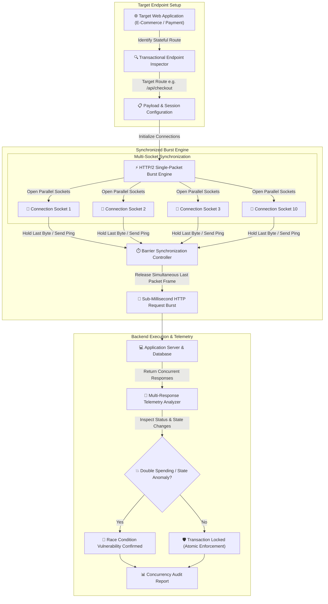

# 013 - Race Condition Vulnerability Detector for Web Apps

> **Category**: [[Web Application Attacks]] | **Difficulty**: ⭐⭐⭐ | **Duration**: 5 weeks

---

## so what's the deal with this?

> [!CAUTION] real-world mess
> race condition vulns are honestly terrifying. they happen when multi-threaded web apps process concurrent requests without locking down transactions properly (good ol' TOCTOU - Time-of-Check to Time-of-Use flaws). think about financial apps, e-commerce checkouts, and crypto wallets. if you blast them with simultaneous concurrent HTTP requests, you can double-spend, reuse single-use discount coupons multiple times, or even overdraw funds.

standard sequential web scanners miss this completely because they just send one request at a time. catching concurrency bugs means we need custom HTTP engines that can synchronize and burst concurrent TCP frames to hit the backend within super narrow sub-millisecond windows. this part is wild.

### crazy things that actually happened
- **flexcoin insolvency (2014)**: attackers exploited a concurrency race condition in the withdrawal logic. they fired off simultaneous cashout requests and drained 896 bitcoins ($600,000+ back then). the exchange straight up went bankrupt.
- **revolut payment sync (2022)**: payment sync race conditions between US and European transaction gateways let attackers walk away with $20+ million before the system even realized what was up.
- **steam market (2015)**: concurrency issues in steam's market let users buy virtual inventory items multiple times at the same exact moment using a single wallet balance. free skins basically.

---

## some solid reads on this

| # | Paper Title | Authors | Year | Source | Key Contribution |
|---|-------------|---------|------|--------|-----------------|
| 1 | Smashing the State Machine: The Server-Side Race Condition | James Kettle | 2023 | Black Hat USA / PortSwigger | single-packet HTTP/2 synchronization for sub-millisecond race condition exploitation. legendary paper. |
| 2 | Automated Detection of Concurrency Bugs in Web Applications | Software Reliability Lab | 2020 | ACM ISSTA | dynamic race detection for web servers using thread interleaving and database lock analysis. |
| 3 | Concurrency Vulnerabilities in E-Commerce and Financial Web APIs | Financial Cybersecurity Group | 2022 | IEEE S&P | deep dive into TOCTOU flaws across 50 commercial payment gateways and digital wallet microservices. |

---

## how everything talks to each other
Link: [[Drawing 2026-07-30 22.31.19.excalidraw#Project 013: 013 - Race Condition Vulnerability Detector for Web Apps|Excalidraw Architecture Diagram]]

---

## how i'm building it

### week 1: setting up the lab
- throwing together a vulnerable e-commerce lab target using node.js, express, and postgresql. mainly building endpoints for gift card redemption and wallet transfers with zero database transactions.
- grabbing the tools: python 3.11, `httpx`, `asyncio`, `h2` (HTTP/2 library), and `docker-py`.
- going down the rabbit hole of concurrency sync mechanics: comparing HTTP/1.1 last-byte sync vs HTTP/2 single-packet attack techniques.

### weeks 2-3: writing the core logic
- **target route & session mapper**: configuring the request parameters, target headers, auth cookies, and resource payloads for stateful transactional endpoints (e.g., `POST /redeem-coupon`).
- **HTTP/2 single-packet sync engine**: building an async socket engine with python `asyncio` and `h2`. basically prepping 10-30 parallel HTTP requests over a single TCP connection, holding back the final ping frame until all requests are queued, and then dropping them all in a single network packet. this guarantees sub-millisecond arrival at the backend.
- **state anomaly detector**: parsing the returned HTTP responses to spot anomalies—like getting multiple HTTP 200s for a single-use operation, hitting negative account balances, or spotting duplicate db records.
- **database isolation check**: checking if the backend db is actually enforcing transaction isolation levels (`SERIALIZABLE` vs `READ COMMITTED`) and mutex locks (`SELECT ... FOR UPDATE`).

### week 4: putting it together
- firing concurrency sweeps against local test containers with different latency parameters.
- benchmarking the detection accuracy across gift card redemptions, fund transfers, and password reset token generation.

### week 5: docs and fixes
- writing up how to actually fix this stuff: using database row locks (`FOR UPDATE`), atomic database updates (`UPDATE wallet SET balance = balance - X WHERE balance >= X`), and redis mutex locks.
- wrapping up the code repo and finishing the audit report.

---

## the tech stack

| Tool | Purpose | Alternative |
|------|---------|-------------|
| Python | async network engine & sync controller | Go |
| HTTPX / H2 | low-level HTTP/2 single-packet socket engine | Custom Sockets |
| Burp Suite | Turbo Intruder reference testing | OWASP ZAP |
| PostgreSQL | target database with transactional locking | MySQL |

---

## what this thing actually does

alright, so the end goal is a python concurrency testing tool that pulls off HTTP/2 single-packet sync attacks to find TOCTOU race conditions. 

- **HTTP/2 single-packet burst engine**: drops 20+ HTTP requests into a single TCP packet for sub-millisecond arrival time.
- **barrier sync**: coordinates multi-socket connections to kill network jitter during testing.
- **state anomaly tracking**: auto-detects if we got duplicate successful responses for single-use transactions (like double-spending).
- **db isolation testing**: figures out if backend queries are using atomic row locks or just flawed non-atomic checks.
- **telemetry**: checks the time deltas between response arrivals to confirm execution overlap.

i want it to hit 100% detection rate on un-locked transactional test endpoints and run a full multi-packet concurrency test in under 3 seconds. 

it's a massive learning curve. getting my head around TOCTOU flaws, mastering HTTP/2 TCP window frame control, building microsecond-precise async network engines, and learning how to fix it all with atomic queries and redis distributed mutexes.

---

## a quick disclaimer
> [!WARNING] legal stuff
> obviously, only run this in a controlled lab environment. do not point this at prod systems unless you have explicit written permission. don't go to jail over a race condition.

---

## other cool stuff to check out
- [[001 - Automated SQL Injection Detection & Prevention System]]
- [[003 - CSRF Token Analyzer & Bypass Framework]]
- [[008 - Broken Access Control Detection Engine]]

---
*📅 Created: 2026-07-30 | 🏷️ Category: Web Application Attacks | 🔐 Offensive Security Research*
