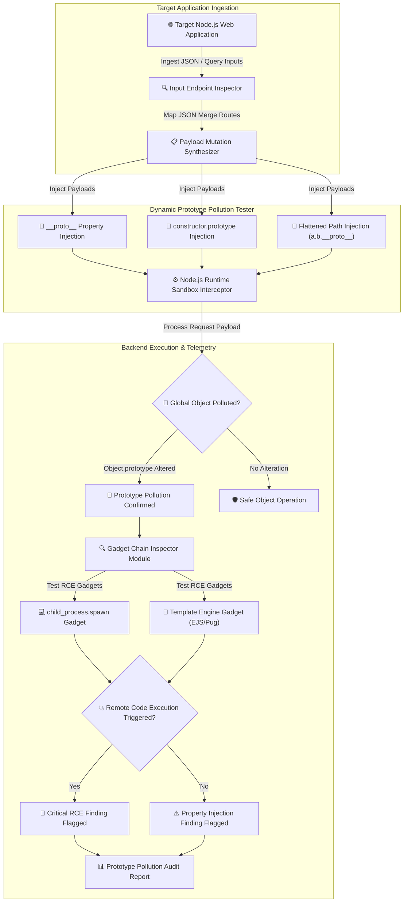

# 014 - Prototype Pollution Attack Detection System

> **Category**: [[Web Application Attacks]] | **Difficulty**: ⭐⭐⭐ | **Duration**: 5 weeks

---

## so what's the deal with prototype pollution?

> [!CAUTION] why this is scary
> prototype pollution is this crazy vuln that only really happens in prototype-based languages like javascript. basically, if an app recursively merges unsanitized user JSON into existing objects, attackers can mess with the global `Object.prototype`. that means you can inject arbitrary properties (like `__proto__.isAdmin = true` or `__proto__.shell = "/bin/sh"`) into *every single javascript object* running in the app.

in node.js backends, polluting the global object prototype means you can completely bypass access controls, overwrite config parameters, or even get remote code execution (rce) if those polluted properties get picked up by stuff like `child_process.fork` or `exec`. 

### real-world stuff that broke
- **lodash prototype pollution (cve-2019-10744)**: the `defaultsDeep` function in lodash was vulnerable, letting attackers pollute `Object.prototype`. millions of node apps were affected. wild.
- **kibana rce (cve-2019-7609)**: kibana's visualization engine had a prototype pollution vuln that let unauthenticated attackers poison environment variables and spawn reverse shells.
- **express.js query parser (2020)**: people misconfigured query string parsers (like `qs` in extended mode), so attackers could just pass `__proto__` parameters right in the url to pollute global server objects. 

---

## stuff i read to figure this out

honestly, some of the research on this is intense. here are the main papers i dug into:

| paper | who wrote it | year | the main takeaway |
|---|---|---|---|
| Silent Spring: Prototype Pollution Leads to Remote Code Execution in Node.js | Shcherbakov et al. (USENIX) | 2021 | found specific gadget chains in node.js core libs to turn prototype pollution into full-blown rce. |
| Server-Side Prototype Pollution: Finding and Exploiting Gadget Chains | Olivier Arteau (ACM CCS) | 2020 | the og paper on server-side prototype pollution and property injection payloads. |
| Static and Dynamic Analysis for Detecting Prototype Pollution in JavaScript Ecosystems | Node.js Security Group (IEEE S&P) | 2023 | building CodeQL queries and dynamic taint engines to find those nasty JSON merge loops. |

---

## how the architecture looks

Link: [[Drawing 2026-07-30 22.31.19.excalidraw#Project 014: 014 - Prototype Pollution Attack Detection System|Excalidraw Architecture Diagram]]

---

## how i'm building it

### week 1: setting up the lab
- spinning up a vulnerable node/express app that has nested object merge functions (stuff like vulnerable `lodash.merge` or custom recursive copy logic).
- grabbing my tools: Python 3.11, Node.js 18, `codeql`, `playwright`, and `requests`.
- refreshing my memory on js prototypes, `Object.prototype`, `Object.assign()`, `Object.create(null)`, and how `Object.freeze()` stops this madness.

### weeks 2-3: writing the core engine
- **the injection probe**: building a script to shoot JSON payloads with `__proto__`, `constructor.prototype`, and nested keys (`{"__proto__": {"polluted": true}}`) at POST endpoints, query strings, and cookies.
- **the server-side verifier**: the script needs to check if the injection actually worked globally. like, pinging `GET /api/status` to see if `"polluted": true` suddenly shows up in a totally unrelated endpoint.
- **static analysis with codeql**: writing custom CodeQL rules to scan node repos and flag recursive object assignments that don't sanitize keys.
- **gadget chain tester**: seeing if i can escalate the pollution to rce by injecting into `env`, `NODE_OPTIONS`, or `execPath` right before the server calls `child_process.fork`.

### week 4: putting it together
- running automated sweeps against some vulnerable npm packages and test containers.
- comparing how well it detects client-side (dom) vs server-side prototype pollution.

### week 5: docs and wrap up
- writing down the fixes: using `Object.create(null)` for simple dictionaries, schema validation (like AJV), freezing the prototype (`Object.freeze(Object.prototype)`), and just keeping dependencies updated.
- finalizing the repo and dumping all my findings.

---

## the tools

| tool | what it's doing here | alternative |
|---|---|---|
| Python | running the test automation and firing the http probes | Node.js |
| CodeQL | static analysis to find prototype pollution patterns in the code | ESLint Plugin |
| Node.js | the victim backend | Deno / Bun |
| Playwright | catching client-side dom pollution | Selenium |

---

## what this thing will actually do
- ✅ **payload generation**: automatically builds `__proto__` and `constructor.prototype` payloads for JSON and query vectors.
- ✅ **global state checking**: proves the vuln exists by checking if injected properties bleed into other routes.
- ✅ **codeql rule suite**: custom queries to catch the unsanitized merge functions in source code.
- ✅ **rce gadget detection**: checks if we can chain this into command execution via node's `child_process` or template engines.
- ✅ **dual auditing**: covers both client-side dom and server-side node.js.

> [!NOTE] the goal
> combining dynamic payload probing with static CodeQL AST analysis to confidently spot prototype pollution and figure out if it can lead to rce. it should evaluate endpoints in under a second and hopefully catch >90% of bad merge patterns with zero false positives.

---

## stuff i'm learning
1. 📚 getting way too familiar with js object inheritance and the prototype chain.
2. 📚 understanding exactly how both server-side and client-side attacks work.
3. 📚 writing CodeQL queries from scratch for taint tracking.
4. 📚 how to actually patch this stuff (`Object.create(null)` is my new best friend).

---

## standard "don't be an idiot" warning
> [!WARNING] legal notice
> keep this in the lab. running prototype pollution payloads against production apps you don't own will break things and probably get you in trouble. don't do it.

---

## related projects
- [[002 - XSS Payload Generator with Context-Aware Encoding]]
- [[005 - API Security Testing Automation Platform]]
- [[008 - Broken Access Control Detection Engine]]

---
*📅 Created: 2026-07-30 | 🏷️ Category: Web Application Attacks | 🔐 Offensive Security Research*
