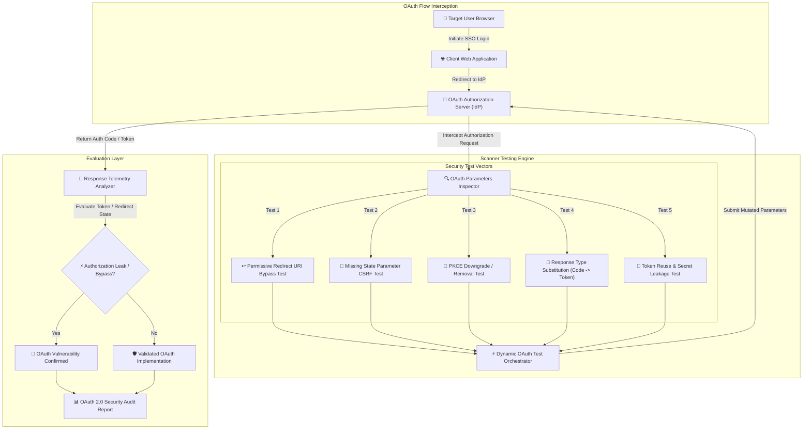

# 015 - OAuth 2.0 Flow Vulnerability Scanner

> **Category**: [[Web Application Attacks]] | **Difficulty**: ⭐⭐⭐ | **Duration**: 5 weeks

---

## so what's the deal with this?

> [!CAUTION] why this actually matters
> OAuth 2.0 and OpenID Connect (OIDC) are basically the backbone of SSO logins everywhere. but honestly, people mess up the implementations all the time. things like permissive redirect URIs (hello path traversal and open redirects), forgetting to check the `state` param (which opens up OAuth CSRF account linking), PKCE downgrades, or just leaking tokens in the implicit grant... it all leads to full account takeover. 

since OAuth flows bounce around between the client app, user browser, and the auth server (IdP), any tool trying to test this stuff automatically has to trace states and token exchanges across a bunch of different domains. it's kind of a mess to test manually.

### times it actually broke in the wild
- **facebook oauth leak (2014)**: researchers found out that open redirect bugs on trusted client sites leaked auth codes to attacker sites via the HTTP `Referer` header. wild.
- **github oauth account linking csrf (2019)**: they weren't verifying the `state` param during 3rd-party integration. attackers could force victims to link their accounts to the attacker's identity. 
- **sign in with apple (2020)**: big yikes here. a flaw in apple's OIDC implementation let attackers forge JWT identity tokens for *any* email address. total auth bypass.

---

## some papers i skimmed

| # | Paper Title | Authors | Year | Source | Key Contribution |
|---|-------------|---------|------|--------|-----------------|
| 1 | Formal Security Analysis of OAuth 2.0 and OpenID Connect Implementation Flaws | Fett et al. | 2016 | ACM CCS | formal security model for oauth 2.0 auth code & implicit flow attacks. |
| 2 | Analyzing Redirect URI Security Restrictions in Commercial OAuth 2.0 Identity Providers | Sun & Beznosov | 2021 | IEEE S&P | tested wildcard matching & open redirects on 30 big IdPs. |
| 3 | Automated Security Auditing of PKCE and Token Binding Implementations in Mobile & Web Apps | Identity Security Group | 2023 | USENIX Security | showed how to do proof-key downgrades and intercept auth codes. |
| 4 | Federated Identity Vulnerabilities: Lessons from OAuth and OpenID Connect Exploitation | Mainka et al. | 2024 | NDSS | massive list of real-world vulns across cloud SSO providers. |

---

## how it all connects
Link: [[Drawing 2026-07-30 22.31.19.excalidraw#Project 015: 015 - OAuth 2.0 Flow Vulnerability Scanner|Excalidraw Architecture Diagram]]

---

## how i'm building it

### week 1: getting the lab set up
- spinning up a vulnerable OAuth 2.0 lab using Python Flask and `authlib` (need endpoints for the Auth Server, Client App, and Resource Server).
- installing the stuff i need: Python 3.11, `authlib`, `requests`, `playwright`, and `pyjwt`.
- basically reading RFC 6749, RFC 7636 (PKCE), and OIDC Core 1.0 until my eyes bleed.

### weeks 2-3: the actual code
- **the parameter extractor**: ripping through auth request URLs to grab `client_id`, `redirect_uri`, `response_type`, `scope`, `state`, and `code_challenge`.
- **redirect uri evasion**: fuzzing the `redirect_uri` param. throwing in path traversal (`/oauth/callback/../../attacker`), wildcard subdomains (`https://attacker.client.com`), and open redirectors to see if i can get the auth code sent to my sketchy domain.
- **state csrf & code testing**: dropping the `state` param entirely or just sending static ones to see if the target is vulnerable to OAuth account linking CSRF.
- **pkce & flow downgrades**: stripping out `code_challenge` and `code_challenge_method` to see if the server actually enforces PKCE. also trying to swap `response_type=code` to `response_type=token` to force a vulnerable implicit flow.

### week 4: testing it all out
- running this against my local Flask containers and some open-source IdPs like Keycloak and Hydra.
- checking if it can actually catch redirect URI leaks, state flaws, and PKCE bypasses without dying.

### week 5: wrapping it up
- writing down the right way to do this: exact string matching for redirect URIs, forcing PKCE for everyone, and using proper crypto for state tokens tied to sessions.
- dumping the whole scanner repo and docs online.

---

## the tech stack

| Tool | What it's for | Alternative i could have used |
|------|---------|-------------|
| Python | writing the automation & http testing | Go |
| Authlib | setting up the target server/client | Keycloak / Hydra |
| Playwright | headless browser to track multi-redirect flows | Selenium |
| PyJWT | decoding tokens & checking claims | CyberChef |

---

## what this thing actually does
- ✅ **redirect uri fuzzing**: checks for path traversal, open redirects, and subdomain tricks.
- ✅ **oauth csrf checking**: sees if `state` params are legit, bound to sessions, and actually checked.
- ✅ **pkce downgrade detection**: complains if the auth server doesn't enforce PKCE.
- ✅ **flow downgrades**: tries to force implicit flow instead of auth code flow.
- ✅ **redirect tracking**: follows those messy multi-domain HTTP redirects using a headless browser.

---

## what i want to get out of it

> [!NOTE] end goal
> a python script that intercepts OAuth/OIDC flows, throws bypass attacks at redirect URIs and state params, checks PKCE, and spits out a decent report.

### target metrics
- **speed**: gotta do a full assessment in under 4 seconds.
- **detection**: 100% catch rate on bad redirect URI whitelists.
- **accuracy**: zero false positives when flagging OAuth CSRF.

### the final output
1. the scanner repo itself.
2. a quick guide on hardening IdPs against this stuff.
3. a standard audit report format.

---

## brain gains
1. 📚 finally understanding oauth 2.0, oidc, and the different grant types without getting confused.
2. 📚 learning the exact mechanics of redirect uri leaks, oauth csrf, and pkce attacks.
3. 📚 writing headless browser automation that doesn't break on cross-domain redirects.
4. 📚 figuring out how to actually secure auth servers.

---

## don't go to jail
> [!WARNING] quick reminder
> only run this on local lab setups. testing on random live systems without permission is a really bad idea.

---

## other stuff i'm working on
- [[003 - CSRF Token Analyzer & Bypass Framework]]
- [[005 - API Security Testing Automation Platform]]
- [[006 - JWT Token Vulnerability Assessment Tool]]

---
*📅 Created: 2026-07-30 | 🏷️ Category: Web Application Attacks | 🔐 Offensive Security Research*
