# 🎯 016 - automated network recon framework

> **category**: [[Network Penetration Testing]] | **difficulty**: ⭐⭐ | **duration**: 5 weeks

---

## 🧐 so what's the deal with this?

> [!CAUTION] real-world impact
> crazy fact: APTs usually burn like 75% of their time just doing recon before they even drop a payload. if they can quietly map out internal topologies, find unpatched external stuff, or exposed admin panels, they basically have a free pass. the solarwinds supply chain breach is a perfect example of this going completely unchecked.

so automated network recon is basically the most important part of any offensive sec assessment (or defending your own stuff). doing host discovery, port scanning, and service enumeration manually across massive corporate IP ranges is honestly so slow and annoying. plus, networks are constantly changing with cloud deployments and random microservices spinning up and down. it's super easy to miss a blind spot.

i'm building a modular, multi-threaded recon framework to fix this. it grabs passive OSINT stuff first, then goes loud with active probing (messing with raw sockets and async port scanning). the end goal is to automatically map out the attack surface, fingerprint OSes, find exposed protocols, and immediately cross-reference service banners with the NVD/CVE databases to find vulns.

### 🌍 some wild real-world examples
- **SolarWinds (2020)**: APT29 just chilled on the network for months, doing passive and active recon to map out AD structures and build servers before they actually did anything malicious.
- **Equifax (2017)**: attackers just aggressively scanned public IP ranges until they found a crusty, unpatched Apache Struts vuln on an external portal. game over.
- **Singtel Telecom (2024)**: state-sponsored groups used automated scripts to find exposed edge routers and forgotten VPNs, then used them to hold persistent access.

---

## 🔬 some papers i skimmed

honestly, these actually helped a lot with understanding the low-level stuff:

| # | paper title | authors | year | source | why i care |
|---|-------------|---------|------|--------|-----------------|
| 1 | ZMap: Fast Network Scan at Internet Scale | Durumeric et al. | 2013 | USENIX Security | this showed me how connectionless probing works. scanning the entire IPv4 space in 45 mins is insane. |
| 2 | Nmap Network Scanning | Lyon, G. | 2009 | Insecure.org | the holy grail for TCP/IP stack fingerprinting and OS detection. |
| 3 | How to 0wn the Internet in Your Spare Time | Staniford et al. | 2002 | USENIX Security | talks about automated worm propagation. kinda scary how fast automated discovery works. |

---

## 🏗️ how it all fits together

link: [[Drawing 2026-07-30 22.31.19.excalidraw#Project 016: 016 - Automated Network Reconnaissance Framework|Excalidraw Architecture Diagram]]

```mermaid
graph TD
    subgraph Input_Scope ["1. Input & Target Scope"]
        A[Target Specification: CIDR / Domain / IP List] --> B[Scope Validator & Excluder]
    end

    subgraph Passive_Recon ["2. Passive Intelligence Layer"]
        B --> C[Shodan API Engine]
        B --> D[Censys & PassiveDNS Query Module]
        B --> E[WHOIS & Reverse DNS Lookups]
    end

    subgraph Active_Recon ["3. Active Probing Engine"]
        B --> F[Asynchronous SYN Scanner - Masscan]
        F --> G[TCP/UDP Port Discovery]
        G --> H[Service Banner Grabber - Scapy]
        H --> I[TCP/IP Stack OS Fingerprinting]
    end

    subgraph Analysis_Engine ["4. Processing & Correlation"]
        C --> J[Data Aggregator & Deduplicator]
        D --> J
        E --> J
        I --> J
        J --> K[CVE / NVD Vulnerability Mapper]
        K --> L[Network Topology Graph Generator]
    end

    subgraph Output_Layer ["5. Reporting & Export"]
        L --> M[Interactive HTML/JSON Dashboard]
        L --> N[Graphviz Network Map Export]
    end

    style Input_Scope fill:#1f2937,stroke:#3b82f6,stroke-width:2px;
    style Passive_Recon fill:#1e293b,stroke:#06b6d4,stroke-width:2px;
    style Active_Recon fill:#111827,stroke:#ef4444,stroke-width:2px;
    style Analysis_Engine fill:#0f172a,stroke:#10b981,stroke-width:2px;
    style Output_Layer fill:#18181b,stroke:#8b5cf6,stroke-width:2px;
```

---

## 📐 how i'm building it (the roadmap)

### phase 1: lab setup (week 1)
- getting Python 3.11+, Scapy, Nmap dev libs, and libpcap installed.
- throwing together a local lab subnet (192.168.56.0/24) with some Linux, Windows, and Metasploitable boxes to beat up.
- registering for API keys for Shodan, Censys, SecurityTrails.
- sorting out raw socket perms (`CAP_NET_RAW`) so i don't have to run everything as root like a noob.

### phase 2: coding the core modules (weeks 2-3)
- **passive stuff**: writing python scripts to hit up WHOIS, passive DNS, and search engines so we can profile the target without touching their servers.
- **active scanner**: building an async TCP SYN scanner. i'm using raw sockets (`Scapy`/`socket` libs) so it can blast thousands of ports a second.
- **banner grabbing & OS fingerprinting**: this part is wild. writing custom probes for HTTP, SSH, FTP, etc. to snatch banners, and analyzing TCP window sizes and TTLs to guess the OS.
- **cve mapping**: setting up an offline SQLite/JSON db of CVEs to automatically match against the banners we grabbed.

### phase 3: gluing it together & testing (week 4)
- merging the passive and active scripts into one slick CLI pipeline using `asyncio` to keep it fast.
- benchmarking the scans against my lab to check speed, bandwidth drops, and accuracy.
- testing stealthy scans (ACK, FIN, fragmenting packets) against Snort IDS to see if i get caught.
- dumping the output into a clean JSON schema and graphing the topology with NetworkX.

### phase 4: wrapping up (week 5)
- comparing my async scanner (Masscan style) against stateful deep scans (Nmap style) to see the trade-offs.
- generating the final reports showing exposed stuff and missing patches.
- writing up the actual BTech project report and slides so i don't fail my viva lol.

---

## 🔧 the tech stack

| tool | what it's for | backup plan |
|------|---------|-------------|
| Python 3.11 | the brain/async logic | Go / Rust |
| Scapy | forging raw packets, banner grabbing | Libpcap / Pyroute2 |
| Masscan | crazy fast async SYN scans | ZMap |
| Nmap | stateful fingerprinting & script checks | Rustscan |
| Shodan API | passive OSINT | Censys API |
| NetworkX | drawing the network graphs | Graphviz |

---

## 💡 the cool parts
- ✅ **hybrid recon**: mixes totally silent OSINT with loud active probing to get the full picture.
- ✅ **async engine**: uses non-blocking I/O to scan a /24 in like 30 seconds.
- ✅ **smart fingerprinting**: actually looks at IP TTL, TCP windows, and headers to figure out the OS instead of just guessing.
- ✅ **auto CVE mapping**: basically free bug bounties. matches banners directly to NVD.
- ✅ **visual graphs**: spits out interactive network maps showing where all the vulns are clustered.

---

## 📊 what i actually want out of this

> [!NOTE] end goal
> a fully working python cli tool for network recon, an offline CVE database, and an html dashboard that compares my tool's speed against commercial stuff.

### performance targets
- **speed**: gotta hit > 5,000 ports/sec on a normal gigabit connection.
- **accuracy**: aiming for > 92% OS fingerprinting match rate on standard Windows/Linux.
- **false positives**: trying to keep wrong CVE matches under 8%.

### what it'll spit out
1. the actual python CLI tool (`recon_framework.py`).
2. a JSON/XML report listing all the assets and their vuln scores.
3. a sick interactive HTML visualizer with the Graphviz network map.

---

## 🎓 brain gains
1. 📚 **tcp/ip deep dive**: actually understanding the handshake, ICMP stuff, and how to write raw socket code.
2. 📚 **async python**: getting really good at `asyncio` and threads so my scripts aren't incredibly slow.
3. 📚 **vuln management**: learning how CVEs, CPEs, and attack surfaces actually work.
4. 📚 **evasion tactics**: figuring out how to sneak past firewalls using packet fragmentation and rate-limiting.

---

## ⚠️ pls don't go to jail
> [!WARNING] legal warning
> spamming packets at a network will definitely clog their pipes, trip their IPS, and probably break something important. ONLY run this against subnets you actually have written permission to test. scanning random external IPs without permission is highly illegal and a great way to get raided.

---

## 🔗 other cool stuff
- [[017 - ARP Spoofing Detection & Prevention System]]
- [[025 - Active Directory Penetration Testing Automation]]
- [[026 - SMB-CIFS Vulnerability Scanner & Exploit Chain Builder]]

---
*📅 started: 2026-07-30 | 🏷️ category: network pentesting | 🔐 offensive security research*
