# 🎯 017 - ARP Spoofing Detection & Prevention System

> **Category**: [[Network Penetration Testing]] | **Difficulty**: ⭐ | **Duration**: 4 weeks

---

## so what's the deal with this?

> [!CAUTION] basically, the internet is broken by design
> ARP has literally zero built-in authentication. none. it just blindly trusts whatever is on the local network (LAN). so anyone can just spam fake ARP replies (gratuitous ARP) and tell the network "hey, i'm the router now." next thing you know, all the traffic is routing through some attacker's machine. this is a massive vuln that hasn't changed in decades.

honestly, this is how most mitm (man-in-the-middle) attacks start. the attacker hijacks the session, sniffs unencrypted traffic, or just drops packets to cause a DoS.

what i'm building here is a real-time layer 2 ARP spoofing detection and prevention system (ASDPS for short). it sniffs incoming ARP headers, keeps a dynamic state table mapping IPs to MACs, and cross-checks them against DHCP logs and ping probes. if it sees a duplicate or weird MAC mapping, it fights back—either by pushing static ARP entries, injecting anti-spoofing packets, or dynamically slapping the attacker with `iptables` drop rules.

### real-world stuff that actually happened:
- **standard chartered bank LAN (2018)**: insiders plugged in some rogue devices, poisoned the ARP cache, and scraped passwords all day.
- **university campus hijack (2021)**: someone poisoned the campus Wi-Fi to redirect traffic to phishing pages. wild.
- **industrial control systems (2023)**: attackers bridged IT to OT networks and manipulated PLC comms using ARP redirection. super dangerous.

---

## stuff i read for this

| #   | paper title                                         | authors             | year | source                  | the main takeaway                                                                                                    |
| --- | --------------------------------------------------- | ------------------- | ---- | ----------------------- | -------------------------------------------------------------------------------------------------------------------- |
| 1   | ARP Cache Poisoning Prevention Techniques           | Ramachandran et al. | 2006 | IEEE Security & Privacy | good ideas on actively probing the network to figure out if ARP bindings are fake.                     |
| 2   | Detection and Mitigation of ARP Poisoning Attacks   | Lootah et al.       | 2007 | IEEE Communications     | added some crypto ticket stuff to ARP to stop unauthorized updates. kinda heavy but smart.                      |
| 3   | Dynamic ARP Inspection (DAI) in Enterprise Networks | Cisco Systems       | 2015 | Whitepaper              | how industry switches do it—checking ARP bindings against DHCP snooping databases. |

---

## how the pieces fit together
Link: [[Drawing 2026-07-30 22.31.19.excalidraw#Project 017: 017 - ARP Spoofing Detection & Prevention System|Excalidraw Architecture Diagram]]

```mermaid
graph TD
    subgraph LAN_Environment ["Local Area Network (OSI Layer 2)"]
        Victim[Victim Workstation] <--> Router[Default Gateway]
        Attacker[Attacker / MitM Node] -. ARP Poisoning Packet .-> Victim
        Attacker -. Gratuitous ARP .-> Router
    end

    subgraph Monitoring_Engine ["1. ASDPS Packet Sniffer"]
        Sensor[Promiscuous Packet Sensor] --> PacketParser[Scapy ARP Header Parser]
    end

    subgraph Detection_Logic ["2. Detection & Analysis Pipeline"]
        PacketParser --> BindingLookup{IP-to-MAC State Table Check}
        BindingLookup -- Match Found --> StateValid[Legitimate Traffic - Pass]
        BindingLookup -- MAC Mismatch / Conflict --> AnomalyTrigger[Anomaly Detector]
        AnomalyTrigger --> ActiveProbe[Active ICMP/ARP Request Probe]
        ActiveProbe --> VerifyHost{Is Dual-MAC Claim Real?}
        VerifyHost -- Single Host Responding --> ConfirmedAttack[Spoofing Confirmed!]
    end

    subgraph Prevention_Engine ["3. Prevention & Mitigation Action"]
        ConfirmedAttack --> StaticARP[Inject Corrective Static ARP Entries]
        ConfirmedAttack --> BlockRule[Trigger iptables MAC Block Rule]
        ConfirmedAttack --> AlertSys[Send Syslog / Email Alert]
    end

    Victim -. Packet Traffic .-> Sensor
    Attacker -. Packet Traffic .-> Sensor

    style LAN_Environment fill:#1e1e2e,stroke:#f38ba8,stroke-width:2px;
    style Monitoring_Engine fill:#181825,stroke:#89b4fa,stroke-width:2px;
    style Detection_Logic fill:#11111b,stroke:#fab387,stroke-width:2px;
    style Prevention_Engine fill:#313244,stroke:#a6e3a1,stroke-width:2px;
```

---

## how i'm building it

### week 1: setting up the lab
- spinning up a virtual network in virtualbox. i need three VMs: a linux gateway, a victim (windows/ubuntu), and kali linux for the attacker node running `arpspoof` or `ettercap`.
- installing python 3.11+, `scapy`, `netfilterqueue`, and `pcap` tools on the monitoring machine.
- locking network adapters to internal network mode so the layer 2 broadcast traffic stays isolated.

### weeks 2-3: the brain of the detector
- **layer 2 sniffer**: writing a low-level packet capture script using scapy, filtering for `eth.type == 0x0806` (which is just ARP traffic).
- **state engine**: building an in-memory cache that maps IPs to MACs. it grabs initial data from the gateway's ARP table and then passively watches traffic.
- **finding the bad guys**: writing rules to catch anomalies:
  1. someone spamming way too many gratuitous ARPs.
  2. MAC addresses suddenly changing for an IP we already know.
  3. vendor OUI codes not matching the IP network prefixes.
- **active probing**: if things look sketchy, the script sends out targeted unicast ARP requests to see if two different physical machines try to claim the same IP.

### week 4: fighting back
- **auto-mitigation**: writing the handlers to actually stop the attack:
  - blasting legitimate ARP replies to fix the poisoned caches on victim machines.
  - using `ip neighbor` commands in linux to lock in static ARP entries.
  - instantly tossing the attacker's MAC into `iptables` / `ebtables` drop rules so they get blocked entirely.
- running tests against `arpspoof` and `bettercap` to see how fast we can detect and drop them.

### week 5: wrapping it up
- checking how much lag our active probes add to the network.
- load testing it, especially with high-frequency DHCP renewals which might trigger false alarms.
- writing up the docs and recording a demo video.

---

## tools i'm using

| tool | what it's for | fallback |
|------|---------|-------------|
| python scapy | packet crafting, sniffing, tearing apart ARP headers | pypcap / libpcap |
| arpspoof / ettercap | simulating the actual mitm attacks in the lab | bettercap |
| iptables / ebtables | kernel-level packet filtering & dropping MACs | nftables |
| wireshark | staring at network frames and pcaps to debug | tshark |
| sqlite | saving MAC-to-IP logs locally | redis |

---

## the cool parts
- ✅ **zero-lag sniffing**: grabs and decodes raw ARP frames straight off the interface without slowing things down.
- ✅ **two-stage detection**: passively watches for MAC changes, then actively probes to make sure it's not a false positive.
- ✅ **auto-healing**: automatically broadcasts the correct ARP info to fix any poisoned devices on the network.
- ✅ **firewall integration**: talks directly to `iptables` to quarantine the attacker's MAC address instantly.
- ✅ **logging**: spits out SIEM-friendly JSON logs with timestamps, attacker MACs, victim IPs, and whatever actions we took.

---

## what to expect at the end

> [!NOTE] the final output
> an actual working python script, a bunch of pcaps showing different ARP attacks, and some performance graphs.

### how well it should perform
- **detection time**: under 250ms from the first fake packet.
- **reaction time**: broadcasting corrective ARPs within 500ms.
- **accuracy**: should catch 100% of standard attacks (like `arpspoof`) with literally zero false positives on static networks.

### what i'm actually writing
1. `arp_detector.py` (the sniffing engine).
2. `arp_mitigator.py` (the firewall/response script).
3. a bunch of pcaps to prove it works.

---

## what i'm learning
1. 📚 **layer 2 deep dive**: really getting into the weeds of ethernet frames, ARP flags, and MAC addresses.
2. 📚 **socket programming**: writing python to manually craft and parse raw ethernet headers.
3. 📚 **active defense**: actually writing code that fights back, updating firewall rules on the fly.
4. 📚 **wireshark skills**: getting way better at spotting broadcast storms, duplicate IPs, and spoofed packets in raw captures.

---

## warning!
> [!WARNING] don't be an idiot
> ARP spoofing literally intercepts traffic for everyone on the subnet. keep this strictly to the virtual lab. if you run this on a university or corporate network without permission, you're asking for trouble (and it's super illegal).

---

## related rabbit holes
- [[016 - Automated Network Reconnaissance Framework]]
- [[020 - Man-in-the-Middle Attack Detection for TLS-SSL]]
- [[024 - VPN Tunnel Leak Detection Analyzer]]

---
*📅 Created: 2026-07-30 | 🏷️ Category: Network Penetration Testing | 🔐 Offensive Security Research*
