# catching dns tunnels with ML (project 018)

> **Category**: [[Network Penetration Testing]] | **Difficulty**: ⭐⭐⭐ | **Duration**: 6 weeks

---

## so what's the deal with this?

> [!CAUTION] Real-World Impact
> honestly, DNS is such a blind spot. corporate firewalls usually just let DNS traffic sail right through without checking it. sneaky APT groups (like APT28 or APT34) know this, so they hide their C2 traffic and stolen data right inside normal-looking DNS queries—usually in TXT, CNAME, or A records.

it works by encoding the data into subdomains. so if the attacker owns `attacker-domain.com`, they just send queries for `[base64_encoded_stolen_data].attacker-domain.com`. regular signature-based IDSs are pretty bad at catching modern tools like `dnscat2` or `iodine` because the traffic is encrypted and constantly changing.

this project is my attempt to build a machine learning analyzer that can actually spot these tunnels in real-time. i'll be feeding live DNS logs into it, extracting stats (like shannon entropy of the subdomains, query frequency, string lengths, etc.), and training Random Forest, SVM, and XGBoost models to figure out if it's normal office traffic or someone stealing a database.

### actual hacks where this happened
- **OilRig (APT34) in 2020**: these guys used custom DNS tools to sneak past middle eastern gov firewalls and steal creds.
- **SolarWinds (SUNBURST) in 2020**: the backdoor disguised its C2 comms using crazy DGA-style subdomains over normal DNS.
- **FIN7 POS Malware (2019)**: they literally shoved stolen credit card numbers into DNS TXT queries. wild.

---

## some papers i read

just keeping track of the academic stuff i'm basing this on:

| # | Paper Title | Authors | Year | Source | Key Contribution |
|---|-------------|---------|------|--------|-----------------|
| 1 | Detecting DNS Tunnels Using Machine Learning | Farnham, G. | 2013 | SANS Institute | laid out the basic lexical features (entropy, char distribution) for catching tunnels. |
| 2 | High-Speed Detection of DNS Tunnels | Das et al. | 2019 | IEEE Transactions on Network Science | tested ensemble models on massive ISP traffic for real-time detection. |
| 3 | Feasibility of DNS Tunneling for C2 and Exfiltration | Born et al. | 2010 | IEEE CISO | broke down the actual bandwidth and weird stats you get when packing payloads into TXT/CNAME records. |

---

## how the whole thing fits together
Link: [[Drawing 2026-07-30 22.31.19.excalidraw#Project 018: 018 - DNS Tunneling Detection Using ML Classifiers|Excalidraw Architecture Diagram]]

```mermaid
graph TD
    subgraph Capture_Layer ["1. Packet Capture & Logging Engine"]
        PCAP[Live Network Interface / PCAP File] --> DNSFilter[DNS Packet Sniffer - Scapy/Tshark]
        DNSFilter --> RawExtractor[Extract Query Name, Type, TTL, Payload]
    end

    subgraph Feature_Engineering ["2. Feature Extraction Subsystem"]
        RawExtractor --> F1[Shannon Entropy Calculation]
        RawExtractor --> F2[Lexical Metrics: Length, Consonant Ratio]
        RawExtractor --> F3[N-Gram Frequency & Character Distribution]
        RawExtractor --> F4[Temporal Query Frequency & Volume Metrics]
        RawExtractor --> F5[Record Type Distribution - TXT/NULL/CNAME]
    end

    subgraph ML_Pipeline ["3. Machine Learning Classification Core"]
        F1 --> VectorAssembler[Feature Vector Construction]
        F2 --> VectorAssembler
        F3 --> VectorAssembler
        F4 --> VectorAssembler
        F5 --> VectorAssembler
        VectorAssembler --> Preprocessor[Scaler & Standardizer]
        Preprocessor --> MLModel{Trained Ensemble Classifier - XGBoost / Random Forest}
    end

    subgraph Output_Action ["4. Threat Detection & Alerting"]
        MLModel -- Probability > 0.85 --> Malicious[Malicious DNS Tunnel Detected]
        MLModel -- Probability <= 0.85 --> Benign[Legitimate DNS Traffic]
        Malicious --> SIEMAlert[JSON SIEM Alert Generation]
        Malicious --> FirewallDrop[Trigger Automated Domain/IP Blocking]
    end

    style Capture_Layer fill:#1e1e2e,stroke:#89b4fa,stroke-width:2px;
    style Feature_Engineering fill:#181825,stroke:#fab387,stroke-width:2px;
    style ML_Pipeline fill:#11111b,stroke:#a6e3a1,stroke-width:2px;
    style Output_Action fill:#313244,stroke:#f38ba8,stroke-width:2px;
```

---

## how i'm actually building it

### step 1: lab setup
first off, gotta build a safe sandbox. i'm throwing up a DNS tunnel server using `dnscat2`, `iodine`, and maybe some Cobalt Strike DNS C2 payloads. on the other side, some client scripts browsing the web normally. need a baseline of about 100k legit queries (using Alexa Top 1M) and 50k dirty queries. python environment is basically `scikit-learn`, `xgboost`, `pandas`, `numpy`, and `scapy`.

### step 2: the feature extractor
this is the brain (`feature_extractor.py`). we're pulling out:
- **shannon entropy**: basically how random the subdomain looks.
  $$H(X) = -\sum_{i=1}^{n} P(x_i) \log_2 P(x_i)$$
- **lexical stuff**: subdomain length, uppercase vs number ratios, longest label, vowel/consonant math. 
- **n-grams**: tracking bigrams/trigrams to see if it looks like english or just gibberish.
- **time series**: how many queries per minute? how many unique subdomains per domain? 

then in `train_classifier.py`, we normalize the data (70/15/15 split for train/val/test) and feed it to Logistic Regression, Random Forest, SVM, and XGBoost. doing some Grid Search to tweak the hyperparams.

### step 3: real-time detection daemon
this part is wild. we hook into the linux stream (using `iptables` or `tshark`) to parse traffic live. it loads up the trained `model.pkl` and scores incoming DNS requests in milliseconds. if it catches something, it spits out a JSON alert to a SIEM and auto-updates local firewall blocklists to kill the connection. expecting around 98.5% accuracy and over 2k queries processed a second on a standard CPU. if we keep false positives below 0.5%, i'll be happy.

---

## tech stack

| Tool | Purpose | Alternative |
|------|---------|-------------|
| Python 3.11 | ML pipeline & packet extraction | Go / Rust |
| Scikit-learn / XGBoost | ML training & inference | PyTorch / TensorFlow |
| Dnscat2 & Iodine | making the malicious datasets | Cobalt Strike / Sleight |
| Scapy / Tshark | sniffing DNS packets live | Pyshark |
| Pandas / Numpy | wrangling the data | Polars |

---

## a quick disclaimer so i don't go to jail

> [!WARNING] Legal & Ethical Notice
> do NOT run these DNS tunneling tools against random DNS servers you don't own. it pollutes the network, trips alarms, and pisses off ISPs. keep all the malicious dataset generation in an isolated lab pointing to your own nameservers. don't be stupid.

---

## other stuff to check out
- [[016 - Automated Network Reconnaissance Framework]]
- [[021 - Network Traffic Anomaly Detection using Autoencoders]]
- [[024 - VPN Tunnel Leak Detection Analyzer]]

---
*📅 Created: 2026-07-30 | 🏷️ Category: Network Penetration Testing | 🔐 Offensive Security Research*
