# 🎯 019 - Wireless Network WPA3 Security Assessment Tool

> **Category**: [[Network Penetration Testing]] | **Difficulty**: ⭐⭐⭐ | **Duration**: 5 weeks

---

## 📋 Problem Statement

> [!CAUTION] Real-World Impact
> Wi-Fi Protected Access 3 (WPA3) was introduced to replace WPA2 by implementing Simultaneous Authentication of Equals (SAE), also known as the Dragonfly handshake, to eradicate offline dictionary attacks. However, implementation flaws, side-channel leaks, and downgrade vulnerabilities (Dragonblood attacks) allow attackers to extract passwords, perform denial-of-service, or force connections down to legacy WPA2 protocols across enterprise wireless infrastructures.

While WPA3 offers significant cryptographic improvements over WPA2-PSK by establishing forward secrecy and preventing passive offline brute-force attacks, its implementation in commercial Access Points (APs) and client drivers remains complex. Flaws in the Dragonfly handshake's Elliptic Curve Cryptography (ECC) operations permit timing-based side-channel attacks, memory allocation exhaustion, and downgrade attacks where an adversary tricks clients into utilizing weaker WPA2 modes.

This project covers the development of an automated WPA3 Security Assessment Tool (WPA3-SAT) designed for wireless penetration testers and security auditors. The framework intercepts 802.11 frames, audits Access Point WPA3/WPA2 transition mode configurations, executes side-channel timing analysis on the Dragonfly hunting-and-pecking algorithm, tests client handling of SAE commit/confirm messages under stress, and automates rogue AP creation for testing WPA3 Enterprise downgrade resistance.

### 🌍 Real-World Incidents
- **Dragonblood Vulnerability Research (CVE-2019-9494 / CVE-2019-9495)**: Security researchers Vanhoef and Borgaonkar demonstrated practical side-channel and timing attacks against WPA3-Personal, recovering WPA3 passwords from vulnerable APs.
- **Enterprise Downgrade Intrusion (2022)**: Attackers set up rogue access points simulating corporate WPA3 Transition Networks, tricking enterprise laptops into connecting using unencrypted WPA2 enterprise methods.
- **Wireless Infrastructure DoS Attack (2023)**: Threat actors flooded enterprise WPA3 APs with spoofed SAE Commit messages, exhausting AP CPU resources during scalar multiplication calculations.

---

## 🔬 Research Paper References

| # | Paper Title | Authors | Year | Source | Key Contribution |
|---|-------------|---------|------|--------|-----------------|
| 1 | Dragonblood: Analysis of WPA3's SAE Handshake | Vanhoef & Borgaonkar | 2019 | IEEE S&P | Discovered side-channel timing and cache-based attacks recovering plain-text passwords from WPA3-SAE. |
| 2 | Security Analysis of WPA3-Enterprise | Security Research Labs | 2020 | USENIX Security | Detailed cryptographic downgrades and certificate validation flaws in enterprise wireless implementations. |
| 3 | Key Reinstallation Attacks (KRACK) | Vanhoef & Piessens | 2017 | ACM CCS | Established frame-injection and state-machine vulnerability methodologies for 802.11 handshakes. |

---

## 🏗️ System Architecture
Link: [[Drawing 2026-07-30 22.31.19.excalidraw#Project 019: 019 - Wireless Network WPA3 Security Assessment Tool|Excalidraw Architecture Diagram]]

```mermaid
graph TD
    subgraph Wireless_Interface ["1. Wireless Frame Capture Engine"]
        Card[Wi-Fi Card - Monitor Mode / Packet Injection] --> ScapySniffer[802.11 RadioTap Parser]
        ScapySniffer --> BeaconFilter[Beacon / Probe Response Scanner]
    end

    subgraph Assessment_Modules ["2. WPA3 Vulnerability Scanner"]
        BeaconFilter --> Module1[Transition Mode Auditor]
        BeaconFilter --> Module2[Dragonfly SAE Handshake Capture]
        BeaconFilter --> Module3[ECC Timing Side-Channel Tester]
        BeaconFilter --> Module4[SAE DoS Resource Exhaustion Engine]
    end

    subgraph Analysis_Core ["3. Cryptographic & Behavioral Analysis"]
        Module1 --> AuditLog[Downgrade Vulnerability Evaluator]
        Module2 --> SideChannel[Timing Variance Recorder - Nanosecond Precision]
        Module3 --> SideChannel
        Module4 --> ResourceMonitor[AP Response Latency Evaluator]
    end

    subgraph Reporting_Module ["4. Assessment Output & Remediation"]
        AuditLog --> VulnerabilityReport[JSON / Executive PDF Report]
        SideChannel --> VulnerabilityReport
        ResourceMonitor --> VulnerabilityReport
        VulnerabilityReport --> HardeningGuide[WPA3 Enterprise Hardening Recommendations]
    end

    style Wireless_Interface fill:#1e1e2e,stroke:#89b4fa,stroke-width:2px;
    style Assessment_Modules fill:#181825,stroke:#f38ba8,stroke-width:2px;
    style Analysis_Core fill:#11111b,stroke:#fab387,stroke-width:2px;
    style Reporting_Module fill:#313244,stroke:#a6e3a1,stroke-width:2px;
```

---

## 📐 Technical Implementation

### Phase 1: Research & Environment Setup (Week 1)
- Procure Wi-Fi network adapters supporting monitor mode and packet injection (e.g., Alfa AWUS036ACH with Atheros/Realtek chipsets).
- Set up a testbed featuring a WPA3-Personal and WPA3-Enterprise enabled Access Point (using `hostapd` on Linux) and target client devices.
- Install Python 3.11, Scapy, `aircrack-ng` suite, `hcxtools`, `hashcat`, and custom Linux kernel wireless drivers.

### Phase 2: Core Module Development (Weeks 2-3)
- **802.11 Frame Sniffer (`wifi_scanner.py`)**: Parse Beacon frames to extract RSN Information Elements (RSN-IE), detecting whether WPA3-SAE, WPA3-Enterprise (192-bit mode), or WPA3 Transition Mode is active.
- **SAE Handshake Capture Engine (`sae_interceptor.py`)**: Capture 4-way handshakes and SAE Commit/Confirm frame pairs (`Authentication Algorithm = 3`).
- **Timing Side-Channel Probe (`dragonfly_timing.py`)**: Construct custom SAE Commit requests using varying password candidates; measure AP response time variances in the "Hunting and Pecking" loop to infer password character lengths and quadratic residue properties.
- **Resource Exhaustion Generator (`sae_dos.py`)**: Asynchronously inject thousands of spoofed SAE Commit scalar values to evaluate whether the target AP crashes or drops legitimate client connections due to ECC CPU overload.

### Phase 3: Integration & Rogue AP Testing (Week 4)
- Integrate assessment routines into a unified Python command-line framework.
- Develop a Rogue Access Point module using `hostapd-mana` to simulate WPA3 Transition Mode downgrades, attempting to force connecting clients down to WPA2-TKIP or unencrypted WPA2 authentication.
- Validate tool accuracy against known vulnerable hostapd versions (e.g., hostapd 2.7 containing Dragonblood vulnerabilities).

### Phase 4: Analysis & Documentation (Week 5)
- Document findings comparing WPA2 vs WPA3 security posture.
- Generate step-by-step mitigation instructions (e.g., disabling transition mode, enforcing WPA3-Only, updating AP firmware).
- Complete BTech project documentation and prepare demonstration.

---

## 🔧 Tools & Technologies

| Tool | Purpose | Alternative |
|------|---------|-------------|
| Python Scapy | Custom 802.11 frame injection and nanosecond timing capture | PyLORCON |
| Hostapd-mana | Rogue Access Point and WPA3 transition mode testing | Hostapd |
| Aircrack-ng / Hcxtools | 802.11 frame capture and hash extraction | Kismet |
| Hashcat | Cryptographic hash cracking verification | John the Ripper |
| Alfa Wi-Fi Adapters | Hardware interface for monitor mode and raw injection | TP-Link N300 (Mon mode) |

---

## 💡 Key Features
- ✅ **Automated RSN-IE Parsing**: Scans and parses 802.11 Beacon frames to identify WPA3 cipher suites and authentication modes instantaneously.
- ✅ **Dragonfly Side-Channel Timing Tester**: Measures microsecond timing variations during SAE commit processing to assess password leak potential.
- ✅ **SAE Commit Exhaustion Engine**: Tests Access Point resilience against CPU denial-of-service via automated scalar flooding.
- ✅ **Transition Mode Downgrade Auditor**: Simulates rogue access points to test whether client devices safely reject forced WPA2 fallback.
- ✅ **Comprehensive Audit Reporting**: Automatically outputs structured JSON and HTML assessment reports with CVSS severity ratings.

---

## 📊 Expected Results

> [!NOTE] Deliverables
> Complete Python WPA3 security assessment framework, captured PCAP sample files of SAE handshakes, side-channel timing analysis notebook, and wireless security audit guide.

### Performance Metrics
- **Frame Parsing Latency**: < 10 milliseconds per 802.11 radio frame.
- **Timing Precision**: Nanosecond-level timestamping using Linux socket `SO_TIMESTAMPING`.
- **Scan Coverage**: 100% identification rate of WPA3/WPA2 Transition Mode configurations across scanned SSIDs.

### Output Artifacts
1. Python Wireless Assessment Tool (`wpa3_auditor.py`).
2. SAE Handshake Capture & Timing Module (`sae_analyzer.py`).
3. Executive Wireless Audit Report template.

---

## 🎓 Learning Outcomes
1. 📚 **Wireless Protocol Cryptography**: In-depth understanding of 802.11i, Simultaneous Authentication of Equals (SAE), and Elliptic Curve Diffie-Hellman (ECDH).
2. 📚 **Side-Channel Analysis**: Practical experience collecting and statistically measuring cryptographic execution timing leaks.
3. 📚 **Low-Level Wireless Manipulation**: Hands-on skills in 802.11 monitor mode, raw radio packet crafting, and frame injection.
4. 📚 **Enterprise Defensive Engineering**: Ability to configure secure enterprise wireless architectures that reject downgrade vectors.

---

## ⚠️ Ethical Considerations
> [!WARNING] Legal & Ethical Notice
> Transmitting raw 802.11 frames, spoofed SAE commit messages, or running rogue access points on unauthorized wireless spectrum interferes with public radio frequencies and violates telecommunication laws (e.g., FCC regulations, IT Act). All tests must be conducted inside a Faraday cage or isolated RF lab.

---

## 🔗 Related Projects
- [[016 - Automated Network Reconnaissance Framework]]
- [[017 - ARP Spoofing Detection & Prevention System]]
- [[020 - Man-in-the-Middle Attack Detection for TLS-SSL]]

---
*📅 Created: 2026-07-30 | 🏷️ Category: Network Penetration Testing | 🔐 Offensive Security Research*
