# 🎯 020 - Man-in-the-Middle Attack Detection for TLS-SSL

> **Category**: [[Network Penetration Testing]] | **Difficulty**: ⭐⭐ | **Duration**: 5 weeks

---

## 🤔 so what's the deal with this?

> [!CAUTION] Real-World Impact
> TLS/SSL is basically the backbone of privacy on the internet right now. but if an attacker pulls off a Man-in-the-Middle (MitM) attack—like sneaking in a rogue root CA, doing ARP/DNS spoofing, or compromising a certificate authority—they can just sit there decrypting, reading, and messing with sensitive financial data, passwords, and API payloads. and the worst part? the user might not even get a warning. 

alright, so TLS interception works by breaking the normal end-to-end encryption. instead, the traffic hits a proxy first (which throws a fake re-signed SSL certificate at the client), and then that proxy makes its own TLS connection to the real server. corporate firewalls do this legally for malware scanning, but bad actors use the exact same tricks to spy on corporate networks, bank logins, and internal APIs. it's wild.

im building this automated TLS/SSL MitM detection system called TLS-Guard. it's gonna run as both a host agent and a passive network monitor. the idea is to catch incoming TLS handshakes, check the SSL certificate chain signatures against official Certificate Transparency (CT) logs, look for weird Server Hello cipher suites, catch SSL strip downgrades (falling back to HTTP), and make sure stuff like HSTS and X.509 Public Key Pinning are actually working.

### 🌍 crazy real-world incidents
- **Superfish Visual Discovery (2015)**: lenovo pre-installed adware on laptops that added a self-signed root CA with a shared private key. literally anyone on the same Wi-Fi could intercept the user's HTTPS traffic. huge mess.
- **Kazakhstan HTTPS Interception (2019)**: the government literally forced citizens to install a state-issued root certificate so they could decrypt social media and banking traffic. crazy.
- **eBanking TLS Stripping (2021)**: attackers used ARP poisoning and SSL stripping on public Wi-Fi to steal unencrypted login tokens for banking apps.

---

## 📚 stuff i've been reading

| # | Paper Title | Authors | Year | Source | Key Contribution |
|---|-------------|---------|------|--------|-----------------|
| 1 | Analyzing HTTPS Interception Infrastructure | Durumeric et al. | 2017 | NDSS | massive internet scans showing how broken commercial TLS inspection products are. |
| 2 | Certificate Transparency: Loud and Proud | Laurie, B. | 2014 | ACM Queue | explained how append-only Certificate Transparency logs can stop rogue CAs. |
| 3 | Practical Attacks Against TLS/SSL | SSL Labs | 2019 | Technical Report | deep dive into TLS renegotiation bugs, SSL stripping, and downgrade attacks. |

---

## 🏗️ how i'm building it
Link: [[Drawing 2026-07-30 22.31.19.excalidraw#Project 020: 020 - Man-in-the-Middle Attack Detection for TLS-SSL|Excalidraw Architecture Diagram]]

```mermaid
graph TD
    subgraph Client_Network ["1. Network Endpoint / Client Environment"]
        ClientApp[Browser / Client Application] --> TLSHandshake[Initiate TLS Client Hello]
    end

    subgraph MitM_Interception ["2. Potential Interception Layer"]
        TLSHandshake --> Interceptor{Active Interceptor Present?}
        Interceptor -- Yes: Rogue CA / Proxy --> FakeCert[Fake Re-signed X.509 Certificate]
        Interceptor -- No: Direct Route --> RealCert[Legitimate Server X.509 Certificate]
    end

    subgraph Detection_Engine ["3. TLS-Guard Detection Core"]
        FakeCert --> PacketSniffer[Live TLS Handshake Sniffer - Scapy]
        RealCert --> PacketSniffer
        PacketSniffer --> CertExtractor[Extract Server Hello & X.509 Certificate]
        
        CertExtractor --> Module1[Root CA Trust Store Validator]
        CertExtractor --> Module2[Certificate Transparency Log Lookup]
        CertExtractor --> Module3[Public Key Fingerprint Pinning Matcher]
        CertExtractor --> Module4[JA3 / Server Cipher Suite Anomaly Detector]
    end

    subgraph Alert_Remediation ["4. Threat Mitigation Output"]
        Module1 --> DecisionEngine{MitM Anomaly Score}
        Module2 --> DecisionEngine
        Module3 --> DecisionEngine
        Module4 --> DecisionEngine
        
        DecisionEngine -- Anomaly Detected --> Alert[Trigger Security Alert & Terminate Connection]
        DecisionEngine -- Valid Certificate --> Safe[Establish Secure Tunnel]
    end

    style Client_Network fill:#1e1e2e,stroke:#89b4fa,stroke-width:2px;
    style MitM_Interception fill:#181825,stroke:#f38ba8,stroke-width:2px;
    style Detection_Engine fill:#11111b,stroke:#fab387,stroke-width:2px;
    style Alert_Remediation fill:#313244,stroke:#a6e3a1,stroke-width:2px;
```

---

## 📐 the game plan

### phase 1: lab setup (week 1)
- spin up a docker lab with a web client, an Nginx HTTPS server (using Let's Encrypt or just self-signed), and a MitM proxy like `mitmproxy` or `Burp Suite`.
- get Python 3.11 running with Scapy, PyOpenSSL, Cryptography, and `requests`.
- mess around with local trust stores so i can test both legit enterprise proxies and sketchy rogue certs.

### phase 2: writing the actual code (weeks 2-3)
- **TLS Handshake Sniffer (`tls_sniffer.py`)**: sniff TCP on port 443. grab the `Client Hello`, `Server Hello`, X.509 leaf certs, and the intermediate chain using Scapy.
- **CT Verifier (`ct_verifier.py`)**: hit up the `crt.sh` API or Google's CT logs to see if the intercepted cert is actually in the public Merkle trees. 
- **Cert Pinning Engine (`cert_pinner.py`)**: keep a local database of SHA-256 hashes for target server SPKIs. if a cert shows up with a weird public key, flag it immediately.
- **JA3S Fingerprinting (`ja3_analyzer.py`)**: calculate JA3S fingerprints from the server's cipher suites, TLS version, and extensions. super helpful for spotting proxies trying to hide.

### phase 3: putting it together & breaking it (week 4)
- wire all the modules into one background service.
- test it against actual attacks:
  1. SSL Stripping (forcing HTTP downgrade with `sslstrip`).
  2. Rogue Root CA interception (letting `mitmproxy` spoof everything).
  3. injecting expired or garbage intermediate certs.
  4. forcing weaker Diffie-Hellman ciphers.
- check if it's fast enough and if it throws too many false positives during normal browsing.

### phase 4: wrapping up (week 5)
- document how well it worked on different OSs and proxy setups.
- write some guidelines on how companies should harden TLS (like HSTS preloading, CAA DNS records, etc).
- bundle up the code and final report.

---

## 🔧 what i'm using

| Tool | What it's for | Backup plan |
|------|---------|-------------|
| Python Scapy / PyOpenSSL | grabbing TLS packets and parsing X.509 certs | Cryptography library |
| Mitmproxy | faking a MitM attack for testing | Burp Suite / Charles |
| crt.sh API | checking public CT logs | Google CT API |
| Wireshark | looking at TLS handshakes manually | Tshark |
| Docker | isolating the whole test network | Vagrant |

---

## 💡 the cool parts
- ✅ **live packet sniffing**: yanks X.509 certs straight out of raw network frames while the TLS handshake is still happening.
- ✅ **CT log checking**: instantly checks if a certificate is legit against global append-only CT logs.
- ✅ **SPKI pinning**: strictly checks public key hashes so random CAs can't just sign fake certs.
- ✅ **JA3S detection**: fingerprints server cipher suites to catch proxy tools acting as the middleman.
- ✅ **SSL strip catching**: watches for sketchy HTTP-to-HTTPS redirects and blocks protocol downgrades.

---

## 📊 what i hope happens

> [!NOTE] What I need to finish
> A working Python script for detecting TLS MitM, some test scripts to simulate attacks, a CT log checker, and a write-up of the results.

### the numbers i want
- **speed**: checking a handshake shouldn't add more than 35ms.
- **detection**: 100% catch rate on bad CAs, rogue intermediates, and SSL stripping.
- **false positives**: under 1% when it's running behind a legit corporate proxy.

### what i'll have at the end
1. the main sniffer/analyzer (`tls_mitm_detector.py`).
2. the CT log checker (`ct_log_checker.py`).
3. a bunch of attack simulation scripts (`run_mitm_tests.py`).

---

## 🎓 what i'm gonna learn
1. 📚 **applied cryptography**: actually understanding PKI, X.509 chains, and how TLS 1.2/1.3 handshakes really work.
2. 📚 **CT logs**: figuring out Merkle trees and how certificate transparency auditing works under the hood.
3. 📚 **packet forensics**: getting good at reading encrypted negotiations, cipher suites, and JA3 fingerprints.
4. 📚 **defensive engineering**: building actual controls that stop interception attacks on endpoints.

---

## ⚠️ don't be an idiot
> [!WARNING] Legal & Ethical Notice
> honestly, don't use this on networks you don't own. sniffing encrypted traffic from other people is a quick way to violate wiretapping laws (like GDPR or ECPA). keep all the testing inside the docker lab with synthetic traffic.

---

## 🔗 related stuff
- [[017 - ARP Spoofing Detection & Prevention System]]
- [[018 - DNS Tunneling Detection Using ML Classifiers]]
- [[024 - VPN Tunnel Leak Detection Analyzer]]

---
*📅 Created: 2026-07-30 | 🏷️ Category: Network Penetration Testing | 🔐 Offensive Security Research*
