# 🎯 022 - BGP Hijacking Simulation & Detection Framework

> **Category**: [[Network Penetration Testing]] | **Difficulty**: ⭐⭐⭐ | **Duration**: 6 weeks

---

## 📋 Problem Statement

> [!CAUTION] Real-World Impact
> Border Gateway Protocol (BGP) forms the routing backbone of the global Internet, yet it fundamentally relies on implicit trust between Autonomous Systems (AS). Attackers or rogue ISPs can broadcast illegitimate BGP route announcements (BGP Hijacking), claiming ownership of IP prefixes belonging to financial institutions, cloud providers, or government entities. This allows malicious actors to reroute, intercept, inspect, or drop global internet traffic at scale.

BGP was originally designed without cryptographic mechanisms to verify whether an Autonomous System is authorized to originate a specific IP prefix. Consequently, an adversary capable of establishing a BGP peering session with an Internet Exchange Point (IXP) or upstream Tier-1/Tier-2 provider can execute an AS-PATH spoofing or prefix hijacking attack (e.g., announcing a more specific `/24` subnet than a legitimate `/16` announcement).

This project details the construction of a BGP Hijacking Simulation & Real-time Detection Framework (BGP-Guard). Utilizing containerized routing daemons (`FRRouting`/`ExaBGP`), the framework creates a multi-AS virtual internet topology to simulate exact sub-prefix hijacking, AS-PATH manipulation, and Man-in-the-Middle route redirection scenarios. Concurrently, the detection engine passively monitors public BGP route collectors (RIPE RIS, RouteViews) and local BGP updates, verifying origin AS numbers against Resource Public Key Infrastructure (RPKI) Route Origin Authorizations (ROAs) and detecting suspicious AS-PATH anomalies.

### 🌍 Real-World Incidents
- **KLAYswap Cryptocurrency Hijack (2022)**: Attackers hijacked South Korean ISP BGP routes targeting KLAYswap's server IP space, intercepting cryptocurrency wallet transactions and stealing $1.9 million.
- **Amazon Route 53 DNS BGP Hijack (2018)**: Threat actors announced fake BGP sub-prefixes for Amazon's DNS IP addresses, redirecting MyEtherWallet users to phishing servers and stealing over $150,000 in Ethereum.
- **Google Global Traffic Redirection (2018)**: A Russian ISP announced unauthorized BGP routes for major Google IP prefixes, causing global internet traffic destined for Google services to route through Moscow for several hours.

---

## 🔬 Research Paper References

| # | Paper Title | Authors | Year | Source | Key Contribution |
|---|-------------|---------|------|--------|-----------------|
| 1 | BGPsec: Protocol Specification | Lepinski & Sriram | 2017 | IETF RFC 8205 | Specified path-validation extensions for BGP using digital signatures to secure AS-PATH propagation. |
| 2 | RPKI-Based Origin Validation | Mohapatra et al. | 2012 | IETF RFC 6811 | Established the standard framework for verifying BGP Route Origin Authorizations using X.509 resource certificates. |
| 3 | Characterizing and Detecting BGP Route Hijacking | Hu & Mao | 2007 | IEEE USENIX | Formulated topological heuristics and latency measurement techniques to identify MitM BGP anomalies. |

---

## 🏗️ System Architecture
Link: [[Drawing 2026-07-30 22.31.19.excalidraw#Project 022: 022 - BGP Hijacking Simulation & Detection Framework|Excalidraw Architecture Diagram]]

```mermaid
graph TD
    subgraph Virtual_AS_Topology ["1. Simulated Internet Topology (Docker / FRRouting)"]
        AS100[AS 100: Legitimate Enterprise Owner / Prefix: 192.0.2.0/24] <--> AS200[AS 200: Transit ISP Router]
        AS300[AS 300: Rogue / Malicious Autonomous System] -. Spoofed /25 Announcement .-> AS200
        AS200 <--> AS400[AS 400: Victim Client ISP Router]
    end

    subgraph Monitoring_Layer ["2. BGP Monitoring & Stream Processing"]
        AS200 -- Live BGP UPDATE Messages --> BGPStream[ExaBGP / RouteViews Collector Stream]
        BGPStream --> MessageParser[BGP Message Decoder & NLRI Extractor]
    end

    subgraph Validation_Engine ["3. BGP Security Analysis Core"]
        MessageParser --> RPKICheck{1. RPKI ROA Validation Engine}
        RPKICheck -- Invalid Origin AS --> AlertRPKI[RPKI Origin Violation Detected!]
        
        MessageParser --> PathCheck{2. AS-PATH Anomaly Detector}
        PathCheck -- Unusually Long / Loop Injected --> AlertPath[AS-PATH Manipulation Detected!]
        
        MessageParser --> SubPrefixCheck{3. Sub-Prefix De-aggregation Detector}
        SubPrefixCheck -- Specific /25 Announced --> AlertPrefix[Sub-Prefix Hijack Detected!]
    end

    subgraph Incident_Response ["4. Defense & Counter-Measures"]
        AlertRPKI --> Mitigate[Execute Automatic Route Withdrawal / Filter Injection]
        AlertPath --> Mitigate
        AlertPrefix --> Mitigate
        Mitigate --> SIEM[Send Alert to SIEM & Telegram Bot]
    end

    style Virtual_AS_Topology fill:#1e1e2e,stroke:#89b4fa,stroke-width:2px;
    style Monitoring_Layer fill:#181825,stroke:#fab387,stroke-width:2px;
    style Validation_Engine fill:#11111b,stroke:#a6e3a1,stroke-width:2px;
    style Incident_Response fill:#313244,stroke:#f38ba8,stroke-width:2px;
```

---

## 📐 Technical Implementation

### Phase 1: Research & Environment Setup (Week 1)
- Install Docker, GNS3/Containerlab, ExaBGP, and FRRouting (`bgpd`).
- Design a 4-node Autonomous System topology representing:
  - `AS 100` (Target Enterprise originating `198.51.100.0/24`).
  - `AS 200` (Core Transit Provider).
  - `AS 300` (Attacker AS executing hijack).
  - `AS 400` (Client AS attempting to reach Enterprise).
- Set up local RPKI Validator cache daemon (`Routinator`).

### Phase 2: Core Module Development (Weeks 2-3)
- **BGP Hijack Attack Engine (`bgp_attacker.py`)**:
  - Configure `ExaBGP` on AS 300 to announce:
    1. **Sub-prefix Hijack**: Announce `198.51.100.0/25` (more specific route takes precedence globally).
    2. **Origin AS Spoofing**: Announce `198.51.100.0/24` with forged `AS-PATH: [300, 100]`.
- **BGP Telemetry Stream Collector (`bgp_collector.py`)**:
  - Connect to live BGP feeds via `PyBGPStream` and local ExaBGP pipes to record `UPDATE`, `ANNOUNCE`, and `WITHDRAW` messages in real time.

### Phase 3: Detection Engine & RPKI Integration (Weeks 4-5)
- **RPKI Origin Validation Module (`rpki_validator.py`)**:
  - Query local Routinator daemon to evaluate incoming `(Prefix, Origin AS, Max Length)` triplets.
  - Classify announcements into `Valid`, `Invalid`, or `NotFound`.
- **AS-PATH & Sub-Prefix Anomaly Engine (`path_analyzer.py`)**:
  - Build an in-memory graph of known AS topology adjacencies.
  - Trigger alerts when an existing prefix is de-aggregated into smaller subnets or when unannounced AS transitions occur.

### Phase 4: Analysis & Documentation (Week 6)
- Validate mitigation speed (automatically injecting BGP `WITHDRAW` or updating FRRouting prefix-lists upon detecting an RPKI `Invalid` status).
- Benchmark global propagation delays and detection latency.
- Finalize BTech dissertation documentation and presentation slides.

---

## 🔧 Tools & Technologies

| Tool | Purpose | Alternative |
|------|---------|-------------|
| FRRouting (FRR) / ExaBGP | Virtual BGP router daemon and raw BGP packet injection engine | BIRD / Quagga |
| Routinator 3000 | RPKI RTA/ROA validation software | NLnet Labs FORT |
| PyBGPStream | Library for processing real-time and historical BGP telemetry data | RIPE RIS Live WebSocket |
| Docker / Containerlab | Multi-node Autonomous System network emulation | GNS3 / EVE-NG |
| Python NetworkX | Graph visualization of AS-PATH topologies | Graphviz |

---

## 💡 Key Features
- ✅ **Full Multi-AS Emulation Environment**: Simulates realistic internet backbone routing conditions across isolated containerized Autonomous Systems.
- ✅ **Automated Hijack Attack Simulation**: Executes sub-prefix hijacking, exact prefix hijacking, and AS-PATH forgery scenarios with a single CLI command.
- ✅ **RPKI Origin Validation**: Directly integrates with production RPKI cache validators to detect unauthorized Origin AS announcements.
- ✅ **Real-Time BGP Telemetry Parsing**: Captures and processes BGP UPDATE frames instantly using non-blocking stream pipes.
- ✅ **Automated Defensive Route Withdrawal**: Triggers real-time BGP route suppression to isolate hijacked prefixes before traffic is compromised.

---

## 📊 Expected Results

> [!NOTE] Deliverables
> Complete BGP simulation lab environment (Docker Compose / Containerlab scripts), Python detection daemon, RPKI validation module, and technical report evaluating Internet routing security.

### Performance Metrics
- **Detection Latency**: < 1.0 second from initial malicious BGP UPDATE announcement.
- **RPKI Query Overhead**: < 5 milliseconds per validation check against local cache.
- **Routing Convergence Speed**: Automated counter-announcement propagated across test AS topology within 3 seconds.

### Output Artifacts
1. BGP Lab Topology Deployment Engine (`docker-compose.yml` / `containerlab.json`).
2. BGP Hijack Simulator Script (`inject_bgp_hijack.py`).
3. Real-time RPKI & Anomaly Detector Daemon (`bgp_guardian.py`).

---

## 🎓 Learning Outcomes
1. 📚 **Internet Backbone Protocols**: Advanced understanding of Exterior Gateway Protocols (EGP), BGP path vector attributes, and peer relationships.
2. 📚 **Resource Public Key Infrastructure (RPKI)**: Practical knowledge of X.509 resource certificates, ROAs, and route origin validation.
3. 📚 **Network Emulation Technologies**: Hands-on experience configuring enterprise-grade routing software (FRRouting, ExaBGP).
4. 📚 **Cyber Defense at Scale**: Expertise in mitigating wide-area network traffic redirection and infrastructure-level attacks.

---

## ⚠️ Ethical Considerations
> [!WARNING] Legal & Ethical Notice
> BGP hijacking against public internet routers disrupts global communications and carries severe legal penalties under international law. All simulations MUST strictly be contained within virtual, non-routed docker networks or isolated laboratory subnets with no connection to external upstream ISPs.

---

## 🔗 Related Projects
- [[016 - Automated Network Reconnaissance Framework]]
- [[018 - DNS Tunneling Detection Using ML Classifiers]]
- [[027 - Zero-Trust Network Architecture Validator]]

---
*📅 Created: 2026-07-30 | 🏷️ Category: Network Penetration Testing | 🔐 Offensive Security Research*
