# 🎯 023 - Port Knocking Authentication System with Stealth Mode

> **Category**: [[Network Penetration Testing]] | **Difficulty**: ⭐⭐ | **Duration**: 4 weeks

---

## alright, so what's the deal with this?

> [!CAUTION] real world impact
> leaving stuff like SSH or RDP just hanging out on default ports is asking for trouble. bots will just hammer your management interfaces with brute-force attacks and zero-days non-stop. normal firewall rules either leave things exposed or make you manage some super annoying static IP whitelist.

port knocking is basically a secret handshake. the ports are completely closed to all traffic by default. if i want in, i have to send a specific sequence of connection attempts to closed ports. once the server sees the correct "knock", it temporarily updates the firewall to let my IP in.

but old-school port knocking kinda sucks. you can do replay attacks, sniff the sequence, or someone running a loud nmap scan can totally mess up your knock sequence.

so, this project is my take on it: a cryptographic single packet authorization (SPA) setup called StealthKnock. instead of sending multiple TCP packets, i'm just firing off one heavily encrypted UDP packet with HMAC signatures, timestamps, nonces, and the port i actually want to open. the server just sniffs raw sockets, verifies the crypto, and updates `iptables` without ever opening a port to the public. completely invisible to scanners.

### why build this? (real incidents)
- **botnets go brrr**: stuff like mirai is always scanning for open SSH port 22 and running dictionary attacks. it's annoying and wastes resources.
- **solarwinds (2020)**: they had internal admin interfaces exposed, which let attackers move laterally.
- **vpn zero-days (2023)**: stuff like citrix bleed got exploited just because the management ports were reachable from the web.

---

## research i looked at

| # | paper | authors | year | where | what it's about |
|---|-------------|---------|------|--------|-----------------|
| 1 | Single Packet Authorization with Fwknop | Rash, M. | 2006 | Linux Journal | doing replay-resistant single-packet authorization with encryption. |
| 2 | Port Knocking: Network Authentication Across Closed Ports | Krywaniuk et al. | 2003 | SysAdmin Mag | the original multi-port state machine ideas for stealth auth. |
| 3 | Cryptographic Analysis of Knocking Protocols | Operational Sec Group | 2018 | IEEE Trans | breaking down replay vulns and nonces in knocking schemes. |

---

## how it works under the hood
Link: [[Drawing 2026-07-30 22.31.19.excalidraw#Project 023: 023 - Port Knocking Authentication System with Stealth Mode|Excalidraw Architecture Diagram]]

```mermaid
graph TD
    subgraph Client_Side ["1. stealthknock client app"]
        User[Admin User] --> KnockGen[Construct Payload: IP, Port, Timestamp, Nonce]
        KnockGen --> EncryptEngine[Encrypt Payload: AES-256-GCM + HMAC-SHA256]
        EncryptEngine --> SPASender[Send Single UDP Packet to Closed Port 62201]
    end

    subgraph Passive_Daemon ["2. server packet sniffer (zero open ports)"]
        SPASender -. Encrypted UDP Packet .-> RawSocket[Raw Libpcap / Kernel Sniffer]
        RawSocket --> PacketValidator[Extract UDP Data Payload]
    end

    subgraph Cryptographic_Validation ["3. crypto validation"]
        PacketValidator --> DecryptEngine[Decrypt Payload using Shared AES Key]
        DecryptEngine -- Decryption Failed --> Drop[Silently Drop Packet - Log Nothing]
        DecryptEngine -- Decrypted OK --> ReplayCheck{Check Nonce & Timestamp < 30s}
        ReplayCheck -- Stale / Replayed --> Drop
        ReplayCheck -- Valid & Fresh --> AuthSuccess[Authentication Successful!]
    end

    subgraph Firewall_Control ["4. dynamic firewall stuff"]
        AuthSuccess --> IPTablesManager[Execute Linux iptables Rule Injector]
        IPTablesManager --> DynamicRule[Add Rule: Allow Client IP to SSH Port 22 for 60s]
        DynamicRule --> TimerDaemon[Start Auto-Close Countdown Timer]
        TimerDaemon -- 60s Elapsed --> CloseRule[Remove Allow Rule - Port Closed Again]
    end

    style Client_Side fill:#1e1e2e,stroke:#89b4fa,stroke-width:2px;
    style Passive_Daemon fill:#181825,stroke:#fab387,stroke-width:2px;
    style Cryptographic_Validation fill:#11111b,stroke:#a6e3a1,stroke-width:2px;
    style Firewall_Control fill:#313244,stroke:#f38ba8,stroke-width:2px;
```




---

## how i'm building it

### week 1: getting the lab ready
- spinning up a linux server vm (ubuntu 22.04 LTS) and a client vm.
- locking down `iptables` to `DROP` all incoming tcp connection requests to SSH (port 22).
- setting up python 3.11 with `PyCryptodome`, `Scapy`, and `netifaces`.

### weeks 2-3: writing the core code
- **the client (`stealth_client.py`)**:
  - making a json payload that looks like this:
    ```json
    {
      "client_ip": "192.168.1.50",
      "target_port": 22,
      "timestamp": 1722384000,
      "nonce": "a8f9b2c41d9e"
    }
    ```
  - encrypting it with AES-256-GCM using a pre-shared key, plus throwing an HMAC-SHA256 signature on it for integrity.
  - shooting it off as a single UDP packet to some random closed port (like UDP 62201).
- **the server sniffer (`stealth_server.py`)**:
  - setting up a raw socket (`socket.AF_INET, socket.SOCK_RAW`) to passively watch the network interface.
  - reading UDP frames without actually binding to a port. nmap scans will just see a black hole.

### week 4: firewall magic
- **crypto verification**:
  - decrypt the packet, check the HMAC.
  - drop it if the timestamp is more than 30s off from server time (to stop replay attacks).
  - check the nonce against a cache to make sure it hasn't been used before.
- **firewall controller (`iptables_controller.py`)**:
  - if the crypto checks out, run: `iptables -I INPUT 1 -s 192.168.1.50 -p tcp --dport 22 -j ACCEPT`
  - start a background timer to yank that `ACCEPT` rule after 60 seconds. established connections will stay alive, but the port locks back down for new ones.

### week 5: testing and wrap-up
- hammering the server with nmap SYN scans (`nmap -p 1-65535`) to prove everything looks `CLOSED` or `FILTERED` while the SPA daemon is running.
- trying to replay the packets with wireshark to make sure the server drops them.
- writing up the final report and recording a demo.

---

## the stack

| tool | what it does | alternative |
|------|---------|-------------|
| Python PyCryptodome | doing the AES-256-GCM and HMAC math | cryptography library |
| Linux iptables / nftables | dynamically opening/closing the kernel firewall | UFW / Firewalld |
| Scapy / Raw Sockets | sniffing packets passively on closed ports | Libpcap / Fwknop |
| Nmap | making sure the ports actually stay hidden | Masscan |
| Wireshark | packet analysis to prove the payload is secret | Tshark |

---

## the cool parts
- ✅ **totally invisible**: the server has no listening sockets. nmap thinks 100% of the ports are closed/filtered.
- ✅ **single packet auth**: encrypting everything with AES-256-GCM in one packet means no one is guessing sequences.
- ✅ **replay protection**: the timestamps and nonces kill packet replay attacks dead.
- ✅ **no scan interference**: since it's just one UDP packet, random internet scanners won't mess up the sequence.
- ✅ **auto-closing firewall**: the rules clean themselves up after a timeout.

---

## what i'm aiming for

> [!NOTE] end goal
> i'll have the client script, the server daemon, the iptables script, nmap audit logs proving it works, and the final project report.

### targets
- **speed**: less than 150ms from sending the packet to the firewall opening up.
- **stealth**: full nmap scans should show 0 open ports.
- **security**: 100% rejection of replayed or delayed packets.

### the files i'll write
1. the client (`stealth_knock_cli.py`).
2. the server daemon (`stealth_knock_daemon.py`).
3. the audit script (`audit_stealth.sh`).

---

## what i'm actually learning
1. 📚 **stealth defense**: figuring out how to hide infrastructure and mess with scanners.
2. 📚 **crypto in practice**: actually writing secure, replay-proof messaging with AES and HMAC.
3. 📚 **linux kernel stuff**: programmatically messing with `iptables` and `nftables`.
4. 📚 **evasion tactics**: building stuff that bots and automated scanners can't even see, let alone brute-force.

---

## ⚠️ quick disclaimer
> [!WARNING] stay out of jail
> port knocking is great for defense, but malware sometimes uses similar tricks for backdoors. i'm only building this to learn how to secure my own admin servers.

---

## related stuff
- [[016 - Automated Network Reconnaissance Framework]]
- [[020 - Man-in-the-Middle Attack Detection for TLS-SSL]]
- [[027 - Zero-Trust Network Architecture Validator]]

---
*📅 Created: 2026-07-30 | 🏷️ Category: Network Penetration Testing | 🔐 Offensive Security Research*
