# 🎯 024 - vpn tunnel leak detection analyzer

> **Category**: [[Network Penetration Testing]] | **Difficulty**: ⭐ | **Duration**: 4 weeks

---

## alright, so what's the deal with this?

> [!CAUTION] real talk
> everyone thinks firing up a vpn makes them invisible. but honestly, misconfigured routing tables, os protocol fallbacks, ipv6 dual-stack messes, and random dns queries often just leak unencrypted traffic right past the vpn tunnel directly to local isps. it completely exposes what you're doing and where you are. 

basically, vpn tunnel leaks happen when your os decides to bypass the virtual network interface (`tun0`/`wg0`) and just routes traffic directly over your physical interface (`eth0`/`wlan0`). 

the big 3 leaks i see all the time:
1. **dns leaks**: the os just ignores the encrypted vpn dns tunnel and sends domain resolution requests to the local isp's dns servers. big yikes.
2. **ipv6 leaks**: the vpn client tunnels ipv4 traffic perfectly, but totally ignores ipv6. so if you hit an ipv6-enabled dual-stack site, they get your real public ipv6 address. 
3. **webrtc & tunnel disconnects**: browsers have webrtc apis that query local network interfaces directly. also, if your vpn suddenly drops, it can momentarily blast cleartext traffic before the kill-switch actually kicks in.

so i'm building an automated vpn tunnel leak detection analyzer (vpn-leakguard). the idea is to have it actively fire off synthetic network probes across multiple protocols, while passively sniffing all physical and virtual interfaces using scapy. it catches and tags traffic leaks in real time.

### real world screw-ups
- **enterprise remote workers (2022)**: some remote corporate employees using split-tunnel openvpn setups leaked internal web traffic over public hotel wi-fi because of unconstrained ipv6 dns resolution. 
- **commercial vpn privacy scandal (2020)**: an academic audit of 80 top android vpn apps showed that over 35% leaked user traffic via ipv6 or dns queries just because they didn't implement an ipv6 kill-switch.
- **journalist anonymity compromise (2021)**: an investigative reporter got their true location exposed when a webrtc stun request bypassed their desktop vpn client during a fallback.

---

## some stuff i read

honestly, these papers are gold if you're looking into this:

| # | Paper Title | Authors | Year | Source | Key Contribution |
|---|-------------|---------|------|--------|-----------------|
| 1 | An Empirical Analysis of Privacy and Security in VPN Apps | Ikram et al. | 2016 | ACM IMC | comprehensive empirical analysis of dns, ipv6, and traffic leakage in commercial vpn systems. |
| 2 | A Guarded Look at VPN Leaks | Khan et al. | 2018 | IEEE Security & Privacy | experimental frameworks for capturing transient connection leaks during tunnel initialization. |
| 3 | WebRTC Security & Privacy Vulnerabilities | Rescorla et al. | 2019 | IETF RFC 8828 | analyzed ip address disclosure risks associated with webrtc ice candidate discovery. |

---

## how it actually works
Link: [[Drawing 2026-07-30 22.31.19.excalidraw#Project 024: 024 - VPN Tunnel Leak Detection Analyzer|Excalidraw Architecture Diagram]]

```mermaid
graph TD
    subgraph Test_Environment ["1. Endpoint Workstation Environment"]
        App[Applications / Probe Generator] --> RoutingTable{Operating System Routing Table}
        RoutingTable -- Tunneled IPv4 --> VirtIntf[Virtual VPN Interface: tun0 / wg0]
        RoutingTable -- Direct / Leaked Traffic --> PhysIntf[Physical Interface: eth0 / wlan0]
    end

    subgraph Sensor_Layer ["2. Multi-Interface Packet Sensor"]
        VirtIntf --> SensorVirt[Scapy Sniffer - Virtual Interface]
        PhysIntf --> SensorPhys[Scapy Sniffer - Physical Interface]
    end

    subgraph Analysis_Engine ["3. Leak Classifier & Correlation Engine"]
        SensorPhys --> Module1[DNS Leak Detector: Port 53 Non-VPN IP Destination]
        SensorPhys --> Module2[IPv6 Leak Detector: Unencrypted EtherType 0x86DD]
        SensorPhys --> Module3[WebRTC STUN Probe Interceptor]
        SensorPhys --> Module4[Kill-Switch Failure Analyzer: Disconnect Window]
    end

    subgraph Reporting_Output ["4. Assessment Dashboard & Remediation"]
        Module1 --> LeakAggregator[Leak Risk Assessment Core]
        Module2 --> LeakAggregator
        Module3 --> LeakAggregator
        Module4 --> LeakAggregator
        
        LeakAggregator --> Report[Detailed Audit Report: JSON / HTML Dashboard]
        LeakAggregator --> Remediation[Auto-Generate iptables Kill-Switch Rules]
    end

    style Test_Environment fill:#1e1e2e,stroke:#89b4fa,stroke-width:2px;
    style Sensor_Layer fill:#181825,stroke:#fab387,stroke-width:2px;
    style Analysis_Engine fill:#11111b,stroke:#f38ba8,stroke-width:2px;
    style Reporting_Output fill:#313244,stroke:#a6e3a1,stroke-width:2px;
```

---

## how i'm building it

### week 1: getting the lab set up
- spinning up a linux testing environment with openvpn and wireguard clients.
- configuring physical interfaces (`eth0`) alongside the virtual tunnel interfaces (`tun0` or `wg0`).
- grabbing python 3.11, scapy, `tshark`, `netifaces`, and `dnspython`.

### weeks 2-3: the core scripts
this part is wild. i need to build out the main modules:
- **the sniffer (`leak_sniffer.py`)**: spawns concurrent packet sniffers using scapy bound to both `eth0` and `tun0`.
- **dns leak detector (`dns_leak_checker.py`)**: resolves dynamic test subdomains (like `[uuid].leak-test.com`). if dns queries to udp port 53 originate from the physical ip to an external, non-vpn dns server, we flag it as a massive dns leak.
- **ipv6 leak detector (`ipv6_leak_checker.py`)**: fires off ipv6 http requests (`curl -6`) to an external dual-stack server. monitors `eth0` for outgoing icmpv6 neighbor discovery or ipv6 tcp/udp traffic that completely bypasses the ipv4-only vpn tunnel.
- **webrtc stun probe (`webrtc_checker.py`)**: crafts stun binding request packets (`udp port 3478`) to see if local physical ips are returned outside the tunnel. 

### week 4: kill-switch validation & putting it together
- tying all the probes into one cli tool (`vpn_leak_guard.py`).
- **kill-switch tester**: gonna programmatically kill the vpn daemon (`pkill openvpn`) while generating non-stop http traffic. this measures exactly how many milliseconds of cleartext traffic leak out before the os firewall rules step in.
- writing an automated script that spits out hardened `iptables` / `ufw` kill-switch rules blocking all non-vpn interface traffic.

### week 5: wrapping it up
- testing the analyzer against some commercial and open-source vpn clients to see how bad they fail.
- throwing together some benchmark charts for leak vulnerability ratings.
- finishing up the btech thesis and demo code. 

---

## what i'm using

| Tool | Purpose | Alternative |
|------|---------|-------------|
| Python Scapy | parallel interface packet sniffing and stun probe crafting | PyPcap / Tshark |
| OpenVPN / WireGuard | the target vpn client tunnels i'm testing | StrongSwan IPsec |
| iptables / UFW | kernel firewall rule creation to enforce vpn kill-switches | Nftables |
| Dnspython | synthetic dns query generation for tracking leaks | Dig / Host |
| Streamlit / Jinja2 | html audit dashboard and report visualization | PDFKit |

---

## what this thing actually does and the goals

at the end of the day, i just want a tool that can do real-time dual-interface monitoring to catch traffic slipping across physical and virtual adapters. it's gonna actively generate dns, ipv6, and webrtc requests to force leaks out into the open. 

plus, i want to actually measure transient connection drops—seeing how long leaks happen during forced crashes is super interesting. everything will get classified by severity, and then it'll auto-generate some copy-pasteable `iptables` kill-switch scripts to patch whatever gaps it finds.

i'm hoping to get the analysis execution time under 15 seconds, with microsecond packet timestamp alignment so we don't miss anything. if all goes well, i'll end up with:
1. the main analyzer engine (`vpn_leak_analyzer.py`)
2. an automated kill-switch generator (`generate_killswitch.sh`)
3. an html dashboard for the final report (`leak_report.html`)

also learned a ton about tun/tap virtual interfaces, network leak forensic analysis, and how to write actual firewall rules that don't suck. building multi-threaded network sniffers in python is pretty fun too.

---

## disclaimer
> [!WARNING] don't be an idiot
> scanning and auditing vpn software/local network traffic is totally fine on your own devices. just don't run automated network diagnostic probes across enterprise vpn gateways without asking first. stay legal.

---

## other cool stuff i'm working on
- [[017 - ARP Spoofing Detection & Prevention System]]
- [[018 - DNS Tunneling Detection Using ML Classifiers]]
- [[020 - Man-in-the-Middle Attack Detection for TLS-SSL]]

---
*📅 started: 2026-07-30 | 🏷️ Category: Network Penetration Testing | 🔐 Offensive Security Research*
