# 🎯 025 - Active Directory Penetration Testing Automation

> **Category**: [[Network Penetration Testing]] | **Difficulty**: ⭐⭐⭐ | **Duration**: 6 weeks

---

## 📋 Problem Statement

> [!CAUTION] Real-World Impact
> Active Directory (AD) manages identity, access, and security policies for over 90% of Fortune 500 enterprise networks. Misconfigurations, over-privileged service accounts, legacy NTLM authentication, and weak Kerberos delegation permissions allow attackers who gain an initial internal foothold to rapidly escalate privileges to Domain Admin (DA), compromise domain controllers, and achieve persistent, irreversible network takeovers.

Manual penetration testing of large Active Directory environments is complex, time-consuming, and prone to missing subtle permission paths (such as ACL abuse, nested group memberships, or unconstrained Kerberos delegation). Attackers leverage automated offensive framework suites to execute complex attack chains—combining initial AS-REP Roasting, Kerberoasting, BloodHound graph path analysis, and Pass-the-Hash/Golden Ticket generation.

This project covers the development of an integrated Active Directory Penetration Testing Automation Framework (AD-Automator). Built in Python on top of the `Impacket` library, the framework automates domain enumeration, identifies misconfigured Service Principal Names (SPNs), extracts Kerberos ticket hashes for offline cracking (Kerberoasting), computes optimal privilege escalation paths using BloodHound REST APIs, and validates domain controller security postures without triggering high-severity security alerts.

### 🌍 Real-World Incidents
- **MGM Resorts & Caesars Ransomware Attack (2023)**: Threat actors gained initial access via social engineering, pivoted into internal Active Directory networks, escalated privileges using Kerberoasting, and deployed enterprise-wide ransomware.
- **Maersk NotPetya Ransomware Disaster (2017)**: NotPetya spread across internal Active Directory structures via EternalBlue and automated LSASS credential scraping (Mimikatz), disabling global shipping operations in minutes.
- **SolarWinds Breach AD Golden Ticket Persistence (2020)**: APT29 forged Golden Tickets using compromised Active Directory krbtgt account keys to maintain invisible, persistent domain access.

---

## 🔬 Research Paper References

| # | Paper Title | Authors | Year | Source | Key Contribution |
|---|-------------|---------|------|--------|-----------------|
| 1 | Kerberoasting: Attacking Kerberos in Active Directory | Tim Medin | 2014 | SANS Institute | Pioneered the Kerberoasting attack vector requesting service tickets for offline password cracking. |
| 2 | Automated Attack Path Discovery in Active Directory | King et al. | 2018 | IEEE Security & Privacy | Formulated graph theory algorithms (BloodHound) for mapping privilege escalation attack paths in AD graphs. |
| 3 | Golden & Silver Ticket Attacks: Abuse of Kerberos Delegation | Metcalf, B. | 2015 | Black Hat USA | Analyzed cryptographic ticket forgery mechanisms utilizing the Active Directory KRBTGT service hash. |

---

## 🏗️ System Architecture
Link: [[Drawing 2026-07-30 22.31.19.excalidraw#Project 025: 025 - Active Directory Penetration Testing Automation|Excalidraw Architecture Diagram]]

```mermaid
graph TD
    subgraph Target_AD ["1. Enterprise Active Directory Infrastructure"]
        DC[Domain Controller / Kerberos KDC] <--> ADDB[Active Directory Database - NTDS.dit]
        Member[Domain Member Workstations / Servers] <--> DC
    end

    subgraph AD_Automator ["2. AD-Automator Framework Core"]
        Init[Low-Privilege User Credentials / Domain Context] --> Enumerator[LDAP / RPC Domain Enumerator]
    end

    subgraph Module_Pipeline ["3. Offensive Attack Modules"]
        Enumerator --> Mod1[AS-REP Roasting Module: Find Accounts Without Pre-Auth]
        Enumerator --> Mod2[Kerberoasting Module: Request TGS for SPNs]
        Enumerator --> Mod3[BloodHound Graph API Analyzer]
        Enumerator --> Mod4[ACL Misconfiguration & Delegation Scanner]
    end

    subgraph Ticket_Cracking ["4. Ticket Processing & Privilege Escalation"]
        Mod1 --> HashExtractor[Extract Kerberos Hash: $krb5asrep$]
        Mod2 --> HashExtractor[Extract TGS Hash: $krb5tgs$]
        HashExtractor --> HashcatEngine[Automated Hashcat / John Cracking Pipeline]
        HashcatEngine --> AdminCreds[Cracked High-Privilege / Service Account Credentials]
        
        AdminCreds --> TicketForge[Golden Ticket / Pass-the-Hash Engine]
        Mod3 --> PathFinder[Dijkstra Shortest Attack Path to Domain Admin]
        PathFinder --> TicketForge
    end

    subgraph Output_Report ["5. Assessment & Defense Report"]
        TicketForge --> Report[Executive Audit Report & AD Hardening Guide]
    end

    style Target_AD fill:#1e1e2e,stroke:#89b4fa,stroke-width:2px;
    style AD_Automator fill:#181825,stroke:#fab387,stroke-width:2px;
    style Module_Pipeline fill:#11111b,stroke:#f38ba8,stroke-width:2px;
    style Ticket_Cracking fill:#313244,stroke:#a6e3a1,stroke-width:2px;
    style Output_Report fill:#2a2a3c,stroke:#cba6f7,stroke-width:2px;
```

---

## 📐 Technical Implementation

### Phase 1: Research & Environment Setup (Week 1)
- Build a multi-VM Active Directory lab environment using Windows Server 2022 (Domain Controller) and Windows 10 enterprise clients.
- Populate AD with realistic domain users, groups, misconfigured SPNs, service accounts, and vulnerable delegation settings.
- Install Python 3.11, Impacket, Neo4j database, BloodHound, Hashcat, and Mimikatz on a Linux attack workstation.

### Phase 2: Core Module Development (Weeks 2-3)
- **LDAP Domain Enumeration Engine (`ad_enum.py`)**:
  - Connect to Domain Controller via LDAP/LDAPS using low-privilege credentials; query user accounts, group memberships, domain controllers, and trust relationships.
- **AS-REP Roasting Subsystem (`asrep_roast.py`)**:
  - Identify AD user accounts configured with `DONT_REQ_PREAUTH` flag; request AS-REP ticket encryptions and extract hashes into Hashcat format.
- **Kerberoasting Subsystem (`kerberoast.py`)**:
  - Query all User accounts with non-null `servicePrincipalName` attributes.
  - Request TGS tickets from the KDC using RC4/AES encryption; extract ticket payloads formatted for offline cracking.

### Phase 3: Attack Graph Integration & Execution (Weeks 4-5)
- **BloodHound API Connector (`bloodhound_path.py`)**:
  - Ingest Sharphound JSON data into Neo4j graph database.
  - Execute Cypher queries programmatically to identify the shortest path from the compromised low-privilege user account to `Domain Admins`.
- **Pass-the-Hash & Golden Ticket Engine (`ticket_manager.py`)**:
  - Interface with Impacket's `smbexec`/`psexec` to execute Pass-the-Hash authenticated command execution.
  - Provide proof-of-concept ticket generation using specified domain SID and KRBTGT NTLM hash.

### Phase 4: Analysis & Remediation (Week 6)
- Execute complete automated audit against test domain; record execution duration and cracked credential percentages.
- Produce automated defensive remediation scripts (PowerShell script enforcing gMSA service accounts, enabling AES Kerberos encryption, and auditing `DONT_REQ_PREAUTH` flags).
- Finalize BTech dissertation report.

---

## 🔧 Tools & Technologies

| Tool | Purpose | Alternative |
|------|---------|-------------|
| Python Impacket | Low-level SMB, RPC, and Kerberos protocol manipulation | NetExec (CrackMapExec) |
| BloodHound / Neo4j | Active Directory attack graph path discovery and Cypher queries | PingCastle |
| Hashcat / John the Ripper | High-speed GPU/CPU offline Kerberos hash cracking | Hashview |
| Windows Server 2022 | Target Domain Controller operating system for lab testing | Samba4 AD DC |
| Mimikatz | Memory credential extraction and ticket inspection validation | Rubeus |

---

## 💡 Key Features
- ✅ **Automated AD Enumeration**: Scans domain users, groups, SPNs, and GPOs via LDAP in seconds.
- ✅ **Integrated AS-REP & Kerberoasting**: Automatically discovers vulnerable service accounts and extracts crackable ticket hashes.
- ✅ **BloodHound API Attack Path Engine**: Queries Neo4j graph databases to map out shortest privilege escalation routes to Domain Admin.
- ✅ **Pass-the-Hash Execution Core**: Automates lateral movement across domain workstations using recovered NTLM hashes.
- ✅ **Automated Remediation Script Generator**: Generates custom PowerShell scripts to fix discovered AD misconfigurations instantly.

---

## 📊 Expected Results

> [!NOTE] Deliverables
> Complete Python AD penetration testing framework, Neo4j BloodHound integration scripts, vulnerability test suite, and comprehensive AD security hardening guide.

### Performance Metrics
- **Enumeration Speed**: Complete domain asset enumeration (< 5,000 objects) completed in < 45 seconds.
- **Kerberoast Extraction**: 100% discovery and ticket extraction rate for all registered SPNs.
- **Attack Path Calculation**: Sub-second Cypher query response times for complex multi-hop privilege escalation paths.

### Output Artifacts
1. AD Automated Pentest Engine (`ad_pentest_framework.py`).
2. Kerberos Ticket Hash Extractor (`kerberoast_extractor.py`).
3. Executive AD Hardening & Audit Report (`ad_security_audit.pdf`).

---

## 🎓 Learning Outcomes
1. 📚 **Active Directory Protocols**: Deep mastery of Kerberos authentication (AS-REQ/AS-REP, TGS-REQ/TGS-REP), LDAP schemas, and NTLM fallbacks.
2. 📚 **Offensive Kerberos Exploitation**: Practical experience executing Kerberoasting, AS-REP Roasting, and ticket forgery.
3. 📚 **Graph-Based Attack Path Analysis**: Ability to utilize graph theory (Neo4j/BloodHound) for privilege escalation discovery.
4. 📚 **Enterprise AD Defense**: Expertise in configuring Group Managed Service Accounts (gMSA), Kerberos Armoring (FAST), and Tiered Administration models.

---

## ⚠️ Ethical Considerations
> [!WARNING] Legal & Ethical Notice
> Active Directory penetration testing tools interact directly with central enterprise identity infrastructure. Executing unauthorized Kerberos requests, ticket scraping, or Pass-the-Hash commands on production corporate domains can cause account lockouts, alert security operation centers (SOCs), and violates federal computer crime laws.

---

## 🔗 Related Projects
- [[016 - Automated Network Reconnaissance Framework]]
- [[023 - Port Knocking Authentication System with Stealth Mode]]
- [[026 - SMB-CIFS Vulnerability Scanner & Exploit Chain Builder]]

---
*📅 Created: 2026-07-30 | 🏷️ Category: Network Penetration Testing | 🔐 Offensive Security Research*
