# 026 - building an smb vulnerability scanner

> **Category**: [[Network Penetration Testing]] | **Difficulty**: ⭐⭐⭐ | **Duration**: 5 weeks

---

## so what's the deal with this?

> [!CAUTION] real-world impact
> smb (server message block) is basically how windows networks share files and printers. the crazy thing is that bugs in smb—like eternalblue (ms17-010) or smbghost (cve-2020-0796)—literally caused billions of dollars in damage because worms like wannacry and notpetya used them to self-propagate everywhere. 

even today, you still see legacy smbv1, unauthenticated null sessions, and missing smb signing all over corporate networks. the annoying part is trying to check if a machine is vulnerable without accidentally bluescreening (BSOD) the server. you really have to mess with the protocol negotiation directly to do it safely.

### real-world stuff that broke
- **wannacry (2017)**: hit over 200,000 computers in 150 countries using eternalblue. completely wrecked the uk's nhs for a bit.
- **notpetya (2017)**: combined eternalblue with automated credential dumping from lsass to basically wipe hard drives globally.
- **kaseya vsa attack (2021)**: attackers used admin smb access in msp networks to push ransomware down to thousands of business clients.

---

## papers i looked at

| # | paper | authors | year | source | what it actually does |
|---|-------------|---------|------|--------|-----------------|
| 1 | Anatomy of the EternalBlue Exploit | Security Research Group | 2017 | USENIX Security | super detailed look at how smbv1 pool grooming and buffer overflows work under the hood. |
| 2 | SMBGhost: Technical Analysis of CVE-2020-0796 | ZECURITY Research | 2020 | IEEE Trans CS | digs into the integer overflow in the smbv3 compression driver (`srv2.sys`). |
| 3 | Security Assessment of SMB Protocol Implementations | NIST Cyber Security | 2019 | NIST SP 800-162 | standard guidelines for hardening smb services. |

---

## how i'm putting it together
Link: [[Drawing 2026-07-30 22.31.19.excalidraw#Project 026: 026 - SMB-CIFS Vulnerability Scanner & Exploit Chain Builder|Excalidraw Architecture Diagram]]

```mermaid
graph TD
    subgraph Target_Network ["1. Enterprise Target Network Range"]
        Target1[Windows Server 2008 / SMBv1 Exposed]
        Target2[Windows 10 / Vulnerable SMBv3 Compression]
        Target3[Hardened Windows Server 2022 / Patched]
    end

    subgraph Scanner_Core ["2. SMB-Shield Protocol Scanner Core"]
        Engine[Python Orchestrator Engine] --> Handshake[SMB Dialect Negotiation Probe]
        Handshake --> DialectDetector{Detect Protocol Version}
    end

    subgraph Vulnerability_Modules ["3. Specialized Vulnerability Checks"]
        DialectDetector -- Dialect: SMBv1 1.0 --> MS17Check[MS17-010 EternalBlue Leak Probe]
        DialectDetector -- Dialect: SMBv3 3.1.1 --> SMBGhostCheck[CVE-2020-0796 Compression Header Probe]
        DialectDetector -- Any Dialect --> NullSessionCheck[IPC$ Null Session & Guest Access Audit]
        DialectDetector -- Any Dialect --> SigningCheck[SMB Packet Signing Enforcement Verifier]
    end

    subgraph Chain_Builder ["4. Safe Exploit Chain Builder"]
        MS17Check --> VulnerabilityMatrix[Vulnerability Aggregator & Classifier]
        SMBGhostCheck --> VulnerabilityMatrix
        NullSessionCheck --> VulnerabilityMatrix
        SigningCheck --> VulnerabilityMatrix
        
        VulnerabilityMatrix --> ExploitChainEngine{Vulnerability Confirmed?}
        ExploitChainEngine -- Vulnerable to RCE --> Chain1[Generate Safe Metasploit / Impacket PoC Chain]
        ExploitChainEngine -- Weak Signing --> Chain2[Generate SMB Relay Attack Vector Plan]
    end

    subgraph Report_Output ["5. Assessment & Remediation Output"]
        Chain1 --> ExecutiveReport[JSON Audit Report & Patching Recommendations]
        Chain2 --> ExecutiveReport
    end

    style Target_Network fill:#1e1e2e,stroke:#89b4fa,stroke-width:2px;
    style Scanner_Core fill:#181825,stroke:#fab387,stroke-width:2px;
    style Vulnerability_Modules fill:#11111b,stroke:#f38ba8,stroke-width:2px;
    style Chain_Builder fill:#313244,stroke:#a6e3a1,stroke-width:2px;
    style Report_Output fill:#2a2a3c,stroke:#cba6f7,stroke-width:2px;
```

---

## how i'm building this thing

### week 1: getting the lab ready
- setting up an isolated virtual network with some intentionally vulnerable windows boxes (win 7 for ms17-010, win 10 for smbghost).
- grabbing the tools: python 3.11, `impacket`, `scapy`, and `wireshark` to look at the packets.

### weeks 2-3: writing the scanner scripts
- **protocol negotiation**: basically making a script to hit port 445 and figure out exactly which smb versions (1.0 up to 3.1.1) the server supports.
- **ms17-010 checker**: this one connects to the `IPC$` share and sends a specific transaction request to see if the server returns a resource error vs an invalid handle error. lets me check if it's patched without crashing it.
- **smbghost checker**: sending a malformed compressed header to an smbv3 server to see if it tries to parse it. 
- **null session & signing**: writing a script to see if i can bind anonymously to shares like `IPC$` or `C$`, and checking if smb signing is strictly enforced.

### week 4: hooking it all up
- tying all those checks into a single python tool.
- adding the logic to automatically generate the right commands (like impacket scripts or metasploit modules) based on what vulnerabilities it finds.

### week 5: testing and wrapping up
- running the scanner against the whole lab to check speed and make sure i'm not getting false positives.
- writing down exactly how to fix these issues (like turning off smbv1 via registry and enforcing gpo signing).

---

## what i'm using

| tool | what it's for | alternative |
|------|---------|-------------|
| python impacket | doing all the low-level smb packet crafting | pysmb |
| scapy | messing with raw tcp packets | wireshark / tshark |
| nmap | just to double check my results | rustscan |
| metasploit | actually testing the exploit chains safely in the lab | custom python scripts |
| wireshark | staring at packet bytes to figure out what's broken | tcpdump |

---

## what this thing actually does
- ✅ **doesn't crash servers**: checks for nasty bugs like eternalblue and smbghost without throwing a bsod.
- ✅ **figures out smb dialects**: maps exactly what versions the server is willing to speak.
- ✅ **finds relay targets**: flags servers that don't enforce smb signing so i know where ntlm relay attacks will work.
- ✅ **spots null sessions**: finds where i can enumerate users anonymously.
- ✅ **builds the chain**: tells me exactly what commands to run to exploit the verified issues.

---

## what i'm getting out of this
1. 📚 learning way too much about how the smb protocol actually works under the hood.
2. 📚 understanding kernel bugs like pool grooming and integer overflows.
3. 📚 figuring out how to write safe scanners that don't take down production networks.
4. 📚 learning how to actually lock down windows networks properly.

---

## obligatory warning
> [!WARNING] legal & ethical notice
> messing with smb drivers can easily crash servers. do not run this against anything outside a controlled, isolated lab that you own. seriously.

---

## other cool stuff
- [[016 - Automated Network Reconnaissance Framework]]
- [[025 - Active Directory Penetration Testing Automation]]
- [[027 - Zero-Trust Network Architecture Validator]]

---
*📅 created: 2026-07-30 | 🏷️ category: network penetration testing | 🔐 offensive security research*
