# 🎯 027 - zero-trust network architecture validator

> **Category**: [[Network Penetration Testing]] | **Difficulty**: ⭐⭐⭐ | **Duration**: 6 weeks

---

## alright, so what's the deal with this?

honestly, everyone talks a big game about zero-trust these days. the whole "never trust, always verify" thing sounds great on paper. but getting it right? absolute nightmare. misconfigured microsegmentation rules, Identity-Aware Proxies (IAP) acting weird, or missing mTLS enforcement—it just takes one tiny slip-up. suddenly, a low-priv workload gets popped, and attackers are moving laterally through your network like they own the place.

checking if a zero-trust setup actually works is ridiculously hard. most security teams just don't have the tools to continuously test if unauthenticated lateral movement is blocked, if IAP controls can be bypassed, or if policies are way too permissive. 

so, i'm building the ZTA-Validator. it's basically a synthetic attacker that tests your zero-trust defenses. it automatically simulates insider lateral movement, probes those microsegmentation boundaries, checks if mTLS is actually strictly enforced, tries JWT session replay/tampering against Policy Enforcement Points (PEP), and evaluates Open Policy Agent (OPA) rules (Policy Decision Point stuff).

### some wild real-world stuff
- **cloud microservice perimeter breach (2022)**: attackers found an exposed public container and just walked right into unauthenticated internal REST APIs. why? missing mTLS enforcement between microservices. crazy.
- **enterprise identity proxy bypass (2021)**: vulnerabilities in identity-aware proxy routing let unauthorized users just append custom HTTP headers (`X-Forwarded-For`, `X-Original-User`) and bypass zero-trust access policies entirely.
- **healthcare network lateral movement (2023)**: threat actors got in through a vendor portal and just roamed around internal medical VLANs because the microsegmentation rules were left in "audit-only" mode. classic.

---

## stuff i've been reading

| # | Paper Title | Authors | Year | Source | Key Contribution |
|---|-------------|---------|------|--------|-----------------|
| 1 | NIST SP 800-207: Zero Trust Architecture | Rose et al. | 2020 | NIST Special Publication | Defined core tenets, logical components (PDP/PEP), and deployment models for Zero-Trust networks. |
| 2 | Automated Verification of Microsegmentation Policies | Smirnov et al. | 2021 | IEEE Trans Netw Service | Formulated graph-based verification algorithms to detect reachability flaws in Zero-Trust microsegmentation rules. |
| 3 | Continuous Authentication and Trust Modeling in ZTA | Al-Fares et al. | 2022 | ACM Computing Surveys | Evaluated contextual risk scoring models and device posture enforcement at Policy Enforcement Points. |

---

## how the architecture fits together
Link: [[Drawing 2026-07-30 22.31.19.excalidraw#Project 027: 027 - Zero-Trust Network Architecture Validator|Excalidraw Architecture Diagram]]

```mermaid
graph TD
    subgraph Synthetic_Attacker ["1. ZTA Synthetic Attacker Node"]
        ValidatorEngine[ZTA-Validator Test Core] --> Probe1[Microsegmentation Reachability Probe]
        ValidatorEngine --> Probe2[mTLS Strict Enforcement Probe]
        ValidatorEngine --> Probe3[Identity Proxy JWT Tamperer]
        ValidatorEngine --> Probe4[Device Posture Spoofing Probe]
    end

    subgraph ZeroTrust_Infrastructure ["2. Target Zero-Trust Deployment"]
        PEP[Policy Enforcement Point - Istio / Envoy Proxy]
        PDP[Policy Decision Point - Open Policy Agent / OPA]
        IdP[Identity Provider - OAuth2 / OIDC Keycloak]
        AppMesh[Protected Enterprise Microservices]
    end

    subgraph Verification_Pipeline ["3. Validation & Compliance Core"]
        Probe1 -. Attempt Unapproved Segment Access .-> PEP
        Probe2 -. Send Plaintext / Invalid Cert .-> PEP
        Probe3 -. Inject Expired / Forged JWT .-> PEP
        Probe4 -. Send Fake Compliance Headers .-> PEP
        
        PEP <--> PDP
        PDP <--> IdP
        PEP -- Forward Access Request --> AppMesh
    end

    subgraph Audit_Reporting ["4. Security Posture Scorecard"]
        ScoreEngine[Zero-Trust Policy Evaluator]
        PEP -- Access Decision Response --> ScoreEngine
        ScoreEngine --> Scorecard[Compliance Scorecard: NIST 800-207 Audit Report]
        ScoreEngine --> Remediation[Generate Remedial Rego / Network Policies]
    end

    style Synthetic_Attacker fill:#1e1e2e,stroke:#89b4fa,stroke-width:2px;
    style ZeroTrust_Infrastructure fill:#181825,stroke:#fab387,stroke-width:2px;
    style Verification_Pipeline fill:#11111b,stroke:#f38ba8,stroke-width:2px;
    style Audit_Reporting fill:#313244,stroke:#a6e3a1,stroke-width:2px;
```

---

## how i'm building it

### week 1: getting the lab running
- spinning up a Kubernetes / Docker Compose microservices lab. gonna need an Istio Service Mesh, Envoy Proxy (as the PEP), Open Policy Agent (PDP), and Keycloak (IdP).
- writing some sample enterprise access policies in Rego (OPA's policy language).
- getting Python 3.11, PyJWT, Scapy, Requests, Nmap, and the `opa` CLI installed and ready.

### weeks 2-3: writing the core probes
this part is wild. building out the actual attacking modules.
- **microsegmentation probing (`segment_tester.py`)**:
  - running port and service reachability scans across internal workload subnets.
  - looking for any direct network connectivity between workloads that totally bypasses the PEP.
- **mTLS enforcement auditor (`mtls_checker.py`)**:
  - throwing different connection attempts at it: plaintext TCP/HTTP, invalid/self-signed TLS certs, and untrusted CAs.
  - checking if Envoy/Istio proxies actually drop non-mTLS traffic with a `403 Forbidden` or a TCP reset.
- **identity & JWT policy validator (`jwt_tamperer.py`)**:
  - crafting messed up JWT payloads. testing algorithm `none` attacks, expired timestamps, forged scopes, and header injection (like `X-Authenticated-User`).
  - firing these through the IAP to see if the cryptographic signature enforcement holds up.

### weeks 4-5: tying it all together
- putting all the probes into one main script (`zta_validator.py`).
- writing an **OPA Policy Verification Parser**. this will parse Rego files and look for logical flaws (e.g., someone writing a wildcard rule like `allow { true }` by mistake).
- generating synthetic compliance scores based on the NIST SP 800-207 tenets.

### week 6: wrapping up
- benchmarking the tool. seeing how fast it runs and tuning the false-positive rates on larger microservice topologies.
- writing some hardening playbooks for Istio Envoy filters and OPA policies.
- finishing the BTech report and getting ready for the live demo.

---

## the tools of the trade

| Tool | Purpose | Alternative |
|------|---------|-------------|
| Open Policy Agent (OPA) / Rego | Policy Decision Point engine and policy verification parsing | AWS Cedar |
| Istio / Envoy Proxy | Service mesh and Policy Enforcement Point proxy architecture | Linkerd / Traefik |
| Python PyJWT / Scapy | Token manipulation and low-level mTLS handshake testing | Cryptography library |
| Keycloak | Identity Provider (IdP) for OAuth2 / OIDC authentication | Okta / Auth0 |
| Docker / Kubernetes | Microservice container orchestration lab topology | Minikube |

---

## what it actually does
- mapping out microsegmentation: finds unauthorized inter-workload network paths bypassing the firewalls.
- strict mTLS validation: makes sure proxies enforce mutual TLS with valid cert chains on every single internal route.
- JWT & session testing: automates token forgery, algorithm downgrades, and identity header injection attacks.
- NIST SP 800-207 audit: scores the target architecture against NIST standards.
- OPA policy hardening: spots overly permissive Rego rules and literally outputs corrected policy code.

---

## what i'm hoping to get out of this

at the end of this, i should have a complete Python ZTA validation engine, a containerized testbed, a Rego policy analyzer, and a slick audit report dashboard (`zta_scorecard.html`). 

hopefully it runs fast—like, under 60 seconds for a full policy and microsegmentation audit. i want 100% detection on unsegmented routes and improperly validated JWTs.

i'm also going to learn a ton about NIST SP 800-207, Istio, Envoy, mTLS, OPA/Rego, and all the OAuth2/OIDC/JWT stuff.

---

## a quick heads-up
> [!WARNING] don't be stupid with this
> throwing malformed tokens and probing zero-trust proxies in a prod environment is a bad idea. it can trigger lockouts, take down microservices, and set off a ton of alarms. keep this in an isolated staging or pre-prod lab. seriously.

---

## related stuff
- [[020 - Man-in-the-Middle Attack Detection for TLS-SSL]]
- [[022 - BGP Hijacking Simulation & Detection Framework]]
- [[023 - Port Knocking Authentication System with Stealth Mode]]

---
*📅 Created: 2026-07-30 | 🏷️ Category: Network Penetration Testing | 🔐 Offensive Security Research*
