# 🎯 028 - building my own ipv6 attack tool

> **Category**: [[Network Penetration Testing]] | **Difficulty**: ⭐⭐⭐ | **Duration**: 5 weeks

---

## alright, so what's the deal with ipv6?

> [!CAUTION] real-world mess
> so basically, as companies move to IPv6 while keeping IPv4 (dual-stack), their security teams are mostly just looking at IPv4 traffic. they set up firewalls and IDS for IPv4 and completely forget about IPv6. attackers (like us in this lab lol) can use this massive blind spot. we can use unmonitored IPv6 Neighbor Discovery Protocol (NDP) and Router Advertisement (RA) messages to pull off sneaky MitM attacks, bypass firewalls, and set up unmonitored exfiltration channels.

honestly, modern OSes (windows, macos, linux) have IPv6 on by default. they actually prefer it over IPv4 if they see an IPv6 router on the local link. this part is wild: an attacker can just broadcast rogue IPv6 Router Advertisements (`RA`), telling everyone "hey, I'm the default IPv6 gateway and DNS server (`RDNSS`)". because sysadmins usually don't monitor IPv6 link-local multicast traffic (`ff02::1`), all outbound dual-stack traffic quietly gets routed through the attacker's box.

for this project, i'm putting together an automated IPv6 Security Assessment & Attack Simulation Tool (IPv6-SecTool). i'm using scapy for low-level ICMPv6 packet crafting to find dual-stack vulns, inject rogue RAs, test if IPv6 fragment extension headers can bypass firewalls, and see if we can crash routers by exhausting their Neighbor Tables.

### some wild real-world stuff
- **corporate DNS takeover (2021)**: pentesters dropped rogue RAs (`mitm6`) on a fortune 500 LAN and grabbed NTLM hashes from windows boxes in like 10 minutes.
- **data center firewall bypass (2020)**: researchers found out that major commercial firewalls just gave up inspecting payloads if they were hidden behind nested IPv6 Hop-by-Hop and Destination Options extension headers. 
- **router DoS (2022)**: attackers flooded an ISP's edge routers with millions of fake IPv6 host addresses. exhausted the neighbor cache tables and took down the regional network. crazy.

---

## the nerdy papers i read

| # | paper | authors | year | where | what it's about |
|---|-------|---------|------|-------|-----------------|
| 1 | Security Implications of IPv6 Extension Headers | Gont, F. | 2014 | IETF RFC 7113 | how complex IPv6 extension header chains bypass firewalls. |
| 2 | Rogue IPv6 Router Advertisement Problem | Atlasis, A. | 2012 | USENIX Security | rogue RA injection and how OSes prefer IPv6. |
| 3 | IPv6 Neighbor Discovery Security Analysis | Convery et al. | 2004 | Cisco Security Paper | crypto counter-measures (SEND RFC 3971) and RA Guard switch stuff. |

---

## how the system fits together
Link: [[Drawing 2026-07-30 22.31.19.excalidraw#Project 028: 028 - IPv6 Security Assessment & Attack Simulation Tool|Excalidraw Architecture Diagram]]

```mermaid
graph TD
    subgraph Target_LAN ["1. Dual-Stack Enterprise Subnet"]
        Victim1[Windows Workstation - IPv6 Enabled] <--> Gateway[Legitimate IPv4 Gateway]
        Victim2[Linux Server - Dual Stack] <--> Gateway
    end

    subgraph Assessment_Engine ["2. IPv6-SecTool Assessment Engine"]
        Engine[Python Scapy Core] --> Mod1[Rogue Router Advertisement Injector]
        Engine --> Mod2[Extension Header Evasion Tester]
        Engine --> Mod3[Neighbor Cache Exhaustion Generator]
        Engine --> Mod4[IPv6 Port Scanner & Service Discovery]
    end

    subgraph Attack_Simulation ["3. Protocol Manipulation Layer"]
        Mod1 -. Broadcast Malicious ICMPv6 RA Type 134 .-> Target_LAN
        Mod2 -. Send Fragmented IPv6 Packets .-> Target_LAN
        Mod3 -. Flood Random ICMPv6 Neighbor Solicitations .-> Target_LAN
        Mod4 -. Transmit IPv6 ICMPv6 Echo / TCP SYN .-> Target_LAN
    end

    subgraph Defense_Analyzer ["4. Compliance & Defense Analyzer"]
        Target_LAN -- Captured Responses --> ResponseCollector[Traffic Sniffer & Log Analyzer]
        ResponseCollector --> VulnerabilityEvaluator{Assess Security Gaps}
        VulnerabilityEvaluator -- Rogue RA Accepted --> Vuln1[FLAG: Missing RA Guard / Missing IPv6 First-Hop Security]
        VulnerabilityEvaluator -- Fragment Bypassed FW --> Vuln2[FLAG: Firewalls Fail IPv6 Extension Header Inspection]
        VulnerabilityEvaluator -- Router Crashed --> Vuln3[FLAG: Neighbor Discovery Cache Vulnerability]
    end

    subgraph Output_Report ["5. Audit Output & Remediation"]
        Vuln1 --> Report[JSON Audit Report & RA Guard Hardening Playbook]
        Vuln2 --> Report
        Vuln3 --> Report
    end

    style Target_LAN fill:#1e1e2e,stroke:#89b4fa,stroke-width:2px;
    style Assessment_Engine fill:#181825,stroke:#fab387,stroke-width:2px;
    style Attack_Simulation fill:#11111b,stroke:#f38ba8,stroke-width:2px;
    style Defense_Analyzer fill:#313244,stroke:#a6e3a1,stroke-width:2px;
    style Output_Report fill:#2a2a3c,stroke:#cba6f7,stroke-width:2px;
```

---

## how i'm building it

### week 1: getting the lab up
- spinning up a virtual dual-stack lab. windows 10, ubuntu, a cisco/vyos router, and my kali attacker vm.
- turning on IPv6 auto-config (SLAAC) and DHCPv6 on the local bridge.
- installing python 3.11, scapy, `thc-ipv6`, `tshark`, `chiron`, and `wireshark`.

### weeks 2-3: writing the core exploits
- **rogue RA module (`rogue_ra.py`)**:
  - crafting ICMPv6 Type 134 (Router Advertisement) frames.
  - setting high router preference flag.
  - dropping a custom IPv6 Prefix (`2001:db8:dead:beef::/64`).
  - adding a Recursive DNS Server option (`RDNSS`) pointing to my attacker IPv6 address.
  - broadcasting this payload to the link-local multicast address `ff02::1`.
- **extension header evasion (`ext_header_evasion.py`)**:
  - building custom IPv6 packets with chained extension headers (Hop-by-Hop Options, Routing Header, Fragment Header, Destination Options).
  - checking if target firewalls actually parse these or just drop them.
- **neighbor table DoS (`ndp_exhaust.py`)**:
  - spamming high-frequency ICMPv6 Neighbor Solicitations with random target IPv6 addresses. basically trying to eat up all the router's memory.

### week 4: detection engine
- building an **IPv6 monitor (`ipv6_monitor.py`)**:
  - passively sniffing link-local traffic for unauthorized RAs, weird prefix announcements, and ICMPv6 floods.
  - suggesting switch port isolation config (IPv6 RA Guard).
- tying all these modules together into a single CLI tool.

### week 5: testing & wrapping up
- testing the performance against the windows and linux VMs.
- writing down how to actually stop this stuff (enforcing Cisco IPv6 RA Guard, binding static IPv6 neighbors, turning off `net.ipv6.conf.all.accept_ra=0`).
- throwing together the BTech project docs and slides.

---

## what's in my toolkit

| tool | why i need it | backup option |
|------|---------|-------------|
| python scapy | low-level ICMPv6 packet crafting & header injection | chiron |
| thc-ipv6 | reference attack tools for baselining | my own scapy scripts |
| wireshark / tshark | watching link-local multicast frames (`ff02::1`, `ff02::2`) | tcpdump |
| vyos / cisco ios | virtual router to test RA Guard on switches | linux router daemon |
| mitm6 | testing IPv6 DNS takeover | custom scapy scripts |

---

## what the tool actually does
- ✅ **rogue RA injection**: blasts custom ICMPv6 RAs to see if hosts just hand over their routing tables.
- ✅ **extension header evasion**: chains together fragmented IPv6 headers to see if firewalls actually inspect the traffic.
- ✅ **NDP cache exhaustion**: spams neighbor solicitations to stress-test router memory.
- ✅ **passive monitoring**: sniffs `ff02::1` and alerts if someone else drops a rogue RA.
- ✅ **remediation scripts**: spits out vendor-specific CLI configs (cisco, aruba, juniper) to lock down IPv6 First-Hop Security.

---

## what i'm hoping to get out of this

> [!NOTE] end goal
> a working python tool, some PCAPs of the attacks, a passive monitor, and a writeup.

### some numbers i want to hit
- **takeover speed**: endpoints should adopt my rogue IPv6 gateway in under 5 seconds.
- **packet spamming**: scapy hitting > 1,500 frames/sec for ICMPv6 generation.
- **detection**: the passive monitor catching rogue RAs in < 100ms.

### what i'm turning in
1. the attack tool (`ipv6_sec_tool.py`).
2. the passive monitor (`ipv6_ra_guardian.py`).
3. hardening guide (`ipv6_hardening_guide.pdf`).

---

## what i'm actually learning
1. 📚 **IPv6 mechanics**: getting deep into ICMPv6, SLAAC, RDNSS, and NDP.
2. 📚 **packet crafting**: writing python to manually stack IPv6 extension headers and fragmentation chains.
3. 📚 **dual-stack pentesting**: finding and hitting IPv6 blind spots on networks that think they're secure because their IPv4 is locked down.
4. 📚 **first-hop security**: figuring out how to actually configure RA Guard, DHCPv6 Guard, etc. on enterprise switches.

---

## ⚠️ warning
> [!WARNING] don't be an idiot
> blasting rogue IPv6 RAs on a real network instantly hijacks the routing tables of every IPv6-enabled device. it can take down the whole network or intercept traffic you shouldn't be seeing. keep this in the lab.

---

## stuff that's related
- [[016 - Automated Network Reconnaissance Framework]]
- [[017 - ARP Spoofing Detection & Prevention System]]
- [[024 - VPN Tunnel Leak Detection Analyzer]]

---
*📅 Created: 2026-07-30 | 🏷️ Category: Network Penetration Testing | 🔐 Offensive Security Research*
