# 🎯 029 - SDN Controller Security Testing Framework

> **Category**: [[Network Penetration Testing]] | **Difficulty**: ⭐⭐⭐ | **Duration**: 6 weeks

---

## 📋 Problem Statement

> [!CAUTION] Real-World Impact
> Software-Defined Networking (SDN) decouples network control logic from physical forwarding hardware, centralizing intelligence into a software-based SDN Controller (e.g., ONOS, Ryu, OpenDaylight). While SDN improves network agility, a single compromise of the central SDN controller gives an adversary complete, unrestricted control over the entire physical and virtual network topology—enabling automated flow poisoning, traffic hijacking, and widespread network blackout.

The centralized architecture of SDN creates a single point of failure. Modern cloud data centers, 5G telecommunications networks, and enterprise environments rely on protocols such as OpenFlow to dynamically install forwarding rules on network switches. Attackers can exploit vulnerabilities in the SDN control plane, north-bound REST APIs, south-bound OpenFlow protocol channels, or inter-controller synchronization interfaces.

This project covers the design and implementation of an automated Software-Defined Network Controller Security Testing Framework (SDN-SecTester). Operating against emulated SDN networks (`Mininet`) managed by open-source controllers (`Ryu`/`OpenDaylight`), the tool automates vulnerability identification across the SDN stack: testing OpenFlow control channel handshake spoofing, flow table saturation Denial-of-Service attacks, topology poisoning via LLDP frame manipulation, and unauthorized north-bound REST API administrative access.

### 🌍 Real-World Incidents
- **Cloud Provider SDN Controller Outage (2021)**: Malicious flow rules injected via exposed north-bound APIs overwhelmed a cloud data center controller, resulting in global cloud platform downtime.
- **Telecommunications 5G Core SDN Vulnerability Research (2023)**: Security researchers demonstrated that unauthenticated OpenFlow control channels allowed rogue switches to inject spoofed topology links, redirecting subscriber data sessions.
- **Enterprise Data Center Topology Poisoning (2022)**: Penetration testers used Link Layer Discovery Protocol (LLDP) frame injection to trick an SDN controller into creating infinite routing loops, freezing internal data center traffic.

---

## 🔬 Research Paper References

| # | Paper Title | Authors | Year | Source | Key Contribution |
|---|-------------|---------|------|--------|-----------------|
| 1 | Poisoning the Topology View of SDN Controllers | Hong et al. | 2015 | ACM CCS | Discovered fundamental vulnerabilities in SDN controller topology discovery using forged LLDP packets. |
| 2 | DELTA: A Security Analysis Framework for SDN | Lee et al. | 2017 | NDSS | Created an automated blackbox security testing framework for discovering control-plane vulnerabilities in SDN controllers. |
| 3 | Flow Table Saturation Attacks in Software-Defined Networks | Shin & Gu | 2013 | IEEE Computer Networks | Analyzed switch memory resource limits under high-volume reactive flow insertion attacks. |

---

## 🏗️ System Architecture
Link: [[Drawing 2026-07-30 22.31.19.excalidraw#Project 029: 029 - SDN Controller Security Testing Framework|Excalidraw Architecture Diagram]]

```mermaid
graph TD
    subgraph Emulated_SDN_Environment ["1. Emulated SDN Environment (Mininet & OpenFlow Switches)"]
        HostA[Host A] <--> SW1[OpenFlow Switch v1.3 - s1]
        HostB[Host B] <--> SW2[OpenFlow Switch v1.3 - s2]
        SW1 <--> SW2
    end

    subgraph Control_Plane ["2. SDN Controller Core"]
        Controller[SDN Controller - Ryu / OpenDaylight]
        SW1 == Southbound OpenFlow Channel ==> Controller
        SW2 == Southbound OpenFlow Channel ==> Controller
    end

    subgraph Security_Testing_Framework ["3. SDN-SecTester Core Engine"]
        Engine[Python Attack Orchestrator] --> Mod1[LLDP Topology Poisoning Engine]
        Engine --> Mod2[Flow Table Saturation DoS Module]
        Engine --> Mod3[Control Channel Handshake Spoofing Module]
        Engine --> Mod4[Northbound REST API Security Auditor]
    end

    subgraph Attack_Execution ["4. Vulnerability Injection Layer"]
        Mod1 -. Inject Spoofed LLDP Packet .-> HostA
        Mod2 -. Send High-Frequency Unknown UDP Flows .-> HostA
        Mod3 -. Attempt Unencrypted TLS OpenFlow Handshake .-> Controller
        Mod4 -. Execute Unauthorized REST API Commands .-> Controller
    end

    subgraph Verification_Analysis ["5. Assessment & Reporting"]
        Controller -- Telemetry & State Logs --> StateAnalyzer[State & Performance Analyzer]
        StateAnalyzer --> ScoreEngine{Evaluate Vulnerability Impact}
        ScoreEngine -- Topology Poisoned --> Vuln1[FLAG: Controller Vulnerable to LLDP Poisoning]
        ScoreEngine -- Controller Frozen --> Vuln2[FLAG: Control Plane Vulnerable to Flow Saturation]
        ScoreEngine --> FinalReport[Executive Audit Report & SDN Hardening Playbook]
    end

    style Emulated_SDN_Environment fill:#1e1e2e,stroke:#89b4fa,stroke-width:2px;
    style Control_Plane fill:#181825,stroke:#fab387,stroke-width:2px;
    style Security_Testing_Framework fill:#11111b,stroke:#f38ba8,stroke-width:2px;
    style Attack_Execution fill:#313244,stroke:#a6e3a1,stroke-width:2px;
    style Verification_Analysis fill:#2a2a3c,stroke:#cba6f7,stroke-width:2px;
```

---

## 📐 Technical Implementation

### Phase 1: Research & Environment Setup (Week 1)
- Install Mininet, Open vSwitch (OVS), Ryu SDN Framework, Python 3.11, Scapy, and Wireshark on an Ubuntu Linux workstation.
- Build a custom Mininet topology script (`custom_topo.py`) creating a multi-switch, multi-host network connected to a remote Ryu OpenFlow 1.3 controller.
- Verify basic L2 switching functionality and OpenFlow handshake capture in Wireshark.

### Phase 2: Core Module Development (Weeks 2-3)
- **LLDP Topology Poisoning Module (`topo_poison.py`)**:
  - Intercept controller-generated Link Layer Discovery Protocol (LLDP) packets on Host A.
  - Craft modified LLDP packets spoofing chassis IDs and port numbers of distant switches; broadcast forged frames to force the controller into constructing non-existent network links (routing loops).
- **Flow Table Saturation DoS Module (`flow_saturation.py`)**:
  - Rapidly transmit TCP/UDP packets with randomized IP addresses and ports.
  - Force the OpenFlow switch to generate thousands of `Packet-In` messages to the controller, overwhelming controller CPU and exhausting switch TCAM flow table memory.
- **Northbound REST API Security Auditor (`northbound_auditor.py`)**:
  - Perform vulnerability scans against the controller's HTTP REST endpoints (e.g., Ryu stats API, OpenDaylight RESTCONF).
  - Attempt unauthenticated flow modification (`POST /stats/flowentry/add`), topology deletion, and privilege escalation.

### Phase 3: Integration & Testing (Week 4)
- Integrate security modules into a unified automated framework (`sdn_sec_tester.py`).
- Benchmark controller memory, CPU utilization, and packet latency during attack execution.
- Implement defense validation scripts: verify TLS-encrypted OpenFlow channels (`of-config`) and LLDP authentication extensions.

### Phase 4: Analysis & Documentation (Week 5)
- Document controller resilience across different open-source controller platforms (Ryu vs OpenDaylight).
- Compile SDN security hardening playbooks detailing OpenFlow TLS enforcement, REST API authentication (OAuth2), and rate-limiting rules.
- Finalize BTech dissertation report and demonstration slides.

---

## 🔧 Tools & Technologies

| Tool | Purpose | Alternative |
|------|---------|-------------|
| Mininet | Network emulation environment for creating virtual OpenFlow switches and hosts | Containerlab |
| Ryu SDN Framework | Open-source Python-based SDN controller platform | OpenDaylight / ONOS |
| Open vSwitch (OVS) | Virtual multilayer software switch supporting OpenFlow 1.0-1.5 | P4 Software Switch |
| Python Scapy | Custom LLDP and OpenFlow protocol packet crafting | DELTA Framework |
| Wireshark / Tshark | Visual analysis of OpenFlow control messages (Packet-In, Flow-Mod) | Tcpdump |

---

## 💡 Key Features
- ✅ **Automated Topology Poisoning Engine**: Injects forged LLDP frames to test SDN controller topology view corruption.
- ✅ **Control Plane Flow Saturation Tester**: Floods unmapped flow requests to evaluate controller CPU and switch TCAM limits.
- ✅ **Northbound REST API Security Scanner**: Audits controller management interfaces for authentication bypasses and CORS misconfigurations.
- ✅ **Real-Time Controller Performance Monitor**: Measures latency spikes, CPU degradation, and memory consumption during attacks.
- ✅ **SDN Hardening Playbook Generator**: Automatically produces configuration guidelines for securing OpenFlow channels with TLS and API authentication.

---

## 📊 Expected Results

> [!NOTE] Deliverables
> Complete Python SDN security testing framework, Mininet lab simulation scripts, custom Ryu application modules, and comprehensive SDN security report.

### Performance Metrics
- **Topology Poisoning Success Latency**: Controller routing loop creation triggered within 3 seconds of LLDP injection.
- **Flow Saturation Impact**: Identifies maximum packet-in threshold causing 100% controller CPU saturation.
- **Scan Coverage**: Audits 100% of exposed Northbound REST API endpoints for authentication enforcement.

### Output Artifacts
1. SDN Security Testing Framework Core (`sdn_sec_tester.py`).
2. Mininet Multi-Switch Testbed Script (`sdn_topo_builder.py`).
3. Executive SDN Hardening Guide (`sdn_controller_hardening.pdf`).

---

## 🎓 Learning Outcomes
1. 📚 **Software-Defined Networking Architecture**: Deep understanding of Control Plane vs Data Plane separation, OpenFlow protocol (v1.3+), and controller internals.
2. 📚 **Control Plane Vulnerability Research**: Experience identifying and exploiting topology discovery vulnerabilities, TCAM resource limits, and API weaknesses.
3. 📚 **Network Emulation Mastery**: Proficiency in programmatically constructing complex virtual networks using Mininet and Open vSwitch.
4. 📚 **SDN Defensive Engineering**: Expertise in configuring secure OpenFlow TLS channels, Northbound API authentication, and static flow provisioning.

---

## ⚠️ Ethical Considerations
> [!WARNING] Legal & Ethical Notice
> SDN controllers manage entire data center and enterprise telecommunications backbones. Disrupting a production SDN controller disables all underlying network routing. All security testing must occur strictly within isolated virtual emulators (e.g., Mininet) without connection to live network infrastructure.

---

## 🔗 Related Projects
- [[016 - Automated Network Reconnaissance Framework]]
- [[022 - BGP Hijacking Simulation & Detection Framework]]
- [[027 - Zero-Trust Network Architecture Validator]]

---
*📅 Created: 2026-07-30 | 🏷️ Category: Network Penetration Testing | 🔐 Offensive Security Research*
