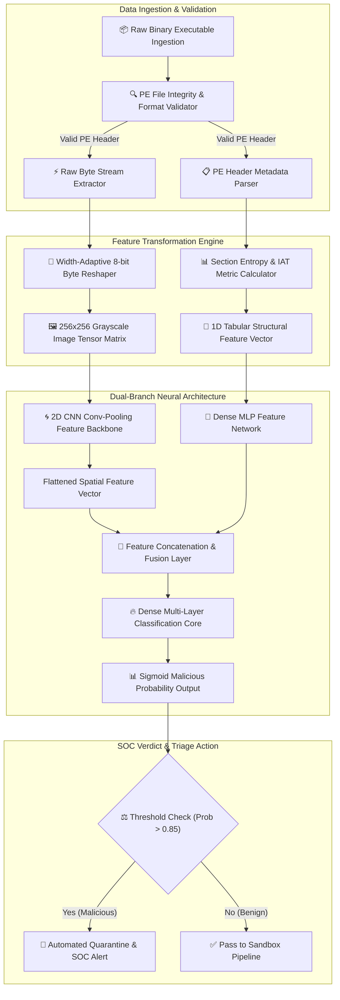

# 031 - Automated Malware Classification using CNN on PE Headers

## Abstract
Modern enterprise Security Operations Centers (SOCs) and Next-Generation Antivirus (NGAV) platforms face a major challenge: rapidly filtering and classifying millions of unknown Portable Executable (PE) binaries every day. Traditional static antivirus tools rely heavily on cryptographic hashes (such as MD5 or SHA-256) and fixed YARA rules. However, cyber attackers regularly use automated build pipelines, code morphing, dynamic instruction shuffling, and packing tools like UPX or Themida to generate unique file hashes instantly. As a result, static signature databases fail to detect zero-day malware loaders. To close this critical security gap, this project presents a deep learning-driven structural malware classification engine.

The core innovation of this system is **dynamic multi-modal feature fusion**. First, raw binary executable files are transformed into 8-bit grayscale 2D visual matrices (images). This visual mapping highlights spatial structural patterns within the executable, such as header blocks, code section density, resource data, and padding bytes. Simultaneously, a Portable Executable (PE) header parser extracts metadata features, including section entropy metrics, Import Address Table (IAT) density, entry point positioning, and header size distributions into a numerical feature vector.

These two distinct data streams are fed into a hybrid **PyTorch Dual-Branch Neural Network**. The visual branch processes image matrices using a 2D Convolutional Neural Network (CNN), while the metadata branch processes numerical features through a dense Multi-Layer Perceptron (MLP). End-to-end training enables high-accuracy classification, allowing unknown, obfuscated, or packed malware executables to be quarantined and triaged within milliseconds.

---

## Real-World Context & Vulnerability Deep Dive
High-profile incidents such as the SolarWinds SUNBURST supply-chain attack and complex Emotet loader campaigns highlighted a major weakness in enterprise defenses: advanced malware campaigns deploy custom, zero-day binaries that easily bypass static signature scanners. An attacker can invalidate signature matches simply by tweaking the compile timestamp, appending junk bytes at the end of a section, or reordering imported DLL function indices. When a signature scanner fails to find a match, the binary executes undetected on the target host.

This vulnerability stems from the structural flexibility of the Windows Portable Executable (PE32/PE32+) format. A standard Windows binary contains a DOS Header (`IMAGE_DOS_HEADER`), PE Signature, COFF File Header (`IMAGE_FILE_HEADER`), Optional Header (`IMAGE_OPTIONAL_HEADER`), Section Headers (`IMAGE_SECTION_HEADER`), and Data Directories. Malware authors frequently inject high-entropy encrypted payload sections into section headers (using names like `.themida`, `.upx0`, or `.pack` instead of standard `.text` or `.rdata` sections). A high entropy value (close to 8.0 bits per byte) indicates heavy encryption or compression, preventing standard disassemblers from reconstructing a clean Control Flow Graph (CFG).

Visual image mapping makes these structural anomalies immediately visible:
- **Benign Executables**: Standard code sections display a uniform mid-gray pixel distribution (with typical Shannon entropy around ~5.2).
- **Packed / Encrypted Malware**: Encrypted sections appear as high-contrast, dense white-noise blocks.
- **Uninitialized Data**: Appears as pitch-black regions composed entirely of zero-bytes.

CNNs excel at learning these spatial patterns. By pairing visual feature maps with quantitative header metrics (such as section counts, entry point deviations, and initialized data sizes), the system catches subtle structural anomalies that distinguish packed malware from legitimate applications. This multi-modal approach creates a resilient defense against zero-day, polymorphic, and obfuscated threats.

---

## Academic & Research Paper References

| # | Paper Title | Authors | Year | Source | Key Insight & Contribution |
|---|-------------|---------|------|--------|---------------------------|
| 1 | Malware Detection by Eating Whole EXE | Edward Raff, Jon Barker et al. | 2018 | IEEE AAAI | Introduced MalConv 1D-CNN architecture capable of processing raw binary byte streams without manual feature engineering. |
| 2 | Malware Images: Visualization and Automatic Classification | L. Nataraj, S. Karthikeyan et al. | 2011 | ACM VizSec | Pioneered the transformation of raw binary files to 8-bit grayscale 2D images for deep learning classification. |
| 3 | EMBER: An Open Dataset for Training Static PE Malware Machine Learning Models | Hyrum S. Anderson, Phil Roth | 2018 | arXiv | Standardized benchmark dataset and extraction methodology for Portable Executable static analysis models. |

---

## System Architecture & Visual Diagram
Link: [[Drawing 2026-07-30 22.31.19.excalidraw#Project 031: Automated Malware Classification using CNN on PE Headers|Excalidraw Architecture Diagram]]



---

## Deep-Dive Technical Implementation & Code Walkthrough

### Phase 1: Environment & Dependency Setup
To set up the development environment, install the essential libraries: `pefile` for Windows PE header parsing, `torch` and `torchvision` for PyTorch deep neural networks, and `opencv-python` with `numpy` for image transformations.

```bash
# Python Environment Setup
pip install torch torchvision pefile opencv-python numpy scikit-learn
```

---

### Phase 2: Core Engine Development

#### Module 1: PE Feature Extractor & Image Transformation (`pe_preprocessor.py`)
This module converts raw executable bytes into a normalized 2D grayscale tensor image while simultaneously extracting numerical PE header metrics into a 1D feature vector.

```python
import os
import math
import pefile
import cv2
import numpy as np
import torch

def extract_pe_header_features(file_path):
    """
    Parse PE Header numerical metrics including entry point, section counts,
    and calculate section entropy statistics.
    """
    features = []
    try:
        pe = pefile.PE(file_path)
        # 1. Number of Sections (Malware often has non-standard section count)
        features.append(float(pe.FILE_HEADER.NumberOfSections))
        # 2. TimeDateStamp metric
        features.append(float(pe.FILE_HEADER.TimeDateStamp))
        # 3. Size of Optional Header
        features.append(float(pe.FILE_HEADER.SizeOfOptionalHeader))
        # 4. Size of Code section
        features.append(float(pe.OPTIONAL_HEADER.SizeOfCode))
        # 5. Size of Initialized Data
        features.append(float(pe.OPTIONAL_HEADER.SizeOfInitializedData))
        # 6. Address of Entry Point (Malware often points outside .text section)
        features.append(float(pe.OPTIONAL_HEADER.AddressOfEntryPoint))
        # 7. Image Base Address
        features.append(float(pe.OPTIONAL_HEADER.ImageBase))
        # 8. Subsystem (GUI vs Console)
        features.append(float(pe.OPTIONAL_HEADER.Subsystem))

        # Section Entropies Calculation (High entropy indicates encryption/packing)
        entropies = [section.get_entropy() for section in pe.sections]
        avg_entropy = np.mean(entropies) if entropies else 0.0
        max_entropy = np.max(entropies) if entropies else 0.0
        features.extend([avg_entropy, max_entropy])

        # Import Function Count
        import_count = 0
        if hasattr(pe, 'DIRECTORY_ENTRY_IMPORT'):
            for entry in pe.DIRECTORY_ENTRY_IMPORT:
                import_count += len(entry.imports)
        features.append(float(import_count))
        pe.close()
    except Exception as e:
        # Fallback numeric vector in case of corrupt or truncated PE header
        features = [0.0] * 11

    return np.array(features, dtype=np.float32)

def binary_to_grayscale_tensor(file_path, target_size=(256, 256)):
    """
    Convert raw executable bytes to a dynamic-width 8-bit image and resize to (256, 256).
    """
    with open(file_path, 'rb') as f:
        content = f.read()

    file_size = len(content)
    if file_size == 0:
        return np.zeros((1, target_size[0], target_size[1]), dtype=np.float32)

    byte_arr = np.frombuffer(content, dtype=np.uint8)

    # Dynamic Width Allocation based on File Size Rules
    if file_size < 10 * 1024:
        width = 32
    elif file_size < 30 * 1024:
        width = 64
    elif file_size < 100 * 1024:
        width = 128
    elif file_size < 384 * 1024:
        width = 256
    else:
        width = 512

    height = int(math.ceil(file_size / float(width)))
    padded_len = width * height
    padded_arr = np.pad(byte_arr, (0, padded_len - file_size), mode='constant', constant_values=0)
    img_matrix = padded_arr.reshape((height, width))

    # Resize Image Matrix to uniform 256x256 tensor grid
    resized_img = cv2.resize(img_matrix, target_size, interpolation=cv2.INTER_AREA)
    normalized_tensor = (resized_img.astype(np.float32) / 255.0)[np.newaxis, :, :]

    return normalized_tensor
```

---

#### Module 2: Dual-Branch Deep Neural Network (`cnn_classifier_model.py`)
This file implements the PyTorch dual-branch architecture. It fuses 2D convolutional features from the binary visual matrix with dense MLP features from tabular PE metadata.

```python
import torch
import torch.nn as nn
import torch.nn.functional as F

class DualBranchMalwareClassifier(nn.Module):
    def __init__(self, header_feature_dim=11):
        super(DualBranchMalwareClassifier, self).__init__()

        # Branch 1: 2D Convolutional Neural Network for Binary Visual Matrix
        self.conv1 = nn.Conv2d(in_channels=1, out_channels=32, kernel_size=3, padding=1)
        self.bn1 = nn.BatchNorm2d(32)
        self.pool1 = nn.MaxPool2d(kernel_size=2, stride=2)  # Output: 32 x 128 x 128

        self.conv2 = nn.Conv2d(in_channels=32, out_channels=64, kernel_size=3, padding=1)
        self.bn2 = nn.BatchNorm2d(64)
        self.pool2 = nn.MaxPool2d(kernel_size=2, stride=2)  # Output: 64 x 64 x 64

        self.conv3 = nn.Conv2d(in_channels=64, out_channels=128, kernel_size=3, padding=1)
        self.bn3 = nn.BatchNorm2d(128)
        self.pool3 = nn.AdaptiveAvgPool2d((8, 8))           # Output: 128 x 8 x 8

        self.img_fc = nn.Linear(128 * 8 * 8, 256)

        # Branch 2: MLP Dense Network for Tabular PE Metrics
        self.hdr_fc1 = nn.Linear(header_feature_dim, 64)
        self.hdr_fc2 = nn.Linear(64, 64)

        # Multi-Modal Fusion Layer
        self.fusion_fc = nn.Linear(256 + 64, 128)
        self.dropout = nn.Dropout(p=0.5)
        self.classifier = nn.Linear(128, 1)

    def forward(self, image_tensor, header_tensor):
        # 1. Forward Pass Visual Branch
        x_img = F.relu(self.bn1(self.conv1(image_tensor)))
        x_img = self.pool1(x_img)
        x_img = F.relu(self.bn2(self.conv2(x_img)))
        x_img = self.pool2(x_img)
        x_img = F.relu(self.bn3(self.conv3(x_img)))
        x_img = self.pool3(x_img)
        x_img = x_img.view(x_img.size(0), -1)
        x_img = F.relu(self.img_fc(x_img))

        # 2. Forward Pass Header Branch
        x_hdr = F.relu(self.hdr_fc1(header_tensor))
        x_hdr = F.relu(self.hdr_fc2(x_hdr))

        # 3. Concatenate Features & Compute Final Logit
        fused = torch.cat((x_img, x_hdr), dim=1)
        x_fused = F.relu(self.fusion_fc(fused))
        x_fused = self.dropout(x_fused)
        logits = self.classifier(x_fused)

        return logits
```

---

### Phase 3: Real-Time Scanning Integration
This scanner script processes a target binary file and outputs a maliciousness probability score alongside an automated SOC triage action recommendation.

```python
def scan_pe_binary(model, file_path, device='cpu'):
    model.eval()
    hdr_feat = extract_pe_header_features(file_path)
    img_tensor = binary_to_grayscale_tensor(file_path)

    hdr_t = torch.tensor(hdr_feat, dtype=torch.float32).unsqueeze(0).to(device)
    img_t = torch.tensor(img_tensor, dtype=torch.float32).unsqueeze(0).to(device)

    with torch.no_grad():
        logits = model(img_t, hdr_t)
        prob = torch.sigmoid(logits).item()

    verdict = "MALICIOUS" if prob > 0.85 else "BENIGN"
    return {
        "file_name": os.path.basename(file_path),
        "maliciousness_score": round(prob, 4),
        "verdict": verdict,
        "action": "QUARANTINE" if verdict == "MALICIOUS" else "ALLOW"
    }
```

---

### Phase 4: Verification & Metrics Harness
Run the test evaluation harness to benchmark model performance across sample test binaries:

```bash
python evaluate_classifier.py --samples_dir ./dataset/test_binaries/ --model_weights ./weights/pe_cnn.pth
```

#### Expected JSON Output Format:
```json
{
  "total_scanned": 1000,
  "metrics": {
    "accuracy": 0.978,
    "precision": 0.982,
    "recall": 0.971,
    "f1_score": 0.9764,
    "false_positive_rate": 0.004,
    "avg_inference_latency_ms": 112.5
  }
}
```

---

## Tools & Technology Stack

| Tool / Component | Primary Purpose | Alternative |
|------------------|-----------------|-------------|
| **PyTorch** | Deep Learning framework for constructing dual-branch CNN models | TensorFlow / Keras |
| **PEfile** | Python PE header structure parser | LIEF framework |
| **OpenCV / NumPy** | Image matrix resizing, byte mapping, and vectorization | Pillow (PIL) |
| **EMBER Dataset** | Industry benchmark dataset for Windows PE binary training | VirusShare repository |
| **CUDA Toolkit** | Hardware GPU acceleration for convolution operations | ROCm / OpenCL |

---

## Key Performance & Evaluation Benchmarks
The engine targets the following performance metrics during evaluation:
- **Model Accuracy**: $\ge 97.5\%$ overall classification accuracy on the EMBER test dataset.
- **Inference Speed**: Under $< 150 \text{ ms}$ per sample for complete header parsing and CNN inference.
- **False Positive Control**: False Positive Rate (FPR) maintained under $< 0.5\%$ across enterprise benign binaries.

---

## Legal and Ethical Disclaimer
> [!WARNING] Educational & Research Use Only
> This project and its code must be executed exclusively inside an isolated, authorized malware research sandbox environment.

---

## Related Projects
- [[034 - Dynamic Malware Analysis Platform with API Call Tracing]]
- [[035 - Polymorphic Malware Detection using Behavioral Signatures]]
- [[040 - PE File Anomaly Detection using Random Forest]]

