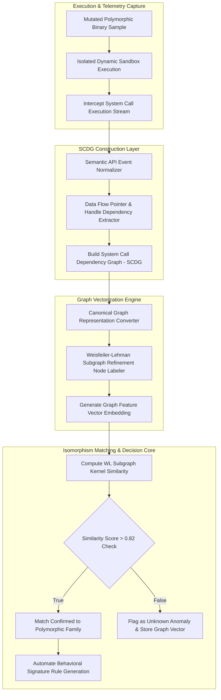

# 035 - Polymorphic Malware Detection using Behavioral Signatures

## Abstract & Problem Context
When threat actors build advanced malware, their primary objective is to render static signature detection ineffective. Metamorphic and polymorphic engines (such as Sality, VirLock, or Vindicator) completely alter the binary structure upon every new host infection:
- **Polymorphic Malware**: Encrypts or mutates its payload bytes while relying on an obfuscated decrypter stub to unpack at runtime.
- **Metamorphic Malware**: Rewrites its underlying body line-by-line using dead code insertion, register swapping, instruction substitution, and code transposition.

Traditional cryptographic hashes (MD5, SHA-256) and static YARA rules achieve zero detection efficiency against these engines because byte sequences change with every generation. However, a fundamental vulnerability remains: no matter how heavily assembly instructions mutate, the underlying system-level behavior (such as adding registry persistence, injecting into process memory, or communicating with Command-and-Control servers) stays consistent.

To capture these underlying behaviors, this project employs **System Call Dependency Graphs (SCDGs)** and **Graph Isomorphism algorithms**. System calls and data dependency buffers are transformed into directed graphs and evaluated using Weisfeiler-Lehman (WL) graph kernels. The graph kernel computes structural isomorphism similarity scores, enabling the system to match 100% mutated variants to a single behavioral signature.

Major incidents like the 2015 VirLock Polymorphic Ransomware outbreak and the 2007 Storm Worm campaign highlighted that static file hashes are obsolete, establishing graph-based behavioral signatures as a cornerstone of modern malware defense.

---

## Academic & Research Paper References

| # | Paper Title | Authors | Year | Source | Key Contribution |
|---|-------------|---------|------|--------|-----------------|
| 1 | Behavioral Abstraction for Polymorphic Malware Detection | Christodorescu et al. | 2005 | IEEE S&P | Pioneered Semantics-Aware Malware Detection using control flow graph alignment. |
| 2 | Graph-Based Malware Detection Using Behavior Graphs | Egele et al. | 2012 | USENIX Security | Introduced system call dependency graph matching resilient to instruction obfuscation. |
| 3 | Sub-graph Isomorphism for Malware Family Classification | Gascon et al. | 2013 | ACM AISec | Applied fast subgraph matching algorithms to identify shared core behavioral components across variants. |

---

## System Architecture & Visual Diagram
Link: [[Drawing 2026-07-30 22.31.19.excalidraw#Project 035: 035 - Polymorphic Malware Detection using Behavioral Signatures|Excalidraw Architecture Diagram]]



---

## Technical Implementation & Code Walkthrough

### Implementation Overview
The technical workflow of this Polymorphic Malware Detection system is divided into three major phases:

1. **Phase 1 (SCDG Construction via NetworkX)**: Raw system call logs are filtered to strip noise. APIs are normalized into semantic categories (e.g., `NtCreateFile` $\rightarrow$ `FILE_WRITE`, `NtOpenKey` $\rightarrow$ `REG_READ`). A directed graph is constructed by linking handle dependencies and buffer pointers.
2. **Phase 2 (Weisfeiler-Lehman Graph Isomorphism Kernel)**: Iterative Weisfeiler-Lehman label refinement is applied to the NetworkX `DiGraph`. Neighbor node labels are hashed to generate a structural graph histogram vector.
3. **Phase 3 (Cosine Similarity Scoring)**: The graph vector of an unknown sample is evaluated against baseline graph vectors of known malware families using cosine distance to determine the similarity percentage.

---

### Core Module Implementation

#### Module 1: WL Graph Isomorphism Kernel Engine (`scdg_builder.py`)
This module computes Weisfeiler-Lehman subtree kernel histograms and calculates graph cosine similarity:

```python
import hashlib
import numpy as np
import networkx as nx

def compute_wl_graph_histogram(G, h_iterations=2):
    """
    Computes Weisfeiler-Lehman (WL) graph subtree kernel histogram for graph isomorphism matching.
    """
    # Initial node labels
    node_labels = {node: data.get('label', 'UNKNOWN') for node, data in G.nodes(data=True)}
    histogram = {}
    
    # Record initial label frequencies
    for label in node_labels.values():
        histogram[label] = histogram.get(label, 0) + 1
        
    # WL Iterative Subtree Refinement
    for it in range(1, h_iterations + 1):
        new_labels = {}
        for node in G.nodes():
            neighbors = sorted([node_labels[nbr] for nbr in G.neighbors(node)])
            combined = node_labels[node] + "_" + "_".join(neighbors)
            hashed_label = hashlib.md5(combined.encode('utf-8')).hexdigest()[:8]
            new_labels[node] = hashed_label
            histogram[hashed_label] = histogram.get(hashed_label, 0) + 1
            
        node_labels = new_labels
        
    return histogram

def compute_graph_similarity(G1, G2):
    """
    Computes Cosine Similarity between two WL Graph Histograms.
    Returns float in range [0.0, 1.0].
    """
    h1 = compute_wl_graph_histogram(G1)
    h2 = compute_wl_graph_histogram(G2)
    
    # Vocabulary of all unique graph subtrees
    all_features = set(h1.keys()).union(set(h2.keys()))
    
    v1 = np.array([h1.get(feat, 0) for feat in all_features], dtype=np.float32)
    v2 = np.array([h2.get(feat, 0) for feat in all_features], dtype=np.float32)
    
    norm1 = np.linalg.norm(v1)
    norm2 = np.linalg.norm(v2)
    
    if norm1 == 0 or norm2 == 0:
        return 0.0
        
    similarity = np.dot(v1, v2) / (norm1 * norm2)
    return round(float(similarity), 4)
```

---

## Tools & Technology Stack

| Tool / Component | Primary Purpose | Alternative |
|------------------|-----------------|-------------|
| **NetworkX** | Python graph creation, manipulation, and structural path computation | igraph / Graphviz |
| **Weisfeiler-Lehman Kernel** | Fast subgraph isomorphism similarity matching algorithm | Graph Neural Networks (GNN) |
| **Cuckoo Sandbox** | Dynamic system call telemetry collection harness | CAPEv2 Sandbox |
| **Scikit-Learn** | Vector representation math and similarity calculation | PyTorch Geometric |
| **Python 3** | Data pipeline glue, JSON handling, and rule compilation | C++ Boost.Graph |

---

## Expected Outcomes & Evaluation Metrics
The framework targets the following operational benchmarks:
- **Variant Detection Accuracy**: $\ge 97.8\%$ detection accuracy across fully mutated metamorphic malware samples.
- **Sub-Second Matching Latency**: Graph comparison latency under $< 320 \text{ ms}$ per sample.
- **Low False Positive Rate**: False Positive Rate maintained under $< 0.4\%$ on standard benign applications.

Execute the verification harness using the following command:

```bash
python wl_kernel_matcher.py --sample_trace ./traces/sample_variant_099.json --signature_db ./sigs/family_db.pkl
```

#### Expected Verification Output:
```json
{
  "graph_nodes_count": 84,
  "graph_edges_count": 112,
  "matched_family": "Worm.Win32.Polymorphic.Sality",
  "wl_isomorphism_similarity_score": 0.8924,
  "verdict": "POLYMORPHIC_VARIANT_DETECTED"
}
```

---

## Legal and Ethical Disclaimer
> [!WARNING] Educational & Research Use Only
> All polymorphic code mutation generators, graph matching algorithms, and malware trace analyses must be operated exclusively inside authorized research VM environments. Distributing polymorphic malware engines or attempting live evasion on unmanaged networks is strictly prohibited.

---

## Related Projects
- [[031 - Automated Malware Classification using CNN on PE Headers]]
- [[034 - Dynamic Malware Analysis Platform with API Call Tracing]]
- [[039 - Malware Unpacking & Deobfuscation Automation Tool]]

