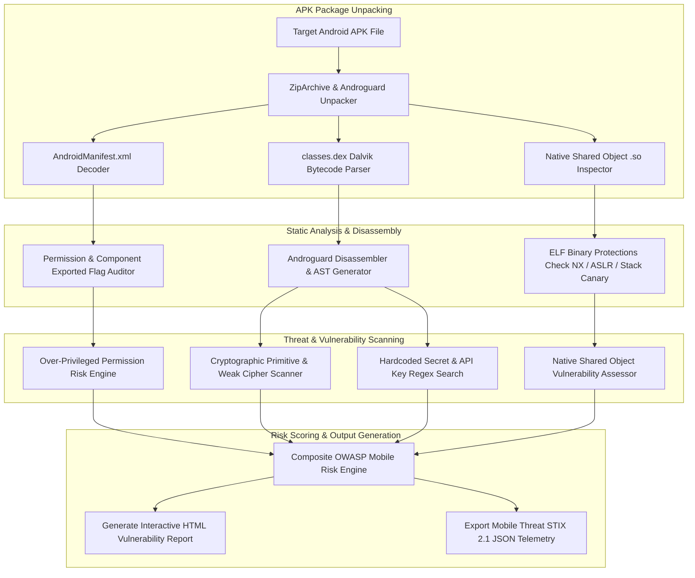

# 036 - Android APK Static Analysis & Vulnerability Scanner

## Abstract & Problem Context
In the mobile application security landscape, Android Package (APK) binaries represent one of the most targeted attack vectors. The Android OS packages Dalvik/ART virtual machine bytecode (`classes.dex`), native shared libraries (`.so` files), and XML resources into a compressed ZIP archive container. Threat actors frequently distribute trojanized applications that silently send premium SMS messages, execute background keylogging, or abuse Accessibility Services to harvest banking credentials without user knowledge.

While manual decompilation tools (such as GUI-based Jadx or Bytecode Viewer) are sufficient for one-off application reviews, automated static vulnerability scanning is essential for app store vetting pipelines and Enterprise Mobile Device Management (MDM) inline validation. Without automated static inspection, over-privileged application permissions (`READ_SMS`, `SYSTEM_ALERT_WINDOW`, `BIND_ACCESSIBILITY_SERVICE`), unprotected exported Broadcast Receivers, insecure dynamic class loading (`DexClassLoader`), and hardcoded cloud credentials (AWS/Firebase API keys) can easily reach production environments.

Campaigns like the 2022 Joker Trojan (which infected over 50 Google Play Store apps via dynamic DEX payload loading) and the 2023 Xenomorph Banking Botnet (which abused Accessibility APIs to execute Automated Transfer Systems attacks) highlight the crucial role of automated static bytecode auditing and taint tracking.

---

## Academic & Research Paper References

| # | Paper Title | Authors | Year | Source | Key Contribution |
|---|-------------|---------|------|--------|-----------------|
| 1 | FlowDroid: Precise Context, Flow, Field, and Object-Sensitive Taint Analysis for Android Apps | Arzt et al. | 2014 | ACM PLDI | Seminal work establishing static taint analysis frameworks for Android application bytecodes. |
| 2 | Drebin: Effective and Explainable Detection of Android Malware in Your Pocket | Arp et al. | 2014 | NDSS | Pioneered comprehensive static feature extraction from AndroidManifest.xml and Dalvik bytecode. |
| 3 | Static Analysis of Android Apps: A Systematic Literature Review | Li et al. | 2017 | Information and Software Technology | Taxonomy of static vulnerability scanning, permission abuse detection, and API call graph mapping. |

---

## System Architecture & Visual Diagram
Link: [[Drawing 2026-07-30 22.31.19.excalidraw#Project 036: 036 - Android APK Static Analysis & Vulnerability Scanner|Excalidraw Architecture Diagram]]



---

## Technical Implementation & Code Walkthrough

### Implementation Overview
This Android APK Static Analysis Scanner uses Python's `androguard` library to disassemble and parse APK containers across three main operational phases:

1. **Phase 1 (Manifest & Permission Audit)**: Parses `AndroidManifest.xml` to flag high-risk permissions and audit exported components (`Activity`, `Service`, `Receiver`, `Provider`) where `android:exported="true"`.
2. **Phase 2 (DEX Bytecode & Hardcoded Secret Scanner)**: Inspects Dalvik bytecode instructions using regular expressions to detect embedded API keys (AWS, Stripe, Firebase, Google API) and hardcoded credentials.
3. **Phase 3 (Insecure Crypto & Dynamic Class Loading Inspector)**: Flags insecure cryptographic algorithms (e.g., `Cipher.getInstance("AES/ECB/PKCS5Padding")` or `DES`) and dynamic class loading invocations (`DexClassLoader`, `PathClassLoader`).

---

### Core Module Implementation

#### Module 1: Manifest Permission & DEX Bytecode Inspector (`manifest_auditor.py`)
This module disassembles Dalvik bytecode instructions and scans AST string constants for security vulnerabilities:

```python
from androguard.misc import AnalyzeAPK
import re

REGEX_PATTERNS = {
    "AWS_API_KEY": r"AKIA[0-9A-Z]{16}",
    "GENERIC_SECRET_KEY": r"(?i)(api_key|secret_key|auth_token)\s*=\s*['\"]([A-Za-z0-9_\-]{16,64})['\"]",
    "INSECURE_AES_ECB": r"AES/ECB/PKCS5Padding",
    "WEAK_DES_CIPHER": r"DES",
    "DYNAMIC_DEX_LOADING": r"Ldalvik/system/DexClassLoader;"
}

def scan_dex_bytecode_vulnerabilities(apk_path):
    """
    Disassembles classes.dex bytecode and scans AST string constants and instructions.
    """
    findings = []
    try:
        a, d, dx = AnalyzeAPK(apk_path)
        
        # Iterate over all classes in Dalvik Executable
        for cls in dx.get_classes():
            class_name = cls.name
            
            # Skip framework standard classes
            if class_name.startswith("Landroid/") or class_name.startswith("Ljava/"):
                continue
                
            for method in cls.get_methods():
                method_name = method.name
                
                # Scan disassembled instructions and strings
                for block in method.get_basic_blocks():
                    for inst in block.get_instructions():
                        inst_str = inst.get_output()
                        
                        for rule_name, pattern in REGEX_PATTERNS.items():
                            matches = re.findall(pattern, inst_str)
                            if matches:
                                findings.append({
                                    "rule": rule_name,
                                    "class": class_name,
                                    "method": method_name,
                                    "matched_content": str(matches[0])
                                })
    except Exception as e:
        findings.append({"error": f"Bytecode analysis failed: {str(e)}"})
        
    return findings
```

---

## Tools & Technology Stack

| Tool / Technology | Primary Purpose | Alternative |
|-------------------|-----------------|-------------|
| **Androguard** | Python static disassembly and Dalvik bytecode analysis suite | Soot Framework |
| **Jadx** | Decompiler converting DEX bytecode to readable Java code | CFR / Fernflower |
| **MobSF (Mobile Security Framework)** | Automated mobile security auditing and reporting platform | AppInfo |
| **YARA-Python** | Rule-based string pattern matching against uncompressed APK assets | Regex Engine |
| **Apktool** | Reverse engineering third-party, closed binary Android APKs | Baksmali |

---

## Expected Outcomes & Evaluation Metrics
The static scanner targets the following operational benchmarks:
- **Analysis Completion Speed**: Complete manifest and bytecode audit of a standard 25 MB Android APK file in under $< 40 \text{ seconds}$.
- **Malware Identification Accuracy**: $\ge 96.2\%$ detection rate across the standard Drebin mobile malware dataset.
- **OWASP Mobile Coverage**: Static coverage for 8 out of 10 major OWASP Mobile Security Risks.

Run the verification scanner via the command line:

```bash
python apk_vulnerability_scanner.py --apk ./samples/target_app.apk --output_html ./reports/scan_report.html
```

#### Expected Scan Report Output:
```json
{
  "apk_metadata": {
    "package_name": "com.example.malicious.app",
    "version": "1.0.4",
    "dangerous_permissions_count": 5
  },
  "critical_vulnerabilities": [
    "HARDCODED_AWS_API_KEY_DETECTED",
    "DYNAMIC_DEX_LOADING_FLAGGED",
    "UNPROTECTED_EXPORTED_RECEIVER"
  ],
  "overall_risk_score": 8.8
}
```

---

## Legal and Ethical Disclaimer
> [!WARNING] Educational & Research Use Only
> Decompilation tasks, DEX reverse engineering tests, and mobile vulnerability scans must be conducted exclusively on open-source software, self-authored applications, or explicitly authorized targets during security engagements. Reverse engineering commercial application packages without authorization violates software license agreements and applicable intellectual property laws.

---

## Related Projects
- [[031 - Automated Malware Classification using CNN on PE Headers]]
- [[037 - ELF Binary Exploit Detection for Linux Systems]]
- [[040 - PE File Anomaly Detection using Random Forest]]

