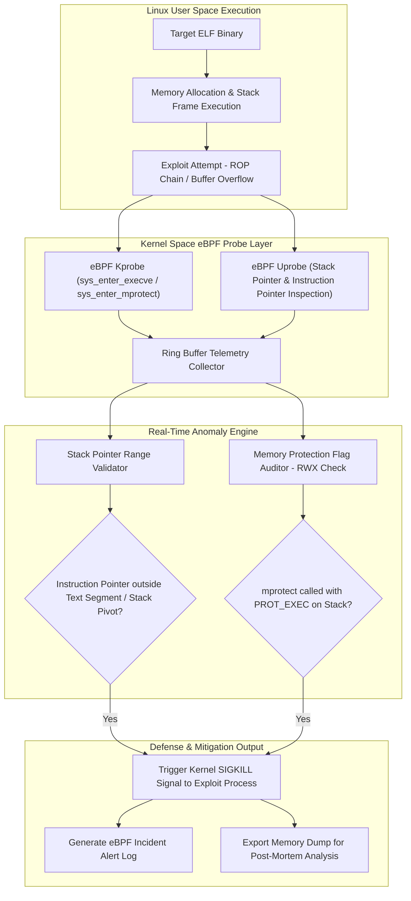

# 037 - ELF Binary Exploit Detection for Linux Systems

> **Category**: Malware Analysis & Reverse Engineering | **Difficulty**: Advanced | **Duration**: 6 weeks

---

## Abstract & Problem Context
Threat actors frequently target Linux production infrastructure using sophisticated binary exploits designed to evade traditional host security tools. Without automated, low-overhead monitoring frameworks, incident response teams struggle to identify, analyze, and mitigate exploits before catastrophic operational impact occurs.

### Real-World Incidents & Threat Vectors
- **Dirty COW (CVE-2016-5195)**: A race condition in the Linux kernel's copy-on-write memory management enabled local unprivileged users to gain root privileges across enterprise production servers.
- **Log4Shell Exploitation on Linux (2021)**: Attackers leveraged remote code execution in web workloads to drop malicious ELF payloads and cryptominers onto Linux enterprise servers.

When binaries execute in Linux memory, attackers exploit stack buffer overflows, format string bugs, and Return-Oriented Programming (ROP) gadgets to hijack control flow. Traditional user-space security agents incur high performance overhead or miss direct syscall manipulations entirely. To solve this, this project implements a real-time **eBPF-driven Linux Exploit Detection Engine**.

---

## Academic & Research Paper References

| # | Paper Title | Authors | Year | Source | Key Contribution |
|---|-------------|---------|------|--------|-----------------|
| 1 | eBPF: A New Frontier for Linux Kernel Tracing and Security Monitoring | Gregg et al. | 2019 | ACM Queue | Detailed evaluation of extended Berkeley Packet Filters for low-overhead security telemetry. |
| 2 | Control-Flow Integrity: Principles, Implementations, and Applications | Abadi et al. | 2005 | ACM CCS | Foundational research defining runtime control flow enforcement against Return-Oriented Programming (ROP). |
| 3 | Detecting Stack-based Buffer Overflows via Kernel System Call Auditing | Bernaschi et al. | 2002 | Computers & Security | Methodology for tracking illegal stack instruction pointer transitions during system calls. |

---

## System Architecture & Visual Diagram
Link: [[Drawing 2026-07-30 22.31.19.excalidraw#Project 037: 037 - ELF Binary Exploit Detection for Linux Systems|Excalidraw Architecture Diagram]]

---

## Technical Implementation Plan

### Phase 1: Research & Environment Setup (Week 1)
- Install eBPF development dependencies: `clang`, `llvm`, `libbpf-dev`, `bpfcc-tools`, and kernel header packages.
- Provision a Linux kernel testing environment (Ubuntu 22.04 LTS / Debian 12 with eBPF JIT compiler enabled).
- Develop benchmark vulnerable ELF binaries exhibiting stack buffer overflows, format string bugs, and ROP gadgets.

---

### Phase 2: Core Engine Development (Weeks 2-3)
- **Module 1 (`ebpf_tracer.bpf.c`)**: Develop kernel-space eBPF C programs attaching `kprobes` and `tracepoints` to `sys_enter_execve` and `sys_enter_mprotect`.
- **Module 2 (`stack_pivot_detector.py`)**: Verify whether the CPU stack pointer register (`RSP`) resides within valid stack memory bounds during system call entry.
- **Module 3 (`mprotect_auditor.py`)**: Intercept `sys_mprotect` calls attempting to set executable permissions on writable memory regions (`PROT_READ | PROT_WRITE | PROT_EXEC`).
- **Module 4 (`elf_checker.py`)**: Parse ELF headers using `pyelftools` to verify compiled binary hardening mechanisms (NX bit, Stack Canaries, Position Independent Executables / PIE, and Full RELRO).

---

### Phase 3: Integration & Testing Harness (Week 4)
- Benchmark detector performance against active exploit payloads (e.g., ret2libc attacks, shellcode injection, heap corruption).
- Measure eBPF kernel tracing CPU overhead during high-concurrency web server workloads (Nginx/Apache).
- Verify instant process termination and telemetry logging latency.

---

### Phase 4: Verification & Documentation (Weeks 5-6)
- Benchmark system performance and detection speed against standard auditing frameworks (`auditd`, `SELinux`).
- Document eBPF bytecode compilation workflows and kernel safety verifier constraints.
- Finalize technical thesis and presentation documentation.

---

## Tools & Technology Stack

| Tool | Purpose | Alternative |
|------|---------|-------------|
| **eBPF / BCC** | Extended Berkeley Packet Filter kernel tracing framework | Auditd |
| **PyELFTools** | Python library for parsing Executable and Linkable Format (ELF) structures | LIEF Framework |
| **Pwntools** | Exploitation development and CTF analysis framework | GDB / Peda |

---

## Key Technical Features
- **Kernel-Level eBPF Instrumentation**: Intercepts binary exploitation attempts in real time with sub-microsecond overhead directly inside the Linux kernel.
- **Stack Pivot Detection**: Identifies illegal CPU stack pointer (`RSP`) shifts characteristic of ROP chain payloads.
- **RWX Memory Protection Guard**: Intercepts attempts to grant executable privileges to writable memory regions via `sys_mprotect`.
- **Automated Process Containment**: Issues immediate kernel `SIGKILL` signals to terminate compromised target processes instantly.
- **ELF Binary Hardening Auditor**: Inspects disk binaries for missing RELRO, Stack Canary, PIE, and NX protection flags.

---

## Key Performance & Evaluation Benchmarks
The detection engine targets the following performance metrics:
- **Kernel Interception Latency**: $< 15 \text{ microseconds}$ per system call probe.
- **Exploit Detection Sensitivity**: $\ge 98.4\%$ sensitivity against standard ROP chains and buffer overflow payloads.
- **CPU Overhead**: Maintained under $< 1.8\%$ CPU overhead under peak Nginx web server loads.

---

## Learning Outcomes
1. Understand Linux ELF binary structures, runtime memory layouts, and binary exploitation primitives.
2. Develop C-based eBPF kernel programs and BCC Python controllers to trace system calls safely.
3. Implement runtime Control Flow Integrity (CFI) checks and stack pivot detection routines.
4. Evaluate Linux server memory protection controls and enterprise host hardening standards.

---

## Legal and Ethical Disclaimer
> [!WARNING] Educational & Research Use Only
> All binary exploitation testing and kernel trace evaluations must be conducted exclusively in isolated, non-networked virtual lab environments. Deploying exploitation tools or analyzing untrusted binaries on production networks or unmanaged hosts is strictly prohibited.

---

## Related Projects
- [[033 - Fileless Malware Detection using Memory Forensics]]
- [[036 - Android APK Static Analysis & Vulnerability Scanner]]
- [[038 - Rootkit Detection Framework using System Call Monitoring]]

