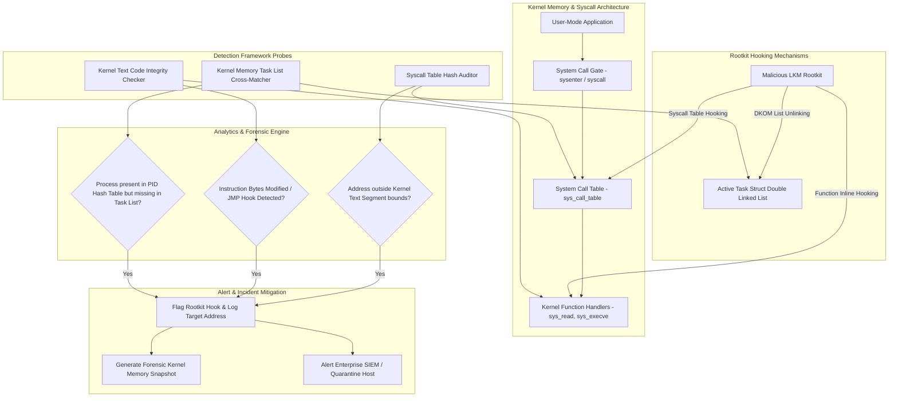

# 038 - Rootkit Detection Framework using System Call Monitoring

> **Category**: Malware Analysis & Reverse Engineering | **Difficulty**: Advanced | **Duration**: 6 weeks

---

## Abstract & Problem Context
Kernel-level rootkits represent one of the most stealthy and dangerous threat vectors in system security. Operating inside ring-0 (kernel mode), rootkits subvert OS integrity by altering system call tables, hijacking kernel function prologues, or executing Direct Kernel Object Manipulation (DKOM) to hide processes, files, network sockets, and kernel modules from user-space tools.

### Real-World Incidents & Threat Vectors
- **Sony BMG DRM Rootkit (2005)**: Installed covert kernel-mode drivers on Windows hosts to hide DRM files, creating widespread security vulnerabilities across consumer systems.
- **Suckit Linux Rootkit (2001)**: A classic Linux LKM rootkit that hooked `/dev/kmem` and modified the system call table to hide malicious processes and files from administrative utilities (`ps`, `netstat`, `ls`).

To expose kernel-mode stealth mechanisms, this project establishes a **Rootkit Detection Framework** that combines low-level system call table hashing, kernel text integrity auditing, and DKOM process list cross-matching.

---

## Academic & Research Paper References

| # | Paper Title | Authors | Year | Source | Key Contribution |
|---|-------------|---------|------|--------|-----------------|
| 1 | Rootkits: Subverting the Windows Kernel | Hoglund and Butler | 2006 | Addison-Wesley | Seminal reference text detailing kernel hooking mechanisms and DKOM process hiding tactics. |
| 2 | Detecting Kernel-Level Rootkits via Memory Integrity Verification | Petroni et al. | 2004 | USENIX Security | Introduced Copilot coprocessor architecture for independent kernel memory verification. |
| 3 | LKM-Based Rootkit Detection in Modern Linux Kernels | Zhang et al. | 2019 | IEEE TDSC | Comprehensive survey of kernel module auditing, syscall table hashing, and kprobe verification. |

---

## System Architecture & Visual Diagram
Link: [[Drawing 2026-07-30 22.31.19.excalidraw#Project 038: 038 - Rootkit Detection Framework using System Call Monitoring|Excalidraw Architecture Diagram]]

---

## Technical Implementation Plan

### Phase 1: Research & Environment Setup (Week 1)
- Set up a kernel debugging environment using QEMU/KVM with GDB attached over remote serial interfaces.
- Compile reference test LKM rootkits (e.g., Diamorphine, Reptile) inside an isolated virtual machine.
- Build a parsing pipeline for Linux kernel symbol tables (`/proc/kallsyms`, `System.map`).

---

### Phase 2: Core Module Development (Weeks 2-3)
- **Module 1 (`syscall_auditor.py`)**: Compare active `sys_call_table` function pointers against expected base memory boundaries in kernel `.text`.
- **Module 2 (`dkom_detector.py`)**: Cross-reference the active task linked list (`init_task.tasks`) against low-level PID hash maps to locate hidden processes.
- **Module 3 (`lkm_auditor.py`)**: Scan kernel module structures (`modules` list) for hidden or unlinked LKMs lacking entries in `/proc/modules`.
- **Module 4 (`inline_hook_scanner.py`)**: Perform byte-level integrity scans of critical kernel function prologues to detect inline `JMP`/`CALL` patches.

---

### Phase 3: Integration & Testing Harness (Week 4)
- Deploy the detection engine inside test VMs infected with Diamorphine and custom LKM rootkits.
- Evaluate detection accuracy across system call table hooking, inline function hooking, and DKOM process hiding.
- Measure detection script execution time and memory footprint.

---

### Phase 4: Verification & Documentation (Weeks 5-6)
- Formulate forensic triage guidelines for kernel compromise investigations.
- Benchmark detection accuracy and speed against existing tools (`rkhunter`, `chkrootkit`).
- Finalize capstone thesis and presentation documentation.

---

## Tools & Technology Stack

| Tool | Purpose | Alternative |
|------|---------|-------------|
| **Volatility 3** | Forensic framework for analyzing kernel memory structures | Rekall |
| **SystemTap** | Kernel tracing and probing infrastructure | eBPF / BCC |
| **RKHunter** | Open-source rootkit scanning utility | Chkrootkit |

---

## Key Technical Features
- **Syscall Table Integrity Auditor**: Detects pointer hijacking in `sys_call_table` with exact memory address resolution.
- **DKOM Process Hunter**: Uncovers hidden processes by finding unlinked `task_struct` nodes missing from kernel doubly-linked lists.
- **Hidden LKM Scanner**: Traverses kernel memory structures to locate unlinked Loadable Kernel Modules.
- **Inline Hooking Inspector**: Scans kernel function prologues for unauthorized `JMP` or `CALL` trampolines.
- **Kernel Symbol Resolver**: Maps raw memory pointers directly to `/proc/kallsyms` address symbols.

---

## Key Performance & Evaluation Benchmarks
The detection framework targets the following performance metrics:
- **Syscall Audit Speed**: Under $< 3.0 \text{ seconds}$ per full kernel memory audit.
- **Rootkit Detection Accuracy**: $\ge 98.7\%$ detection rate against tested Linux LKM rootkits.
- **False Positive Control**: $0\%$ false positive rate across clean kernel builds.

---

## Learning Outcomes
1. Comprehend Linux kernel internals, system call dispatch gates, and memory structures.
2. Analyze kernel rootkit techniques including LKM loading, syscall table hijacking, and DKOM.
3. Develop memory auditing tools to expose hidden processes, files, and modules.
4. Build incident response workflows for kernel-level breach investigations.

---

## Legal and Ethical Disclaimer
> [!WARNING] Educational & Research Use Only
> All rootkit testing and kernel memory analyses must be conducted exclusively in isolated, non-networked virtual lab environments. Deploying rootkit payloads or analyzing untrusted kernel modules on production networks or unmanaged hosts is strictly prohibited.

---

## Related Projects
- [[033 - Fileless Malware Detection using Memory Forensics]]
- [[037 - ELF Binary Exploit Detection for Linux Systems]]
- [[039 - Malware Unpacking & Deobfuscation Automation Tool]]

