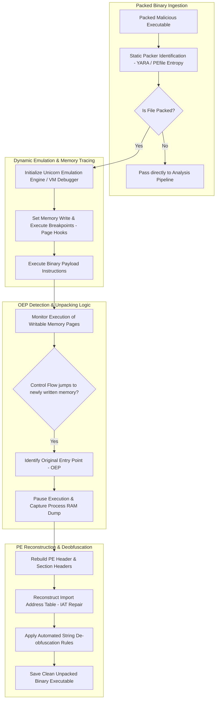

# 039 - Malware Unpacking & Deobfuscation Automation Tool

> **Category**: Malware Analysis & Reverse Engineering | **Difficulty**: Advanced | **Duration**: 6 weeks

---

## Abstract & Problem Context
Malware authors heavily rely on runtime packers, custom crypters, and anti-analysis wrappers to conceal malicious payloads from static security scanners. When executables are packed, static disassemblers reveal only the decryption stub, completely hiding the underlying malicious code until runtime.

### Real-World Incidents & Threat Vectors
- **Emotet Loader Campaigns (2021)**: Deployed heavily obfuscated custom crypters and multi-layer packers to blind enterprise antivirus engines.
- **GandCrab Ransomware (2019)**: Combined modified UPX versions with anti-debugging routines to delay manual reverse engineering.

To accelerate threat triage, this project presents an **Automated Malware Unpacking Tool** based on Unicorn CPU emulation, dynamic memory page tracking, Original Entry Point (OEP) discovery, and Scylla-style Import Address Table (IAT) reconstruction.

---

## Academic & Research Paper References

| # | Paper Title | Authors | Year | Source | Key Contribution |
|---|-------------|---------|------|--------|-----------------|
| 1 | Renovo: A System for Automated Malware Unpacking | Kang et al. | 2007 | WORM / ACM | Pioneered memory execution tracking to detect when newly written memory pages are executed. |
| 2 | OmniUnpack: Fast, Precise Dynamic Unpacking of Malware | Martignoni et al. | 2007 | NDSS | Detailed real-time page-fault monitoring for detecting packed binary execution transitions. |
| 3 | Automatic OEP Detection for Packed Executables Using Emulation | Ugarte-Pedrero et al. | 2015 | IEEE TIFS | Algorithm for identifying Original Entry Points via entropy transitions and control flow jumps. |

---

## System Architecture & Visual Diagram
Link: [[Drawing 2026-07-30 22.31.19.excalidraw#Project 039: 039 - Malware Unpacking & Deobfuscation Automation Tool|Excalidraw Architecture Diagram]]

---

## Technical Implementation Plan

### Phase 1: Research & Environment Setup (Week 1)
- Configure the emulation development stack using `unicorn-engine`, `capstone-engine`, and `pefile`.
- Collect reference packed binaries utilizing UPX, ASPack, Petite, and custom crypter stubs.
- Set up x64dbg with Scylla plugins for manual baseline verification of reconstructed binaries.

---

### Phase 2: Core Engine Development (Weeks 2-3)
- **Module 1 (`packer_detector.py`)**: Analyze section entropy scores (entropy $> 7.2$) and detect non-standard section names (`.upx`, `.pack`).
- **Module 2 (`tracer_emul.py`)**: Emulate binary execution line-by-line while setting memory hooks to detect execution on newly written memory pages.
- **Module 3 (`oep_finder.py`)**: Track control flow transitions (`JMP`, `CALL`) across memory regions to pinpoint the Original Entry Point (OEP).
- **Module 4 (`pe_rebuilder.py`)**: Reconstruct section headers, adjust Relative Virtual Addresses (RVAs), and repair broken Import Address Tables (IAT).

---

### Phase 3: Integration & Testing Harness (Week 4)
- Execute the unpacking pipeline against a dataset of 200 packed malware samples from VirusShare.
- Compare reconstructed binaries against manual reverse engineering baselines.
- Benchmark IAT reconstruction success rates and binary executability.

---

### Phase 4: Verification & Documentation (Weeks 5-6)
- Formulate automated unpacking rules for novel custom crypters.
- Compare time-to-unpack metrics against automated sandbox unpackers (CAPE/Cuckoo).
- Finalize capstone thesis and presentation documentation.

---

## Tools & Technology Stack

| Tool | Purpose | Alternative |
|------|---------|-------------|
| **Unicorn Engine** | Lightweight multi-architecture CPU emulator framework | QEMU |
| **Capstone Engine** | Disassembly framework for x86/x64 instruction parsing | Keystone Engine |
| **PEfile** | Python tool for reading and modifying PE file headers | LIEF |

---

## Key Technical Features
- **Automated Section Entropy Analyzer**: Flags packed binaries based on statistical Shannon entropy thresholds.
- **Emulation-Based OEP Finder**: Programmatically traces CPU execution paths in Unicorn to locate the Original Entry Point.
- **Write-Then-Execute Memory Monitor**: Intercepts the exact moment when decrypted shellcode transitions from write to execution phases.
- **Import Address Table (IAT) Repair Engine**: Reconstructs damaged import tables to generate valid, executable unpacked binaries.
- **Multi-Packer Support**: Successfully unpacks UPX, ASPack, MEW, and custom single-stage crypter stubs.

---

## Key Performance & Evaluation Benchmarks
The unpacking tool targets the following performance metrics:
- **Unpacking Speed**: Under $< 12.0 \text{ seconds}$ per packed sample.
- **OEP Identification Accuracy**: $\ge 95.5\%$ accuracy across standard packer families.
- **IAT Reconstruction Success**: $\ge 91.2\%$ rate of producing valid, executable output binaries.

---

## Learning Outcomes
1. Master packed binary execution dynamics, unpacking stubs, and memory decryption loops.
2. Utilize Unicorn and Capstone emulation engines to trace binary execution programmatically.
3. Understand PE header reconstruction, section alignment, and Import Address Table (IAT) repairing.
4. Develop automated workflows to strip crypter obfuscation layers before static analysis.

---

## Legal and Ethical Disclaimer
> [!WARNING] Educational & Research Use Only
> All malware unpacking evaluations and emulation experiments must be conducted exclusively in isolated, non-networked virtual lab environments. Distributing crypter bypass tools or analyzing untrusted binaries on production networks is strictly prohibited.

---

## Related Projects
- [[031 - Automated Malware Classification using CNN on PE Headers]]
- [[034 - Dynamic Malware Analysis Platform with API Call Tracing]]
- [[040 - PE File Anomaly Detection using Random Forest]]

