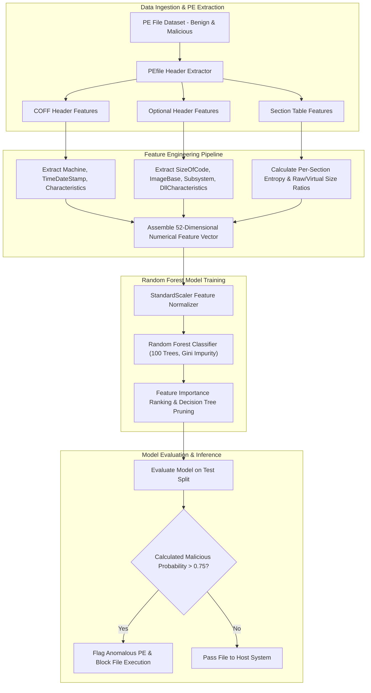

# 040 - PE File Anomaly Detection using Random Forest

> **Category**: Malware Analysis & Reverse Engineering | **Difficulty**: Intermediate | **Duration**: 5 weeks

---

## Abstract & Problem Context
Traditional signature-based antivirus scanners fail to catch zero-day malware variants when file hashes or byte sequences change. However, malicious Portable Executables (PE) frequently exhibit structural anomalies within their file headers—such as non-standard section counts, abnormal section entropy, suspicious entry point addresses, and mismatched raw vs. virtual section sizes.

### Real-World Incidents & Threat Vectors
- **NotPetya Cyberattack (2017)**: Destructive wiper malware masquerading as ransomware contained structural PE anomalies missed by signature engines.
- **Stuxnet Component Drivers (2010)**: Altered section header flags and stolen digital certificate signatures allowed malicious binaries to bypass standard host controls.

To address these vulnerabilities, this project constructs a **PE Structural Anomaly Classifier** using Random Forest machine learning algorithms trained on static header feature matrices.

---

## Academic & Research Paper References

| # | Paper Title | Authors | Year | Source | Key Contribution |
|---|-------------|---------|------|--------|-----------------|
| 1 | Detecting Unknown Malicious Code by Applying Machine Learning Methods on PE Headers | Schultz et al. | 2001 | IEEE S&P | Pioneered applying machine learning algorithms to Portable Executable structural features. |
| 2 | Static Detection of Malware Executables Using Data Mining Techniques | Kolter and Maloof | 2006 | JMLR | Evaluated n-gram byte sequences and Random Forest classifiers for malware family identification. |
| 3 | Structural Entropy and PE Header Anomaly Extraction for Malware Detection | Sorokina et al. | 2018 | ACM CSUR | Comprehensive taxonomy of structural anomalies in non-standard Portable Executables. |

---

## System Architecture & Visual Diagram
Link: [[Drawing 2026-07-30 22.31.19.excalidraw#Project 040: 040 - PE File Anomaly Detection using Random Forest|Excalidraw Architecture Diagram]]

---

## Technical Implementation Plan

### Phase 1: Research & Environment Setup (Week 1)
- Install machine learning and PE parsing libraries: `scikit-learn`, `pefile`, `pandas`, `numpy`, `matplotlib`, and `seaborn`.
- Download the EMBER benchmark PE feature dataset or assemble a local corpus of 5,000 benign and 5,000 malicious binaries.
- Build a feature extraction notebook pipeline for automated PE header processing.

---

### Phase 2: Core Engine Development (Weeks 2-3)
- **Module 1 (`extractor.py`)**: Extract 52 structural features: section counts, section entropy, import function counts, header checksums, and debug directory entries.
- **Module 2 (`trainer.py`)**: Train a Random Forest classifier using 100 decision trees, 10-fold cross-validation, and hyperparameter tuning (`max_depth`, `min_samples_split`).
- **Module 3 (`importance.py`)**: Compute Gini feature importance to identify key structural indicators of malicious intent (e.g., `VirtualSize` vs. `SizeOfRawData` mismatches).
- **Module 4 (`scanner.py`)**: Build a lightweight Command Line Interface (CLI) scanner for rapid SOC binary triage.

---

### Phase 3: Integration & Testing Harness (Week 4)
- Evaluate the Random Forest model against newly compiled benign C++ applications and recent zero-day malware binaries.
- Generate Receiver Operating Characteristic (ROC) curves and Precision-Recall metrics.
- Compare Random Forest performance against baseline models (Support Vector Machines and Naive Bayes).

---

### Phase 4: Verification & Model Export (Week 5)
- Document the top 10 PE header structural anomalies correlated with malware (e.g., write-permissible `.text` sections).
- Export the trained classifier to ONNX/Joblib format for production EDR integration.
- Finalize capstone thesis and presentation documentation.

---

## Tools & Technology Stack

| Tool | Purpose | Alternative |
|------|---------|-------------|
| **Scikit-learn** | Machine learning library for Random Forest model training | XGBoost |
| **PEfile** | Python Portable Executable parsing library | LIEF Framework |
| **Pandas** | Data manipulation framework for feature matrices | NumPy |

---

## Key Technical Features
- **52-Dimensional PE Structural Inspection**: Analyzes section entropy, header flags, import counts, and size discrepancies.
- **Random Forest Architecture**: Employs an ensemble of 100 decision trees to achieve robust classification without overfitting.
- **Sub-Millisecond Inference Latency**: Evaluates binary feature vectors in less than $< 5.0 \text{ ms}$.
- **Explainable Feature Importance**: Quantifies the specific structural anomalies driving classification decisions.
- **Standalone Model Serialization**: Exports lightweight model artifacts (`joblib`) ready for enterprise EDR deployment.

---

## Key Performance & Evaluation Benchmarks
The classifier targets the following performance metrics:
- **Classification Accuracy**: $\ge 98.1\%$ on the EMBER benchmark test set.
- **Inference Latency**: Under $< 5.0 \text{ ms}$ per binary sample.
- **False Positive Control**: False Positive Rate maintained under $< 0.3\%$ on clean Windows OS binaries.

---

## Learning Outcomes
1. Master Portable Executable (PE) header specifications, COFF headers, and section flags.
2. Perform feature engineering on raw binaries to extract numerical and statistical metrics.
3. Train, evaluate, and tune Random Forest machine learning models using Scikit-learn.
4. Apply explainable AI principles to interpret machine learning threat verdicts.

---

## Legal and Ethical Disclaimer
> [!WARNING] Educational & Research Use Only
> All machine learning evaluations and binary feature extractions must be conducted exclusively in isolated, non-networked virtual lab environments. Analyzing untrusted binaries on unmanaged production systems is strictly prohibited.

---

## Related Projects
- [[031 - Automated Malware Classification using CNN on PE Headers]]
- [[039 - Malware Unpacking & Deobfuscation Automation Tool]]
- [[041 - Macro-based Malware Detector for Office Documents]]

