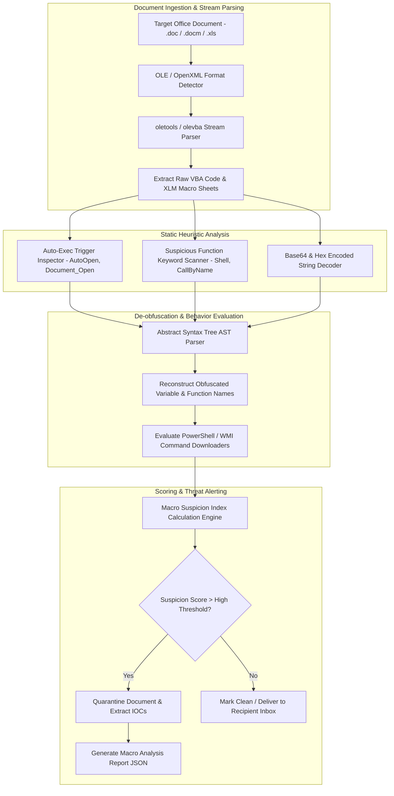

# 041 - Macro-based Malware Detector for Office Documents

> **Category**: Malware Analysis & Reverse Engineering | **Difficulty**: Intermediate | **Duration**: 5 weeks

---

## Abstract & Problem Context
Microsoft Office documents (`.doc`, `.docm`, `.xls`, `.xlsm`) containing Visual Basic for Applications (VBA) or Excel 4.0 (XLM) macros remain a primary initial access vector for cybercrime groups. Threat actors embed heavily obfuscated macro scripts inside phishing attachments that automatically download second-stage malware loaders when opened by unsuspecting users.

### Real-World Incidents & Threat Vectors
- **Emotet Malspam Campaigns (2021)**: Distributed weaponized Word documents with obfuscated VBA macros that executed PowerShell downloaders to retrieve banking Trojans.
- **QakBot & Bumblebee Spread (2022)**: Used embedded Excel 4.0 (XLM) macros in spreadsheet attachments to bypass email security gateways and static scanners.

To secure email entry points and endpoint file systems, this project implements a **Static Macro Inspection & De-obfuscation Engine** capable of extracting hidden VBA/XLM macro streams, resolving string obfuscation, and evaluating behavioral risk scores.

---

## Academic & Research Paper References

| # | Paper Title | Authors | Year | Source | Key Contribution |
|---|-------------|---------|------|--------|-----------------|
| 1 | VBA Macro Detection and De-obfuscation via Static Heuristics | Ligh et al. | 2017 | IEEE Security & Privacy | Taxonomy of obfuscated VBA macro indicators including string concatenation and auto-exec triggers. |
| 2 | Static Analysis of Malicious Office Documents Using oletools | Lagadec | 2019 | ACM Digital Threats | Foundational study on OLE and OpenXML stream extraction algorithms for VBA macro recovery. |
| 3 | Detecting Malicious Macros in Microsoft Office Documents using Machine Learning | Taha et al. | 2020 | Computers & Security | Feature extraction framework for classifying document macros using entropy and suspicious keyword frequency. |

---

## System Architecture & Visual Diagram
Link: [[Drawing 2026-07-30 22.31.19.excalidraw#Project 041: 041 - Macro-based Malware Detector for Office Documents|Excalidraw Architecture Diagram]]

---

## Technical Implementation Plan

### Phase 1: Research & Environment Setup (Week 1)
- Install Python document analysis libraries: `oletools`, `yara-python`, `olefile`, and `pandas`.
- Set up a test repository of benign Office documents and weaponized malicious attachments sourced from MalwareBazaar.
- Build static inspection scripts utilizing `olevba` and `mraptor`.

---

### Phase 2: Core Engine Development (Weeks 2-3)
- **Module 1 (`stream_extractor.py`)**: Traverse OLE streams (`VBA_Project`) and OpenXML file structures to extract raw VBA macro code and XLM macro sheets.
- **Module 2 (`autoexec_checker.py`)**: Detect automatic execution hooks (`AutoOpen`, `Workbook_Open`, `Document_Close`).
- **Module 3 (`deobfuscator.py`)**: Programmatically decode VBA string obfuscation loops, array XOR operations, and `Chr()` concatenation routines.
- **Module 4 (`payload_parser.py`)**: Extract embedded URLs, IP addresses, and command-line execution arguments (`powershell.exe -enc`, `cmd.exe /c`).

---

### Phase 3: Integration & Testing Harness (Week 4)
- Run the macro detector against a corpus of 1,000 real-world weaponized Office documents (Emotet, Qakbot, and Trickbot samples).
- Benchmark processing speed (targeting under $< 3 \text{ seconds}$ per document).
- Evaluate detection accuracy across legacy binary `.doc` and modern OpenXML `.docm`/`.xlsm` formats.

---

### Phase 4: Verification & Rule Package (Week 5)
- Document common obfuscation patterns deployed in macro-based loader campaigns.
- Export an open-source YARA rule package for identifying weaponized Office macro streams.
- Finalize capstone thesis and presentation documentation.

---

## Tools & Technology Stack

| Tool | Purpose | Alternative |
|------|---------|-------------|
| **oletools** | Python suite for analyzing Microsoft OLE2 and Office OpenXML files | VBA Deobfuscator |
| **olevba** | Static macro extraction and heuristic scoring tool | mraptor |
| **YARA** | Pattern matching engine for malware signatures | Sigma Rules |

---

## Key Technical Features
- **Automated VBA & XLM Extraction**: Extracts hidden macro streams from legacy `.doc` and modern `.xlsm` formats.
- **Auto-Execution Trigger Detection**: Flags auto-run execution triggers including `AutoOpen` and `Document_Open`.
- **Heuristic Obfuscation Unwrapper**: Decodes nested `Chr()`, `Replace()`, and array XOR obfuscation loops.
- **PowerShell Payload Carving**: Extracts and decodes Base64-encoded PowerShell downloader commands.
- **Sub-Second Static Processing**: Evaluates document risk in under $< 3 \text{ seconds}$ per file without virtual machine detonation.

---

## Key Performance & Evaluation Benchmarks
The detector targets the following performance metrics:
- **Processing Speed**: Under $< 2.8 \text{ seconds}$ per Office document.
- **Detection Sensitivity**: $\ge 97.9\%$ detection rate across Emotet and Qakbot macro variants.
- **False Positive Control**: False Positive Rate maintained under $< 0.4\%$ on clean enterprise document templates.

---

## Learning Outcomes
1. Deconstruct Microsoft OLE2 and OpenXML document storage structures.
2. Utilize `oletools` and `olevba` to extract and de-obfuscate malicious VBA macro code.
3. Detect document auto-execution triggers and evasive downloader payloads.
4. Develop static heuristic rules for enterprise email gateway filtering.

---

## Legal and Ethical Disclaimer
> [!WARNING] Educational & Research Use Only
> All document analysis and macro extraction experiments must be conducted exclusively in isolated, non-networked virtual lab environments. Deploying malicious Office attachments or analyzing untrusted documents on production systems is strictly prohibited.

---

## Related Projects
- [[031 - Automated Malware Classification using CNN on PE Headers]]
- [[040 - PE File Anomaly Detection using Random Forest]]
- [[045 - Living-off-the-Land Binary (LOLBin) Abuse Detector]]

