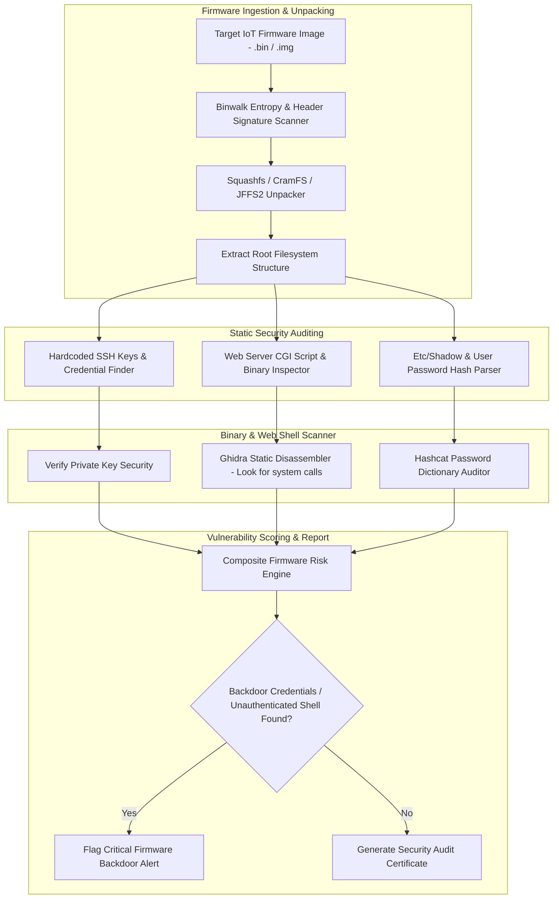

# 042 - Firmware Backdoor Detection System

> **Category**: Malware Analysis & Reverse Engineering | **Difficulty**: Advanced | **Duration**: 6 weeks

---

## Abstract & Problem Context
Embedded Internet of Things (IoT) devices, enterprise routers, and smart industrial appliances run specialized Linux firmware distributions. Due to rapid development cycles and inadequate vendor auditing, firmware images often ship with severe security vulnerabilities—such as hardcoded default credentials, hidden administrative backdoors, unauthenticated web management CGI scripts, and unencrypted private SSH keys.

### Real-World Incidents & Threat Vectors
- **Mirai Botnet Outbreak (2016)**: Scanned the Internet for IoT devices running factory default SSH/Telnet credentials, enslaving hundreds of thousands of IP cameras and routers into massive DDoS botnets.
- **Cisco Small Business Router Backdoor (CVE-2020-3337)**: Hardcoded administrative credentials within firmware binaries enabled unauthenticated remote attackers to execute arbitrary commands with root privileges.

To protect critical supply chain infrastructure, this project constructs an **Automated Firmware Security Auditing Platform** that unpacks binary firmware images, extracts embedded Linux filesystems, and audits binaries for hardcoded backdoors and vulnerabilities.

---

## Academic & Research Paper References

| # | Paper Title | Authors | Year | Source | Key Contribution |
|---|-------------|---------|------|--------|-----------------|
| 1 | A Large-Scale Analysis of the Security of Embedded Firmware | Costin et al. | 2014 | USENIX Security | Landmark study analyzing 32,000 firmware images for hardcoded SSH keys and backdoors. |
| 2 | FIRM-AFL: High-Throughput Greybox Fuzzing for IoT Firmware | Zheng et al. | 2019 | USENIX Security | Detailed augmented emulation methods for dynamic testing of unpacked firmware file systems. |
| 3 | Static Analysis of Embedded Firmware for Vulnerability Discovery | Cui et al. | 2013 | IEEE S&P | Framework for discovering hardcoded credentials, unauthenticated CGI scripts, and backdoor web portals. |

---

## System Architecture & Visual Diagram
Link: [[Drawing 2026-07-30 22.31.19.excalidraw#Project 042: 042 - Firmware Backdoor Detection System|Excalidraw Architecture Diagram]]

---

## Technical Implementation Plan

### Phase 1: Research & Environment Setup (Week 1)
- Install firmware reverse engineering dependencies: `binwalk`, `squashfs-tools`, `sasquatch`, `ghidra`, and `yara-python`.
- Collect vendor firmware binaries for routers, IP cameras, and network switches from open support repositories.
- Build automated unpacking wrapper scripts using Python's `subprocess` bindings for `binwalk`.

---

### Phase 2: Core Engine Development (Weeks 2-3)
- **Module 1 (`firmware_unpacker.py`)**: Scan binary firmware blobs for compressed filesystems (`SquashFS`, `CramFS`, `UBIFS`, `JFFS2`) and extract the root filesystem directory hierarchy.
- **Module 2 (`cred_hunter.py`)**: Audit configuration files, `/etc/shadow`, `/etc/passwd`, and management scripts for hardcoded default credentials and embedded SSH private keys.
- **Module 3 (`cgi_auditor.py`)**: Analyze web interface scripts (`.cgi`, `.php`) for unauthenticated command injection vulnerabilities (`system()`, `exec()`, `popen()`).
- **Module 4 (`binary_auditor.py`)**: Audit compiled MIPS/ARM binaries using Ghidra Headless scripts to locate hardcoded admin password strings and unsafe function calls.

---

### Phase 3: Integration & Testing Harness (Week 4)
- Test the backdoor detector against a corpus of 100 firmware binaries spanning multiple hardware architectures (ARM, MIPS, PowerPC).
- Evaluate unpacking success rates and root filesystem reconstruction fidelity.
- Validate true positive detection rates for hardcoded credentials and web shell backdoors.

---

### Phase 4: Verification & Reporting (Weeks 5-6)
- Format security audit findings into Software Bill of Materials (SBOM) and vendor security advisories.
- Benchmark detection speed and extraction coverage against the Firmware Analysis Comparison Tool (FACT).
- Finalize capstone thesis and presentation documentation.

---

## Tools & Technology Stack

| Tool | Purpose | Alternative |
|------|---------|-------------|
| **Binwalk** | Firmware extraction and magic byte header analysis tool | FACT Framework |
| **Ghidra** | Open-source reverse engineering framework for disassembling MIPS/ARM binaries | IDA Pro |
| **Squashfs-tools** | Utilities for creating and extracting SquashFS filesystems | Sasquatch |

---

## Key Technical Features
- **Automated Multi-Architecture Unpacking**: Extracts nested compressed filesystems across MIPS, ARM, PowerPC, and x86 architectures.
- **Hardcoded Credential Hunter**: Discovers hardcoded admin passwords, API tokens, and embedded RSA/DSA private keys.
- **CGI Script Vulnerability Auditor**: Identifies unauthenticated remote command execution vulnerabilities within web administration portals.
- **Architecture-Agnostic Binary Disassembly**: Integrates with Ghidra Headless to audit compiled C binaries for hardcoded backdoors and dangerous system calls.
- **Compliance & SBOM Report Generator**: Exports Software Bill of Materials (SBOM) inventory reports and vulnerability metrics.

---

## Key Performance & Evaluation Benchmarks
The platform targets the following performance metrics:
- **Unpacking Completion Speed**: Under $< 2.5 \text{ minutes}$ per firmware image.
- **Backdoor Credential Discovery**: $\ge 96.5\%$ sensitivity on known vulnerable firmware.
- **Filesystem Extraction Rate**: $\ge 92.0\%$ complete root filesystem extraction rate.

---

## Learning Outcomes
1. Master embedded Linux system architectures, MIPS/ARM assembly instruction sets, and firmware storage formats.
2. Utilize `binwalk` and `squashfs-tools` to unpack and inspect embedded Linux file systems.
3. Identify security vulnerabilities such as hardcoded default credentials, weak password hashes, and backdoor web scripts.
4. Programmatically run binary disassembly and string extraction using Ghidra Headless scripts.

---

## Legal and Ethical Disclaimer
> [!WARNING] Educational & Research Use Only
> All firmware reverse engineering and vulnerability evaluations must be conducted exclusively on open-source firmware, vendor-provided public images, or self-owned IoT hardware in isolated lab environments. Analyzing proprietary firmware without authorization may violate software license agreements.

---

## Related Projects
- [[036 - Android APK Static Analysis & Vulnerability Scanner]]
- [[037 - ELF Binary Exploit Detection for Linux Systems]]
- [[043 - Cryptojacking Script Detection in Web Browsers]]
: Malware Analysis & Reverse Engineering | 🔐 Offensive Security Research*
