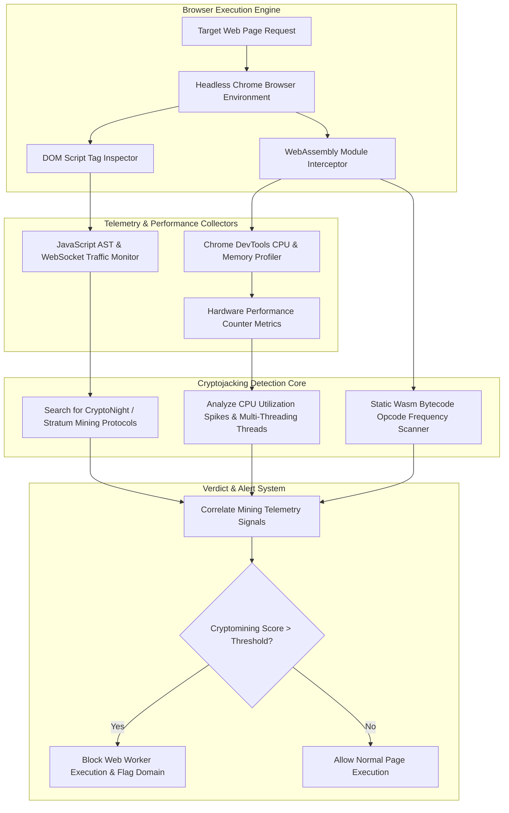

# 043 - Cryptojacking Script Detection in Web Browsers

> **Category**: Malware Analysis & Reverse Engineering | **Difficulty**: Intermediate | **Duration**: 5 weeks

---

## Abstract & Problem Context
Browser-based cryptojacking involves embedding unauthorized JavaScript or WebAssembly (Wasm) scripts into websites to hijack site visitors' CPU resources for mining cryptocurrencies (such as Monero). Because these scripts run silently within standard web browser sandboxes without requiring file downloads, traditional host antivirus software often fails to detect them.

### Real-World Incidents & Threat Vectors
- **Coinhive Epidemic (2017-2019)**: Thousands of compromised websites (including public sector portals and news outlets) secretly embedded Coinhive JavaScript mining libraries to mine cryptocurrency using visitor CPU threads.
- **LA County Court Web Cryptojacking (2018)**: Official court administration portals were compromised with malicious WebAssembly cryptomining scripts, causing severe system slowdowns for public users.

To protect web users and enterprise endpoints from resource hijacking, this project implements a real-time **Browser Cryptojacking Detection Platform** combining Chrome DevTools Protocol telemetry, WebAssembly opcode analysis, and Stratum protocol inspection.

---

## Academic & Research Paper References

| # | Paper Title | Authors | Year | Source | Key Contribution |
|---|-------------|---------|------|--------|-----------------|
| 1 | Out-of-Sight, Out-of-Mind: Detecting Web-Based Cryptojacking in the Wild | Hong et al. | 2018 | ACM CCS | Landmark measurement study introducing hardware performance counter metrics for cryptojacking detection. |
| 2 | MineSweeper: An In-Browser Cryptojacking Detection System | Kharraz et al. | 2019 | USENIX Security | Detailed execution profiling of WebAssembly primitives used in cryptomining algorithms. |
| 3 | Capsule: Detecting In-Browser Cryptojacking via WebAssembly Bytecode Analysis | Rodriguez et al. | 2021 | IEEE TIFS | Static and dynamic analysis methodology for identifying CryptoNight algorithms in Wasm binaries. |

---

## System Architecture & Visual Diagram
Link: [[Drawing 2026-07-30 22.31.19.excalidraw#Project 043: 043 - Cryptojacking Script Detection in Web Browsers|Excalidraw Architecture Diagram]]

---

## Technical Implementation Plan

### Phase 1: Research & Environment Setup (Week 1)
- Install browser automation and Wasm inspection tools: `npm install puppeteer`, `pip install wasm-parser scikit-learn`.
- Configure headless Chrome instances with Chrome DevTools Protocol (CDP) performance profiling enabled.
- Assemble benchmark datasets of normal web applications versus sites hosting Coinhive, CryptoLoot, and WebMinePool scripts.

---

### Phase 2: Core Engine Development (Weeks 2-3)
- **Module 1 (`browser_monitor.js`)**: Puppeteer controller tracking WebSocket frames, Web Worker spawns, and real-time CPU utilization levels.
- **Module 2 (`wasm_auditor.py`)**: Parse intercepted `.wasm` binary modules to calculate cryptographic bitwise opcode frequencies (`xor`, `rotl`, `i64.add`).
- **Module 3 (`protocol_checker.py`)**: Intercept WebSocket traffic searching for Stratum mining protocol JSON frames (`mining.subscribe`, `mining.submit`).
- **Module 4 (`classifier.py`)**: Train a Random Forest classifier using CPU usage metrics, Web Worker thread counts, and Wasm opcode distributions.

---

### Phase 3: Integration & Testing Harness (Week 4)
- Benchmark detector performance against 500 benign websites (including CPU-intensive streaming sites) and 200 active cryptojacking test cases.
- Measure detection speed (targeting miner detection within $< 10 \text{ seconds}$ of page load).
- Evaluate false positive rates on legitimate WebAssembly web applications (e.g., Figma, WebGL games).

---

### Phase 4: Verification & Protection Prototype (Week 5)
- Document hardware performance counter signatures characteristic of CryptoNight hashing algorithms.
- Package a browser extension prototype for inline endpoint protection.
- Finalize capstone thesis and presentation documentation.

---

## Tools & Technology Stack

| Tool | Purpose | Alternative |
|------|---------|-------------|
| **Puppeteer** | Node.js library for controlling headless Chrome/Chromium browsers | Playwright |
| **Wasm-Parser** | Python parser for WebAssembly binary opcode inspection | Wasm-Tools |
| **Chrome DevTools Protocol** | Low-level browser debugging and performance telemetry API | WebExtension API |

---

## Key Technical Features
- **Headless Browser Telemetry**: Monitors Web Worker thread spawns, CPU utilization, and heap allocation in real time.
- **WASM Opcode Frequency Inspection**: Identifies CryptoNight hashing loops inside WebAssembly binary modules.
- **Stratum Mining Protocol Parser**: Intercepts WebSocket network traffic for mining pool authentication and share submission frames.
- **Dynamic Worker Throttling**: Automatically terminates rogue Web Workers consuming excessive CPU resources.
- **Browser Extension Protection**: Provides real-time user notification and site-blocking capabilities.

---

## Key Performance & Evaluation Benchmarks
The detection platform targets the following performance metrics:
- **Detection Latency**: Under $< 8.5 \text{ seconds}$ from initial page load.
- **Mining Identification Accuracy**: $\ge 98.2\%$ accuracy across tested cryptojacking scripts.
- **False Positive Control**: False Positive Rate maintained under $< 0.5\%$ on legitimate Wasm games and media applications.

---

## Learning Outcomes
1. Understand WebAssembly execution models, Web Worker threading, and browser security sandboxing.
2. Utilize Puppeteer and Chrome DevTools Protocol to gather real-time performance telemetry.
3. Analyze WebAssembly bytecode opcodes to identify intensive cryptographic calculation loops.
4. Develop web extension prototypes to protect endpoints from resource hijacking.

---

## Legal and Ethical Disclaimer
> [!WARNING] Educational & Research Use Only
> All browser cryptojacking evaluations and script analyses must be conducted exclusively in isolated, non-networked virtual lab environments. Deploying cryptojacking scripts or testing unauthorized web pages without consent is strictly prohibited.

---

## Related Projects
- [[036 - Android APK Static Analysis & Vulnerability Scanner]]
- [[042 - Firmware Backdoor Detection System]]
- [[045 - Living-off-the-Land Binary (LOLBin) Abuse Detector]]

