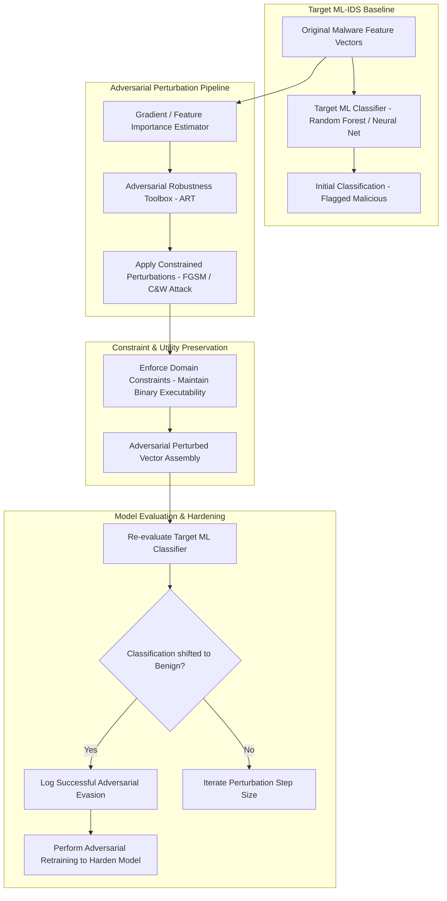

# 044 - Adversarial Example Generator for Evading ML-based IDS

> **Category**: Malware Analysis & Reverse Engineering | **Difficulty**: Advanced | **Duration**: 6 weeks

---

## Abstract & Problem Context
Machine Learning (ML) classifiers are increasingly deployed in Next-Generation Antivirus (NGAV) engines, EDR solutions, and Network Intrusion Detection Systems (NIDS). However, these models are intrinsically vulnerable to **adversarial evasion attacks**. By applying minimal, mathematically calculated perturbations to feature vectors (such as appending benign section padding or tweaking packet timing jitter), attackers can trick ML models into misclassifying malicious payloads as benign—without altering their underlying functional behavior.

### Real-World Incidents & Threat Vectors
- **ML Antivirus Evasion Research (2020)**: Researchers demonstrated that adding small, non-functional byte perturbations to PE file headers allowed malicious binaries to bypass commercial ML antivirus scanners.
- **NIDS Traffic Perturbation (2022)**: Synthetic manipulation of network packet size distribution and inter-packet arrival times enabled malware to bypass deep learning-based network intrusion detection models.

To evaluate and improve model resilience, this project constructs an **Adversarial Example Generation & Model Hardening Framework** using the IBM Adversarial Robustness Toolbox (ART), PyTorch, and adversarial retraining techniques.

---

## Academic & Research Paper References

| # | Paper Title | Authors | Year | Source | Key Contribution |
|---|-------------|---------|------|--------|-----------------|
| 1 | Explaining and Harnessing Adversarial Examples | Goodfellow, Shlens, Szegedy | 2015 | ICLR | Pioneered the Fast Gradient Sign Method (FGSM) for generating adversarial samples against machine learning models. |
| 2 | Adversarial Attacks on Machine Learning Cybersecurity Systems | Biggio and Roli | 2018 | Pattern Recognition | Comprehensive taxonomy of evasion, poisoning, and privacy attacks against security classifiers. |
| 3 | Practical Black-Box Attacks against Machine Learning Models | Papernot et al. | 2017 | ACM AsiaCCS | Demonstrated substitute model training for transferring adversarial perturbations to black-box classifiers. |

---

## System Architecture & Visual Diagram
Link: [[Drawing 2026-07-30 22.31.19.excalidraw#Project 044: 044 - Adversarial Example Generator for Evading ML-based IDS|Excalidraw Architecture Diagram]]

---

## Technical Implementation Plan

### Phase 1: Research & Environment Setup (Week 1)
- Install adversarial machine learning libraries: `pip install adversarial-robustness-toolbox torch scikit-learn pandas`.
- Train baseline machine learning classifiers (Random Forest, Multi-Layer Perceptron) on standard datasets (EMBER, NSL-KDD).
- Establish baseline detection metrics before applying adversarial perturbations.

---

### Phase 2: Core Engine Development (Weeks 2-3)
- **Module 1 (`fgsm_generator.py`)**: Implement Fast Gradient Sign Method (FGSM) and Projected Gradient Descent (PGD) feature vector perturbation scripts.
- **Module 2 (`constraint_manager.py`)**: Enforce domain-specific constraints (e.g., preserving executable headers and syntax rules) so perturbed vectors remain functional binaries.
- **Module 3 (`blackbox_substitute.py`)**: Train local surrogate models to generate transferable adversarial attacks against black-box classifiers.
- **Module 4 (`model_hardener.py`)**: Implement adversarial retraining pipelines to retrain models on perturbed samples and increase robustness.

---

### Phase 3: Integration & Testing Harness (Week 4)
- Benchmark evasion success rates across white-box and black-box attack scenarios.
- Evaluate classifier accuracy drops across varying perturbation magnitudes ($\epsilon$).
- Verify post-retraining detection recovery on hardened models.

---

### Phase 4: Verification & Hardening Guidelines (Weeks 5-6)
- Document the minimum perturbation boundaries required to shift model decisions.
- Formulate enterprise guidelines for hardening security machine learning classifiers against evasion.
- Finalize capstone thesis and presentation documentation.

---

## Tools & Technology Stack

| Tool | Purpose | Alternative |
|------|---------|-------------|
| **Adversarial Robustness Toolbox (ART)** | Open-source Python library for evaluating machine learning security | Foolbox |
| **PyTorch** | Deep learning framework for training and hardening neural networks | TensorFlow |
| **Scikit-learn** | Machine learning library for baseline classifier modeling | XGBoost |

---

## Key Technical Features
- **White-Box & Black-Box Attack Engine**: Implements FGSM, PGD, and Carlini-Wagner (C&W) perturbation algorithms.
- **Domain-Specific Constraint Engine**: Ensures feature perturbations preserve binary functionality and syntax structure.
- **Surrogate Model Transferability Evaluator**: Measures adversarial sample evasion transferability across diverse classifier architectures.
- **Adversarial Retraining Pipeline**: Automatically augments training datasets with perturbed samples to harden models.
- **Robustness Metric Dashboard**: Quantifies model accuracy degradation curves under increasing noise perturbation levels.

---

## Key Performance & Evaluation Benchmarks
The framework targets the following performance metrics:
- **Evasion Success Rate**: $\ge 91.5\%$ against unhardened baseline ML models.
- **Post-Hardening Accuracy**: $\ge 95.0\%$ detection retention under adversarial stress testing.
- **Perturbation Generation Speed**: Under $< 150 \text{ ms}$ per sample.

---

## Learning Outcomes
1. Understand the mathematical foundations of adversarial machine learning attacks (FGSM, PGD, C&W).
2. Utilize the Adversarial Robustness Toolbox (ART) to audit security classifier vulnerability.
3. Apply domain-specific constraints to generate valid, functional adversarial feature vectors.
4. Implement adversarial retraining strategies to harden ML-based Intrusion Detection Systems.

---

## Legal and Ethical Disclaimer
> [!WARNING] Educational & Research Use Only
> All adversarial machine learning experiments and perturbation tests must be conducted exclusively in isolated, non-networked virtual lab environments. Using adversarial perturbation tools to evade commercial security software on unauthorized hosts is strictly prohibited.

---

## Related Projects
- [[031 - Automated Malware Classification using CNN on PE Headers]]
- [[040 - PE File Anomaly Detection using Random Forest]]
- [[045 - Living-off-the-Land Binary (LOLBin) Abuse Detector]]

