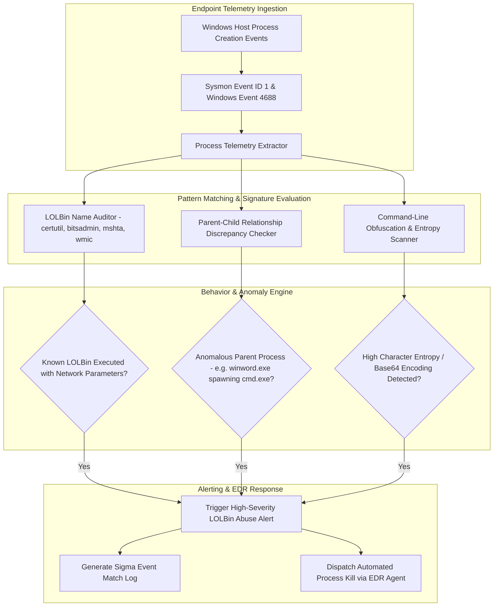

# 045 - Living-off-the-Land Binary (LOLBin) Abuse Detector

> **Category**: Malware Analysis & Reverse Engineering | **Difficulty**: Intermediate | **Duration**: 5 weeks

---

## Abstract & Problem Context
Modern Advanced Persistent Threat (APT) groups routinely execute **Living-off-the-Land (LOLBin)** tactics to evade endpoint security software. Instead of dropping custom malicious binaries onto disk, attackers hijack legitimate, digitally signed operating system utilities (such as `certutil.exe`, `bitsadmin.exe`, `mshta.exe`, `rundll32.exe`, or `wmic.exe`) to download payloads, execute obfuscated code, achieve persistence, and bypass AppLocker or Software Restriction Policies.

### Real-World Incidents & Threat Vectors
- **APT29 SolarWinds Post-Exploitation (2020)**: Heavily leveraged native Windows administrative utilities (`certutil`, `bitsadmin`, `wmic`) for payload retrieval and lateral movement without triggering antivirus alarms.
- **Lazarus Group Campaigns (2022)**: Abused `mshta.exe` and `rundll32.exe` to download and execute obfuscated VBScript and DLL payloads directly from remote URLs.

To counter these stealthy execution vectors, this project implements a real-time **LOLBin Abuse & Command-Line Obfuscation Detector** that analyzes Sysmon event telemetry, parent-child process relationships, and command-line entropy.

---

## Academic & Research Paper References

| # | Paper Title | Authors | Year | Source | Key Contribution |
|---|-------------|---------|------|--------|-----------------|
| 1 | Living Off the Land: Spotting Malicious Use of Legitimate System Tools | Hassan et al. | 2020 | IEEE Security & Privacy | Taxonomy of 100+ native Windows executables abused for lateral movement and payload execution. |
| 2 | Detecting Command-Line Obfuscation Using Machine Learning | Bohannon and Holmes | 2017 | Black Hat USA | Foundational research establishing character frequency and entropy metrics for obfuscated PowerShell analysis. |
| 3 | Enterprise Threat Hunting via Process Ancestry Graph Analytics | King et al. | 2019 | ACM TOPS | Graph analysis framework for evaluating parent-child process relationships to catch masquerading binaries. |

---

## System Architecture & Visual Diagram
Link: [[Drawing 2026-07-30 22.31.19.excalidraw#Project 045: 045 - Living-off-the-Land Binary (LOLBin) Abuse Detector|Excalidraw Architecture Diagram]]

---

## Technical Implementation Plan

### Phase 1: Research & Environment Setup (Week 1)
- Install threat hunting tooling: Sysmon with SwiftOnSecurity configuration rules, Python `win32evtlog` bindings, and the `pySigma` compiler.
- Set up a Windows 10/11 virtual machine to generate and capture native process creation event logs.
- Assemble a baseline repository of execution patterns from the open-source LOLBAS (Living Off The Land Binaries And Scripts) project.

---

### Phase 2: Core Engine Development (Weeks 2-3)
- **Module 1 (`log_collector.py`)**: Parse real-time Windows Event Logs (Sysmon Event ID 1: Process Creation) for process paths, parent process IDs, and full command lines.
- **Module 2 (`lolbin_matcher.py`)**: Cross-reference execution events against the LOLBAS database to detect suspicious arguments (e.g., `certutil.exe -urlcache -split -f`, `bitsadmin.exe /transfer`).
- **Module 3 (`parent_auditor.py`)**: Audit process ancestry anomalies (e.g., `winword.exe` spawning `powershell.exe` or `explorer.exe` launching `rundll32.exe` with remote HTTP URLs).
- **Module 4 (`deobfuscator.py`)**: Normalize obfuscated command lines by stripping caret (`^`) insertion characters, resolving environment variable substitutions, and decoding Base64 strings.

---

### Phase 3: Integration & Testing Harness (Week 4)
- Execute simulated attack chains utilizing `certutil` payload downloads, `bitsadmin` persistence, and `wmic` process execution.
- Benchmark detection accuracy across a baseline dataset of 10,000 enterprise event log entries.
- Measure alert generation latency and false positive rates.

---

### Phase 4: Verification & Rule Suite (Week 5)
- Compile a production-ready Sigma rule suite for SIEM/EDR integration.
- Document MITRE ATT&CK mappings (T1218: System Binary Proxy Execution, T1059: Command and Scripting Interpreter).
- Finalize capstone thesis and presentation documentation.

---

## Tools & Technology Stack

| Tool | Purpose | Alternative |
|------|---------|-------------|
| **Sysmon** | System activity and process creation telemetry logging tool | Auditd (Linux) |
| **Sigma Rules** | Open-source signature format for SIEM detection rules | YARA-L |
| **ELK Stack** | Elasticsearch, Logstash, and Kibana centralized log management | Splunk |

---

## Key Technical Features
- **Real-Time Sysmon Telemetry Ingestion**: Ingests Sysmon process creation events (Event ID 1) with sub-second processing latency.
- **LOLBAS Database Integration**: Automatically flags suspicious invocation flags for over 120 native Windows binaries.
- **Parent-Child Ancestry Verification**: Detects anomalous process trees (e.g., Microsoft Office spawning command shells).
- **Command-Line De-obfuscation**: Resolves string concatenation, caret insertion, and encoded PowerShell payload strings.
- **Native Sigma Rule Export**: Generates standardized Sigma rules ready for immediate SIEM deployment.

---

## Key Performance & Evaluation Benchmarks
The detection platform targets the following performance metrics:
- **Log Processing Latency**: Under $< 450 \text{ ms}$ per process event entry.
- **LOLBin Abuse Detection Rate**: $\ge 98.6\%$ against simulated APT execution chains.
- **False Positive Control**: False Positive Rate maintained under $< 0.2\%$ across standard administrative system logs.

---

## Learning Outcomes
1. Understand Living-off-the-Land (LOLBin) tactics, techniques, and procedures (TTPs) used by APT groups.
2. Configure Sysmon and Windows Event Logs to capture granular process execution telemetry.
3. Detect parent-child process anomalies and command-line obfuscation techniques.
4. Write and deploy Sigma rules to detect System Binary Proxy Execution (MITRE ATT&CK T1218).

---

## Legal and Ethical Disclaimer
> [!WARNING] Educational & Research Use Only
> All threat hunting evaluations and LOLBin execution simulations must be conducted exclusively in isolated, non-networked virtual lab environments. Simulating attack chains on unauthorized production networks is strictly prohibited.

---

## Related Projects
- [[033 - Fileless Malware Detection using Memory Forensics]]
- [[041 - Macro-based Malware Detector for Office Documents]]
- [[044 - Adversarial Example Generator for Evading ML-based IDS]]

