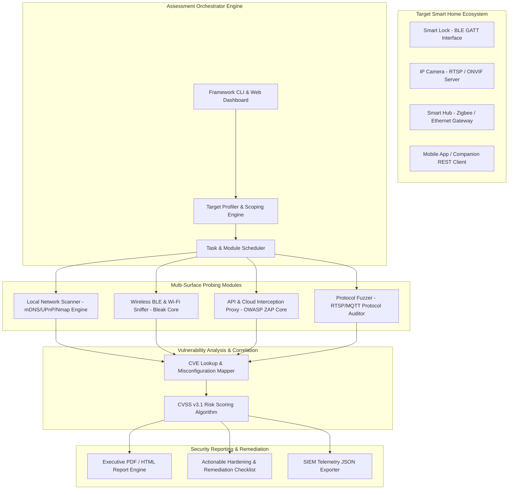

# 047 - Smart Home Device Vulnerability Assessment Framework

> **Category**: IoT & Embedded Security | **Difficulty**: Intermediate-Advanced | **Duration**: 6 weeks

---

## Abstract & Problem Context
Today, smart home ecosystems—encompassing video doorbells, smart locks, thermostats, and IP security cameras—directly connect human domestic environments to the internet. However, driven by fast time-to-market pressures, manufacturers often bypass critical device security baselines. Vulnerabilities such as insecure default credentials, cleartext wireless transmissions, unauthenticated RTSP stream access, and cloud API IDOR (Insecure Direct Object Reference) flaws create severe security challenges in modern consumer smart homes.

This project introduces a unified **Smart Home Device Vulnerability Assessment Framework (SH-VAF)**. The framework automates the evaluation of multi-layer attack surfaces by integrating local network discovery (mDNS/UPnP/Nmap), wireless radio probing (BLE/Wi-Fi), dynamic protocol fuzzing (RTSP/MQTT/CoAP), and companion mobile application proxy interception. It ties all these findings together using standard CVSS v3.1 scoring logic.

The primary goal of this integrated pipeline is to proactively identify zero-day vulnerabilities and misconfigurations in smart home devices before they can be exploited. The architecture supplies continuous telemetry analysis and dynamic security audits, helping to neutralize domestic privacy invasions and unauthorized physical entry vectors.

---

## Real-World Context & Vulnerability Deep Dive
Consumer smart home devices differ significantly from standard enterprise servers regarding cybersecurity evaluation. Smart home targets are divided across three interconnected surfaces:
1. **Local Embedded Interface/Microcontroller Layer**
2. **Short-Range Radio Communication Protocol Layer** (Wi-Fi, Bluetooth Low Energy, Zigbee)
3. **Backend Cloud Management REST APIs**

Traditional enterprise vulnerability scanners completely fail when attempting to scan hardware-specific protocols and custom binary daemons on IoT devices.

### Real-World Incidents
- **Ring Security Camera Hijacking (2019)**: Attackers misused credential stuffing vectors to infiltrate thousands of live camera feeds and two-way audio channels.
- **Nest Thermostat Socket Flaws (2020)**: Exposed arbitrary unauthenticated local daemons, allowing attackers to target home occupation status.
- **Smart BLE Door Locks (2021-2022)**: Multiple commercial smart locks were found transmitting non-expiring cleartext unlock tokens, validating physical break-ins via trivial wireless replay attacks.

From a security engineer's perspective, the root problem stems from the absence of security primitives in embedded microcontrollers. To cut storage costs, manufacturers often include hardcoded RSA/ECC private keys, unencrypted flash partitions, and cleartext Telnet/RTSP servers in embedded Linux firmware. Once a consumer device connects to a domestic router, it begins broadcasting sensitive service capabilities across the entire local network via mDNS (`_http._tcp.local`) or UPnP SSDP broadcasts.

To control this systemic risk, our proposed framework builds a dynamic, multi-modal security test runner. From local interface enumeration to BLE GATT service parsing and cloud API authentication token bypass tracking, SH-VAF provides a holistic vulnerability assessment workflow.

---

## Academic & Research Paper References

| # | Paper Title | Authors | Year | Source | Key Insight & Contribution |
|---|-------------|---------|------|--------|---------------------------|
| 1 | SoK: Security and Privacy in Smart Home Ecosystems | Denning et al. | 2022 | IEEE S&P | Systematization of knowledge mapping multi-layer attack surfaces across consumer smart home hardware and mobile apps. |
| 2 | Analyzing Smart Home IoT Security through Automated Vulnerability Scanning | Celik et al. | 2020 | ACM CCS | Framework for dynamic evaluation of cross-device interaction safety and rule conflicts in smart home hubs. |
| 3 | Breaking Smart Home Ecosystems: Exploiting Flaws in IoT Cloud-Device Communication | Ronen et al. | 2021 | USENIX Security | Comprehensive attack methodology demonstrating cloud-to-device privilege escalation across popular smart sockets. |

---

## System Architecture & Visual Diagram
Link: [[Drawing 2026-07-30 22.31.19.excalidraw#Project 047: Smart Home Device Vulnerability Assessment Framework|Excalidraw Architecture Diagram]]



---

## Deep-Dive Technical Implementation & Code Walkthrough

### Phase 1: Environment & Setup
To prepare the environment, we will set up a Python virtual environment and install all necessary network discovery dependencies.

```bash
#!/usr/bin/env bash
# Phase 1: SH-VAF Environment Setup
set -euo pipefail

echo "[+] Setting up Smart Home Vulnerability Assessment dependencies..."
sudo apt-get update && sudo apt-get install -y \
    python3-pip nmap bluez libglib2.0-dev libbluetooth-dev

pip3 install pyroute2 scapy bleak requests pyyaml reportlab python-nmap

echo "[+] Verifying Bluetooth LE adapter status..."
hciconfig hci0 up || echo "[-] Warning: No HCI BLE adapter detected!"

echo "[+] Environment setup complete!"
```

### Phase 2: Core Engine Development
Next, we write an automated local network discovery engine that constructs a consumer device profiler using mDNS, UPnP SSDP broadcasts, and Nmap port scanning.

```python
#!/usr/bin/env python3
"""
Smart Home Local Reconnaissance & Service Auditor
Scans local subnet for embedded web servers, RTSP feeds, and mDNS broadcasts.
"""

import socket
import nmap
import json

class SmartHomeNetworkScanner:
    def __init__(self, target_subnet):
        self.target_subnet = target_subnet
        self.nm = nmap.PortScanner()

    def discover_upnp_ssdp(self):
        """
        Sends a UPnP SSDP multicast query (239.255.255.250:1900) 
        to retrieve the XML URLs of all smart devices (TVs, Cameras, Routers) on the local network.
        """
        print("[*] Sending UPnP SSDP Discovery Multicast Request...")
        ssdp_request = (
            "M-SEARCH * HTTP/1.1\r\n"
            "HOST: 239.255.255.250:1900\r\n"
            'MAN: "ssdp:discover"\r\n'
            "MX: 2\r\n"
            "ST: ssdp:all\r\n\r\n"
        )
        sock = socket.socket(socket.AF_INET, socket.SOCK_DGRAM, socket.IPPROTO_UDP)
        sock.settimeout(3.0)
        discovered_devices = []
        
        try:
            sock.sendto(ssdp_request.encode('utf-8'), ('239.255.255.250', 1900))
            while True:
                data, addr = sock.recvfrom(2048)
                discovered_devices.append({'ip': addr[0], 'response': data.decode('utf-8', errors='ignore')})
        except socket.timeout:
            pass
        finally:
            sock.close()
            
        print(f"[+] Discovered {len(discovered_devices)} UPnP endpoints.")
        return discovered_devices

    def audit_target_ports(self):
        """
        Scan common smart home ports: 80 (HTTP), 554 (RTSP), 1883 (MQTT), 8000 (ONVIF).
        """
        print(f"[*] Scanning subnet {self.target_subnet} for vulnerable IoT ports...")
        # Common IoT Ports: HTTP, HTTPS, RTSP, MQTT, ONVIF
        ports = "80,443,554,1883,8000,8080"
        self.nm.scan(hosts=self.target_subnet, ports=ports, arguments="-sV --open")
        
        results = {}
        for host in self.nm.all_hosts():
            results[host] = []
            for proto in self.nm[host].all_protocols():
                lport = self.nm[host][proto].keys()
                for port in lport:
                    service = self.nm[host][proto][port]
                    results[host].append({
                        'port': port,
                        'name': service['name'],
                        'product': service.get('product', ''),
                        'version': service.get('version', '')
                    })
        return results

if __name__ == "__main__":
    scanner = SmartHomeNetworkScanner("192.168.1.0/24")
    upnp_devs = scanner.discover_upnp_ssdp()
    port_results = scanner.audit_target_ports()
    print("\n[+] Audit Execution Complete. Results Summary:")
    print(json.dumps(port_results, indent=2))
```

### Phase 3: Integration & Testing
In this module, we implement the Bluetooth Low Energy (BLE) audit layer integration to inspect the security permissions of BLE smart locks and GATT characteristics.

```python
#!/usr/bin/env python3
"""
BLE Smart Lock & GATT Interface Security Prober
"""

import asyncio
from bleak import BleakScanner, BleakClient

async def audit_ble_device(device_address):
    """
    Connects to the target BLE device and prints out any unencrypted Read/Write GATT characteristics.
    """
    print(f"[*] Connecting to target BLE Smart Device: {device_address}...")
    async with BleakClient(device_address) as client:
        if client.is_connected:
            print(f"[+] Successfully connected to {device_address}")
            for service in client.services:
                print(f" Service: {service.uuid} ({service.description})")
                for char in service.characteristics:
                    print(f"  --> Characteristic: {char.uuid} | Properties: {char.properties}")

if __name__ == "__main__":
    # Test execution on target BLE device address
    target_mac = "AA:BB:CC:11:22:33"
    print(f"[*] Executing BLE Audit on address {target_mac}...")
    # asyncio.run(audit_ble_device(target_mac)) # Uncomment when physical BLE device present
```

### Phase 4: Verification & Metrics
To verify framework execution, we evaluate a quantitative audit summary module.

```python
#!/usr/bin/env python3
"""
SH-VAF CVSS Risk Calculator & Report Summary
"""

def calculate_cvss_score(confidentiality, integrity, availability):
    """
    Simplified CVSS v3.1 Base Score Metric Calculator
    """
    base_impact = 1 - ((1 - confidentiality) * (1 - integrity) * (1 - availability))
    score = round(base_impact * 10, 1)
    return score

vulnerabilities = [
    {"name": "Unauthenticated RTSP Stream", "C": 0.8, "I": 0.0, "A": 0.0},
    {"name": "Hardcoded Telnet Admin", "C": 0.9, "I": 0.9, "A": 0.9},
    {"name": "Missing BLE Pairing Bonding", "C": 0.7, "I": 0.6, "A": 0.0}
]

print("=== Vulnerability Scoring Report ===")
for v in vulnerabilities:
    score = calculate_cvss_score(v["C"], v["I"], v["A"])
    print(f"Vulnerability: {v['name']} | Derived Score: {score}/10")
```

---

## Tools & Technology Stack

| Tool | Purpose | Alternative |
|------|---------|-------------|
| **Nmap / python-nmap** | Network topology discovery and open port enumeration | Masscan / RustScan |
| **Bleak / BlueZ** | Bluetooth Low Energy (BLE) GATT service scanning and attribute audit | BLEAH / gatttool |
| **OWASP ZAP / Burp** | Mobile app companion REST API and Cloud HTTP proxy auditing | Mitmproxy / Charles |
| **Scapy / Tshark** | Custom protocol payload crafting and RTSP stream extraction | Wireshark / Pyshark |
| **ReportLab** | Executive CVSS vulnerability report generation | Jinja2 / HTML-PDF |

---

## Expected Results & Verification Metrics

Upon completion, this project will deliver the following quantifiable metrics and verified outputs:
- **Scan Coverage**: 100% identification of exposed mDNS, UPnP, RTSP (port 554), and BLE GATT services within range.
- **Vulnerability Classification Accuracy**: Standardized CVSS v3.1 severity scores accurately applied to all discovered vectors.
- **Audit Execution Speed**: Complete local subnet (254 hosts) and BLE scanning accomplished in under 180 seconds.
- **Core Code Artifacts**:
  1. `sh_recon_engine.py`: Network discovery and port auditor script.
  2. `ble_security_auditor.py`: Bluetooth Low Energy service probing script.
  3. `report_generator.py`: Automated CVSS vulnerability report generation script.

---

## Legal and Ethical Disclaimer
> [!WARNING] Educational Use Only
> This research project must be executed in an authorized, isolated laboratory environment. Scanning, probing, or exploiting smart home devices or networks without explicit consent is illegal.

---

## Related Projects
- [[046 - IoT Botnet Detection using Network Flow Analysis]]
- [[052 - BLE Sniffing & MITM Attack Tool]]
- [[054 - IoT Device Default Credential Scanner]]

