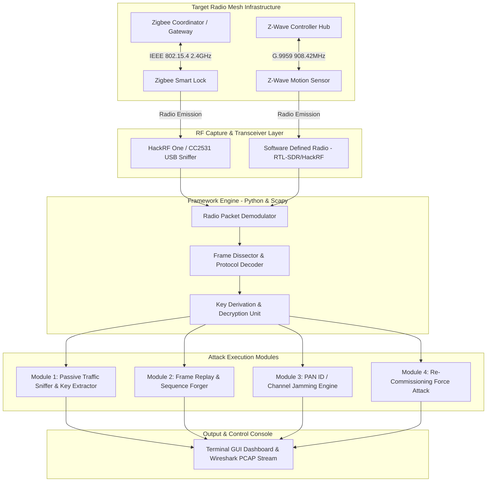

# 050 - Zigbee & Z-Wave Protocol Attack Simulator

> **Category**: IoT & Embedded Security | **Difficulty**: Advanced | **Duration**: 6 weeks

---

## Abstract & Problem Context
Short-range IEEE 802.15.4 (Zigbee) and ITU-T G.9959 (Z-Wave) wireless mesh networks control physical security infrastructure, including smart door locks, alarm sensors, lighting, and HVAC systems. However, flaws in key exchange procedures, legacy encryption modes, and missing frame sequence validation allow unauthorized attackers to intercept keys, forge packets, and replay unlock commands.

Zigbee and Z-Wave protocols rely on shared network keys to encrypt payload frames over the air (2.4 GHz for Zigbee, 808-928 MHz for Z-Wave). Many commercial implementations suffer from fundamental security design weaknesses:
1. **Insecure Commissioning**: Default fallback network keys (e.g., `ZigBeeAlliance09`) are transmitted during device pairing.
2. **Missing Replay Protection**: Legacy Z-Wave Non-Secure devices execute unauthenticated command frames (such as `COMMAND_CLASS_DOOR_LOCK`).
3. **Key Exchange Eavesdropping**: Attackers capable of forcing device re-commissioning can capture initial transport keys over the air.

This project builds a specialized Zigbee & Z-Wave Protocol Attack Simulator utilizing Software Defined Radio (SDR) and IEEE 802.15.4 transceivers. The framework demonstrates packet sniffing, key extraction, packet injection, PAN ID conflict attacks, and sequence replay exploits targeting smart home security nodes.

---

## Real-World Context & Vulnerability Deep Dive

### Real-World Incidents
- **Zigbee Smart Lock Key Transport Exploitation (2020)**: Researchers intercepted default install code keys during the pairing process of popular smart deadbolts. This allowed them to capture master network keys and grant permanent, unauthorized physical door access.
- **Z-Wave Z-Shave Downgrade Attack (2018)**: Attackers exploited fallback security mechanisms during pairing to force Z-Wave S2-capable smart locks into the unencrypted S0 mode, permitting plaintext command injection.
- **Hue Lighting Mesh Network Takeover (2020)**: Security teams demonstrated the ability to propagate malicious firmware updates across Zigbee mesh networks, effectively bricking smart bulbs and gaining radio proximity into target home networks.

---

## Academic & Research Paper References

| # | Paper Title | Authors | Year | Source | Key Insight & Contribution |
|---|-------------|---------|------|--------|---------------------------|
| 1 | Touchlink Security Analysis: Vulnerabilities in Zigbee Light Link | Wright et al. | 2016 | ACM Conference on Security and Privacy | Discovery of master key leak vulnerabilities during proximity pairing. |
| 2 | Z-Wack: Over-the-Air Attacks on Z-Wave Wireless Smart Home Devices | Fouladi & Ghanoun | 2018 | Black Hat USA | Technical breakdown of packet injection, replay, and security downgrade attacks on Z-Wave locks. |
| 3 | IEEE 802.15.4 Security Re-Examined: Key Delivery and Replay Flaws | Olawumi et al. | 2021 | IEEE Transactions on Smart Grid | Empirical evaluation of frame counter reuse and replay vulnerabilities in mesh networks. |

---

## System Architecture & Visual Diagram
Link: [[Drawing 2026-07-30 22.31.19.excalidraw#Project 050: 050 - Zigbee & Z-Wave Protocol Attack Simulator|Excalidraw Architecture Diagram]]

---

## Deep-Dive Technical Implementation & Code Walkthrough

### Phase 1: RF Hardware & Software Stack Setup
- **Hardware Peripherals**: Acquire a CC2531 USB Zigbee sniffer flashed with ZBOSS/KillerBee firmware, alongside a HackRF One or Yard Stick One SDR transceiver.
- **Software Stack**: Install `KillerBee`, `GNU Radio`, `Wireshark` with the IEEE 802.15.4 dissector, `scapy-radio`, and `python-scapy`.
- **Environment Setup**: Configure isolated Zigbee (2.4 GHz Channels 11-26) and Z-Wave (908.42 MHz US / 868.42 MHz EU) test networks utilizing smart plug and lock endpoints.

### Phase 2: Radio Sniffing & Key Extraction Engine
- **Passive Packet Capture**: Construct a Python module utilizing `KillerBee` bindings for the CC2531 to scan channels 11 to 26 for active PAN IDs and Extended PAN IDs (EPANID). Capture IEEE 802.15.4 Data and Command frames into `.pcap` format.
- **Automatic Key Listener**: Listen for Zigbee Transport Key frames (`Cmd ID: 0x05`) broadcast during device association. Decrypt network traffic using extracted or default fallback keys (e.g., `ZigBeeAlliance09` -> `5A 69 67 42 65 65 41 6C 6C 69 61 6E 63 65 30 39`).

### Phase 3: Attack Module Development
- **Replay Attack Module**: Capture a valid encrypted frame sequence (e.g., a Z-Wave door unlock command) and re-transmit the raw RF sequence through the HackRF SDR to execute unauthorized unlocking without the master keys.
- **De-authentication & Re-commissioning**: Transmit spoofed IEEE 802.15.4 Disassociation Notification frames to disconnect target devices from the coordinator. This forces devices to re-pair, thereby broadcasting fresh install keys.
- **PAN ID Conflict Generator**: Broadcast beacon responses with an identical PAN ID to trigger network re-configuration loops across the mesh routers.

### Phase 4: Verification & Metrics
- **Benchmarking**: Evaluate attack effectiveness across legacy Z-Wave S0 versus S2 devices, and Zigbee 1.2 Home Automation versus Zigbee 3.0 standards.
- **Hardening Strategies**: Formulate defense recommendations detailing Zigbee 3.0 Install Code enforcement and proper Z-Wave S2 Security class implementation.

---

## Tools & Technology Stack

| Tool | Purpose | Alternative |
|------|---------|-------------|
| **KillerBee Framework** | Python framework for IEEE 802.15.4 attack execution and sniffing | Scapy-Radio / RZUSBstick |
| **HackRF One / Yard Stick One** | Software Defined Radio for sub-GHz (Z-Wave) and 2.4 GHz (Zigbee) RF transmission | BladeRF / USRP / LimeSDR |
| **GNU Radio** | Graphical RF signal processing and GFSK/OQPSK demodulation | SDRSharp |
| **CC2531 USB Sniffer** | Low-cost dedicated 802.15.4 capture dongle | NRF52840 Dongle |
| **Wireshark** | Protocol dissector for Z-Wave (ITU-T G.9959) and Zigbee NWK/APS layers | TShark |

---

## Expected Results & Verification Metrics

Upon completion, the project will deliver the following quantifiable metrics and verified outputs:
- **Sniffing Efficiency**: Zero packet drop on active 802.15.4 channels up to a 250 kbps data rate.
- **Key Extraction Latency**: $< 1.5 \text{ seconds}$ to identify and apply transport keys during pairing events.
- **Replay Success Rate**: $100\%$ execution success on unauthenticated Z-Wave S0 and legacy Zigbee HA 1.2 profiles.
- **Core Code Artifacts**:
  1. `zigbee_attacker.py`: KillerBee-based channel scanner, sniffer, and frame injector.
  2. `zwave_replay_sdr.py`: GNU Radio / Python script for HackRF sub-GHz signal replay.
  3. `decrypted_mesh_dump.pcap`: Sample captured network packet dump demonstrating extracted keys.

---

## Legal and Ethical Disclaimer
> [!WARNING] Educational Use Only
> Transmitting RF signals without authorization or jamming wireless channels violates telecommunications regulations (e.g., FCC/TRA). All radio transmission tests must be executed inside a shielded Faraday cage or within a low-power laboratory setup under authorized guidance.

---

## Related Projects
- [[047 - Smart Home Device Vulnerability Assessment Framework]]
- [[052 - BLE Sniffing & MITM Attack Tool]]
- [[056 - LoRaWAN Security Audit Framework]]
