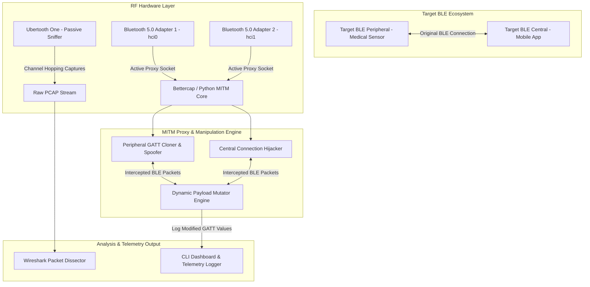

# 052 - BLE Sniffing & MITM Attack Tool

> **Category**: IoT & Embedded Security | **Difficulty**: Advanced | **Duration**: 6 weeks

---

## Abstract & Problem Context
Bluetooth Low Energy (BLE 4.x / 5.x) is the dominant short-range wireless standard used by wearable health monitors, insulin pumps, smart glucose meters, and door access tokens. Implementation flaws—such as "Just Works" pairing without authentication, missing link-layer encryption, and static MAC address tracking—expose sensitive health data to passive sniffing and allow active Man-In-The-Middle (MITM) manipulation of critical device settings.

Unlike classic Bluetooth, BLE relies on the Generic Access Profile (GAP) for device discovery and the Generic Attribute Profile (GATT) for data transfer, organized into Services and Characteristics. Many medical and IoT manufacturers skip pairing entirely or deploy legacy "Just Works" unauthenticated Diffie-Hellman key exchange, which is vulnerable to active interceptors.

An attacker positioned within radio range can passively sniff BLE advertisement and connection packets, or deploy a rogue dual-role proxy (spoofing both peripheral and central roles) to manipulate sensor readings (such as altering reported blood glucose concentrations) before relaying packets to mobile healthcare applications.

This project develops an advanced BLE Sniffing & Man-In-The-Middle (MITM) Attack Framework utilizing Ubertooth One hardware and Bettercap software. The tool demonstrates passive advertisement capturing, active GATT service cloning, credential interception, and dynamic packet manipulation on live BLE connection links.

---

## Real-World Context & Vulnerability Deep Dive

### Real-World Incidents
- **Insulin Pump BLE Command Injection (2019-2020)**: Security advisories revealed unauthenticated BLE control interfaces on commercial insulin pumps, allowing the unauthorized remote delivery of lethal insulin doses.
- **BLE Smart Glucose Meter Telemetry Spoofing (2021)**: Researchers demonstrated intercepting BLE traffic from wearable continuous glucose monitors, modifying blood sugar telemetry values in real-time during MITM proxying.
- **BLE Smart Lock Relay Attacks (2022)**: Commercial automotive and residential BLE keyless entry systems were compromised using low-latency BLE proxy relays, unlocking vehicles while owner keys were far away.

---

## Academic & Research Paper References

| # | Paper Title | Authors | Year | Source | Key Insight & Contribution |
|---|-------------|---------|------|--------|---------------------------|
| 1 | BLEDSA: Security Analysis of Bluetooth Low Energy Pairing Implementations | Wu et al. | 2020 | USENIX Security | Uncovering logic vulnerabilities and MITM flaws across commercial BLE protocol stacks. |
| 2 | Practical BLE Sniffing and MITM Attacks on IoT Health Devices | Sun et al. | 2021 | IEEE Transactions on Information Forensics and Security | Empirical demonstration of real-time payload modification in connected medical sensor streams. |
| 3 | BLUFFS: Bluetooth Forward and Future Secrecy Attacks | Antonioli et al. | 2023 | ACM CCS | Discovery of fundamental architectural flaws in Bluetooth key derivation allowing session key impersonation. |

---

## System Architecture & Visual Diagram
Link: [[Drawing 2026-07-30 22.31.19.excalidraw#Project 052: 052 - BLE Sniffing & MITM Attack Tool|Excalidraw Architecture Diagram]]

---

## Deep-Dive Technical Implementation & Code Walkthrough

### Phase 1: Hardware Setup & BLE Environment
- **Environment Preparation**: Setup a Linux testing host equipped with an Ubertooth One hardware sniffer and two CSR 4.0 / BLE 5.0 USB Bluetooth dongles (`hci0`, `hci1`).
- **Dependency Installation**: Install required tools: `ubertooth`, `kismet`, `bettercap`, `bluez`, `gatttool`, `python-bleak`, `scapy`.
- **Target Configuration**: Configure a test BLE peripheral target (e.g., an ESP32 running a GATT health thermometer service or a Nordic nRF52 dev board).

### Phase 2: Passive RF Sniffing & Channel Tracking
- **Passive Collection Pipeline**: Build a passive packet collection pipeline using `ubertooth-rx` and `ubertooth-btle`:
  - Sniff advertisement channels (37, 38, 39) to detect device MAC addresses and Advertising Data (AD) flags.
  - Follow connection requests (`CONNECT_REQ`) and track adaptive frequency hopping (37 data channels) using CRC initialization and Access Address parameters.
- **Wireshark Integration**: Pipe captured raw BLE Link Layer frames directly into Wireshark via named pipes (`/tmp/pipe`) for real-time packet dissection.

### Phase 3: Active GATT Enumeration & MITM Proxy
- **GATT Service Enumerator**:
  - Connect to the target peripheral using `gatttool` / `bleak` to clone all Primary Services, Characteristics, Descriptors, and UUIDs.
- **Rogue Peripheral & Central Proxy (Bettercap)**:
  - Adapter `hci0` advertises the cloned GATT profile to impersonate the target medical device to the mobile application.
  - Adapter `hci1` connects to the real physical medical device as a central client.
  - Transparently bridge connection packets while maintaining dual GATT sockets.

### Phase 4: Dynamic Payload Manipulation & Hardening
- **Payload Mutator Engine**:
  - Inspect incoming GATT Read/Write/Notification frames in Python.
  - Implement dynamic rule evaluation: e.g., if GATT Characteristic UUID == `0x2A37` (Heart Rate Measurement) or `0x2A18` (Glucose Measurement), modify byte values in-flight before forwarding.
- **Remediation Strategy**:
  - Formulate guidelines for implementing BLE Passkey / Out-Of-Band (OOB) pairing, AES-CCM link encryption, and application-layer payload signing.

---

## Tools & Technology Stack

| Tool | Purpose | Alternative |
|------|---------|-------------|
| **Ubertooth One** | Hardware 2.4 GHz wireless development platform for BLE sniffing | Nordic nRF52840 Dongle / Ellisys |
| **Bettercap** | Modular framework for BLE reconnaissance and active MITM proxying | BLESuite / GATTack |
| **BlueZ (hcitool / gatttool)**| Official Linux Bluetooth protocol stack | Bleak / Noble |
| **Wireshark** | Packet dissector analyzing BLE Link Layer and ATT/GATT protocols | TShark |
| **ESP32 / nRF52** | Hardware targets for building benign medical device emulators | Arduino BLE |

---

## Expected Results & Verification Metrics

Upon completion, this project will deliver the following quantifiable metrics and verified outputs:
- **Sniffing Hop Reliability**: $\ge 95\%$ packet capture rate on active BLE connection hopping.
- **GATT Cloning Speed**: Sub-10 seconds to discover and replicate the full GATT database.
- **MITM Relay Latency**: $< 20 \text{ ms}$ latency added during active packet modification.
- **Core Code Artifacts**:
  1. `ble_mitm_proxy.py`: Python script managing dual HCI sockets and payload mutations.
  2. `ubertooth_pcap_stream.sh`: Automation script piping raw RF frames into Wireshark.
  3. `cloned_gatt_profile.json`: Captured GATT structure database file.

---

## Learning Outcomes
1. **BLE Protocol Stack**: Deep understanding of GAP, GATT, ATT, SMP (Security Manager Protocol), and Link Layer packet structures.
2. **Radio Packet Tracking**: Tracking adaptive frequency hopping, access addresses, and connection parameters over the air.
3. **Active MITM Architectures**: Constructing dual-role wireless proxies for payload interception and alteration.
4. **Healthcare IoT Defense**: Hardening embedded health monitors against unauthenticated pairing and plain-text telemetry risks.

---

## Legal and Ethical Disclaimer
> [!WARNING] Legal & Ethical Notice
> Intercepting or modifying wireless health monitor communications poses direct physical risks. Never execute BLE MITM attacks against active medical hardware used by patients. Conduct all tests exclusively on isolated lab hardware.

---

## Related Projects
- [[047 - Smart Home Device Vulnerability Assessment Framework]]
- [[050 - Zigbee & Z-Wave Protocol Attack Simulator]]
- [[057 - Embedded Device Side-Channel Attack Demonstrator]]
