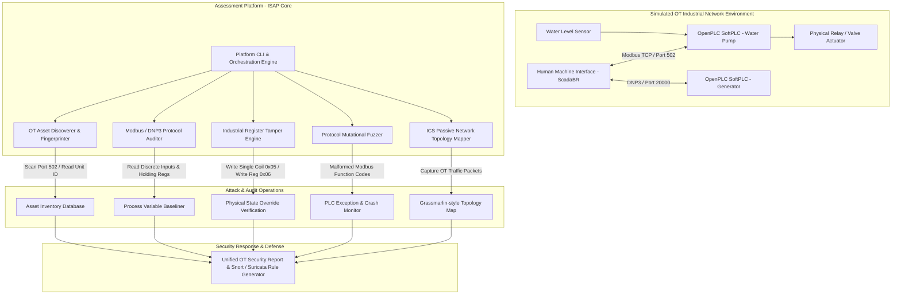

# 053 - Industrial SCADA-ICS Security Assessment Platform

> **Category**: IoT & Embedded Security | **Difficulty**: Advanced | **Duration**: 6 weeks

---

## Abstract & Problem Context
Industrial Control Systems (ICS) and Supervisory Control and Data Acquisition (SCADA) networks manage critical infrastructure, including power distribution grids, chemical processing plants, oil refineries, and water treatment facilities. Legacy industrial protocols (such as Modbus TCP, DNP3, and Ethernet/IP) were designed without modern security controls, fundamentally lacking authentication, message integrity checks, or encryption.

Operational Technology (OT) networks are increasingly converging with enterprise IT networks to enable remote telemetry and analytics. This convergence exposes Programmable Logic Controllers (PLCs), Remote Terminal Units (RTUs), and Human-Machine Interfaces (HMIs) to sophisticated cyber threats. Attackers exploiting unauthenticated industrial protocols can read sensitive process variables, force coil outputs, write arbitrary memory to PLC registers, and overwrite control firmware.

This project constructs a comprehensive Industrial SCADA-ICS Security Assessment Platform (ISAP). The platform features simulated PLCs (using OpenPLC), automated Modbus TCP/DNP3 scanner modules, industrial packet fuzzers, register tamper demonstrator engines, and an OT network topology visualizer.

---

## Real-World Context & Vulnerability Deep Dive

### Real-World Incidents
- **Stuxnet Attack on Iranian Nuclear Facilities (2010)**: A sophisticated worm targeted Siemens S7-300 PLCs, manipulating frequency drive controller speeds while simultaneously feeding benign telemetry back to HMIs, ultimately destroying uranium enrichment centrifuges physically.
- **Ukraine Power Grid Cyberattack (2015 - BlackEnergy / Industroyer)**: Attackers hijacked SCADA HMIs and sent unauthorized remote control commands over IEC 60870-5-104 and DNP3 protocols to open circuit breakers, disconnecting electricity for 230,000 residents.
- **Triton / Triscape Petrochemical Attack (2017)**: Targeted Triconex Safety Instrumented System (SIS) controllers at an industrial facility, attempting to reprogram safety logic and risking catastrophic physical failure.

---

## Academic & Research Paper References

| # | Paper Title | Authors | Year | Source | Key Insight & Contribution |
|---|-------------|---------|------|--------|---------------------------|
| 1 | SCADA System Security: Vulnerabilities, Attacks, and Countermeasures | Cherdantseva et al. | 2016 | Ad Hoc Networks | Systematized survey of physical and cyber threat models across OT energy and manufacturing domains. |
| 2 | Industroyer: Analysis of the Industrial Malware Targeting Power Grids | Cherepanov & Lipovsky | 2017 | ESET Research Report | In-depth reverse engineering of automated industrial protocol attack payloads (IEC 104, IEC 61850, DNP3). |
| 3 | Modbus-Fuzz: Protocol-Aware Fuzzing for Industrial Programmable Logic Controllers | Formby et al. | 2019 | IEEE Transactions on Control Systems Technology | Mutational fuzzing methodology revealing high-severity memory corruption bugs in PLC firmware daemons. |

---

## System Architecture & Visual Diagram
Link: [[Drawing 2026-07-30 22.31.19.excalidraw#Project 053: 053 - Industrial SCADA-ICS Security Assessment Platform|Excalidraw Architecture Diagram]]

---

## Deep-Dive Technical Implementation & Code Walkthrough

### Phase 1: Simulated SCADA/ICS Testbed Setup
- **Environment Provisioning**: Deploy Docker containers running the `OpenPLC` runtime (simulating Siemens/Allen-Bradley PLCs) and `ScadaBR` / `Grafana` (simulating HMI panels).
- **Protocol Configuration**: Configure virtual Modbus TCP slaves (port `502`) and DNP3 outstations (port `20000`) managing simulated industrial processes (e.g., liquid tank level control).
- **Dependency Installation**: Install necessary tools: `python-pymodbus`, `scapy`, `cpppo`, `wireshark`, `suricata`.

### Phase 2: Asset Discovery & Protocol Enumeration
- **Automated OT Discovery Module**:
  - Scan standard industrial ports (502 Modbus, 20000 DNP3, 44818 EtherNet/IP, 102 Siemens S7).
  - Query Modbus Function Code `43/14` (Read Device Identification) to extract vendor name, product code, and firmware revision version without disrupting PLC operations.
- **Topology Builder**: Build a passive traffic topology builder parsing PCAP streams to comprehensively map Master-Slave communication relationships.

### Phase 3: Protocol Auditing & Payload Injection Modules
- **Modbus Holding Register Auditor**:
  - Automatically query Function Code `03` (Read Holding Registers) and Function Code `01` (Read Coils) across all 65,535 register addresses.
  - Baseline normal sensor operating ranges.
- **Register Tampering & Actuator Override Engine**:
  - Implement targeted command injection utilizing Function Code `05` (Write Single Coil) and Function Code `16` (Write Multiple Registers).
  - Demonstrate overriding safety limits (e.g., setting emergency shutoff valve coil `0x0001` to `0x0000` or writing dangerous pressure setpoints).
- **Industrial Protocol Fuzzer**:
  - Generate invalid function codes, truncated length headers, and out-of-bounds register address offsets to check for PLC freeze or restart conditions.

### Phase 4: Intrusion Detection & Hardening Rules
- **IDS Rule Generation**: Develop custom `Suricata` / `Snort` IDS rule signatures to detect unauthorized Modbus write operations and abnormal function codes.
- **Hardening Guide**: Create an OT Security Hardening Guide covering industrial firewall zoning (Purdue Model), Modbus TCP security extensions (TLS encapsulation), and deep packet inspection configurations.

---

## Tools & Technology Stack

| Tool | Purpose | Alternative |
|------|---------|-------------|
| **OpenPLC Runtime** | Open-source Programmable Logic Controller emulator | Conpot / PyModbus Server |
| **PyModbus / Python-DNP3** | Python libraries for crafting industrial protocol packets | Modbus-cli / mbtget |
| **ScadaBR / Grafana** | Open-source Human Machine Interface (HMI) visualizer | Ignition / Wonderware |
| **Grassmarlin** | Passive OT network topology mapping tool | Malcolm / NetworkMiner |
| **Suricata / Snort** | Network Intrusion Detection System for ICS rule verification | Zeek |

---

## Expected Results & Verification Metrics

Upon completion, this project will deliver the following quantifiable metrics and verified outputs:
- **Asset Discovery Latency**: $< 3 \text{ seconds}$ per subnet scan without causing PLC CPU overloads.
- **Register Scanning Rate**: $1,000$ registers read per second over Modbus TCP.
- **Detection Signature Precision**: $100\%$ detection of unauthorized write commands via the generated Suricata rules.
- **Core Code Artifacts**:
  1. `isap_audit_suite.py`: Master Python security scanner CLI.
  2. `modbus_tamper_poc.py`: Register manipulation script for the OpenPLC testbed.
  3. `ot_ids_rules.rules`: Custom Suricata rules for Modbus write command detection.

---

## Learning Outcomes
1. **Industrial Automation Protocols**: Master Modbus TCP packet structures, function codes, coil/register memory architecture, and DNP3 object models.
2. **OT vs IT Security Paradigms**: Understanding safety-first constraints, zero-downtime operational requirements, and physical impact risks.
3. **Purdue Model Architecture**: Designing robust network segmentation between Enterprise IT (Levels 4-5) and Industrial Control (Levels 0-3).
4. **ICS Malware Mechanics**: Reverse engineering attack vectors utilized by historically significant malware like Stuxnet, Industroyer, and Triton.

---

## Legal and Ethical Disclaimer
> [!WARNING] Legal & Ethical Notice
> ICS/SCADA equipment directly controls physical machinery, electricity, and water systems. Never run port scanners, fuzzers, or payload injectors on live operational technology networks. All testing must strictly use isolated emulators or non-production testbenches.

---

## Related Projects
- [[048 - CAN Bus Intrusion Detection for Connected Vehicles]]
- [[049 - MQTT Protocol Security Testing Tool]]
- [[058 - OT Network Segmentation Validator]]
