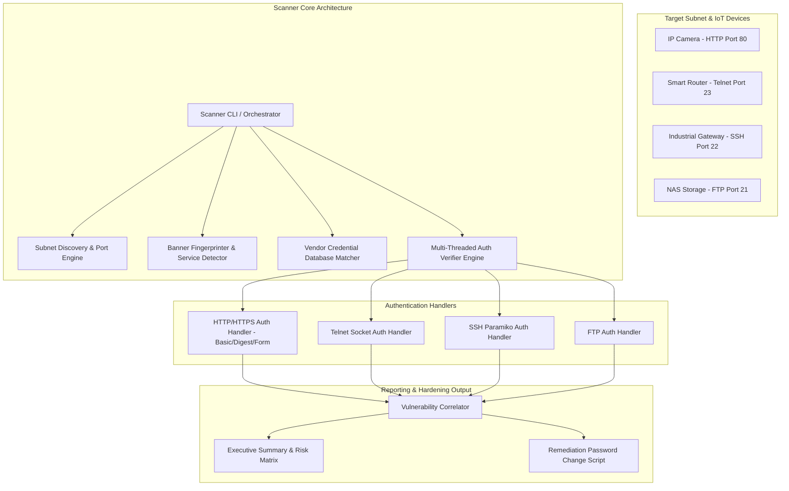

# 054 - IoT Device Default Credential Scanner

> **Category**: IoT & Embedded Security | **Difficulty**: Basic | **Duration**: 4 weeks

---

## Abstract & Problem Context
Millions of connected IoT devices—including IP security cameras, home routers, smart plugs, and industrial sensors—are shipped with universal factory default credentials (e.g., `admin:admin`, `root:vizstat`, `support:support`). Failure by consumers and administrators to change these defaults upon deployment enables automated Internet-wide scanning bots to compromise devices in bulk within minutes of exposure.

Public IoT search engines like Shodan, Censys, and FOFA index exposed Telnet (port 23), SSH (port 22), HTTP/HTTPS administrative interfaces (ports 80, 443, 8080), and FTP servers across IPv4 space. Botnets leverage static wordlists containing known vendor default credentials to execute high-speed login attempts, deploy lightweight ELF payloads, and enroll hijacked devices into DDoS networks.

Organizations require an automated, internal assessment tool to scan corporate and lab subnets, identify exposed IoT management interfaces, verify baseline compliance against vendor default password dictionaries, and generate remediation reports before devices are indexed by external threat actors.

This project implements an IoT Device Default Credential Scanner (IDCS). The tool automates port discovery, fingerprints embedded web and CLI service banners, matches services against a comprehensive database of vendor default credentials, performs non-destructive authentication verification, and outputs actionable remediation guides.

---

## Real-World Context & Vulnerability Deep Dive

### Real-World Incidents
- **Mirai Telnet Password Dictionary Exploitation (2016)**: Mirai propagated across the internet by continuously scanning port 23/2323 and attempting a hardcoded list of just 62 default username/password combinations (e.g., `root:xc3511`, `admin:1234`), compromising over 600,000 devices.
- **Hikvision Default Credential Camera Invasions (2021)**: Exposed security cameras across thousands of businesses were hijacked by attackers using factory admin credentials, streaming private office footage to public forums.
- **Enterprise Router Telnet Hijacking (2022)**: ISP-provided routers deployed across regional businesses were compromised via exposed WAN management ports running default `admin:password` combinations.

---

## Academic & Research Paper References

| # | Paper Title | Authors | Year | Source | Key Insight & Contribution |
|---|-------------|---------|------|--------|---------------------------|
| 1 | Internet-Wide Scans of IoT Devices: Measurement and Security Implications | Durumeric et al. | 2014 | USENIX Security | Landmark study evaluating global exposure of weak credentials on ports 22, 23, and 80. |
| 2 | Analyzing the Password Security of Embedded IoT Firmware | Sun et al. | 2020 | IEEE Transactions on Dependable and Secure Computing | Systematized extraction of 500+ default vendor credential pairs from unpacked Linux firmware images. |
| 3 | Automated Credential Auditing for Distributed IoT Networks | Alrawi et al. | 2021 | ACM SIGCOMM | Evaluation of rate-limiting evasion and lightweight credential verification algorithms on edge nodes. |

---

## System Architecture & Visual Diagram
Link: [[Drawing 2026-07-30 22.31.19.excalidraw#Project 054: 054 - IoT Device Default Credential Scanner|Excalidraw Architecture Diagram]]

---

## Deep-Dive Technical Implementation & Code Walkthrough

### Phase 1: Architecture & Wordlist Curation
- **Database Curation**: Compile a comprehensive IoT vendor default credential database (`iot_defaults.json`) containing over 500 verified pairs (mapping Vendor, Product Type, Protocol, Username, Password).
- **Testbed Setup**: Setup an isolated testbed running vulnerable IoT emulators (e.g., `DVIA`, `RouterSploit` mock daemons, Docker Telnet/SSH containers).
- **Dependency Installation**: Setup Python dependencies: `paramiko`, `requests`, `telnetlib3`, `scapy`, `nmap-python`, `concurrent.futures`.

### Phase 2: High-Speed Port Scanning & Service Fingerprinting
- **Asynchronous Scanner Module**: Implement an asynchronous subnet scanner module:
  - Scan target IP ranges for common IoT management ports (21 FTP, 22 SSH, 23 Telnet, 80/443 HTTP, 8080/8443 Web).
  - Capture banner headers (e.g., `Server: BusyBox 1.31.1`, `SSH-2.0-Dropbear_2020.81`) to fingerprint specific embedded OS vendors.

### Phase 3: Multi-Protocol Auth Verification Engine
- **Authentication Handlers**: Build modular authentication verification handlers:
  - **Telnet Handler**: Handle raw socket negotiation, dynamically detect login/password prompts, and test matched vendor defaults.
  - **SSH Handler**: Utilize `Paramiko` with key exchange timeouts to safely test SSH credentials without triggering account lockouts.
  - **HTTP/HTTPS Handler**: Parse HTML form fields, detect HTTP Basic/Digest authentication headers, and accurately submit credentials.
- **Resource Management**: Implement adaptive rate-limiting and thread concurrency controls to avoid overloading small embedded CPUs.

### Phase 4: Reporting & Automated Remediation
- **Audit Reporting**: Generate interactive HTML/JSON reports displaying compromised host IPs, MAC addresses, fingerprinted vendor models, and cracked default credentials.
- **Remediation Scripting**: Develop an automated remediation helper script (`password_rotator.py`) capable of logging into identified vulnerable Telnet/SSH devices and automatically executing password change commands (`passwd`).

---

## Tools & Technology Stack

| Tool | Purpose | Alternative |
|------|---------|-------------|
| **Python Paramiko / Telnetlib** | Protocol-specific network login verification | THC-Hydra / Medusa |
| **Nmap / Python-Nmap** | Service discovery and banner grabbing | Masscan / ZMap |
| **Shodan API** | OSINT lookup of external host exposure | Censys / BinaryEdge |
| **BusyBox / Docker** | Lightweight containerized environment for creating vulnerable targets | QEMU Emulators |
| **Jinja2** | Template engine for HTML vulnerability report rendering | ReportLab |

---

## Expected Results & Verification Metrics

Upon completion, this project will deliver the following quantifiable metrics and verified outputs:
- **Subnet Scanning Speed**: Full Class C network (/24 subnet, 254 hosts) port scan completed in under 15 seconds.
- **Verification Accuracy**: $100\%$ accuracy on standard BusyBox, Dropbear, and Apache embedded web targets.
- **Resource Footprint**: Memory usage strictly under 50 MB during active multithreaded scanning.
- **Core Code Artifacts**:
  1. `idcs_scanner.py`: Core CLI application.
  2. `iot_defaults.json`: Structured database of 500+ IoT default credentials.
  3. `remediation_report.html`: Exported HTML audit report.

---

## Learning Outcomes
1. **Network Authentication Protocols**: Deep understanding of SSH handshake mechanics, Telnet prompt parsing, and HTTP auth headers.
2. **Asynchronous Network Programming**: Master multi-threading and non-blocking I/O in Python using `concurrent.futures`.
3. **Service Banner Fingerprinting**: Extracting vendor signatures from HTTP header fields and SSH version strings.
4. **IoT Hardening Standards**: Implementing NIST SP 800-213 guidelines for IoT device cybersecurity baselines.

---

## Legal and Ethical Disclaimer
> [!WARNING] Legal & Ethical Notice
> Unauthorized credential testing against external IP addresses constitutes unauthorized access under anti-hacking laws (CFAA/Computer Misuse Act). Conduct audits exclusively on internal subnets with explicit administrative approval.

---

## Related Projects
- [[046 - IoT Botnet Detection using Network Flow Analysis]]
- [[047 - Smart Home Device Vulnerability Assessment Framework]]
- [[051 - IoT Firmware Extraction & Analysis Pipeline]]
