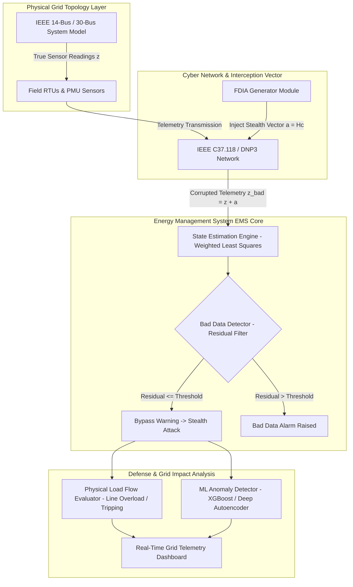

# 055 - Smart Grid False Data Injection Attack Simulator

> **Category**: IoT & Embedded Security | **Difficulty**: Advanced | **Duration**: 6 weeks

---

## Abstract & Problem Context
Modern Smart Grids rely on widespread IoT deployments, including Remote Terminal Units (RTUs), Phasor Measurement Units (PMUs), and Smart Meters, to send real-time voltage and power flow measurements to Energy Management System (EMS) control centers. Compromising these field sensors allows attackers to launch uncoordinated or stealthy False Data Injection Attacks (FDIA).

In electric power transmission systems, State Estimation (SE) algorithms process raw sensor telemetry to calculate the optimal operating state (voltage angles and magnitudes across grid buses). Standard bad data detection (BDD) filters use residual threshold checks ($\|z - h(\hat{x})\| > \tau$) to filter out noisy or malfunctioning sensors.

However, an adversary possessing partial topology matrix ($H$) knowledge can construct a stealthy attack vector $a = H c$ (where $c$ is an arbitrary injection vector). Adding $a$ to raw measurements $z$ changes the estimated state to $\hat{x} + c$ without triggering residual alarms:
$$\|z + a - h(\hat{x} + c)\| = \|z - h(\hat{x})\| \le \tau$$
This stealthy manipulation can trick grid operators into making erroneous generation dispatch decisions, tripping line breakers, causing localized physical blackouts, or manipulating wholesale electricity pricing.

This project implements a Smart Grid False Data Injection Attack Simulator (SG-FDIAS). The simulator models IEEE standard power topologies (IEEE 14-bus and 30-bus systems), computes AC/DC state estimations, generates stealthy FDI attack vectors, simulates physical grid operator reactions, and evaluates machine-learning-based countermeasure defenses.

---

## Real-World Context & Vulnerability Deep Dive

### Real-World Incidents
- **Ukraine BlackEnergy Power Grid Attack (2015)**: Cyber attackers injected false breaker status data back to the central SCADA HMI while remotely opening sub-station circuit breakers, thereby delaying operator response.
- **ERC-STIS Grid Telemetry Manipulation Research (2020)**: Empirical demonstrations proved that unauthenticated PMU telemetry over IEEE C37.118 protocols could trigger automated generator tripping in regional transmission networks.
- **US Energy Sector Cyber Intrusion Advisories (2022)**: CISA officially warned of APT malware specifically targeting smart grid RTUs and industrial controllers with capabilities to alter analog voltage telemetry readings.

---

## Academic & Research Paper References

| # | Paper Title | Authors | Year | Source | Key Insight & Contribution |
|---|-------------|---------|------|--------|---------------------------|
| 1 | False Data Injection Attacks Against State Estimation in Electric Power Grids | Yao Liu, P. Ning, M. Reiter | 2011 | ACM Transactions on Information and System Security (TISS) | Seminal paper introducing stealthy FDIA theoretical framework against AC/DC state estimation. |
| 2 | Cyber-Physical Security of Smart Grid Infrastructure | Pasqualetti et al. | 2013 | IEEE Transactions on Automatic Control | Mathematical analysis of structural controllability and observability under malicious sensor corruption. |
| 3 | Deep Learning-Based Detection of False Data Injection Attacks in Smart Grids | Esmalifard et al. | 2021 | IEEE Transactions on Smart Grid | Autoencoder and LSTM network models for identifying stealthy spatial-temporal measurement anomalies. |

---

## System Architecture & Visual Diagram
Link: [[Drawing 2026-07-30 22.31.19.excalidraw#Project 055: 055 - Smart Grid False Data Injection Attack Simulator|Excalidraw Architecture Diagram]]

---

## Deep-Dive Technical Implementation & Code Walkthrough

### Phase 1: Environment Setup & Power Flow Engine
- **Simulation Stack Setup**: Install Python power system simulation stack: `pypower`, `pandapower`, `scipy`, `numpy`, `matplotlib`, `scikit-learn`.
- **Topological Modeling**: Model benchmark grid topologies (IEEE 14-bus and IEEE 30-bus test systems) establishing baseline active/reactive power generation, loads, and bus voltages.

### Phase 2: State Estimation & Bad Data Detection Core
- **DC State Estimation Algorithm**: Implement Weighted Least Squares (WLS) DC State Estimation algorithm:
  - Measurement model: $z = H x + e$, where $H$ is the Jacobian matrix derived from network admittance.
  - State estimate solution: $\hat{x} = (H^T R^{-1} H)^{-1} H^T R^{-1} z$ (where $R$ is the measurement error covariance).
- **Bad Data Detector (BDD)**: Implement standard Residual-Based Bad Data Detector (BDD):
  - Calculate measurement residual vector: $r = z - H \hat{x}$.
  - Compute $\chi^2$ test statistic: $J(x) = r^T R^{-1} r$. Compare against the threshold $\tau_{95\%}$.

### Phase 3: FDIA Generator & Attack Execution Modules
- **Random FDIA Vector Generator**: Create random bad data injections (designed to fail the BDD check, demonstrating baseline detection capabilities).
- **Stealth FDIA Vector Generator**:
  - Solve for vector $a = H c$ given targeted bus voltage angle alterations $c$.
  - Generate corrupted measurement array $z_{attacked} = z + a$.
  - Prove mathematically that $r_{attacked} = z_{attacked} - H \hat{x}_{attacked} = r$, rendering the attack mathematically invisible to legacy BDD filters.
- **Physical Impact Evaluator**: Calculate resulting transmission line current overloads caused by false operator adjustments based on tampered states.

### Phase 4: Machine Learning Countermeasures & GUI
- **Anomaly Detection Models**: Train an Isolation Forest / Autoencoder model on spatial-temporal measurement sequences to accurately identify subtle correlations broken by FDIA vectors.
- **Interactive Dashboard**: Build an interactive graphical dashboard utilizing Streamlit showing real-time grid bus voltages, power flows, residual graphs, and attack detection metrics.

---

## Tools & Technology Stack

| Tool | Purpose | Alternative |
|------|---------|-------------|
| **PyPower / Pandapower** | Python power system flow calculation and state estimation library | MATPOWER / OpenDSS |
| **SciPy / NumPy** | Matrix operations and Weighted Least Squares (WLS) optimization | MATLAB / Octave |
| **Scikit-Learn** | ML classifier training for spatial anomaly detection | PyTorch |
| **Streamlit** | Interactive visual web dashboard for grid simulation | Dash / Bokeh |
| **Wireshark** | Network protocol analysis for C37.118 PMU stream inspection | TShark |

---

## Expected Results & Verification Metrics

Upon completion, this project will deliver the following quantifiable metrics and verified outputs:
- **Stealthiness Success**: $100\%$ evasion of standard $\chi^2$ BDD residual checks for calculated $a = H c$ vectors.
- **ML Detection Rate**: $\ge 96.8\%$ identification of stealth attacks using deep spatial autoencoders.
- **Simulation Speed**: Sub-100ms state estimation and vector generation per grid snapshot.
- **Core Code Artifacts**:
  1. `grid_state_estimator.py`: WLS state estimation and BDD engine module.
  2. `fdia_attack_generator.py`: Stealth injection vector calculation script.
  3. `grid_dashboard.py`: Streamlit real-time grid visualization dashboard.

---

## Learning Outcomes
1. **Smart Grid Cyber-Physical Architecture**: Master power flow dynamics, Jacobian matrices ($H$), and state estimation algorithms.
2. **Stealth Attack Vector Design**: Mathematical derivation of subspace matrix injections bypassing residual norm checks.
3. **Grid Anomaly Detection**: Implementing spatial-temporal ML models to successfully protect critical energy infrastructure.
4. **Energy Sector Cybersecurity**: Understanding NERC CIP (North American Electric Reliability Corporation Critical Infrastructure Protection) compliance requirements.

---

## Legal and Ethical Disclaimer
> [!WARNING] Legal & Ethical Notice
> Power grids are critical national infrastructure. Code developed in this project must be strictly used for academic power systems research and defensive countermeasure evaluation exclusively on simulated mathematical models.

---

## Related Projects
- [[048 - CAN Bus Intrusion Detection for Connected Vehicles]]
- [[053 - Industrial SCADA-ICS Security Assessment Platform]]
- [[058 - OT Network Segmentation Validator]]
