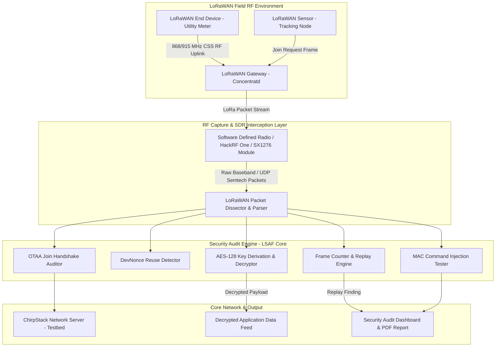

# 056 - LoRaWAN Security Audit Framework

> **Category**: IoT & Embedded Security | **Difficulty**: Advanced | **Duration**: 5 weeks

---

## Abstract & Problem Context
Long Range Wide Area Network (LoRaWAN 1.0.x / 1.1) is the dominant wireless protocol powering long-range IoT applications across smart agriculture, utility metering, asset tracking, and smart city sensors. Cryptographic key management flaws—such as hardcoded Application Keys (`AppKey`), static DevNonce reuse, and insecure Over-The-Air Activation (OTAA) handshakes—allow regional radio attackers to compromise session keys, forge uplinks, and inject malicious telemetry into cloud servers.

LoRaWAN networks span up to 15 kilometers using sub-GHz chirp spread spectrum (CSS) radio modulation. Security fundamentally relies on two distinct AES-128 cryptographic keys: `NwkSKey` (Network Session Key for frame integrity) and `AppSKey` (Application Session Key for payload encryption).

In legacy LoRaWAN 1.0.x deployments, both session keys are derived directly from a single master `AppKey` during the OTAA Join Request / Join Accept exchange. If an attacker captures the initial join handshake or extracts the static `AppKey` from un-hardened node flash memory, they gain the complete capability to decrypt all historical and future traffic, craft spoofed sensor readings, or initiate JoinNonce replay attacks to disconnect active sensors.

This project implements an automated LoRaWAN Security Audit Framework (LSAF). The framework comprehensively integrates SDR radio sniffing, frame parsing, MAC command auditing, key derivation validation, and join request replay testing explicitly for enterprise LoRaWAN deployments.

---

## Real-World Context & Vulnerability Deep Dive

### Real-World Incidents
- **Smart City Water Meter Key Compromise (2020)**: Security audits of municipal LoRaWAN smart water meters revealed identical default `AppKey` values hardcoded across 20,000 active meters, allowing for full network traffic decryption.
- **LoRaWAN Replay & ACK Injection Vulnerability (2021)**: Researchers demonstrated replaying captured uplink frames on LoRaWAN 1.0.2 networks due to missing frame counter checks on Join Accept frames, resulting in a widespread denial-of-service for utility monitoring.
- **Agricultural LoRa Gateway Impersonation (2022)**: Rogue gateway injection attacks actively intercepted and dropped sensor telemetry from remote agricultural soil monitors, triggering automated crop irrigation failures.

---

## Academic & Research Paper References

| # | Paper Title | Authors | Year | Source | Key Insight & Contribution |
|---|-------------|---------|------|--------|---------------------------|
| 1 | Security of LoRaWAN v1.1 in Backward Compatible Deployments | Aras et al. | 2018 | ACM Conference on Security and Privacy in Wireless and Mobile Networks | Comprehensive security evaluation of OTAA activation flaws and nonce replay risks. |
| 2 | Systematic Key Reuse Analysis in LoRaWAN Ecosystems | Eldefrawy et al. | 2020 | IEEE Transactions on Information Forensics and Security | Empirical study discovering widespread static AppKey reuse in commercial LPWAN deployments. |
| 3 | Practical Bit-Flipping and Replay Attacks on LoRaWAN | Noura et al. | 2021 | IEEE Internet of Things Journal | Demonstration of payload tampering and MAC command injection vulnerabilities in LoRaWAN 1.0.3. |

---

## System Architecture & Visual Diagram
Link: [[Drawing 2026-07-30 22.31.19.excalidraw#Project 056: 056 - LoRaWAN Security Audit Framework|Excalidraw Architecture Diagram]]

---

## Deep-Dive Technical Implementation & Code Walkthrough

### Phase 1: Testbed Setup & RF Infrastructure
- **Network Server Provisioning**: Deploy an isolated LoRaWAN network using the `ChirpStack` open-source Network Server running on Docker.
- **Hardware Configuration**: Setup hardware endpoints: an ESP32 with an SX1276 LoRa transceiver module (End Device) and a Dragino / RAK Wireless LoRaWAN Gateway.
- **Software Stack Setup**: Install the necessary software stack: `pyLoraWAN`, `scapy`, `GNU Radio`, `wireshark` with the LoRaWAN plugin, `hackrf`.

### Phase 2: Frame Dissection & Key Derivation Parser
- **Frame Parser Development**: Build a Python LoRaWAN frame parser decoding physical layer MHDR (MAC Header), DevAddr, FCtrl, FCnt, FPort, and MIC (Message Integrity Code):
  - **Join Request Frame Parsing**: Extract $AppEUI$, $DevEUI$, and $DevNonce$.
  - **Join Accept Frame Parsing**: Extract $AppNonce$, $NetID$, $DevAddr$, $DLSettings$, and $RxDelay$.
- **Session Key Derivation Engine**: Implement AES-128 Session Key Derivation matching the standard LoRaWAN 1.0.x specification:
  $$NwkSKey = \text{AES-128}_{AppKey}(0x01 \parallel AppNonce \parallel NetID \parallel DevNonce \parallel pad_{16})$$
  $$AppSKey = \text{AES-128}_{AppKey}(0x02 \parallel AppNonce \parallel NetID \parallel DevNonce \parallel pad_{16})$$

### Phase 3: Attack Execution Modules
- **Module 1 - DevNonce Reuse & Replay Engine**:
  - Monitor Join Requests for repeated $DevNonce$ values. Replay historical Join Requests to evaluate whether the target Network Server properly enforces nonce tracking or erroneously allows session key resets.
- **Module 2 - MIC Bit-Flipping & Tamper Auditor**:
  - Test MIC validation rigor by proactively altering unencrypted payload bytes and recalculating the associated AES-CMAC integrity tags.
- **Module 3 - MAC Command Injection Tester**:
  - Inject unauthenticated piggybacked MAC commands (e.g., `LinkADRReq` to degrade node radio transmission power or forcefully change channel frequencies) into unencrypted downlink streams.

### Phase 4: Reporting & LoRaWAN 1.1 Hardening Guide
- **Audit Reporting Generation**: Compile automated JSON and PDF reports formally categorizing findings against the official LoRa Alliance Security Guidelines.
- **Migration Planning**: Formulate a robust migration plan detailing upgrading vulnerable nodes to LoRaWAN 1.1 (enforcing `NwkKEY` / `AppKEY` separation and utilizing dedicated Join Server hardware security modules).

---

## Tools & Technology Stack

| Tool | Purpose | Alternative |
|------|---------|-------------|
| **ChirpStack** | Open-source LoRaWAN Network Server for local testbed hosting | The Things Network (TTN) |
| **PyLoraWAN / Python-Crypto** | Python packet decoding and AES-128 key derivation library | Scapy-LoRaWAN |
| **HackRF One / SX1276** | SDR radio hardware for sub-GHz Chirp Spread Spectrum packet capture | LimeSDR / RTL-SDR |
| **Wireshark (LoRaWAN Plugin)**| Graphical packet dissector for PHY payload and MAC header analysis | TShark |
| **ChirpStack Gateway Bridge** | UDP to MQTT Semtech packet forwarder translator | Semtech Packet Forwarder |

---

## Expected Results & Verification Metrics

Upon completion, this project will deliver the following quantifiable metrics and verified outputs:
- **Packet Decoding Speed**: Sub-10ms frame parsing and MIC integrity verification per uplink frame.
- **Key Derivation Accuracy**: $100\%$ match with official LoRa Alliance key derivation test vectors.
- **Replay Detection Rate**: $100\%$ positive identification of repeated DevNonce instances on the network.
- **Core Code Artifacts**:
  1. `lorawan_audit_tool.py`: Core CLI audit runner program.
  2. `key_derivation_engine.py`: Cryptographic key calculator module.
  3. `lorawan_security_report.pdf`: Generated assessment audit output report.

---

## Learning Outcomes
1. **LPWAN Radio Protocols**: Master Chirp Spread Spectrum (CSS) modulation, spreading factors (SF7-SF12), transmission bandwidth, and sub-GHz frequencies.
2. **LoRaWAN Cryptographic Architecture**: Deep understanding of AES-CMAC integrity checks, AES-CTR payload encryption, and dual session key derivation methodologies.
3. **OTAA vs ABP Activation**: Evaluating practical security trade-offs between Over-The-Air Activation and Activation By Personalization deployments.
4. **LPWAN Threat Modeling**: Mitigating replay attacks, mitigating gateway spoofing, and addressing key exposure risks in long-range IoT networks.

---

## Legal and Ethical Disclaimer
> [!WARNING] Legal & Ethical Notice
> Sub-GHz ISM radio bands (868 MHz EU / 915 MHz US) are shared spectrum regulated by regional authorities. All RF transmissions and test replays must strictly comply with duty-cycle limits and be performed solely within authorized private test environments.

---

## Related Projects
- [[050 - Zigbee & Z-Wave Protocol Attack Simulator]]
- [[052 - BLE Sniffing & MITM Attack Tool]]
- [[053 - Industrial SCADA-ICS Security Assessment Platform]]
