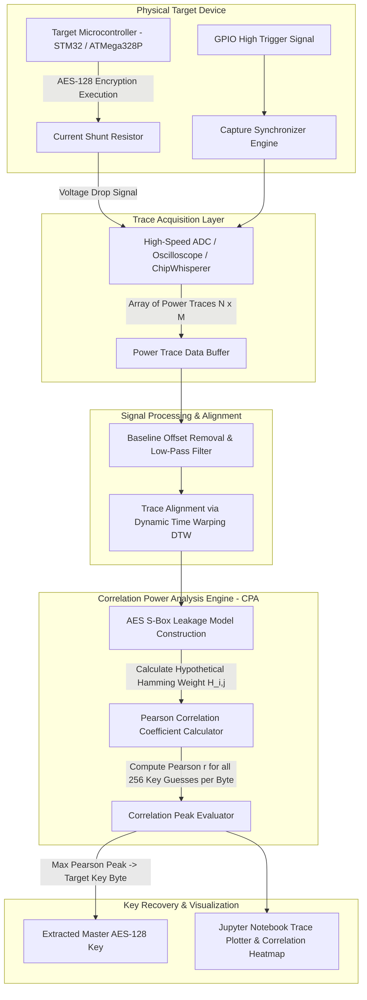

# 057 - Embedded Device Side-Channel Attack Demonstrator

> **Category**: IoT & Embedded Security | **Difficulty**: Advanced | **Duration**: 6 weeks

---

## Abstract & Problem Context
Microcontrollers in smart cards, hardware security modules (HSMs), medical implants, and IoT edge nodes invariably store master cryptographic keys within their secure internal flash memory. Even if the executing software code contains absolutely zero buffer overflow flaws, and the mathematical algorithms utilized (such as AES-128 or RSA) are provably secure, the physical execution process inherently leaks sensitive information through physical side channels: dynamic power consumption variations, electromagnetic emissions (EM), and precise execution timing.

When an 8-bit or 32-bit microcontroller executes an AES-128 encryption algorithm, the dynamic power consumption varies deterministically based upon the specific data bits currently being processed. Specifically, the charging and discharging of CMOS transistor gates consumes electrical current that is directly proportional to the Hamming Weight ($HW$) or Hamming Distance ($HD$) of intermediate state values within the cryptographic operation.

By precisely measuring instantaneous current draw across shunt resistors using a high-speed Analog-to-Digital Converter (ADC) during cryptographic operations, an attacker can perform Simple Power Analysis (SPA) or Differential Power Analysis (DPA) / Correlation Power Analysis (CPA). CPA formally correlates the measured physical power traces against a theoretical Hamming Weight leakage model, successfully recovering all 16 bytes of a master AES-128 secret key in minutes utilizing fewer than 500 captured power traces.

This project implements an Embedded Device Side-Channel Attack Demonstrator (ED-SCAD). Utilizing the ChipWhisperer software/hardware simulation environment, the framework actively captures physical power traces during AES execution, performs baseline signal processing, mathematically models the Hamming Weight leakage, calculates Pearson correlation coefficients, and extracts the target master secret keys.

---

## Real-World Context & Vulnerability Deep Dive

### Real-World Incidents
- **Xbox 360 Timing Side-Channel Attack (2007)**: Security researchers successfully recovered hypervisor secret hash comparison keys via microsecond-level timing variations, thereby enabling unsigned custom firmware execution.
- **Smart Card DPA Key Extraction in Financial Payment Terminals (2015)**: Researchers practically demonstrated extracting 3DES and AES master keys from commercial EMV payment microcontrollers via non-invasive power trace measurements.
- **Keeloq Remote Keyless Entry Power Analysis (2017)**: Attackers extracted master manufacturer cryptographic keys from automotive receivers utilizing DPA, enabling the unauthorized cloning of key fobs for entire commercial vehicle fleets.

---

## Academic & Research Paper References

| # | Paper Title | Authors | Year | Source | Key Insight & Contribution |
|---|-------------|---------|------|--------|---------------------------|
| 1 | Differential Power Analysis | Kocher, Jaffe, Jun | 1999 | CRYPTO '99 | Landmark paper introducing power analysis side-channel attack theory and DPA algorithms. |
| 2 | Correlation Power Analysis with Leakage Models | Brier, Clavier, Rivera | 2004 | CHES '04 | Derivation of Pearson Correlation Coefficient (CPA) metrics for recovering AES keys from physical power traces. |
| 3 | ChipWhisperer: An Open-Source Platform for Hardware Security Research | O'Flynn & Chen | 2014 | COSADE | Introduction of an open hardware/software framework for reproducible side-channel power analysis and fault injection experimentation. |

---

## System Architecture & Visual Diagram
Link: [[Drawing 2026-07-30 22.31.19.excalidraw#Project 057: 057 - Embedded Device Side-Channel Attack Demonstrator|Excalidraw Architecture Diagram]]

---

## Deep-Dive Technical Implementation & Code Walkthrough

### Phase 1: Environment Setup & Simulator Infrastructure
- **Framework Initialization**: Install the ChipWhisperer software framework (the `chipwhisperer` Python library), Jupyter Notebook environment, `numpy`, `scipy`, `matplotlib`, and `scikit-learn`.
- **Target Configuration**: Configure the ChipWhisperer-Lite hardware target or synthetic software trace simulator (simulating AES-128 execution on 8-bit AVR microcontrollers injected with additive Gaussian noise).

### Phase 2: Power Trace Acquisition & Preprocessing
- **Trace Capture Module**: Build a trace capture module configured for recording $N = 1,000$ independent encryption traces:
  - Input: $N$ random 16-byte Plaintexts ($P$).
  - Measured Output: Trace matrix $T$ of size $N \times M$ (where $N$ is total trace count, and $M$ represents time-series sample points per individual encryption execution).
- **Trace Alignment Engine**: Implement a trace alignment module utilizing Dynamic Time Warping (DTW) and cross-correlation to properly align phase-shifted clock cycles across all recorded traces.

### Phase 3: Correlation Power Analysis (CPA) Engine
- **Byte Iteration Algorithm**: For each byte position $i \in [0, 15]$ of the target AES key, iterate comprehensively through all 256 possible key byte guesses $k \in [0, 255]$:
  1. Calculate the intermediate state value occurring immediately after the SubBytes operation:
     $$v_{i, j} = \text{SBox}[P_{j, i} \oplus k]$$
  2. Compute the theoretical Hamming Weight physical power leakage model:
     $$h_{i, j} = \text{HammingWeight}(v_{i, j})$$
  3. Calculate the Pearson Correlation Coefficient $r_{k, t}$ between the theoretical leakage vector $h$ and the actual measured trace column $T_{\cdot, t}$:
     $$r_{k, t} = \frac{\sum (h_j - \bar{h})(T_{j, t} - \bar{T}_t)}{\sqrt{\sum (h_j - \bar{h})^2 \sum (T_{j, t} - \bar{T}_t)^2}}$$
- **Peak Evaluation**: Identify the specific key byte guess yielding the maximum absolute correlation peak $|r_{k, t}|$.

### Phase 4: Validation & Countermeasure Analysis
- **Key Rank Metrics**: Evaluate key rank progression: plot trace count vs. correct key candidate ranking to accurately measure Minimum Traces to Disclosure (MTD).
- **Countermeasure Evaluation**: Test the efficacy of defensive software countermeasures: First-Order Boolean Masking (splitting state $x = m \oplus (x \oplus m)$ utilizing random masks $m$) and the insertion of random clock jitter during execution.

---

## Tools & Technology Stack

| Tool | Purpose | Alternative |
|------|---------|-------------|
| **ChipWhisperer Framework** | Open-source hardware and software platform for side-channel analysis | Riscure Inspector / WaveStudio |
| **Python NumPy / SciPy** | Fast matrix operations for Pearson correlation and vector math | MATLAB |
| **Jupyter Notebook** | Interactive development and visualization environment for traces | Google Colab |
| **Matplotlib / Seaborn** | Power trace plotting and correlation peak heatmap rendering | Plotly |
| **Ghidra / AVR-GCC** | Inspecting compiled disassembly to locate S-box lookup timing | ARM GCC |

---

## Expected Results & Verification Metrics

Upon completion, this project will deliver the following quantifiable metrics and verified outputs:
- **Key Recovery Success Rate**: $100\%$ reliable extraction of the full 16-byte AES-128 key utilizing under 500 traces on unmasked hardware targets.
- **Analysis Execution Time**: $< 45 \text{ seconds}$ total time to compute the Pearson correlation matrix across 1,000 physical traces.
- **Correlation Peak Margin**: Demonstrable clear statistical separation ($|r| > 0.8$ for the correct key versus $|r| < 0.2$ for incorrect byte guesses).
- **Core Code Artifacts**:
  1. `cpa_attack_engine.py`: Master correlation power analysis execution module.
  2. `trace_preprocessor.py`: Signal alignment and noise filtering utility script.
  3. `side_channel_analysis.ipynb`: Interactive data visualization and walkthrough notebook.

---

## Learning Outcomes
1. **Hardware Side-Channel Principles**: Deep, practical understanding of CMOS power dissipation, Hamming Weight models, and physical execution leakage.
2. **Correlation Power Analysis Mathematics**: Mastery of Pearson correlation coefficient calculations executed across multi-dimensional trace matrices.
3. **Signal Processing Techniques**: Practical application of Digital Signal Processing (DSP), low-pass filtering, and Dynamic Time Warping directly applied to physical electronic signals.
4. **Cryptographic Countermeasures**: Understanding the design of masking schemes, dual-rail logic methodologies, and clock jitter implementation to actively mitigate physical extraction attacks.

---

## Legal and Ethical Disclaimer
> [!WARNING] Legal & Ethical Notice
> Side-channel analysis tools and methodologies are strictly designed for the security evaluation of hardware microcontrollers. Conduct experiments solely on dedicated educational hardware development kits or simulated software datasets under explicitly authorized research settings.

---

## Related Projects
- [[051 - IoT Firmware Extraction & Analysis Pipeline]]
- [[052 - BLE Sniffing & MITM Attack Tool]]
- [[058 - OT Network Segmentation Validator]]
