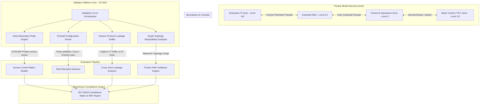

# 058 - OT Network Segmentation Validator

> **Category**: IoT & Embedded Security | **Difficulty**: Intermediate | **Duration**: 5 weeks

---

## Abstract & Problem Context
Industrial manufacturing plants, energy facilities, and transport networks inherently rely on strict isolation between corporate Enterprise IT networks (Purdue Model Levels 4-5) and Operational Technology networks (Purdue Model Levels 0-3). Flat network topologies lacking proper internal firewalls or demilitarized zones (DMZs) dangerously allow corporate IT ransomware (e.g., WannaCry, Colonial Pipeline attack) to pivot laterally into critical plant floors, halting physical production.

International compliance frameworks (such as IEC 62443 and NIST SP 800-82) dictate that OT networks must be partitioned into logical security "Zones" connected exclusively through strictly controlled "Conduits" (DMZ firewalls equipped with unidirectional gateways and deep packet inspection).

In practice, misconfigured switch VLANs, dual-homed engineering laptops, rogue Wi-Fi access points, and overly permissive firewall rules inevitably introduce unauthorized bypass paths between enterprise IT systems and secure control zones. Organizations critically need an automated, non-disruptive validation tool to audit physical and logical network segmentation enforcement continuously.

This project builds an OT Network Segmentation Validator (OT-NSV). The platform actively probes inter-zone boundary paths, audits complex firewall rule matrices against the Purdue Model architecture, passively maps cross-boundary protocol leakages, and automatically generates standard IEC 62443 compliance gap reports.

---

## Real-World Context & Vulnerability Deep Dive

### Real-World Incidents
- **Colonial Pipeline Ransomware Breach (2021)**: The compromise of an un-segmented corporate IT virtual private network (VPN) led management to deliberately shut down the entire fuel pipeline system due to uncertainty regarding malware spillover into OT billing/control networks.
- **Norsk Hydro Aluminum Plant Cyberattack (2019)**: LockerGoga ransomware spread rapidly from IT active directory controllers across unsegmented local subnets into European plant floors, forcing manual plant operation and causing in excess of $70M in damages.
- **Oldsmar Water Treatment Facility Intrusion (2021)**: Attackers accessed remote access software (TeamViewer) on an IT-connected workstation and maliciously modified chemical lye concentration levels due to missing inner OT network segmentation boundaries.

---

## Academic & Research Paper References

| # | Paper Title | Authors | Year | Source | Key Insight & Contribution |
|---|-------------|---------|------|--------|---------------------------|
| 1 | Automated Verification of Network Segmentation for Industrial Control Systems | Dondossola et al. | 2019 | IEEE Transactions on Industrial Informatics | Introduced a graph-based reachability algorithm for auditing Purdue Model firewall policies. |
| 2 | Assessing Network Segmentation in Converged IT/OT Infrastructure | Stouffer et al. | 2021 | NIST Special Publication 800-82 Rev 2 | Framework comprehensively defining conduits, security zones, and multi-layer firewall audit methodology. |
| 3 | Efficacy of Unidirectional Gateways and DMZ Architecture in OT Security | Cherdantseva et al. | 2022 | Computers & Security | Empirical measurement and analysis of cross-zone protocol leakage across industrial perimeter firewalls. |

---

## System Architecture & Visual Diagram
Link: [[Drawing 2026-07-30 22.31.19.excalidraw#Project 058: 058 - OT Network Segmentation Validator|Excalidraw Architecture Diagram]]

---

## Deep-Dive Technical Implementation & Code Walkthrough

### Phase 1: Environment Setup & Purdue Network Emulation
- **Emulated Environment**: Deploy a Docker / GNS3 network accurately emulating Purdue Model security zones:
  - **Zone 1 (Enterprise IT)**: `10.10.0.0/16`
  - **Zone 2 (Industrial DMZ)**: `172.16.0.0/24` (Jump box, Historian)
  - **Zone 3 (OT Control)**: `192.168.1.0/24` (HMI, SCADA)
  - **Zone 4 (Process Level 1)**: `192.168.2.0/24` (PLCs, IO)
- **Firewall Integration**: Interconnect zones utilizing Linux `iptables` / `VyOS` virtual firewalls.
- **Software Stack Setup**: Install the necessary software stack: `python-networkx`, `scapy`, `nmap-python`, `pandas`, `paramiko`, `reportlab`.

### Phase 2: Configuration Parser & Reachability Graph Engine
- **Firewall Rule Parser**: Build a robust firewall rule configuration parser:
  - Ingests `iptables-save`, Cisco ASA, and Fortinet configuration files natively.
  - Converts firewall rule tables into a formal directed graph structure utilizing `NetworkX`:
    - Nodes represent Subnets / Security Zones.
    - Edges represent Allowed protocol traffic paths (source IP, dest IP, port, action).
- **Reachability Algorithms**: Implement shortest-path reachability algorithms evaluating whether any unrestricted path exists from Level 4 (IT) to Level 1 (PLC Zone) that bypasses the Industrial DMZ.

### Phase 3: Active Probing & Passive Leakage Detection
- **Active Probing Module**:
  - Send low-rate TCP SYN / UDP probes specifically targeting common industrial and enterprise ports across zone boundaries.
  - Flag unauthorized cross-zone access paths (e.g., RDP port 3389 explicitly open from IT to HMI, or Modbus port 502 broadly accessible from IT).
- **Passive Leakage Sniffer Module**:
  - Capture network traffic directly at OT switch SPAN ports.
  - Detect inappropriate protocol leakage appearing inside control zones (e.g., active Directory Kerberos, NetBIOS, mDNS, or Dropbox cloud traffic appearing inappropriately inside Level 2 PLC subnets).

### Phase 4: IEC 62443 Compliance & Reporting
- **Compliance Mapping**: Systematically map identified segmentation violations directly to IEC 62443-3-2 (Security Risk Assessment and System Design) and NIST SP 800-82 requirements.
- **Report Generation**: Produce automated PDF and HTML executive reports containing interactive NetworkX zone reachability maps, violation matrices, and firewall rule remediation recommendations.

---

## Tools & Technology Stack

| Tool | Purpose | Alternative |
|------|---------|-------------|
| **Python NetworkX** | Graph theory modeling for multi-zone reachability analysis | PyVis / Gephi |
| **Scapy / Nmap** | Custom packet probing across perimeter firewalls | Masscan / RustScan |
| **Linux iptables / VyOS** | Open-source router and firewall for Purdue model emulation | pfSense / Cisco VIRL |
| **Wireshark / TShark** | Passive packet analysis for cross-zone protocol leakage detection | Zeek |
| **ReportLab / Jinja2** | Automated PDF and HTML security compliance report rendering | WeasyPrint |

---

## Expected Results & Verification Metrics

Upon completion, this project will deliver the following quantifiable metrics and verified outputs:
- **Graph Evaluation Speed**: Sub-second reachability graph calculation executed for networks comprising up to 500 complex firewall rules.
- **Probing Safety**: Zero packet drops or CPU spikes on emulated PLC interfaces during active discovery.
- **Leakage Detection Recall**: $100\%$ positive identification of un-sanitized enterprise broadcast traffic residing inside OT zones.
- **Core Code Artifacts**:
  1. `ot_segmentation_validator.py`: Main CLI tool operation script.
  2. `firewall_config_parser.py`: Multi-vendor firewall rule set parser module.
  3. `iec62443_compliance_report.pdf`: Generated visual PDF report output document.

---

## Learning Outcomes
1. **Purdue Model Architecture**: Deep understanding of industrial network zoning (Levels 0 to 5) and conduit isolation principles.
2. **Graph Theory in Cybersecurity**: Modeling network firewall policies formally as directed graph matrices to perform automated reachability validation.
3. **Cross-Zone Protocol Risks**: Accurately identifying high-risk administrative protocols (RDP, SSH, SMB) inappropriately traversing IT/OT perimeters.
4. **Industrial Security Compliance**: Applying international standards (IEC 62443 and NIST SP 800-82) directly to real-world infrastructure auditing.

---

## Legal and Ethical Disclaimer
> [!WARNING] Legal & Ethical Notice
> Active network probing directed against physical OT switches and firewalls must be performed exclusively during scheduled maintenance windows or on isolated, offline staging networks. High-rate packet probing can induce legacy serial-to-Ethernet converters and PLCs to irrecoverably fail.

---

## Related Projects
- [[048 - CAN Bus Intrusion Detection for Connected Vehicles]]
- [[049 - MQTT Protocol Security Testing Tool]]
- [[053 - Industrial SCADA-ICS Security Assessment Platform]]
